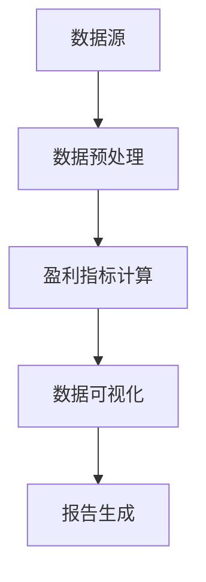
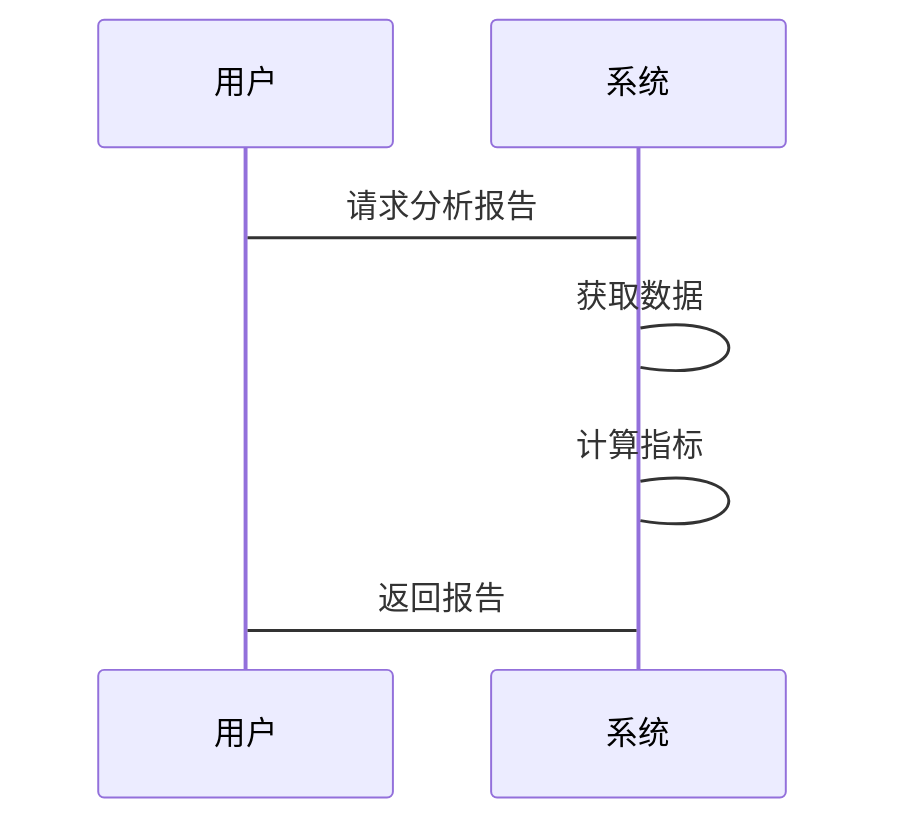

                 


# 特价股票与公司盈利质量的深度分析

> 关键词：特价股票，公司盈利质量，财务指标，投资分析，市场分析

> 摘要：本文系统地探讨了特价股票与公司盈利质量之间的关系，通过分析核心财务指标，如净利润、毛利率、营业利润率和净资产收益率（ROE），揭示了如何利用这些指标来评估公司的盈利能力和判断特价股票的投资价值。文章结合理论与实践，提供了从基础概念到实际应用的全面分析，并通过案例展示了如何在实际投资中应用这些分析方法。

---

## 第一部分: 特价股票与公司盈利质量的背景介绍

### 第1章: 特价股票与公司盈利质量概述

#### 1.1 特价股票的定义与特点
- **1.1.1 特价股票的定义**  
  特价股票通常指价格相对较低的股票，可能因为市场忽视、公司估值被低估或处于困境阶段。这类股票可能隐藏着投资机会。

- **1.1.2 特价股票的特点**  
  - 价格低于行业平均水平  
  - 市盈率、市净率等估值指标较低  
  - 可能存在较高的上涨潜力  

- **1.1.3 特价股票的投资价值**  
  - 低价股票可能因市场复苏或公司改善而上涨  
  - 适合风险承受能力较高的投资者  

#### 1.2 公司盈利质量的概念与重要性
- **1.2.1 公司盈利质量的定义**  
  盈利质量是指公司在一定时期内实现利润的能力，不仅关注利润的多少，还关注利润的来源和质量。

- **1.2.2 公司盈利质量的核心要素**  
  - 净利润  
  - 毛利率  
  - 营业利润率  
  - 净资产收益率（ROE）  

- **1.2.3 公司盈利质量与股价的关系**  
  - 盈利质量高的公司通常能获得更高的股价估值  
  - 盈利质量差的公司可能面临股价下跌风险  

#### 1.3 特价股票与公司盈利质量的关联
- **1.3.1 特价股票的市场特征**  
  - 价格低，但可能隐藏着高成长潜力  
  - 可能因市场波动或公司治理问题导致低估  

- **1.3.2 公司盈利质量对股价的影响**  
  - 盈利质量高的公司更受市场青睐  
  - 盈利质量差的公司可能引发股价下跌  

- **1.3.3 特价股票与公司盈利质量的匹配逻辑**  
  - 寻找被低估但盈利质量良好的公司，可能获得超额收益  

#### 1.4 本章小结  
本章介绍了特价股票和公司盈利质量的基本概念，并分析了两者之间的关联，为后续分析奠定了基础。

---

## 第二部分: 特价股票与公司盈利质量的核心概念与联系

### 第2章: 公司盈利质量的核心指标

#### 2.1 净利润与盈利质量
- **2.1.1 净利润的定义与计算**  
  净利润 = 收入 - 成本 - 费用 - 税费  
  净利润是公司整体盈利能力的直接体现。

- **2.1.2 净利润与盈利质量的关系**  
  净利润高并不一定意味着盈利质量高，需结合毛利率、营业利润率等指标综合分析。

- **2.1.3 净利润的行业差异**  
  不同行业的净利润率差异较大，需在同一行业中进行比较。

#### 2.2 毛利率与盈利质量
- **2.2.1 毛利率的定义与计算**  
  毛利率 = (收入 - 成本) / 收入  
  毛利率高说明公司在主营业务中具有较强的盈利能力。

- **2.2.2 毛利率与盈利质量的关系**  
  高毛利率通常意味着公司产品或服务的竞争力强，盈利能力稳定。

- **2.2.3 毛利率的行业差异**  
  制造业和科技行业的毛利率差异较大，需在同一行业中进行横向比较。

#### 2.3 营业利润率与盈利质量
- **2.3.1 营业利润率的定义与计算**  
  营业利润率 = 营业利润 / 收入  
  营业利润反映公司在日常经营中的盈利能力。

- **2.3.2 营业利润率与盈利质量的关系**  
  高营业利润率表明公司在管理和运营方面效率较高。

- **2.3.3 营业利润率的行业差异**  
  服务业和零售业的营业利润率通常较高，而制造业可能较低。

#### 2.4 净资产收益率（ROE）与盈利质量
- **2.4.1 ROE的定义与计算**  
  ROE = 净利润 / 股东权益  
  ROE衡量了公司使用股东资金的效率。

- **2.4.2 ROE与盈利质量的关系**  
  高ROE表明公司能够高效利用股东资金创造利润。

- **2.4.3 ROE的行业差异**  
  高ROE通常出现在金融、科技等行业，而传统制造业可能ROE较低。

#### 2.5 本章小结  
本章详细分析了净利润、毛利率、营业利润率和ROE等核心财务指标，及其对盈利质量的影响。

---

### 第3章: 特价股票与公司盈利质量的关联分析

#### 3.1 特价股票的市场特征
- **3.1.1 特价股票的市场定位**  
  特价股票通常位于市场中的低估值区域，可能被投资者忽视。

- **3.1.2 特价股票的投资机会**  
  - 市场复苏时，特价股票可能有较大的上涨空间  
  - 公司基本面改善时，股价可能迅速反弹  

- **3.1.3 特价股票的风险与挑战**  
  - 市场波动可能导致股价进一步下跌  
  - 公司可能面临财务危机或其他风险  

#### 3.2 公司盈利质量对股价的影响
- **3.2.1 盈利质量与股价的相关性**  
  盈利质量高的公司通常能获得更高的股价估值。

- **3.2.2 盈利质量与股价波动的关系**  
  盈利质量的变化可能引发股价的剧烈波动。

- **3.2.3 盈利质量与股价长期表现的关系**  
  长期来看，盈利质量是决定股价走势的重要因素。

#### 3.3 特价股票与公司盈利质量的匹配逻辑
- **3.3.1 特价股票的盈利质量分析**  
  - 通过财务指标评估公司的盈利质量  
  - 寻找盈利质量高但估值低的公司  

- **3.3.2 盈利质量与股价的动态关系**  
  - 盈利质量改善可能推动股价上涨  
  - 盈利质量下降可能导致股价下跌  

- **3.3.3 投资策略**  
  - 选择盈利质量高且估值低的公司进行投资  
  - 关注行业周期和市场环境的变化  

#### 3.4 本章小结  
本章分析了特价股票的市场特征，并探讨了公司盈利质量对股价的影响，提出了匹配逻辑和投资策略。

---

## 第三部分: 特价股票与公司盈利质量的算法原理与数学模型

### 第4章: 算法原理与数学模型

#### 4.1 算法原理
- **4.1.1 杜邦分析法**  
  杜邦分析法将ROE分解为净利润率、总资产周转率和权益乘数的乘积，帮助分析ROE的驱动因素。

#### 4.2 数学模型
- **4.2.1 净利润公式**  
  $$ \text{净利润} = \text{收入} - \text{成本} - \text{费用} - \text{税费} $$
  
- **4.2.2 毛利率公式**  
  $$ \text{毛利率} = \frac{\text{收入} - \text{成本}}{\text{收入}} $$
  
- **4.2.3 营业利润率公式**  
  $$ \text{营业利润率} = \frac{\text{营业利润}}{\text{收入}} $$
  
- **4.2.4 净资产收益率（ROE）公式**  
  $$ \text{ROE} = \frac{\text{净利润}}{\text{股东权益}} $$

#### 4.3 代码实现
```python
import pandas as pd

# 假设df为包含财务数据的DataFrame
def calculate_profitability_metrics(df):
    df['净利润率'] = df['净利润'] / df['收入']
    df['毛利率'] = (df['收入'] - df['成本']) / df['收入']
    df['营业利润率'] = df['营业利润'] / df['收入']
    df['ROE'] = df['净利润'] / df['股东权益']
    return df

# 示例数据
data = {
    '公司': ['A', 'B', 'C'],
    '收入': [100, 200, 150],
    '成本': [50, 100, 70],
    '费用': [20, 30, 25],
    '税费': [10, 15, 12],
    '股东权益': [50, 75, 60]
}

df = pd.DataFrame(data)
df['净利润'] = df['收入'] - df['成本'] - df['费用'] - df['税费']
df = calculate_profitability_metrics(df)
print(df)
```

#### 4.4 本章小结  
本章通过杜邦分析法和数学公式，详细讲解了如何计算和分析公司的盈利质量指标，并通过代码实现展示了这些计算过程。

---

## 第四部分: 特价股票与公司盈利质量的系统分析与架构设计

### 第5章: 系统分析与架构设计

#### 5.1 问题场景介绍
- 特价股票筛选与分析  
- 公司盈利质量评估系统设计  

#### 5.2 系统功能设计
- 数据收集模块：获取公司财务数据  
- 分析模块：计算各项盈利指标  
- 可视化模块：生成图表和报告  

#### 5.3 系统架构设计（Mermaid架构图）


#### 5.4 系统接口设计
- 数据接口：与数据库或API对接  
- 报告接口：生成可导出的报告  

#### 5.5 系统交互设计（Mermaid序列图）


#### 5.6 本章小结  
本章设计了一个完整的系统架构，用于支持特价股票与公司盈利质量的分析。

---

## 第五部分: 特价股票与公司盈利质量的项目实战

### 第6章: 项目实战

#### 6.1 环境安装
- 安装Python和相关库（如Pandas、Matplotlib）  
- 数据获取：使用API或爬虫获取公司财务数据  

#### 6.2 核心实现
- 数据清洗与预处理  
- 计算各项盈利指标  
- 可视化分析  

#### 6.3 案例分析
- 选取某行业中的特价股票  
- 分析其盈利质量指标  
- 得出投资建议  

#### 6.4 本章小结  
通过实际案例分析，展示了如何利用前面的理论进行实际投资决策。

---

## 第六部分: 特价股票与公司盈利质量的最佳实践与总结

### 第7章: 最佳实践与总结

#### 7.1 投资策略
- 选择盈利质量高且估值低的公司  
- 关注行业周期和市场环境  

#### 7.2 风险提示
- 市场波动可能导致股价下跌  
- 公司基本面可能恶化  

#### 7.3 未来趋势
- 科技创新可能改变公司盈利模式  
- 可持续发展可能成为新的盈利增长点  

#### 7.4 本章小结  
总结了投资策略、风险提示和未来趋势，为读者提供了实用的建议。

---

## 结语

本文通过系统地分析特价股票与公司盈利质量的关系，结合理论与实践，为投资者提供了科学的投资分析方法。通过本文的指导，读者可以更好地识别特价股票的投资价值，并做出明智的投资决策。

---

## 作者

作者：AI天才研究院/AI Genius Institute & 禅与计算机程序设计艺术 /Zen And The Art of Computer Programming

