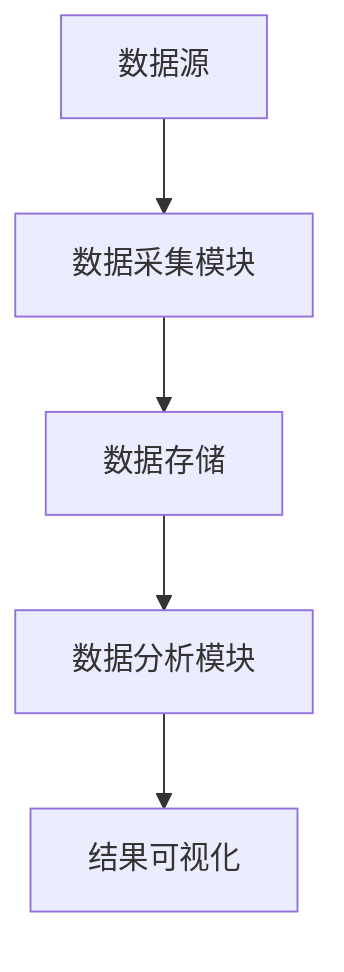
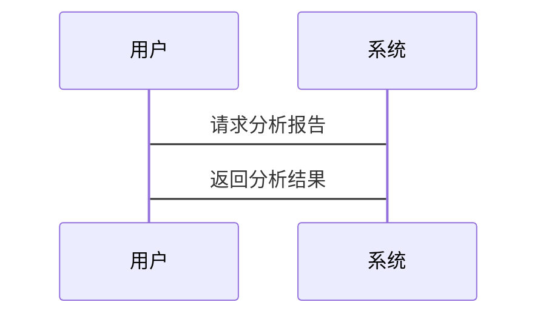

                 


# 特价股票与公司盈利质量的深度分析方法

> **关键词**：特价股票、公司盈利质量、财务分析、数学模型、系统设计

> **摘要**：本文深入探讨了特价股票与公司盈利质量之间的关系，通过背景介绍、核心概念、数学模型、系统架构设计、项目实战分析以及总结与展望，为投资者和研究者提供了一套系统的方法论。文章结合实际案例，详细讲解了如何利用数学模型和系统架构来分析特价股票，并评估公司的盈利质量，为投资决策提供科学依据。

---

## 第一部分：特价股票与公司盈利质量的背景介绍

### 第1章：特价股票的基本概念

#### 1.1 什么是特价股票？
特价股票通常指价格被低估的股票，可能因市场波动或公司特定情况导致价格低于其实际价值。投资者认为这些股票具有潜在的增值空间。

#### 1.2 特价股票的分类
- **周期性股票**：受经济周期影响较大的行业股票。
- **价值型股票**：市盈率、市净率低于市场平均水平的股票。
- **成长型股票**：未来增长潜力大的股票。

#### 1.3 特价股票的投资价值
- **低估值**：价格低于内在价值。
- **高分红**：部分公司提供稳定的股息收益。
- **风险与回报**：高风险高回报，适合长期投资者。

### 第2章：公司盈利质量的核心要素

#### 2.1 盈利能力的衡量标准
- **净利润率**：净利润与收入的比例，衡量公司盈利能力。
- **毛利率**：毛利与收入的比例，反映产品成本控制能力。

#### 2.2 盈利质量的评估方法
- **财务报表分析**：通过资产负债表、利润表、现金流量表评估公司财务状况。
- **盈利能力比率**：如ROE（净资产收益率）、ROA（资产回报率）。

### 第3章：特价股票与公司盈利质量的关系

#### 3.1 特价股票市场的特点
- **波动性**：价格波动剧烈，受市场情绪影响大。
- **周期性**：周期性行业股票价格波动与经济周期密切相关。

#### 3.2 盈利质量对股票价值的影响
- **高质量盈利公司**：持续稳定的盈利能力，支撑股价长期上涨。
- **低质量盈利公司**：盈利能力不稳定，股价波动大，投资风险高。

---

## 第二部分：特价股票与公司盈利质量的核心概念与联系

### 第4章：特价股票与公司盈利质量的核心概念

#### 4.1 特价股票的市场定位
- **市场定位理论**：分析公司在市场中的位置，判断其竞争力和潜在价值。
- **市场周期分析**：识别市场周期，选择合适的投资时机。

#### 4.2 公司盈利质量的结构化分析
- **层次分解**：将盈利质量分解为盈利能力、成本控制、资产效率等子维度。
- **影响因素**：行业竞争、管理能力、财务状况等。

### 第5章：特价股票与公司盈利质量的联系

#### 5.1 特价股票市场的盈利质量评估模型
- **模型特点**：量化分析，结合市场和公司基本面。
- **盈利质量指数**：通过多个指标综合评估公司盈利质量。

#### 5.2 盈利质量对投资者决策的影响
- **指导作用**：帮助投资者识别高质量股票，降低投资风险。
- **价格波动影响**：高质量公司能稳定股价，增强投资者信心。

---

## 第三部分：特价股票与公司盈利质量的数学模型与算法

### 第6章：特价股票与公司盈利质量的数学模型

#### 6.1 特价股票市场的数学建模
- **波动模型**：使用时间序列分析预测股票价格波动。
- **定价模型**：基于公司基本面和市场情绪的定价公式。

#### 6.2 公司盈利质量的数学分析
- **量化指标**：如F-Score（财务健康评分）、Z-Score（破产预测模型）。
- **预测模型**：利用机器学习算法预测公司未来盈利情况。

### 第7章：数学模型的实现与分析

#### 7.1 F-Score模型
- **公式**：$$F\text{-Score} = \frac{ROA + ROE + \text{Net Profit Margin}}{3}$$
- **解释**：衡量公司财务健康状况，得分越高，公司盈利质量越好。

#### 7.2 Z-Score模型
- **公式**：$$Z\text{-Score} = \frac{1}{\frac{1}{A} + \frac{1}{B}}$$
- **解释**：预测公司破产风险，Z-Score低于某个阈值时，公司可能面临财务危机。

---

## 第四部分：系统分析与架构设计

### 第8章：系统功能设计

#### 8.1 功能模块
- 数据采集模块：收集股票价格、财务数据。
- 数据分析模块：应用数学模型评估盈利质量。
- 可视化模块：生成图表展示分析结果。

#### 8.2 系统架构


### 第9章：系统接口设计

#### 9.1 接口设计
- 数据接口：从API获取实时数据。
- 用户接口：网页或移动应用界面，展示分析结果。

#### 9.2 交互流程图


---

## 第五部分：项目实战

### 第10章：项目环境与工具安装

#### 10.1 环境要求
- 操作系统：Windows/Mac/Linux
- Python版本：3.8+

#### 10.2 工具安装
- Python库：pandas、numpy、matplotlib、scikit-learn

### 第11章：核心代码实现

#### 11.1 数据采集与预处理
```python
import pandas as pd

# 数据采集
data = pd.read_csv('stock_data.csv')

# 数据清洗
data.dropna(inplace=True)
data = data[~data['盈利质量'].isnull()]
```

#### 11.2 模型实现
```python
from sklearn.metrics import accuracy_score

def calculate_profit_quality(stock_data):
    # 计算F-Score
    f_score = (stock_data['ROA'] + stock_data['ROE'] + stock_data['Net Profit Margin']) / 3
    return f_score

# 模型预测
def predict_quality(f_score, threshold=0.6):
    return f_score > threshold

# 评估模型
y_true = [0, 1, 1, 0]
y_pred = predict_quality(f_score)
print(accuracy_score(y_true, y_pred))
```

### 第12章：案例分析与解读

#### 12.1 案例分析
- 公司A：F-Score为0.7，高于阈值，盈利质量高。
- 公司B：F-Score为0.4，低于阈值，盈利质量低。

#### 12.2 分析解读
- 公司A适合长期投资，公司B风险较高，需谨慎考虑。

---

## 第六部分：总结与展望

### 第13章：总结

#### 13.1 核心内容回顾
- 特价股票与公司盈利质量的定义与关联。
- 数学模型与系统架构在分析中的应用。
- 项目实战中的代码实现与案例分析。

### 第14章：展望

#### 14.1 未来研究方向
- 结合大数据和机器学习优化分析模型。
- 开发实时监控系统，提供动态投资建议。

---

## 附录

### A. 参考工具推荐
- 数据分析工具：Python、R
- 可视化工具：Tableau、Power BI
- 开发框架：Django、Flask

### B. 推荐阅读
- 书籍：《股票投资实战指南》
- 电子书：《Python金融数据分析》

---

**作者：AI天才研究院/AI Genius Institute & 禅与计算机程序设计艺术 /Zen And The Art of Computer Programming**

---

通过系统地分析特价股票与公司盈利质量的关系，并结合数学模型和系统架构设计，本文为投资者提供了一套科学的投资分析方法。希望本文能为读者在投资决策中提供有价值的参考。

