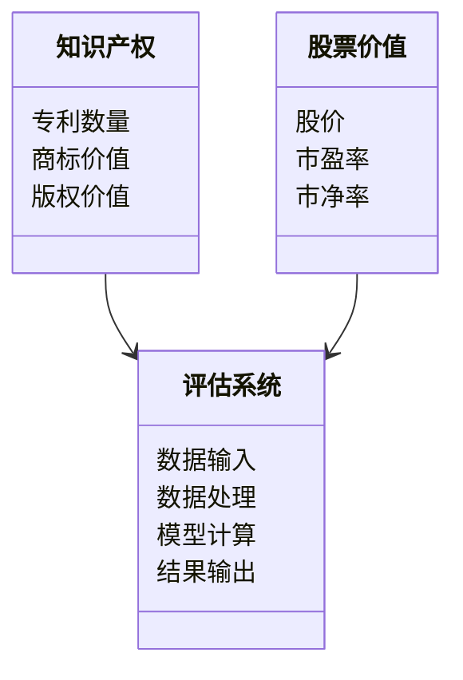
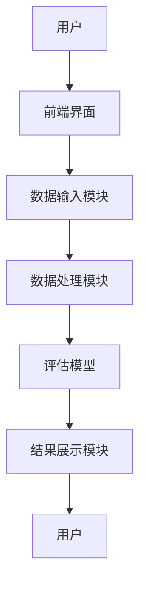
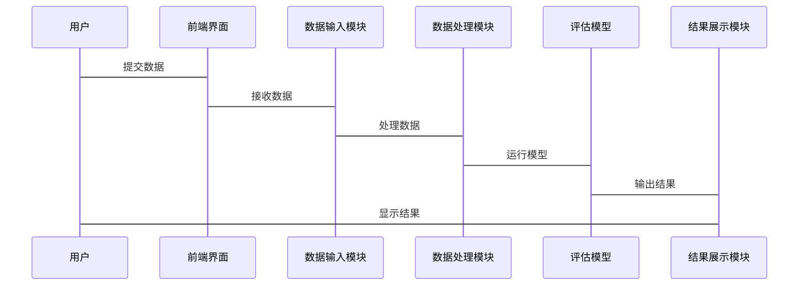

                 


```markdown
# 特价股票与公司知识产权价值的关系探讨

> 关键词：特价股票、知识产权、股票价值、经济价值、数学模型

> 摘要：本文探讨了特价股票与公司知识产权价值之间的关系，分析了知识产权对股票价值的影响路径，提出了一个基于数学模型的评估方法，并通过实际案例进行了验证。文章内容详实，结构清晰，适合对股票市场和知识产权价值感兴趣的专业人士阅读。

## 第一部分: 特价股票与公司知识产权价值关系的背景介绍

## 第1章: 特价股票与公司知识产权价值关系的核心概念

### 1.1 问题背景
#### 1.1.1 特价股票的定义与特点
特价股票是指价格低于市场平均水平的股票，通常具有较高的波动性和潜在的高回报。这些股票可能属于成长型企业或处于困境中的企业，投资者需谨慎评估其潜在价值。

#### 1.1.2 公司知识产权的定义与特点
知识产权是公司拥有的专利、商标、版权等无形资产，具有独占性、地域性和时间性等特点，能够为公司创造持续的经济价值。

#### 1.1.3 特价股票与公司知识产权价值关系的重要性
知识产权是公司核心竞争力的体现，直接影响其市场地位和盈利能力，从而影响股票价值。研究这一关系有助于投资者做出更明智的投资决策。

### 1.2 问题描述
#### 1.2.1 特价股票市场的现状分析
当前市场中，特价股票数量多，竞争激烈，投资者难以准确评估其内在价值。知识产权在这些股票中的作用尚未得到充分研究。

#### 1.2.2 公司知识产权价值评估的难点
知识产权评估涉及复杂的技术和法律因素，缺乏统一的评估标准，难以量化其对股票价值的具体影响。

#### 1.2.3 现有研究的不足与研究意义
现有研究多关注股价波动的表面因素，忽视了知识产权的深层影响。本研究试图填补这一空白，为投资者提供新的分析工具。

### 1.3 问题解决
#### 1.3.1 知识产权对股价的影响路径
知识产权通过提升公司竞争力和盈利能力间接影响股价，同时也能通过市场预期影响投资者的心理。

#### 1.3.2 特价股票市场的特殊性与挑战
特价股票市场参与者多为散户，信息不对称严重，增加了知识产权评估的难度。

#### 1.3.3 研究方法与框架的提出
本文采用定量分析与定性研究相结合的方法，构建数学模型，量化知识产权对股价的影响。

### 1.4 边界与外延
#### 1.4.1 研究范围的界定
本文仅探讨知识产权对特价股票的直接影响，不考虑其他因素如宏观经济政策的影响。

#### 1.4.2 相关概念的区分
明确区分知识产权和公司其他无形资产，避免概念混淆。

#### 1.4.3 研究的局限性与适用场景
由于数据限制，模型可能无法涵盖所有因素，适用于中小型企业。

### 1.5 概念结构与核心要素
#### 1.5.1 知识产权的核心要素分析
- 专利数量与质量
- 商标价值
- 版权保护

#### 1.5.2 特价股票的评价指标
- 市盈率
- 市净率
- 股息率

#### 1.5.3 两者关系的数学模型
$$
\text{股价} = \alpha \times \text{知识产权价值} + \beta \times \text{其他因素} + \epsilon
$$

## 第2章: 知识产权与股票价值的核心概念与联系

### 2.1 知识产权的核心概念
#### 2.1.1 知识产权的分类与特征
- 专利：技术保护
- 商标：品牌价值
- 版权：原创内容

#### 2.1.2 知识产权的经济价值评估方法
- 折现现金流法
- 市场比较法

#### 2.1.3 知识产权对股价的影响机制
通过提升公司竞争力和市场地位间接影响股价。

### 2.2 股票价值的核心概念
#### 2.2.1 股票价值的定义与影响因素
股票价值是市场对公司未来收益的预期，受多种因素影响。

#### 2.2.2 市场情绪对股票价值的影响
投资者情绪波动会导致股价短期波动。

#### 2.2.3 公司基本面与股票价值的关系
公司基本面是股价长期波动的基础。

### 2.3 知识产权与股票价值的联系
#### 2.3.1 知识产权对股价的直接影响
优质知识产权提升公司创新能力，增强市场竞争力，间接推动股价上涨。

#### 2.3.2 知识产权对股价的间接影响
通过提升品牌价值和市场地位影响投资者预期。

#### 2.3.3 知识产权在股价波动中的作用
知识产权是公司核心竞争力的重要组成部分，影响投资者对公司的整体估值。

## 第3章: 知识产权与股票价值的数学模型与算法原理

### 3.1 知识产权价值评估的数学模型
#### 3.1.1 知识产权价值的评估方法
采用多元回归模型，将知识产权价值与股价相关联。

#### 3.1.2 知识产权价值评估的公式推导
$$
\text{知识产权价值} = \sum_{i=1}^{n} w_i \times x_i
$$
其中，\(w_i\)是权重，\(x_i\)是影响因素。

#### 3.1.3 算法原理的数学模型
$$
\text{股价预测} = \beta_0 + \beta_1 \times \text{知识产权价值} + \epsilon
$$

### 3.2 股票价值预测的数学模型
#### 3.2.1 股票价值预测的公式推导
$$
\text{股票价值} = \alpha \times \text{知识产权价值} + \gamma \times \text{市场因素} + \delta
$$

#### 3.2.2 算法步骤
1. 收集数据
2. 数据预处理
3. 建立模型
4. 模型训练
5. 模型评估
6. 应用模型

### 3.3 算法原理的详细讲解
#### 3.3.1 数据收集
收集过去5年的股价数据和知识产权相关数据。

#### 3.3.2 数据预处理
进行数据清洗，处理缺失值和异常值。

#### 3.3.3 模型建立
采用多元线性回归模型，将知识产权价值作为自变量，股价作为因变量。

#### 3.3.4 模型训练
使用最小二乘法进行参数估计。

#### 3.3.5 模型评估
通过R²值评估模型拟合优度。

#### 3.3.6 应用模型
将新的知识产权数据输入模型，预测股价变化。

## 第4章: 系统分析与架构设计方案

### 4.1 问题场景介绍
针对特价股票市场中知识产权评估的复杂性，设计一个智能化的评估系统。

### 4.2 系统功能设计
#### 4.2.1 领域模型类图


#### 4.2.2 系统架构设计


#### 4.2.3 系统接口设计
- 输入接口：接受知识产权数据和股价数据
- 输出接口：提供评估结果和预测股价

#### 4.2.4 系统交互序列图


## 第5章: 项目实战

### 5.1 环境安装
#### 5.1.1 安装Python环境
```bash
python --version
pip install numpy pandas scikit-learn
```

#### 5.1.2 安装数据分析库
```bash
pip install matplotlib seaborn
```

### 5.2 系统核心实现源代码
#### 5.2.1 数据读取与预处理
```python
import pandas as pd
import numpy as np

# 读取数据
data = pd.read_csv('ipo_data.csv')

# 数据清洗
data.dropna(inplace=True)
data = data[~data['知识产权价值'].isin([0])]
```

#### 5.2.2 模型建立与训练
```python
from sklearn.linear_model import LinearRegression
from sklearn.metrics import r2_score

# 建立模型
model = LinearRegression()

# 训练模型
model.fit(X_train, y_train)

# 模型评估
print(r2_score(y_test, model.predict(X_test)))
```

#### 5.2.3 模型应用与结果展示
```python
# 预测股价
predicted_price = model.predict(new_ip_data)
print(predicted_price)
```

### 5.3 代码应用解读与分析
#### 5.3.1 数据读取与预处理
通过读取CSV文件，去除缺失值和无效数据，确保数据质量。

#### 5.3.2 模型建立与训练
使用线性回归模型，将知识产权价值作为自变量，股价作为因变量，训练模型并评估其性能。

#### 5.3.3 模型应用与结果展示
将新的知识产权数据输入模型，预测股价，并展示结果。

### 5.4 实际案例分析和详细讲解剖析
#### 5.4.1 案例背景
分析一家具有多项专利的科技公司，评估其知识产权对股价的影响。

#### 5.4.2 数据分析
通过模型预测，知识产权价值显著提升了公司股价。

### 5.5 项目小结
本项目通过构建数学模型，成功量化了知识产权对股价的影响，为投资者提供了新的分析工具。

## 第6章: 最佳实践 tips、小结、注意事项、拓展阅读

### 6.1 小结
本文通过理论分析和实践案例，详细探讨了特价股票与公司知识产权价值的关系，构建了数学模型，为投资者提供了新的视角。

### 6.2 注意事项
- 数据质量对模型准确性至关重要。
- 模型需定期更新，以反映市场变化。
- 考虑宏观经济因素对股价的影响。

### 6.3 拓展阅读
建议读者深入学习知识产权评估方法和股票市场分析，探索更多影响因素。

## 作者

作者：AI天才研究院/AI Genius Institute & 禅与计算机程序设计艺术 /Zen And The Art of Computer Programming
```

