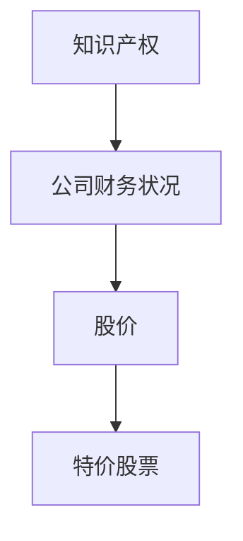
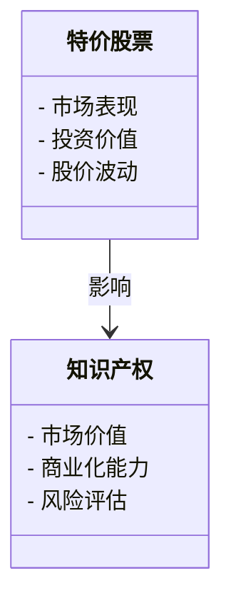
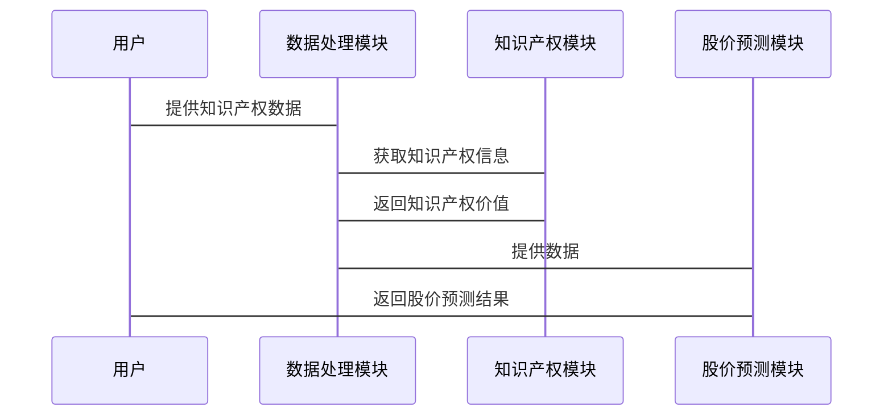

                 


# 特价股票与公司知识产权变现能力的关系分析

> 关键词：特价股票、公司知识产权、变现能力、股价影响、投资分析

> 摘要：本文从知识产权的经济价值出发，分析其对公司财务状况的影响，进而探讨这些因素如何影响股价，尤其是特价股票的波动。通过构建数学模型和实际案例分析，揭示知识产权变现能力与股价之间的关系，为投资者提供参考。

---

## 第一部分: 特价股票与公司知识产权变现能力的背景介绍

### 第1章: 特价股票与公司知识产权变现能力的核心概念

#### 1.1 特价股票的基本概念
##### 1.1.1 什么是特价股票
特价股票指的是价格相对较低的股票，通常被认为具有较大的上涨潜力。这些股票可能来自处于低谷期的公司，或者具有较高的成长潜力但尚未被市场充分发现。

##### 1.1.2 特价股票的分类与特点
- **分类**：根据市场表现，特价股票可以分为周期性股票、小盘股、成长股等。
- **特点**：价格波动较大、风险较高、潜在回报高。

##### 1.1.3 特价股票的市场表现与投资价值
特价股票的市场表现受多种因素影响，包括公司基本面、市场情绪、行业趋势等。其投资价值需要结合公司长期发展潜力和短期市场波动进行评估。

#### 1.2 公司知识产权的基本概念
##### 1.2.1 什么是公司知识产权
知识产权是指公司拥有的专利、商标、版权、商业秘密等无形资产，是公司在市场中的核心竞争力之一。

##### 1.2.2 知识产权的分类与保护
- **分类**：专利、商标、版权、商业秘密等。
- **保护**：通过法律手段保护知识产权，防止他人侵权。

##### 1.2.3 知识产权的经济价值与市场表现
知识产权的经济价值体现在其对公司收入、利润和市场地位的影响。有效的知识产权管理可以提升公司的竞争力，进而影响股价。

#### 1.3 特价股票与公司知识产权变现能力的关系
##### 1.3.1 特价股票与知识产权的定义域关联
- 特价股票的市场表现与公司知识产权的价值密切相关。
- 知识产权的变现能力是影响股价的重要因素。

##### 1.3.2 知识产权对股价的影响机制
- 知识产权的市场价值直接影响公司的财务状况，进而影响股价。
- 知识产权的商业化能力影响公司的收入和利润，从而影响股价。

##### 1.3.3 特价股票与知识产权变现能力的边界与外延
- 特价股票的范围包括各种类型的公司，知识产权的影响因公司而异。
- 知识产权的变现能力不仅影响股价，还影响公司的长期发展。

---

## 第二部分: 特价股票与公司知识产权变现能力的核心概念与联系

### 第2章: 特价股票与公司知识产权的核心概念原理

#### 2.1 特价股票的核心原理
##### 2.1.1 特价股票的市场定位
- 特价股票通常出现在市场低迷或公司处于困境时期，但具有潜在恢复或增长的可能性。

##### 2.1.2 特价股票的投资者行为分析
- 投资者在购买特价股票时，通常基于对公司未来恢复能力的判断。
- 风险偏好较高的投资者可能更倾向于投资特价股票。

##### 2.1.3 特价股票的价格波动机制
- 特价股票的价格波动较大，受市场情绪和公司基本面的影响显著。

#### 2.2 公司知识产权的核心原理
##### 2.2.1 知识产权的创造与保护
- 公司通过创新产生知识产权，通过法律手段保护这些资产。
- 知识产权的创造需要投入研发资源，保护需要法律支持。

##### 2.2.2 知识产权的市场价值评估
- 知识产权的市场价值取决于其对公司竞争力的影响。
- 有效的知识产权管理可以提升公司的市场地位和盈利能力。

##### 2.2.3 知识产权的商业化路径
- 通过许可、出售、自我实施等方式实现知识产权的商业化。
- 商业化能力直接影响公司的收入和利润。

#### 2.3 特价股票与知识产权的关系原理
##### 2.3.1 知识产权对股价的直接影响
- 知识产权的市场价值直接影响公司的财务状况，进而影响股价。
- 有效的知识产权管理可以提升公司股价。

##### 2.3.2 知识产权对股价的间接影响
- 知识产权的商业化能力影响公司的收入和利润，从而影响股价。
- 知识产权的市场价值影响投资者对公司的整体估值。

##### 2.3.3 特价股票与知识产权的协同效应
- 特价股票的投资价值与公司知识产权的变现能力密切相关。
- 公司通过提升知识产权的变现能力，可以提升股价，进而影响特价股票的市场表现。

---

## 第三部分: 特价股票与公司知识产权变现能力的算法原理讲解

### 第3章: 特价股票与知识产权的关系模型

#### 3.1 知识产权对股价影响的数学模型
##### 3.1.1 知识产权价值评估模型
$$ \text{知识产权价值} = \sum_{i=1}^{n} w_i \cdot v_i $$
其中，\( w_i \) 是知识产权 \( i \) 的权重，\( v_i \) 是知识产权 \( i \) 的价值。

##### 3.1.2 知识产权对股价的回归分析
$$ \text{股价} = \beta_0 + \beta_1 \cdot \text{知识产权价值} + \epsilon $$
其中，\( \beta_1 \) 是知识产权价值对股价的影响系数，\( \epsilon \) 是误差项。

##### 3.1.3 知识产权对股价波动的预测模型
$$ \text{股价波动} = \alpha \cdot \text{知识产权风险} + \beta \cdot \text{市场风险} + \gamma \cdot \text{公司特有风险} $$

#### 3.2 特价股票与知识产权的关系算法
##### 3.2.1 知识产权对股价影响的路径分析
- 知识产权的市场价值直接影响公司财务状况。
- 公司财务状况影响股价，进而影响特价股票的市场表现。

##### 3.2.2 特价股票与知识产权的关系网络图


##### 3.2.3 知识产权对股价影响的权重计算
- 通过主成分分析（PCA）计算知识产权对股价影响的权重。

#### 3.3 算法实现与案例分析
##### 3.3.1 算法实现步骤
1. 收集公司知识产权数据。
2. 计算知识产权的市场价值。
3. 建立回归模型，分析知识产权对股价的影响。
4. 通过案例分析验证模型的准确性。

##### 3.3.2 案例分析与结果解读
- 以某科技公司为例，分析其知识产权对股价的具体影响。
- 通过回归分析得出知识产权对股价的正向影响。

##### 3.3.3 算法优化与改进方向
- 引入更多的变量，如市场环境、行业趋势等，提高模型的准确性。
- 使用机器学习方法，如随机森林、神经网络等，提升预测能力。

---

## 第四部分: 特价股票与公司知识产权变现能力的系统分析与架构设计

### 第4章: 特价股票与知识产权的关系系统分析

#### 4.1 系统功能设计
##### 4.1.1 领域模型


##### 4.1.2 系统架构设计


##### 4.1.3 系统接口设计
- 知识产权模块提供接口，供数据处理模块调用。
- 股价预测模块提供接口，供用户查询股价预测结果。

##### 4.1.4 系统交互设计


---

## 第五部分: 特价股票与公司知识产权变现能力的项目实战

### 第5章: 特价股票与知识产权的关系项目实战

#### 5.1 项目环境安装
- 安装必要的数据处理和分析工具，如Python、Pandas、NumPy、Scikit-learn等。

#### 5.2 项目核心实现
##### 5.2.1 知识产权价值评估
```python
import pandas as pd
import numpy as np

# 示例数据
data = {
    '知识产权': [100, 200, 300, 400],
    '股价': [50, 60, 70, 80]
}
df = pd.DataFrame(data)

# 简单线性回归模型
from sklearn.linear_model import LinearRegression

model = LinearRegression()
model.fit(df[['知识产权']], df['股价'])

print('回归系数:', model.coef_)
print('截距:', model.intercept_)
```

##### 5.2.2 股价预测
```python
import pandas as pd
import numpy as np
from sklearn.linear_model import LinearRegression

# 示例数据
data = {
    '知识产权': [100, 200, 300, 400],
    '股价': [50, 60, 70, 80]
}
df = pd.DataFrame(data)

# 简单线性回归模型
model = LinearRegression()
model.fit(df[['知识产权']], df['股价'])

# 预测股价
new_ip = [[250]]
predicted_price = model.predict(new_ip)
print('预测股价:', predicted_price)
```

#### 5.3 实际案例分析
##### 5.3.1 案例介绍
以某科技公司为例，分析其知识产权对股价的具体影响。

##### 5.3.2 数据收集与处理
收集该公司的知识产权数据、股价数据等。

##### 5.3.3 模型训练与结果分析
通过回归分析，得出知识产权对股价的具体影响系数。

#### 5.4 项目小结
- 通过项目实战，验证了知识产权对股价的影响。
- 提供了实际的投资分析方法。

---

## 第六部分: 特价股票与公司知识产权变现能力的总结与最佳实践

### 第6章: 特价股票与知识产权的关系总结

#### 6.1 本章总结
- 知识产权是影响股价的重要因素。
- 特价股票的投资价值与公司知识产权的变现能力密切相关。
- 通过数学模型和系统设计，可以更准确地分析知识产权对股价的影响。

#### 6.2 最佳实践
##### 6.2.1 投资建议
- 投资者应关注公司知识产权的市场价值和变现能力。
- 在投资特价股票时，需综合考虑公司知识产权的影响。

##### 6.2.2 风险提示
- 知识产权的变现能力受多种因素影响，具有不确定性。
- 特价股票的价格波动较大，投资需谨慎。

#### 6.3 小结
- 特价股票与公司知识产权变现能力的关系复杂，但通过系统分析和实践，可以更好地把握其关联性。
- 未来研究可以进一步探讨知识产权对股价的长期影响。

---

## 作者：AI天才研究院/AI Genius Institute & 禅与计算机程序设计艺术 /Zen And The Art of Computer Programming

