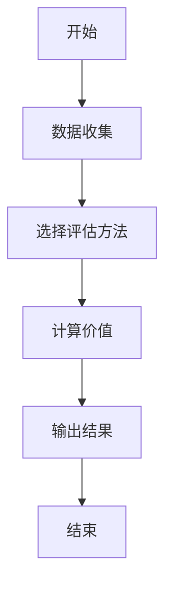

                 


# 特价股票与公司知识产权生态系统价值评估

**关键词**：特价股票、知识产权、价值评估、生态系统、算法模型

**摘要**：本文探讨了特价股票与公司知识产权生态系统之间的关系，并详细分析了知识产权生态系统对股票价值的影响。通过介绍知识产权生态系统的构成要素、价值评估方法和算法模型，本文为投资者和企业管理者提供了科学的决策依据。结合实际案例和系统设计，文章展示了如何通过技术手段实现知识产权价值的量化评估。

---

## 第1章：特价股票与知识产权的基本概念

### 1.1 特价股票的定义与特点

#### 1.1.1 特价股票的定义
特价股票是指价格相对较低的股票，通常具有较高的增长潜力。这类股票可能属于中小型企业或新兴行业，价格波动较大，但潜在回报也较高。

#### 1.1.2 特价股票的特点
- **价格低廉**：相对于蓝筹股，特价股票的价格更低，适合小额投资。
- **高波动性**：由于市场关注度较低，特价股票价格波动较大。
- **高风险高回报**：投资风险较高，但潜在收益也较大。

#### 1.1.3 特价股票的分类
- **小盘股**：市值较小的公司股票。
- **未盈利股**：尚未实现盈利的公司股票。
- **新兴行业股**：处于成长阶段的行业股票。

### 1.2 知识产权的基本概念

#### 1.2.1 知识产权的定义
知识产权是指法律保护的创造性成果，包括专利、商标、版权、商业秘密等。

#### 1.2.2 知识产权的主要类型
- **专利**：技术解决方案的法律保护。
- **商标**：品牌标识的法律保护。
- **版权**：文学、艺术作品的法律保护。
- **商业秘密**：未公开的商业信息和技术。

#### 1.2.3 知识产权的保护与应用
- **保护**：通过法律手段防止他人非法使用。
- **应用**：通过授权、转让等方式实现商业价值。

### 1.3 特价股票与知识产权的关系

#### 1.3.1 特价股票与知识产权的相互作用
- 知识产权是公司核心竞争力的重要组成部分，直接影响股票价值。
- 特价股票的公司可能通过知识产权提升市场地位。

#### 1.3.2 知识产权对股票价值的影响
- **正向影响**：强大的知识产权组合提升公司估值。
- **反向影响**：知识产权纠纷可能导致股价波动。

#### 1.3.3 特价股票与知识产权生态系统的关联
- 知识产权生态系统包括创造、保护、运用和管理等多个环节。
- 特价股票公司的知识产权生态系统对其市场表现有重要影响。

### 1.4 本章小结
本章介绍了特价股票和知识产权的基本概念，并分析了两者之间的关系。知识产权是影响股票价值的重要因素，而特价股票的公司通过优化知识产权生态系统可以提升市场表现。

---

## 第2章：知识产权生态系统的核心概念

### 2.1 知识产权生态系统的定义

#### 2.1.1 生态系统的概念
知识产权生态系统是指围绕知识产权创造、保护和运用所形成的一个有机整体。

#### 2.1.2 知识产权生态系统的特点
- **系统性**：各组成部分相互关联。
- **动态性**：随着市场变化不断调整。
- **多样性**：涵盖多种知识产权类型。

### 2.2 知识产权生态系统的构成要素

#### 2.2.1 企业知识产权管理
- **战略制定**：明确知识产权目标。
- **资源分配**：合理配置人力、物力资源。
- **风险管理**：防范知识产权风险。

#### 2.2.2 知识产权法律框架
- **法律法规**：专利法、商标法等。
- **国际条约**：《伯尔尼公约》、《巴黎公约》等。

#### 2.2.3 知识产权市场环境
- **市场需求**：市场对知识产权的需求程度。
- **竞争环境**：行业内知识产权竞争状况。

### 2.3 知识产权生态系统的核心功能

#### 2.3.1 知识产权的创造与保护
- **创造**：通过研发产生新的知识产权。
- **保护**：通过法律手段保护知识产权不被侵犯。

#### 2.3.2 知识产权的交易与运用
- **交易**：通过许可、转让等方式实现价值。
- **运用**：将知识产权应用于实际生产经营。

#### 2.3.3 知识产权的评估与价值实现
- **评估**：准确评估知识产权的价值。
- **实现**：通过多种方式实现知识产权的经济价值。

### 2.4 本章小结
本章详细介绍了知识产权生态系统的构成要素和核心功能，强调了知识产权管理在企业中的重要性。通过优化知识产权生态系统，企业可以提升核心竞争力，进而影响股票价值。

---

## 第3章：知识产权价值评估的核心原理

### 3.1 知识产权价值评估的背景与意义

#### 3.1.1 知识产权价值评估的必要性
- **投资决策**：帮助投资者评估知识产权的价值。
- **企业估值**：帮助企业准确评估自身知识产权资产。

#### 3.1.2 知识产权价值评估的挑战
- **复杂性**：知识产权价值受多种因素影响。
- **主观性**：评估结果可能因评估方法而异。

### 3.2 知识产权价值评估的主要方法

#### 3.2.1 市场法
- **定义**：通过市场交易数据进行评估。
- **步骤**：收集类似知识产权的交易案例，进行比较分析。

#### 3.2.2 收益法
- **定义**：基于未来收益预测进行评估。
- **步骤**：预测未来收益，折现计算现值。

#### 3.2.3 成本法
- **定义**：基于知识产权的开发成本进行评估。
- **步骤**：计算开发成本，考虑机会成本。

### 3.3 知识产权价值评估的关键指标

#### 3.3.1 技术创新性评估
- **技术先进性**：技术是否领先。
- **技术成熟度**：技术是否可商业化。

#### 3.3.2 市场竞争力评估
- **市场需求**：技术是否符合市场需求。
- **竞争状况**：市场上是否有类似技术。

#### 3.3.3 法律保护力度评估
- **保护范围**：专利的保护范围是否清晰。
- **法律风险**：是否存在侵权风险。

### 3.4 本章小结
本章介绍了知识产权价值评估的主要方法和关键指标，强调了不同方法的适用场景和评估中的注意事项。投资者和企业管理者应根据具体情况选择合适的评估方法。

---

## 第4章：知识产权价值评估的算法与模型

### 4.1 知识产权价值评估的数学模型

#### 4.1.1 基于收益的评估公式
$$ V = \sum_{t=1}^{n} \frac{C_t}{(1 + r)^t} $$
其中，\( V \) 表示知识产权价值，\( C_t \) 表示第 \( t \) 年的收益，\( r \) 表示折现率。

#### 4.1.2 基于市场比较的评估公式
$$ V = \frac{\sum_{i=1}^{m} V_i}{m} \times k $$
其中，\( V_i \) 表示相似知识产权的评估价值，\( m \) 表示相似案例的数量，\( k \) 表示调整系数。

#### 4.1.3 基于成本的评估公式
$$ V = C + \delta $$
其中，\( C \) 表示开发成本，\( \delta \) 表示附加价值。

### 4.2 算法原理与流程图



### 4.3 算法实现与代码示例

```python
def calculate_value(method, **kwargs):
    if method == 'market':
        values = kwargs['values']
        avg = sum(values) / len(values)
        return avg * kwargs['k']
    elif method == 'income':
        cash_flows = kwargs['cash_flows']
        discount_rate = kwargs['discount_rate']
        return sum(flow / (1 + discount_rate)**t for t, flow in enumerate(cash_flows))
    elif method == 'cost':
        cost = kwargs['cost']
        return cost + kwargs['delta']
    else:
        return None
```

### 4.4 本章小结
本章通过数学公式和算法流程图详细讲解了知识产权价值评估的实现方法。投资者可以使用这些工具和方法，结合实际情况，准确评估知识产权的价值。

---

## 总结与展望

本文系统地探讨了特价股票与公司知识产权生态系统价值评估的关系，分析了知识产权生态系统的核心要素和价值评估的方法。通过数学模型和算法实现，本文为投资者和企业管理者提供了科学的决策依据。未来，随着技术的进步和市场的变化，知识产权价值评估将更加精准和多样化。

---

**作者：AI天才研究院/AI Genius Institute & 禅与计算机程序设计艺术 /Zen And The Art of Computer Programming**

