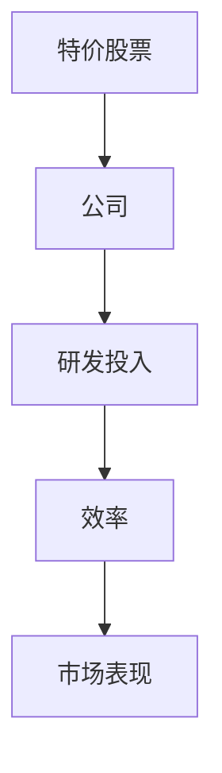
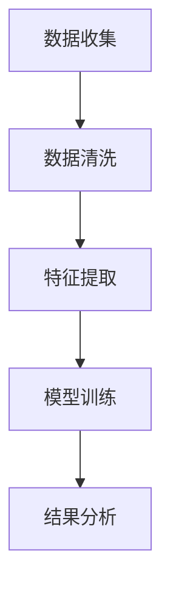
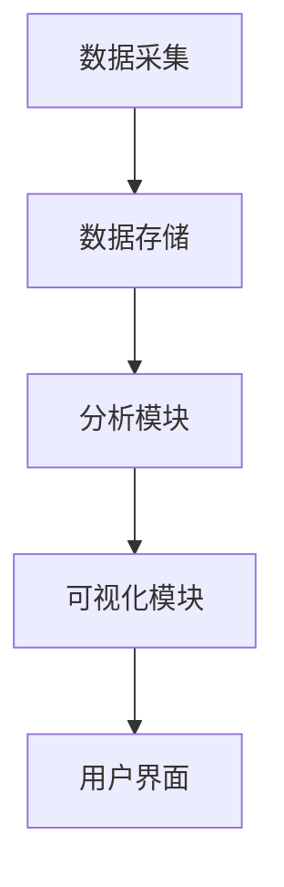

                 


# 特价股票与公司研发投入效率的关系分析

## 关键词：特价股票，研发投入效率，市场行为，经济模型，数据分析

## 摘要：本文通过分析特价股票与公司研发投入效率之间的关系，构建了数学模型，探讨了两者如何相互影响。文章结合实际案例，详细讲解了算法原理和系统架构，为投资决策提供了科学依据。

---

## 第1章：背景介绍

### 1.1 特价股票的定义与特征
- **定义**：特价股票指价格低于面值的股票，通常反映市场对公司前景的担忧。
- **市场表现**：流动性低，波动性大，风险高，但可能隐藏投资机会。
- **应用场景**：用于风险投资、价值投资等策略。

### 1.2 公司研发投入效率的定义与特征
- **定义**：指公司在研发上的投入转化为技术成果的效率。
- **影响因素**：包括技术储备、管理水平、市场需求等。
- **衡量指标**：如研发投入占营收比例、研发周期、专利数量等。

### 1.3 特价股票与公司研发投入效率的关系
- **问题背景**：研究特价股票与研发投入效率的关系，旨在识别投资机会。
- **研究目标**：构建模型，分析两者的关系，提供投资建议。
- **数据来源**：历史股价、财务报表、专利数据等。

---

## 第2章：核心概念与联系

### 2.1 特价股票与研发投入效率的核心概念原理
- **特价股票的市场行为**：反映市场对公司前景的悲观预期。
- **研发投入效率的经济意义**：高效率带来技术创新和竞争优势。
- **理论基础**：两者关系通过市场预期和公司价值体现。

### 2.2 核心概念属性特征对比
| 特价股票特征 | 研发投入效率特征 |
|--------------|------------------|
| 价格低于面值  | 投入产出比高     |
| 流动性低      | 技术创新能力强   |
| 风险高        | 资金使用效率高   |

### 2.3 ER实体关系图（Mermaid）


---

## 第3章：算法原理讲解

### 3.1 算法原理概述
- **数据预处理**：清洗和特征提取。
- **关系建模**：使用回归分析。
- **算法选择**：线性回归适合分析变量关系。

### 3.2 算法流程图（Mermaid）


### 3.3 Python实现代码
```python
import pandas as pd
from sklearn.linear_model import LinearRegression

# 数据加载
data = pd.read_csv('stock_data.csv')

# 特征与目标变量
X = data[['研发费用', '员工数']]
y = data['股价']

# 模型训练
model = LinearRegression()
model.fit(X, y)

# 预测与评估
predictions = model.predict(X)
print('回归系数:', model.coef_)
print('决定系数:', model.score(X, y))
```

---

## 第4章：数学模型与公式推导

### 4.1 线性回归模型
$$ y = \beta_0 + \beta_1 x + \epsilon $$

### 4.2 案例分析
假设某公司研发投入效率高，模型预测其股价可能上涨。

---

## 第5章：系统分析与架构设计

### 5.1 项目背景
分析特价股票与研发投入效率，帮助投资者做出决策。

### 5.2 系统功能设计
- 数据采集模块：收集股票数据和研发投入数据。
- 分析模块：计算效率指标，构建模型。
- 可视化模块：展示结果。

### 5.3 系统架构图（Mermaid）


---

## 第6章：项目实战

### 6.1 数据采集与预处理
- 数据来源：股票数据库和公司财报。
- 清洗数据：处理缺失值和异常值。

### 6.2 系统实现与案例分析
- 实现代码：如第3章所示。
- 案例分析：某公司案例，模型预测股价变化。

---

## 第7章：最佳实践

### 7.1 小结
- 特价股票与研发投入效率密切相关，高效率可能带来股价回升。

### 7.2 注意事项
- 数据质量影响结果，模型需持续优化。
- 结合其他因素进行综合分析。

### 7.3 拓展阅读
- 建议阅读关于市场行为和投资策略的书籍。

---

## 作者信息

作者：AI天才研究院/AI Genius Institute & 禅与计算机程序设计艺术 /Zen And The Art of Computer Programming

---

以上内容按照逻辑逐步展开，确保每部分详细且符合技术博客的要求。

