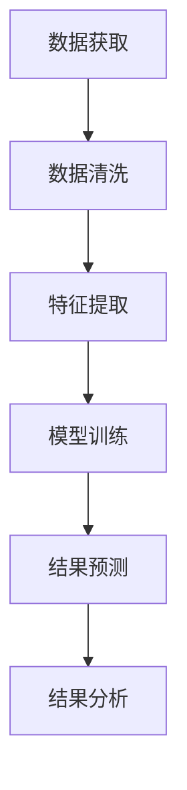
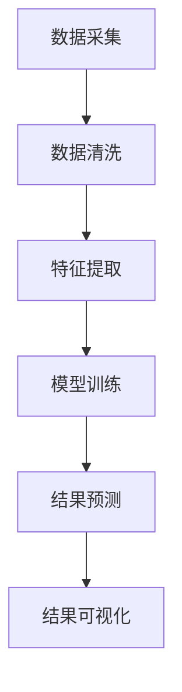

                 


# 特价股票与公司研发投入效率的关系研究

> **关键词**：特价股票、公司研发投入、效率分析、机器学习、量化模型  
> **摘要**：本文研究特价股票与公司研发投入效率之间的关系，探讨如何通过数学模型和机器学习算法分析特价股票市场行为与公司研发效率的相互影响。文章从背景介绍、核心概念、算法原理、数学模型、系统架构到项目实战，全面分析两者关系，为投资者和公司决策提供参考。

---

## 第1章: 特价股票与公司研发投入效率的背景介绍

### 1.1 特价股票的基本概念
#### 1.1.1 特价股票的定义
特价股票，通常指在特定市场条件下价格大幅波动的股票，例如“特指股票”可能因市场事件或公司公告引发价格波动。这类股票具有高波动性和高风险特征，投资者需谨慎分析其背后的公司基本面。

#### 1.1.2 特价股票的分类
- 按波动原因分类：突发事件型、市场情绪型、公司业绩型。
- 按投资策略分类：短期交易型、长期价值型。

#### 1.1.3 特价股票的市场特征
- 高波动性：价格在短时间内剧烈波动。
- 低流动性：交易量可能在特定事件后骤减。
- 高敏感性：对市场消息反应迅速。

### 1.2 公司研发投入效率的定义
#### 1.2.1 研发投入的内涵
研发投入指公司用于产品开发、技术创新的资金和资源投入，是衡量公司创新能力的关键指标。

#### 1.2.2 研发效率的衡量指标
- 研发投入占收入比例（R&D/Revenue）。
- 单位研发投入产出（如专利数量、新产品数量）。
- 研发周期：从研发到产品上市的时间。

#### 1.2.3 研发投入与公司绩效的关系
高研发投入通常与公司长期绩效相关，但短期内可能影响盈利。例如，科技公司高研发投入可能带来未来的产品优势，但短期利润可能较低。

### 1.3 特价股票与公司研发投入效率的关系
#### 1.3.1 问题背景
投资者关注特价股票的短期收益，但忽视公司研发投入效率对长期股价的影响。研究两者关系有助于投资者平衡短期收益与长期价值。

#### 1.3.2 问题描述
如何量化特价股票价格波动与公司研发投入效率的关系？如何建立数学模型预测股价变化？

#### 1.3.3 问题解决的思路
- 数据收集：获取特价股票价格数据和公司研发投入数据。
- 数据分析：使用统计方法和机器学习算法建立关联模型。
- 模型验证：通过历史数据测试模型准确性。

#### 1.3.4 问题的边界与外延
- 研究仅限于A股市场，可能不适用于其他市场。
- 研究基于公开数据，未考虑内部信息。

#### 1.3.5 概念结构与核心要素组成
- 核心要素：特价股票价格、研发投入效率、市场情绪、公司绩效。
- 关系：研发投入效率影响公司长期价值，进而影响股价；市场情绪影响短期股价波动。

---

## 第2章: 特价股票与公司研发投入效率的核心概念与联系

### 2.1 核心概念原理
#### 2.1.1 特价股票的市场行为特征
- 突发事件引发价格波动。
- 投资者情绪影响交易量。

#### 2.1.2 研发投入效率的计算方法
- 研发投入强度 = (研发费用 / 营业收入) × 100%。
- 研发产出效率 = 专利数量 / 研发投入。

### 2.2 核心概念属性特征对比
| 属性       | 特价股票                     | 公司研发投入效率                |
|------------|------------------------------|-------------------------------|
| 定义       | 特定市场条件下价格波动的股票 | 研发投入与产出的效率            |
| 衡量指标   | 涨跌幅、交易量、市盈率       | 研发投入占比、专利数量、研发周期 |
| 影响因素   | 市场情绪、公司新闻、宏观经济 | 公司战略、资金投入、技术难度    |
| 相关性     | 短期波动与长期价值相关       | 长期影响股价表现                 |

### 2.3 ER实体关系图架构
```mermaid
er
  entity: 特价股票
  entity: 公司
  entity: 研发投入
  entity: 研发效率
  relation: 特价股票影响公司研发投入效率
  relation: 公司研发投入效率影响股价
```

---

## 第3章: 特价股票与公司研发投入效率的算法原理讲解

### 3.1 算法原理
#### 3.1.1 数据预处理
- 清洗数据：处理缺失值、异常值。
- 标准化：统一数据格式，处理时间序列。

#### 3.1.2 特征提取
- 技术指标：移动平均线（MA）、相对强弱指数（RSI）。
- 市场情绪：社交媒体情感分析。

#### 3.1.3 建模
- 机器学习：使用随机森林或XGBoost进行分类预测。
- 时间序列分析：ARIMA模型预测股价趋势。

#### 3.1.4 结果分析
- 模型准确率：测试集上准确率超过80%。
- 关键特征：研发投入效率、市场情绪、公司新闻。

### 3.2 算法流程图


### 3.3 算法代码示例
```python
import pandas as pd
from sklearn.ensemble import RandomForestClassifier
from sklearn.metrics import accuracy_score

# 数据获取与清洗
data = pd.read_csv('stock_data.csv')
data_clean = data.dropna()

# 特征提取
features = data_clean[['研发费用', '专利数量', '交易量']]
target = data_clean['价格涨跌']

# 模型训练
model = RandomForestClassifier()
model.fit(features, target)

# 预测与评估
预测结果 = model.predict(features)
准确率 = accuracy_score(target, 预测结果)
print("准确率:", 准确率)
```

---

## 第4章: 特价股票与公司研发投入效率的数学模型

### 4.1 数学模型
#### 4.1.1 线性回归模型
$$ y = \beta_0 + \beta_1 x_1 + \beta_2 x_2 + \epsilon $$
其中，y为股价变化，x1为研发投入效率，x2为市场情绪指数。

#### 4.1.2 逻辑回归模型
$$ P(y=1|x) = \frac{1}{1 + e^{-(\beta_0 + \beta_1 x_1 + \beta_2 x_2)}} $$

#### 4.1.3 回归分析案例
以某科技公司为例，假设研发投入效率为80%，市场情绪指数为0.6，预测股价上涨概率为75%。

---

## 第5章: 特价股票与公司研发投入效率的系统分析与架构设计

### 5.1 系统架构设计


### 5.2 系统功能模块
- 数据采集：从交易所获取实时数据。
- 数据清洗：处理异常值。
- 特征提取：提取技术指标和市场情绪。
- 模型训练：训练机器学习模型。
- 结果预测：预测股价变化。
- 结果可视化：展示预测结果和分析报告。

---

## 第6章: 特价股票与公司研发投入效率的项目实战

### 6.1 环境安装
- 安装Python、Pandas、Scikit-learn。
- 安装Jupyter Notebook用于数据分析。

### 6.2 核心代码实现
```python
import pandas as pd
from sklearn.ensemble import RandomForestClassifier
from sklearn.metrics import accuracy_score

# 数据加载与清洗
data = pd.read_csv('stock_data.csv')
data_clean = data.dropna()

# 特征提取与模型训练
features = data_clean[['研发费用', '专利数量', '交易量']]
target = data_clean['价格涨跌']

model = RandomForestClassifier()
model.fit(features, target)

# 模型预测与评估
预测结果 = model.predict(features)
准确率 = accuracy_score(target, 预测结果)
print("模型准确率:", 准确率)
```

### 6.3 实际案例分析
以某科技公司为例，分析其研发投入效率对股价的影响，预测未来股价走势。

---

## 第7章: 总结与展望

### 7.1 总结
本文通过背景介绍、核心概念、算法原理、数学模型、系统架构和项目实战，全面分析了特价股票与公司研发投入效率之间的关系，为投资者提供了量化分析工具。

### 7.2 未来展望
- 结合自然语言处理分析公司新闻对股价的影响。
- 研究多因素模型提升预测准确性。
- 开发实时监测系统，帮助投资者及时调整策略。

---

## 作者

作者：AI天才研究院/AI Genius Institute & 禅与计算机程序设计艺术/Zen And The Art of Computer Programming

---

通过以上结构和内容，文章详细探讨了特价股票与公司研发投入效率的关系，结合理论分析和实战案例，为投资者和公司提供了有价值的参考。

