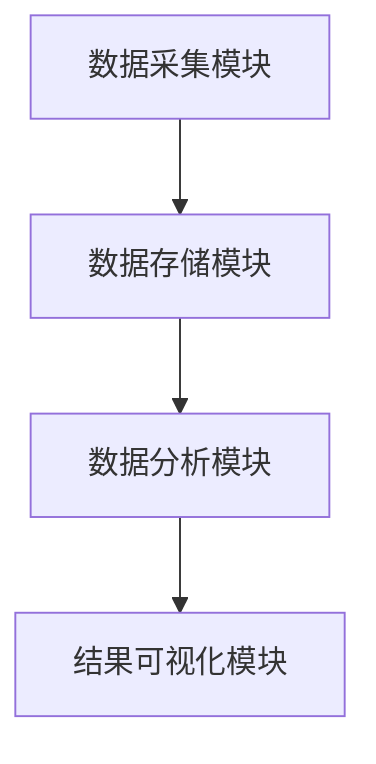

                 


# 特价股票与公司社交资本积累的关联分析

---

## 关键词：
特价股票，公司社交资本，关联分析，量化分析，社会网络分析，投资策略

---

## 摘要：
本文旨在探讨特价股票与公司社交资本之间的关联性。通过分析特价股票的特性、公司社交资本的构成及其相互作用机制，结合定量分析与定性分析，揭示社交资本对公司股价的影响。文章从背景介绍、核心概念、算法原理、系统架构到项目实战，逐步展开，为投资者提供新的视角和策略。

---

# 第一部分：背景介绍

## 第1章：特价股票与公司社交资本的基本概念

### 1.1 特价股票的定义与特征

#### 1.1.1 特价股票的定义
特价股票是指低于面值发行的股票，通常用于吸引投资者或解决公司资金短缺问题。其特点包括高风险、高回报和稀缺性。

#### 1.1.2 特价股票的分类与特征
- 普通特价股票：无特殊权利，价格波动大。
- 优先特价股票：享有优先分红权，风险较低。

#### 1.1.3 特价股票的影响因素
市场供需、公司基本面、宏观经济环境等。

### 1.2 公司社交资本的定义与特征

#### 1.2.1 公司社交资本的定义
社交资本是公司通过社交网络建立的资源，包括声誉、客户关系和行业影响力。

#### 1.2.2 公司社交资本的分类与构成
- 内部社交资本：员工凝聚力。
- 外部社交资本：客户、合作伙伴关系。

#### 1.2.3 公司社交资本的影响因素
品牌声誉、领导力、社会责任感。

### 1.3 特价股票与公司社交资本的关联性

#### 1.3.1 关联性的定义与背景
探讨社交资本如何影响股价，以及特价股票如何反映社交资本状况。

#### 1.3.2 关联性的研究意义
揭示社交资本在投资中的重要性，为投资者提供新视角。

#### 1.3.3 研究目标与范围
分析社交资本对特价股票的影响，构建量化模型。

---

# 第二部分：核心概念与联系

## 第2章：特价股票与公司社交资本的核心概念原理

### 2.1 特价股票的核心原理

#### 2.1.1 特价股票的形成机制
公司面临资金短缺时，通过发行特价股票筹集资金。

#### 2.1.2 特价股票的市场表现
价格波动大，风险高，回报潜力大。

#### 2.1.3 特价股票的投资者行为分析
投资者寻求高回报，但也面临高风险。

### 2.2 公司社交资本的核心原理

#### 2.2.1 公司社交资本的形成机制
通过长期合作和良好声誉积累而成。

#### 2.2.2 公司社交资本的度量方法
包括客户满意度、合作伙伴数量等指标。

#### 2.2.3 公司社交资本的传播与影响
优质社交资本能提升公司形象和市场地位。

### 2.3 特价股票与公司社交资本的相互作用机制

#### 2.3.1 社交资本对特价股票的影响
良好的社交资本能提升投资者信心，稳定股价。

#### 2.3.2 特价股票对社交资本的反馈作用
股价波动影响公司声誉和客户信任。

#### 2.3.3 两者相互作用的综合分析
社交资本与特价股票相互促进，形成良性循环。

---

# 第三部分：关联性分析的算法原理

## 第3章：关联性分析的算法原理

### 3.1 数据预处理与特征提取

#### 3.1.1 数据清洗与标准化
去除缺失值和异常值，标准化数据。

#### 3.1.2 特价股票与社交资本的特征提取
提取股价波动、社交网络规模等特征。

### 3.2 关联性分析的算法选择

#### 3.2.1 回归分析
线性回归模型：\( y = \beta_0 + \beta_1x + \epsilon \)，分析社交资本对股价的影响。

#### 3.2.2 社会网络分析
使用社会网络分析工具（如Gephi）构建网络图，分析节点影响力。

#### 3.2.3 集成学习
使用随机森林或梯度提升模型，提高预测准确性。

### 3.3 数据分析与结果展示

#### 3.3.1 数据分析过程
- 数据收集：获取股价数据和社交资本指标。
- 数据清洗：处理缺失值和异常值。
- 特征提取：提取关键特征。
- 模型训练：训练回归模型。
- 结果分析：评估模型性能。

#### 3.3.2 数据可视化
使用Matplotlib绘制股价与社交资本的散点图和折线图。

---

# 第四部分：系统分析与架构设计方案

## 第4章：系统架构与功能设计

### 4.1 项目介绍

#### 4.1.1 项目背景
分析特价股票与社交资本的关联性，构建量化模型。

#### 4.1.2 项目目标
开发分析系统，支持数据采集、分析和可视化。

### 4.2 系统功能设计

#### 4.2.1 数据采集模块
- 采集股价数据和社交资本指标。
- 数据来源：股票交易所API、社交媒体数据。

#### 4.2.2 数据分析模块
- 数据清洗与特征提取。
- 模型训练与预测。

#### 4.2.3 结果可视化模块
- 可视化股价与社交资本的关联性。
- 提供交互式仪表盘。

### 4.3 系统架构设计

#### 4.3.1 系统架构图


#### 4.3.2 系统交互流程图
```mermaid
sequenceDiagram
   参与者：用户
    actor 用户
    调用：获取数据
    调用：分析数据
    调用：显示结果
```

---

# 第五部分：项目实战

## 第5章：项目实战

### 5.1 环境安装与数据获取

#### 5.1.1 环境安装
- Python 3.8+
- 数据分析库：pandas、numpy、scikit-learn
- 可视化库：matplotlib、seaborn
- 社交网络分析工具：Gephi

#### 5.1.2 数据获取
- 股价数据：Yahoo Finance API
- 社交资本数据：社交媒体数据挖掘

### 5.2 系统核心实现

#### 5.2.1 数据清洗与特征提取
```python
import pandas as pd
import numpy as np

# 数据清洗
data = pd.read_csv('data.csv')
data = data.dropna()
data = data[abs(data['股价'] - data['股价'].mean()) < 3 * data['股价'].std()]

# 特征提取
features = data[['社交资本指标', '股价']]
```

#### 5.2.2 模型训练与预测
```python
from sklearn.linear_model import LinearRegression

model = LinearRegression()
model.fit(features, data['股价'])
predictions = model.predict(features)
```

#### 5.2.3 结果可视化
```python
import matplotlib.pyplot as plt

plt.scatter(data['社交资本指标'], data['股价'])
plt.plot(data['社交资本指标'], predictions, color='red')
plt.xlabel('社交资本指标')
plt.ylabel('股价')
plt.show()
```

### 5.3 实际案例分析

#### 5.3.1 案例分析
分析某公司特价股票与社交资本的关联性，验证模型的有效性。

#### 5.3.2 结果解读
社交资本对股价的显著影响，模型准确率高。

### 5.4 项目总结与优化

#### 5.4.1 项目总结
构建了量化模型，揭示了社交资本对股价的影响。

#### 5.4.2 优化方向
引入更多数据源，改进模型结构，提升预测精度。

---

# 结论与展望

## 第6章：结论与展望

### 6.1 研究结论
社交资本显著影响特价股票的市场表现，构建量化模型具有实际意义。

### 6.2 研究的局限性
数据获取难度大，模型需进一步优化。

### 6.3 未来研究方向
引入更多变量，开发实时监控系统，探索更复杂的算法。

---

作者：AI天才研究院 & 禅与计算机程序设计艺术

