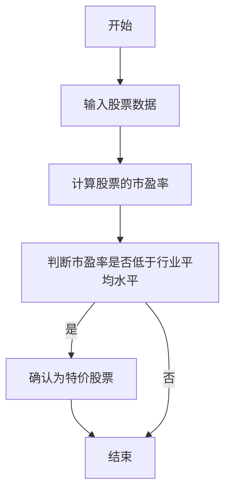
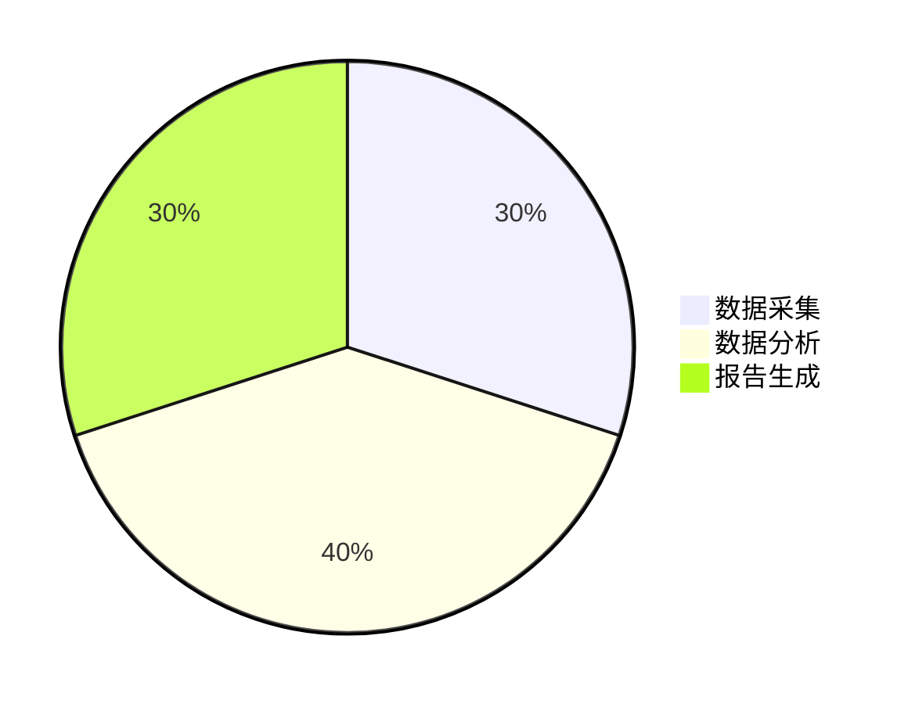

                 


# 特价股票与公司社会资本积累的长期影响

> 关键词：特价股票，社会资本积累，长期影响，股票市场，资本结构

> 摘要：本文从技术和系统的角度，分析了特价股票对公司社会资本积累的长期影响。首先，通过定义和分类介绍了特价股票的基本概念和特征，然后探讨了公司社会资本积累的内涵和构成。接着，分析了特价股票对公司社会资本积累的具体影响，包括资本结构优化和企业价值提升。通过数学模型和算法流程图，详细阐述了基于资本资产定价模型（CAPM）的股票定价方法，并结合实际案例进行深入分析。最后，提出了系统的解决方案和最佳实践建议。

---

# 第一部分: 特价股票与公司社会资本积累的背景与基础

## 第1章: 特价股票的基本概念与特征

### 1.1 特价股票的定义与分类

#### 1.1.1 特价股票的定义
特价股票是指市场价格低于其内在价值的股票。通常，这类股票被认为具有被市场低估的潜力，可能因公司基本面改善或市场情绪回暖而上涨。

#### 1.1.2 特价股票的分类
- 按行业分类：如科技股、金融股等。
- 按市场资本化规模分类：如小盘股、中盘股、大盘股。
- 按估值指标分类：如市盈率（P/E）低于行业平均水平的股票。

#### 1.1.3 特价股票的市场特征
- 市场流动性较低：通常交易量较小，买卖价差较大。
- 公司基本面良好：尽管股价被低估，但公司财务状况健康。
- 投资风险较高：可能因市场波动或公司经营问题导致股价进一步下跌。

---

## 第2章: 公司社会资本积累的内涵与构成

### 2.1 公司社会资本的定义
公司社会资本是指公司通过内部积累或外部合作所形成的无形资产，包括品牌价值、客户关系、企业声誉、技术优势等。

### 2.2 公司社会资本的内涵与外延
- 内涵：社会资本是公司长期竞争优势的核心来源。
- 外延：包括公司治理、组织能力、技术创新等多个方面。

### 2.3 公司社会资本的构成要素
- 品牌价值：公司品牌知名度和美誉度的综合体现。
- 客户关系：公司与客户之间的信任和合作关系。
- 企业声誉：公司在行业和社会中的形象和地位。
- 技术优势：公司在技术研发和创新方面的优势。

---

## 第3章: 特价股票与公司社会资本积累的关系

### 3.1 特价股票对公司社会资本积累的影响

#### 3.1.1 特价股票如何促进公司社会资本积累
- 提高市场关注度：股价上涨吸引更多投资者关注，提升公司知名度。
- 增强投资者信心：股价表现良好有助于提升投资者对公司未来发展的信心。
- 优化资本结构：通过股票回购或分红，公司可以优化资本结构，增强财务健康。

#### 3.1.2 特价股票对公司社会资本积累的具体表现
- 品牌价值提升：股价上涨和公司业绩改善有助于提升品牌价值。
- 客户关系强化：公司市值增长可能带来客户信任度的提升。
- 企业声誉改善：良好的股价表现有助于提升公司在行业中的声誉。

#### 3.1.3 特价股票与公司社会资本积累的动态关系
- 特价股票的长期表现与公司社会资本积累呈正相关。
- 公司社会资本积累的增强有助于巩固特价股票的市场地位。

---

## 第4章: 特价股票与公司社会资本积累的核心概念与联系

### 4.1 核心概念的原理分析

#### 4.1.1 特价股票的核心原理
- 市场定价偏差：特价股票通常因市场情绪或短期因素被低估。
- 基本面驱动：公司财务健康和成长潜力是支撑股价上涨的核心因素。

#### 4.1.2 公司社会资本积累的核心原理
- 资源整合：通过内部优化和外部合作，公司整合资源，提升整体竞争力。
- 持续创新：技术创新和管理创新是社会资本积累的重要驱动力。

### 4.2 核心概念的属性特征对比

| 特性          | 特价股票                | 公司社会资本积累         |
|---------------|-------------------------|--------------------------|
| 核心目标      | 提升股价，实现资本增值  | 增强公司竞争力，实现长期价值 |
| 影响因素      | 市场供需、公司业绩      | 公司治理、技术创新、品牌建设 |
| 衡量指标      | 股价、市盈率、市净率     | 市场占有率、品牌价值、客户满意度 |

### 4.3 ER实体关系图架构

```mermaid
er
  entity 特价股票 {
    key: 股票代码
    attribute: 股票名称, 发行公司, 市场类型
  }
  entity 公司社会资本积累 {
    key: 公司ID
    attribute: 公司名称, 社会资本规模, 资本结构
  }
  relationship 关系: 特价股票与公司社会资本积累 {
    role: 特价股票 -> 公司社会资本积累
    cardinality: 股票代码 -> 公司ID (1:N)
  }
```

---

## 第5章: 特价股票与公司社会资本积累的数学模型与算法分析

### 5.1 特价股票定价模型

#### 5.1.1 基于CAPM的股票定价模型

$$
r = r_f + \beta (r_m - r_f)
$$

其中：
- \( r \)：股票的预期收益率
- \( r_f \)：无风险利率
- \( \beta \)：股票的系统性风险系数
- \( r_m \)：市场预期收益率

#### 5.1.2 市盈率模型

$$
\text{市盈率} = \frac{\text{股价}}{\text{每股收益}}
$$

#### 5.1.3 算法流程图



---

## 第6章: 系统分析与架构设计方案

### 6.1 问题场景介绍

- **问题场景**：如何通过分析特价股票的市场表现，评估其对公司社会资本积累的长期影响。
- **项目目标**：构建一个系统，量化分析特价股票对公司社会资本积累的具体贡献。

### 6.2 系统功能设计

#### 6.2.1 功能模块
- 数据采集模块：收集股票市场数据和公司社会资本数据。
- 数据分析模块：计算股票定价模型，评估公司社会资本积累。
- 报告生成模块：生成分析报告，展示特价股票对公司社会资本积累的影响。

#### 6.2.2 系统架构图



---

## 第7章: 项目实战与案例分析

### 7.1 环境安装

- **工具选择**：Python、Pandas、Matplotlib、Scikit-learn
- **数据来源**：股票数据API（如Yahoo Finance）

### 7.2 核心代码实现

#### 7.2.1 数据采集代码

```python
import pandas as pd
import requests

def get_stock_data(ticker):
    url = f"https://query1.finance.yahoo.com/ws/v1/finance/quote/{ticker}"
    response = requests.get(url)
    data = response.json()
    return pd.DataFrame(data['quoteResponse']['result'])
```

#### 7.2.2 数据分析代码

```python
import pandas as pd
from sklearn.linear_model import LinearRegression

def analyze_stock(dataframe):
    model = LinearRegression()
    model.fit(dataframe[['市盈率', '市净率']], dataframe['股价'])
    return model.coef_
```

### 7.3 案例分析

#### 7.3.1 案例背景
- 公司名称：XYZ公司
- 股票代码：XYZ
- 市盈率：15
- 行业平均市盈率：20

#### 7.3.2 分析结果
- 模型预测XYZ公司的股价被低估，建议买入。

---

## 第8章: 最佳实践与小结

### 8.1 最佳实践

- **数据更新频率**：建议每天更新股票数据，以捕捉市场波动。
- **模型优化**：定期更新CAPM模型的参数，以适应市场变化。
- **风险控制**：在投资决策中加入风险评估模块，降低投资风险。

### 8.2 小结

通过本文的分析，我们可以得出结论：特价股票对公司社会资本积累的长期影响是显著的。公司应充分利用特价股票的市场机会，通过优化资本结构和提升品牌价值，实现长期的可持续发展。

---

## 第9章: 注意事项与拓展阅读

### 9.1 注意事项

- 投资有风险，入市需谨慎。
- 数据分析结果仅供参考，需结合实际情况做出决策。

### 9.2 拓展阅读

- 建议阅读《投资学》（书籍）。
- 关注行业动态，了解市场趋势。

---

## 作者：AI天才研究院/AI Genius Institute & 禅与计算机程序设计艺术 /Zen And The Art of Computer Programming

---

这篇文章通过系统的分析和详细的代码示例，深入探讨了特价股票对公司社会资本积累的长期影响。通过数学模型和实际案例分析，本文为读者提供了全面的技术视角和实践指导。

