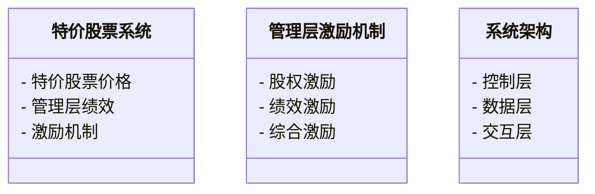
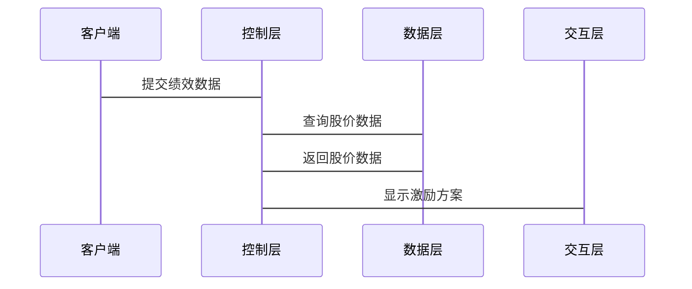

                 


# 特价股票与公司管理层激励机制的关系

## 关键词
- 特价股票
- 管理层激励机制
- 股权激励
- 绩效激励
- 激励机制设计

## 摘要
本文探讨了特价股票与公司管理层激励机制之间的关系，分析了激励机制的类型及其对股价和公司治理的影响，详细讲解了激励机制的数学模型和系统架构设计，并通过实际案例展示了激励机制的实施效果。文章旨在为企业管理层提供有效的激励策略，以提升公司业绩和股东价值。

---

# 第1章: 特价股票与管理层激励机制的背景介绍

## 1.1 特价股票的基本概念
### 1.1.1 特价股票的定义
特价股票是指公司以低于市场价发行的股票，通常用于激励员工或管理层。这类股票通常附带一定的限制条件，如服务期限或业绩目标。

### 1.1.2 特价股票的类型与特点
- **限制性股票**：需满足特定条件（如服务期限）后方可解锁。
- **股票期权**：以特定价格购买公司股票的权利，行权价格通常低于市场价。

### 1.1.3 特价股票在资本市场的地位与作用
特价股票是公司治理和激励机制的重要工具，能够吸引和留住优秀人才，同时激发员工积极性。

## 1.2 管理层激励机制的基本概念
### 1.2.1 管理层激励机制的定义
通过给予管理层股权、奖金等形式，激励其为公司创造更大价值。

### 1.2.2 管理层激励机制的类型与特点
- **股权激励**：授予管理层一定数量的股票或期权。
- **现金激励**：通过奖金、绩效奖金等形式进行激励。

### 1.2.3 管理层激励机制在公司治理中的作用
激励机制能够有效提升管理层的积极性，促进公司业绩增长，同时减少代理成本。

## 1.3 特价股票与管理层激励机制的相互关系
### 1.3.1 特价股票在激励机制中的角色
特价股票是股权激励的重要组成部分，能够有效绑定管理层利益与公司长期发展。

### 1.3.2 激励机制对股价波动的影响
有效的激励机制能够提升公司业绩，进而推动股价上涨，反之可能引发股价波动。

### 1.3.3 特价股票与激励机制的协同效应
通过特价股票激励管理层，能够增强其责任感和归属感，促进公司长期稳定发展。

## 1.4 本章小结
本章介绍了特价股票和管理层激励机制的基本概念，并探讨了两者之间的相互关系，为后续分析奠定了基础。

---

# 第2章: 管理层激励机制的类型分析

## 2.1 股权激励机制
### 2.1.1 股权激励的定义与特点
- **定义**：授予管理层一定数量的股票或期权，使其分享公司增值收益。
- **特点**：长期激励效果显著，但存在较高的风险和不确定性。

### 2.1.2 股权激励的主要形式
- **限制性股票**：需满足特定条件后方可解锁。
- **股票期权**：以特定价格购买公司股票的权利。

### 2.1.3 股权激励的实施条件与限制
- **实施条件**：公司需具备一定的盈利能力和发展潜力。
- **限制**：可能存在稀释现有股东权益的风险。

## 2.2 绩效激励机制
### 2.2.1 绩效激励的定义与特点
- **定义**：根据管理层的绩效表现给予奖金或其他奖励。
- **特点**：短期激励效果明显，但可能存在过度关注短期目标的风险。

### 2.2.2 绩效激励的主要形式
- **绩效奖金**：根据绩效表现发放奖金。
- **绩效股票**：根据绩效表现授予股票。

### 2.2.3 绩效激励的实施方法与挑战
- **实施方法**：设定明确的绩效目标，定期评估并兑现奖励。
- **挑战**：绩效目标的设定可能过于复杂，难以量化。

## 2.3 综合激励机制
### 2.3.1 综合激励机制的定义与特点
- **定义**：结合股权激励和绩效激励的综合激励方式。
- **特点**：兼顾短期和长期激励效果，灵活性高。

### 2.3.2 综合激励机制的主要形式
- **混合激励**：结合股票期权和绩效奖金。
- **递增式激励**：根据绩效表现逐步授予股票。

### 2.3.3 综合激励机制的实施优势与劣势
- **优势**：能够同时满足管理层的短期和长期激励需求。
- **劣势**：实施复杂度较高，需要更多的资源和管理支持。

## 2.4 本章小结
本章分析了股权激励、绩效激励和综合激励三种主要激励机制的类型、特点及实施方法，为后续章节的分析提供了理论基础。

---

# 第3章: 特价股票与激励机制的数学模型与系统分析

## 3.1 特价股票定价模型
### 3.1.1 特价股票定价的基本原理
特价股票的价格通常低于市场价，但需根据公司市值、行业竞争状况等因素进行评估。

### 3.1.2 特价股票定价的数学公式
$$ P = P_{market} \times (1 - \alpha) $$
其中，$P$ 是特价股票的价格，$P_{market}$ 是市场价，$\alpha$ 是折扣率。

### 3.1.3 特价股票定价模型的实例分析
假设某公司市场价为100元，折扣率为20%，则特价股票的价格为80元。

## 3.2 激励机制的数学模型
### 3.2.1 激励机制的基本数学框架
$$ I = f(P, T, S) $$
其中，$I$ 是激励强度，$P$ 是股价，$T$ 是时间，$S$ 是管理层绩效。

### 3.2.2 激励机制的数学公式
$$ I = k \times (S - S_{target}) $$
其中，$k$ 是激励系数，$S$ 是实际绩效，$S_{target}$ 是目标绩效。

### 3.2.3 激励机制数学模型的实例分析
假设某公司目标绩效为80分，实际绩效为90分，激励系数为10%，则激励强度为10分。

## 3.3 特价股票与激励机制的联合模型
### 3.3.1 联合模型的基本原理
通过将特价股票的价格与激励机制相结合，实现管理层与公司利益的长期绑定。

### 3.3.2 联合模型的数学公式
$$ I = f(P, T, S) $$
其中，$P$ 是特价股票的价格，$T$ 是时间，$S$ 是管理层绩效。

### 3.3.3 联合模型的实例分析
假设某公司特价股票价格为80元，目标绩效为80分，实际绩效为90分，激励强度为10分。

---

# 第4章: 系统分析与架构设计方案

## 4.1 系统功能设计
### 4.1.1 领域模型（Mermaid类图）


### 4.1.2 系统架构设计（Mermaid架构图）


## 4.2 系统接口设计
### 4.2.1 接口描述
- **输入接口**：管理层绩效数据、股价数据。
- **输出接口**：激励强度、激励方案。

### 4.2.2 接口交互流程（Mermaid序列图）


---

# 第5章: 项目实战

## 5.1 环境安装
- **工具**：Python、Mermaid、LaTeX。
- **步骤**：
  1. 安装Python和必要的库（如numpy、pandas）。
  2. 安装Mermaid和LaTeX环境。

## 5.2 系统核心实现源代码
```python
def calculate_incentive(price, target_performance, actual_performance, incentive_coeff):
    incentive = incentive_coeff * (actual_performance - target_performance)
    return incentive

# 示例
market_price = 100
discount_rate = 0.2
special_price = market_price * (1 - discount_rate)
target_performance = 80
actual_performance = 90
incentive_coeff = 0.1

incentive = calculate_incentive(special_price, target_performance, actual_performance, incentive_coeff)
print(f"激励强度为：{incentive}")
```

## 5.3 代码应用解读与分析
- **代码功能**：计算管理层的激励强度。
- **输入参数**：市场价、折扣率、目标绩效、实际绩效、激励系数。
- **输出结果**：激励强度。

## 5.4 案例分析
假设某公司市场价为100元，折扣率为20%，目标绩效为80分，实际绩效为90分，激励系数为10%，则激励强度为10分。

## 5.5 项目小结
通过代码实现，可以清晰地看到特价股票与激励机制之间的关系，并能够根据实际数据进行调整和优化。

---

# 第6章: 总结与展望

## 6.1 总结
本文系统地分析了特价股票与公司管理层激励机制的关系，探讨了激励机制的类型及其对股价和公司治理的影响，详细讲解了激励机制的数学模型和系统架构设计，并通过实际案例展示了激励机制的实施效果。

## 6.2 注意事项
- 激励机制的设计需结合公司实际情况，避免一刀切。
- 需关注激励机制的长期效果，避免过度关注短期目标。

## 6.3 拓展阅读
- 推荐阅读《公司治理与激励机制》和《股票定价与市场行为》。

## 6.4 结语
通过合理设计激励机制，公司可以有效提升管理层积极性，促进公司业绩增长和股东价值提升。

---

# 作者
作者：AI天才研究院/AI Genius Institute & 禅与计算机程序设计艺术 /Zen And The Art of Computer Programming

