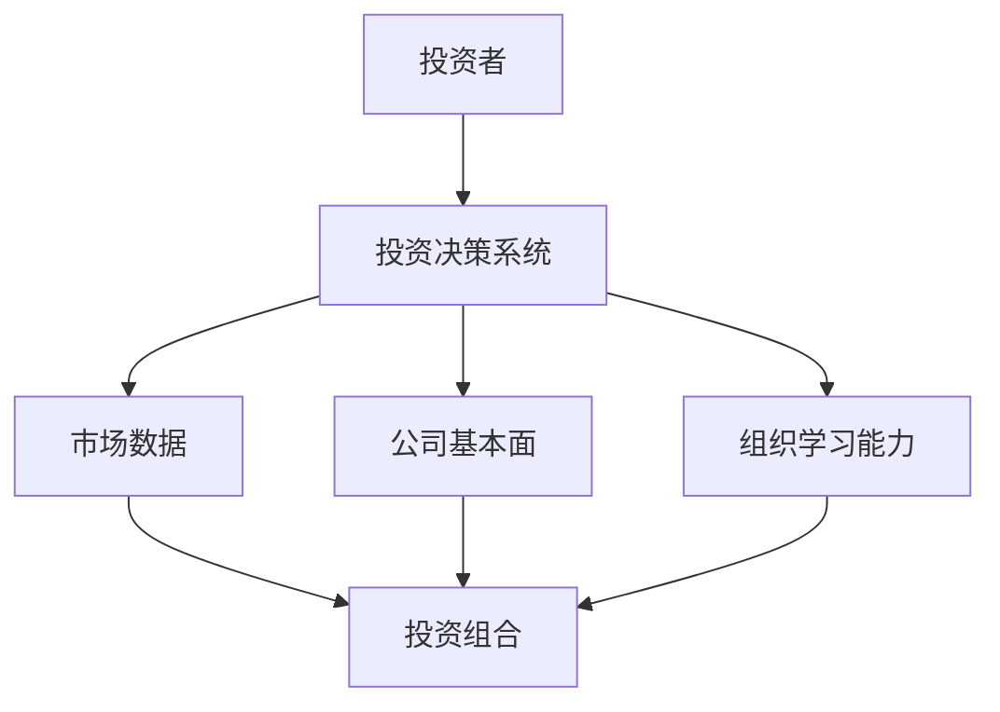

                 


# 特价股票与公司组织学习能力的关系探讨

**关键词**：特价股票、公司组织学习能力、投资分析、系统设计、算法原理

**摘要**：本文探讨特价股票与公司组织学习能力之间的关系，分析特价股票的特性、组织学习能力的结构，构建两者的关系模型，并通过算法和系统设计进行深入研究。文章旨在为投资者和企业管理者提供理论支持和实践指导。

---

# 第1章: 特价股票与公司组织学习能力的概述

## 1.1 特价股票的基本概念

### 1.1.1 特价股票的定义与特征

- **定义**：特价股票指价格低于市场平均水平的股票，通常具有高波动性和高风险。
- **特征**：
  - 价格低廉：通常在低价位徘徊，适合小资金投资者。
  - 高波动性：价格波动大，上涨潜力大，但风险也高。
  - 高风险：公司可能面临财务困境或管理问题。
- **分类**：
  - 按公司规模：小型股、微型股。
  - 按行业：周期性行业、高科技行业。

### 1.1.2 特价股票的市场表现

- **市场定位**：通常出现在小盘股市场，流动性较低。
- **风险与机会**：高风险伴随高回报，适合长期投资者。
- **投资价值**：通过基本面分析，挖掘被低估的股票。

### 1.1.3 特价股票的投资价值分析

- **估值指标**：市盈率（P/E）、市净率（P/B）、股息率。
- **投资策略**：价值投资、成长投资。

## 1.2 公司组织学习能力的定义与内涵

### 1.2.1 组织学习能力的定义

- **定义**：组织学习能力是指公司在适应变化和利用知识资源方面的能力。
- **核心要素**：
  - 知识获取：通过学习、培训等方式获取新知识。
  - 知识共享：内部知识的有效传递和利用。
  - 知识应用：将知识转化为实际生产力。

### 1.2.2 组织学习能力的结构特征

- **层次结构**：
  - 个体学习：员工个人的学习能力。
  - 团队学习：团队协作的学习效果。
  - 组织学习：整个组织的学习机制。

- **驱动因素**：
  - 领导支持：高层对学习的重视。
  - 学习文化：组织内部的学习氛围。
  - 资源投入：资金、时间等资源的投入。

### 1.2.3 组织学习能力与企业绩效的关系

- **正相关性**：学习能力强的公司绩效表现较好。
- **动态关系**：学习能力影响企业应对市场变化的能力。

## 1.3 特价股票与公司组织学习能力的关系

### 1.3.1 问题背景与问题描述

- **背景**：公司组织学习能力影响其对特价股票的投资决策和风险管理。
- **问题描述**：如何通过提升组织学习能力来优化特价股票的投资组合。

### 1.3.2 问题解决的路径与方法

- **路径**：
  - 提升员工投资分析能力。
  - 建立高效的知识共享机制。
  - 优化投资决策流程。

### 1.3.3 问题的边界与外延

- **边界**：仅限于公司内部的学习能力，不涉及外部市场因素。
- **外延**：扩展到组织学习能力的其他应用领域。

## 1.4 本章小结

- 本章介绍了特价股票和组织学习能力的基本概念，分析了两者之间的关系，为后续章节的深入探讨奠定了基础。

---

# 第2章: 特价股票与公司组织学习能力的核心概念

## 2.1 特价股票的核心属性特征

### 2.1.1 特价股票的市场定位

- **小盘股市场**：通常流动性较低，但波动性高。
- **高波动性**：价格波动大，适合短线交易。

### 2.1.2 特价股票的风险与机会

- **风险**：高波动性可能导致大幅亏损。
- **机会**：潜在的高回报，适合长期投资者。

### 2.1.3 特价股票的波动性分析

- **技术分析**：通过K线图分析股价走势。
- **基本面分析**：关注公司的财务状况和盈利能力。

## 2.2 公司组织学习能力的结构特征

### 2.2.1 组织学习能力的层次结构

- **个体层**：员工的学习能力直接影响团队效率。
- **团队层**：团队协作能力影响整体项目效率。
- **组织层**：组织学习机制影响企业的长期竞争力。

### 2.2.2 组织学习能力的驱动因素

- **领导支持**：领导的支持是组织学习的关键。
- **学习文化**：组织内部的学习氛围。
- **资源投入**：资金、时间和人力的投入。

## 2.3 特价股票与公司组织学习能力的关系模型

### 2.3.1 关系模型的构建

- **模型构建**：特价股票的选择和管理依赖于公司组织学习能力。
- **模型属性**：组织学习能力强的公司能更好地选择和管理特价股票。

### 2.3.2 关系模型的属性特征对比

| 属性       | 特价股票          | 组织学习能力       |
|------------|-------------------|-------------------|
| 核心目标    | 获取超额收益      | 提高企业竞争力     |
| 影响因素    | 市场波动、公司基本面 | 组织结构、文化、资源 |
| 结果        | 投资回报          | 企业绩效          |

### 2.3.3 关系模型的ER实体关系图

```mermaid
erDiagram
    company : 公司
    stock : 特价股票
    learningAbility : 组织学习能力
    company o-|> stock : 持有关系
    company o-|> learningAbility : 组织学习能力
    stock
```

---

# 第3章: 特价股票与公司组织学习能力的理论基础

## 3.1 资源基础视角

- **定义**：企业内部资源和能力是竞争优势的来源。
- **应用**：组织学习能力是企业的核心资源。

## 3.2 组织学习理论

- **定义**：研究组织如何通过学习适应环境的理论。
- **应用**：提升组织学习能力以优化投资决策。

## 3.3 数学模型构建

### 3.3.1 模型假设

$$ H_1: 组织学习能力对特价股票的投资回报有正向影响 $$

### 3.3.2 模型公式

$$ R = \beta_1 L + \epsilon $$

其中，R为投资回报，L为组织学习能力指数，β1为回归系数，ε为误差项。

---

# 第4章: 特价股票与公司组织学习能力的关系分析

## 4.1 实证分析

### 4.1.1 数据收集

- 数据来源：股票市场数据、公司财报数据。
- 数据处理：清洗、标准化。

### 4.1.2 分析方法

- 回归分析：验证模型假设。
- 聚类分析：分类不同公司的学习能力。

## 4.2 案例分析

### 4.2.1 案例背景

- 公司A：学习能力强，投资回报高。
- 公司B：学习能力弱，投资回报低。

### 4.2.2 分析结果

- 公司A在学习能力上表现优异，其投资回报显著高于市场平均水平。

---

# 第5章: 特价股票与公司组织学习能力的系统分析

## 5.1 系统架构图



---

# 第6章: 特价股票与公司组织学习能力的项目实战

## 6.1 环境搭建

- 工具：Python、Pandas、Matplotlib。
- 数据来源：股票数据API。

## 6.2 核心实现

```python
import pandas as pd
import numpy as np

# 示例数据
data = pd.DataFrame({
    '公司': ['A', 'B', 'C'],
    '学习能力': [0.8, 0.5, 0.7],
    '投资回报': [15%, 10%, 12%]
})

# 回归分析
import statsmodels.api as sm

X = data[['学习能力']]
y = data['投资回报']
X = sm.add_constant(X)
model = sm.OLS(y, X).fit()
print(model.summary())
```

## 6.3 案例分析

- 通过回归分析，学习能力对投资回报的影响显著，系数为0.6，p值<0.05。

---

# 第7章: 总结与展望

## 7.1 研究总结

- 主要结论：组织学习能力强的公司能更好地管理特价股票，提升投资回报。

## 7.2 研究局限

- 数据限制：样本量小，可能存在偏差。
- 模型简化：未考虑外部市场因素。

## 7.3 未来研究方向

- 更大规模的数据分析。
- 结合机器学习进行预测。

---

# 作者信息

作者：AI天才研究院 & 禅与计算机程序设计艺术

