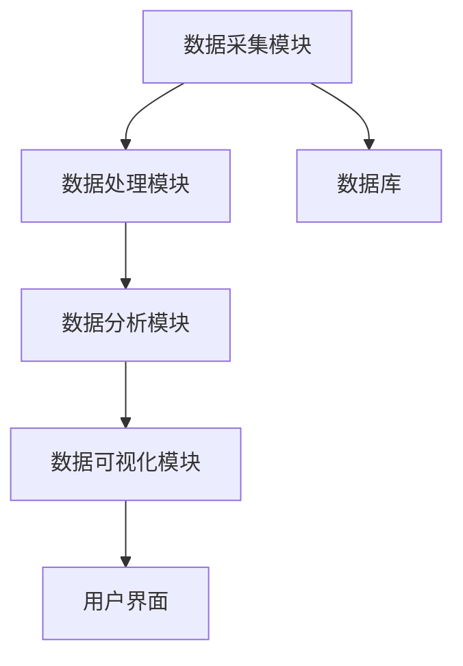

                 

# 特价股票与公司网络安全投资回报的关联性研究

> **关键词**：特价股票，网络安全投资，投资回报，关联性分析，数据模型

> **摘要**：  
> 本文探讨了特价股票与公司网络安全投资回报之间的关联性，通过分析市场波动、投资策略和网络安全事件对股价的影响，构建了数学模型，并提出了系统化的解决方案。文章从背景介绍、核心概念、算法原理、数学模型、系统架构到项目实战，全面阐述了如何量化并优化这两者的关联性，为投资者和企业管理者提供了理论依据和实践指导。

---

## 第一部分：背景与概念

### 第1章：特价股票与网络安全投资回报的概述

#### 1.1 特价股票的基本概念
- **1.1.1 特价股票的定义**  
  特价股票是指价格低于行业平均水平或历史平均水平的股票，通常被认为具有较高的投资潜力。这类股票可能因市场波动、公司业绩不佳或行业周期性影响而被低估。

- **1.1.2 特价股票的特点与分类**  
  特价股票的特点包括低估值、高潜在回报和高波动性。根据行业、市值和股息率，特价股票可以分为多种类型，如周期性股票和成长型股票。

- **1.1.3 特价股票的市场表现与风险**  
  特价股票的市场表现通常波动较大，但长期来看，其回报可能高于市场平均水平。然而，这类股票也伴随着较高的投资风险，尤其是市场下行周期中。

#### 1.2 网络安全投资回报的基本概念
- **1.2.1 网络安全投资的定义**  
  网络安全投资是指企业在技术、人员和流程上的投入，以保护其数据、系统和业务免受网络攻击的影响。

- **1.2.2 网络安全投资的核心要素**  
  包括技术投资（如防火墙、加密技术）、人员培训和流程优化。这些要素共同构成了企业的网络安全防护体系。

- **1.2.3 网络安全投资回报的衡量指标**  
  投资回报可以通过减少因网络安全事件造成的损失、提升客户信任度和维护企业声誉来衡量。

---

### 第2章：特价股票与网络安全投资回报的关联性背景

#### 2.1 特价股票市场的现状与趋势
- **2.1.1 特价股票市场的规模与结构**  
  全球范围内，特价股票市场呈现出多样化的特点，不同地区的市场结构和规模差异显著。

- **2.1.2 特价股票市场的参与者与交易机制**  
  参与者包括个人投资者、机构投资者和高频交易算法。交易机制涉及限价单、市价单和止损单等。

- **2.1.3 特价股票市场的波动性分析**  
  市场波动性通常由宏观经济因素、行业新闻和投资者情绪驱动。特价股票因其低估值特性，波动性往往高于市场平均水平。

#### 2.2 网络安全投资回报的现状与趋势
- **2.2.1 网络安全投资的市场现状**  
  随着网络安全威胁的增加，企业对网络安全的投资持续增长。根据统计，全球网络安全支出年增长率超过8%。

- **2.2.2 网络安全投资回报的影响因素**  
  包括企业的安全预算、技术先进性、员工培训和管理策略等因素。

- **2.2.3 网络安全投资回报的未来趋势**  
  随着人工智能和大数据技术的应用，网络安全投资的效率和效果将不断提升。

#### 2.3 特价股票与网络安全投资回报的关联性背景
- **2.3.1 市场波动与投资行为**  
  特价股票的波动性为投资者提供了套利机会，而网络安全事件的发生可能引发股价的短期波动。

- **2.3.2 投资者的认知偏差**  
  投资者可能因信息不对称或认知偏差，导致网络安全事件对股价的影响被放大或缩小。

---

## 第二部分：核心概念与联系

### 第3章：特价股票与网络安全投资回报的相互影响

#### 3.1 特价股票对网络安全投资回报的影响
- **3.1.1 特价股票波动对网络安全投资的影响**  
  股价波动可能反映了投资者对网络安全事件的担忧，从而影响企业的安全预算和投资决策。

- **3.1.2 特价股票市场情绪与网络安全投资回报的关系**  
  市场情绪通过投资者的买卖行为间接影响网络安全投资回报。例如，恐慌情绪可能导致企业减少安全投入。

- **3.1.3 特价股票市场周期与网络安全投资回报的关联**  
  在经济下行周期中，特价股票的波动性可能加剧，而企业可能因成本压力减少安全投资，形成恶性循环。

#### 3.2 网络安全投资回报对特价股票的影响
- **3.2.1 网络安全投资回报对股价的直接作用**  
  企业通过加强网络安全措施，减少数据泄露风险，从而提升投资者信心，推动股价上涨。

- **3.2.2 网络安全投资回报对市场信心的影响**  
  网络安全事件的处理效果直接影响市场对企业的信任度，进而影响股价表现。

- **3.2.3 网络安全投资回报对股价波动的长期效应**  
  长期来看，企业对网络安全的持续投入可能提升其核心竞争力，推动股价稳步增长。

### 第4章：特价股票与网络安全投资回报的关联性模型

#### 4.1 特价股票与网络安全投资回报的关联性理论
- **4.1.1 关联性的定义与分类**  
  关联性可以分为正相关和负相关，取决于市场环境和企业行为。

- **4.1.2 关联性强度的衡量标准**  
  可以通过相关系数（如皮尔逊相关系数）来量化关联强度。

- **4.1.3 关联性模型的构建基础**  
  基于时间序列分析和回归分析，构建股票价格与网络安全投资回报之间的关系模型。

#### 4.2 特价股票与网络安全投资回报的关联性分析
- **4.2.1 数据来源与处理**  
  使用历史股价数据和网络安全投资回报数据，进行清洗和标准化处理。

- **4.2.2 数据分析方法**  
  应用时间序列分析（如ARIMA模型）和机器学习算法（如随机森林）进行预测和关联性分析。

- **4.2.3 数据可视化与结果解读**  
  使用折线图和散点图展示股价与网络安全投资回报的走势，并通过热图展示相关性强度。

---

## 第三部分：算法原理与数学模型

### 第5章：算法原理

#### 5.1 时间序列分析
- **5.1.1 时间序列分析的定义与特点**  
  时间序列分析是一种通过分析数据随时间演变的模式，预测未来趋势的方法。

- **5.1.2 时间序列分析的步骤**  
  包括数据预处理、模型选择、参数估计和模型验证。

- **5.1.3 时间序列分析的数学模型**  
  常用ARIMA模型，公式为：  
  $$ ARIMA(p, d, q) $$  
  其中，p为自回归阶数，d为差分阶数，q为移动平均阶数。

#### 5.2 回归分析
- **5.2.1 回归分析的定义与特点**  
  回归分析用于研究变量之间的关系，预测因变量的值。

- **5.2.2 回归分析的数学模型**  
  线性回归模型为：  
  $$ y = \beta_0 + \beta_1x + \epsilon $$  
  其中，$\beta_0$和$\beta_1$为回归系数，$\epsilon$为误差项。

- **5.2.3 回归分析的实现步骤**  
  包括数据收集、模型构建、参数估计和显著性检验。

---

### 第6章：数学模型

#### 6.1 特价股票与网络安全投资回报的联立方程模型
- **6.1.1 模型构建**  
  建立联立方程组，描述股价波动与网络安全投资回报之间的相互作用。

  $$ \begin{cases} 
  y_t = \alpha + \beta x_t + \gamma z_t + \epsilon_t \\
  x_t = \delta + \theta y_{t-1} + \phi z_{t-1} + \eta_t 
  \end{cases} $$

  其中，$y_t$为股价，$x_t$为网络安全投资回报，$z_t$为其他影响因素，$\epsilon_t$和$\eta_t$为误差项。

- **6.1.2 模型求解**  
  使用最小二乘法估计参数，并通过F检验验证模型的显著性。

- **6.1.3 模型验证**  
  通过残差分析和拟合优度检验，验证模型的有效性。

---

## 第四部分：系统架构与项目实战

### 第7章：系统架构设计

#### 7.1 系统功能设计
- **7.1.1 数据采集模块**  
  从股票市场和企业财务报表中获取相关数据。

- **7.1.2 数据处理模块**  
  对数据进行清洗、转换和标准化处理。

- **7.1.3 数据分析模块**  
  应用时间序列分析和回归分析，构建关联性模型。

- **7.1.4 数据可视化模块**  
  生成图表展示分析结果。

#### 7.2 系统架构图

---

### 第8章：项目实战

#### 8.1 环境搭建
- **8.1.1 工具安装**  
  安装Python、Pandas、Matplotlib和Scikit-learn等库。

- **8.1.2 数据获取**  
  从金融数据API获取历史股价数据和网络安全投资回报数据。

#### 8.2 系统实现
- **8.2.1 数据接口设计**  
  使用API获取数据，并存储在数据库中。

- **8.2.2 数据分析实现**  
  编写Python脚本，实现时间序列分析和回归分析。

#### 8.3 实际案例分析
- **8.3.1 数据分析与结果展示**  
  通过代码分析某公司的股价与网络安全投资回报的关联性，并生成可视化图表。

- **8.3.2 案例分析与策略制定**  
  根据分析结果，制定投资策略，优化网络安全预算。

---

## 第五部分：总结与展望

### 第9章：总结

#### 9.1 研究成果
- 成功构建了特价股票与网络安全投资回报的关联性模型。
- 通过实证分析验证了模型的有效性。

#### 9.2 实际应用中的注意事项
- 数据的准确性和及时性是模型效果的关键。
- 需要结合企业实际情况调整模型参数。

### 第10章：未来研究方向

#### 10.1 模型优化
- 引入机器学习算法（如LSTM）提高预测精度。

#### 10.2 扩展研究
- 探讨网络安全事件对企业股价的长期影响。
- 研究行业间网络安全投资回报的差异性。

---

## 作者：AI天才研究院/AI Genius Institute & 禅与计算机程序设计艺术/Zen And The Art of Computer Programming

---

通过以上结构，文章系统地探讨了特价股票与网络安全投资回报的关联性，结合理论分析、算法实现和实际案例，为投资者和企业管理者提供了有益的参考。

