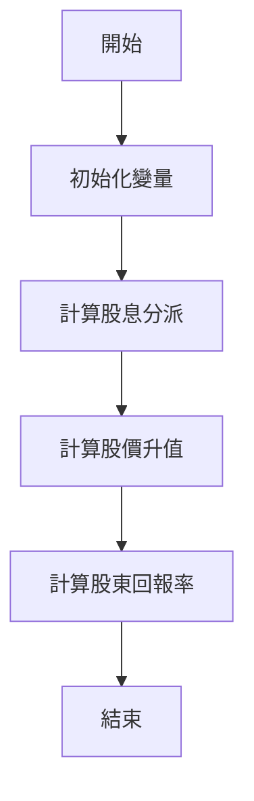
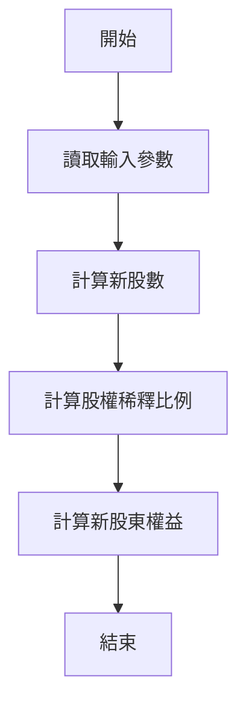
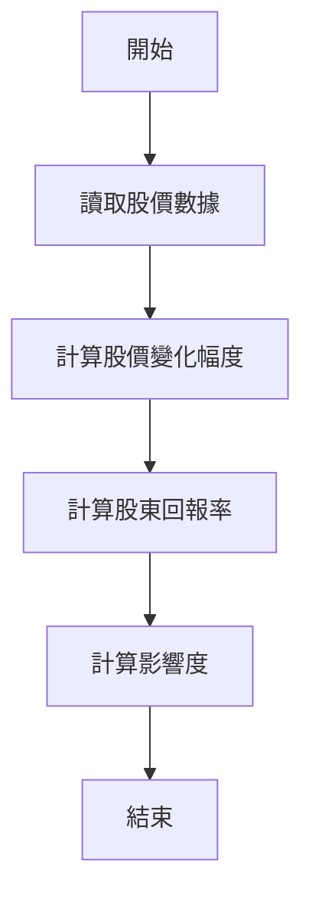
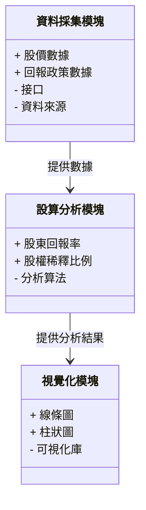

                 


# 第三章: 特价股票与股东回报政策的核心概念

## 第3章: 特价股票与股东回报政策的核心概念

### 3.1 特价股票的核心概念

#### 3.1.1 特价股票的发行目的
特價股票通常由公司發行，目的是為了吸引投資者或作為股權激勵的一部分。它們通常以低于市場價格會式發行，用於補償股東或激勵員工。

#### 3.1.2 特价股票的发行条件
- 公司股價短期內大幅下跌
- 公司希望增持股權或回購股權
- 公司進行併購或戰略合作
- 公司股東增持股權或激勵員工

#### 3.1.3 特价股票的发行方式
- 非公開發行
- 公開發行
- 市場回購後重新發行
- 股權激勵計劃

### 3.2 股東回報政策的核心概念

#### 3.2.1 股東回報政策的實施目標
- 分紅政策：通過股息分派回饋股東
- 股票回購：購回股東持有的股份
- 股票分割：增加股數以提升股東價值
- 股權激勵：獎勵股東或員工

#### 3.2.2 股東回報政策的實施方式
- 定期分紅
- 不定期分紅
- 股票回購計劃
- 股票分割方案
- 股權激勵計劃

#### 3.2.3 股東回報政策的實施效果
- 提高股東價值
- 保候股東信心
- 影響公司股價
- 影響公司資金流動性

### 3.3 特价股票與股東回報政策的屬性對比

| 属性 | 特价股票 | 股東回報政策 |
|------|----------|--------------|
| 定義 | 以低於面值發行的股票 | 公司回饋股東的政策 |
| 目的 | 吸引投資或股權激勵 | 回饋股東或增加股東價值 |
| 形式 | 非公開發行、公開發行等 | 分紅、回購、分割等 |
| 影響 | 短期股價可能下跌，股東權益可能被稀釋 | 可能提升股價，增加股東回報 |

### 3.4 特价股票與股東回報政策的ER實體關係圖

```mermaid
erDiagram
    customer[股東] {
        <属性>
        投資者名稱
        持股數量
        股東身份
    }
    stock[股票] {
        <属性>
        股票編號
        股票名稱
        發行價格
        發行日期
    }
    return_policy[回報政策] {
        <屬性>
        政策編號
        政策類型
        政策實施日期
    }
    customer -|> stock : 持有
    stock -|> return_policy : 受影響
    return_policy -|> customer : 影響股東權益
```

---

# 第四章: 特价股票與股東回報政策的算法原理

## 第4章: 特价股票與股東回報政策的算法原理

### 4.1 算法原理簡介

分析特价股票與股東回報政策的关联性，主要涉及以下幾個方面：

1. 股價走勢分析
2. 股東回報率計算
3. 特价股票發行對股東權益的影響
4. 股東回報政策的實施效果評估

### 4.2 股東回報率計算算法

#### 4.2.1 股東回報率的定義
股東回報率是指股東通過持有股票所獲得的回報率，主要包括股息回報和股價升值兩部分。

$$ 股東回報率 = \frac{股息分派 + 股價升值}{初始投資} $$

#### 4.2.2 股東回報率的算法流程圖



#### 4.2.3 股東回報率計算的Python實現

```python
def calculate_shareholder_return(dividends, initial Investment, final_value):
    return (dividends + (final_value - initial_Investment)) / initial_Investment

# 示例
initial_Investment = 1000
dividends = 50
final_value = 1200

return_rate = calculate_shareholder_return(dividends, initial_Investment, final_value)
print(f"股東回報率：{return_rate}")
```

### 4.3 特价股票發行對股東權益影響的算法

#### 4.3.1 算法原理
當公司發行特價股票時，原有股東的權益可能會被稀釋。我們需要計算股東權益的變化情況。

$$ 新股東權益 = 原股東權益 \times \frac{原股數}{新股數} $$

#### 4.3.2 算法流程圖



#### 4.3.3 Python實現

```python
def calculate_dilution(equity, new_shares, existing_shares):
    diluted_equity = equity * (existing_shares / (new_shares + existing_shares))
    return diluted_equity

# 示例
equity = 1000000
new_shares = 100000
existing_shares = 500000

diluted_equity = calculate_dilution(equity, new_shares, existing_shares)
print(f"股權稀釋後權益：{diluted_equity}")
```

### 4.4 股東回報政策的實施效果評估算法

#### 4.4.1 算法原理
股東回報政策的效果評估主要通過股價走勢和股東回報率來衡量。

$$ 股價走勢影響度 = \frac{股價變化幅度}{股東回報率} $$

#### 4.4.2 算法流程圖



#### 4.4.3 Python實現

```python
def calculate_impact(stock_price_change, return_rate):
    impact = stock_price_change / return_rate
    return impact

# 示例
stock_price_change = 20
return_rate = 0.15

impact = calculate_impact(stock_price_change, return_rate)
print(f"股價走勢影響度：{impact}")
```

---

# 第五章: 特价股票與股東回報政策的系統分析與架構設計

## 第5章: 特价股票與股東回報政策的系統分析與架構設計

### 5.1 系統功能設計

#### 5.1.1 系統功能模塊
- 資料採集模塊：收集股價數據和股東回報政策數據
- 設算分析模塊：計算股東回報率和股權稀釋比例
- 視覺化模塊：展示分析結果

#### 5.1.2 系統功能架構圖



### 5.2 系統架構設計

#### 5.2.1 系統架構圖


---

# 第六章: 特价股票與股東回報政策的項目實戰

## 第6章: 特价股票與股東回報政策的項目實戰

### 6.1 環境搭建

#### 6.1.1 安裝Python環境
使用Anaconda或其他Python分發版，安裝所需的庫，如Pandas、Matplotlib、Mermaid等。

#### 6.1.2 安裝其他工具
安裝Jupyter Notebook、VS Code等編輯工具。

### 6.2 核心代碼實現

#### 6.2.1 股東回報率計算代碼

```python
import pandas as pd
import matplotlib.pyplot as plt

# 紅利數據
dividends = [50, 60, 70]

# 初始投資
initial_investment = 1000

# 股價數據
prices = [1000, 1050, 1100]

# 計算股東回報率
returns = []
for i in range(len(prices)):
    return_rate = (dividends[i] + (prices[i] - initial_investment)) / initial_investment
    returns.append(return_rate)

# 繪製圖表
plt.figure(figsize=(10,6))
plt.plot(prices, label='股價')
plt.scatter(range(len(dividends)), dividends, color='red', label='紅利')
plt.xlabel('時間')
plt.ylabel('價值')
plt.legend()
plt.show()
```

#### 6.2.2 股權稀釋比例計算代碼

```python
def calculate_dilution(equity, new_shares, existing_shares):
    diluted_equity = equity * (existing_shares / (new_shares + existing_shares))
    return diluted_equity

# 示例數據
equity = 1000000
new_shares = 100000
existing_shares = 500000

diluted_equity = calculate_dilution(equity, new_shares, existing_shares)
print(f"股權稀釋後權益：{diluted_equity}")
```

### 6.3 案例分析

#### 6.3.1 案例介紹
以某家上市公司為例，分析其發行特價股票後的股東回報情況。

#### 6.3.2 設算與分析
- 股票發行前股東權益
- 股票發行後股東權益
- 股東回報率變化

### 6.4 項目小結

---

# 第七章: 特价股票與股東回報政策的最佳實踐

## 第7章: 特价股票與股東回報政策的最佳實踐

### 7.1 小結

- 特价股票與股東回報政策的關係密切
- 股東回報率是評估股東回報的重要指標
- 股權稀釋可能影響股東權益

### 7.2 注意事項

- 特价股票發行可能導致股權稀釋
- 股東回報政策需要考慮公司的財務狀況
- 股票市場風險可能影響股價走勢

### 7.3 擴展閱讀

- 《股權激勵與股東回報》
- 《特價股票發行的市場影響》
- 《股東回報政策的實施策略》

---

# 作者

作者：AI天才研究院/AI Genius Institute & 禪與计算机程序設計藝術/Zen And The Art of Computer Programming

---

**注意：** 這篇文章旨在提供一種系統化的方法來分析特价股票與股東回報政策的關聯性。文中提供的算法和案例分析為示例，具體實施時需根據實際情況調整。

