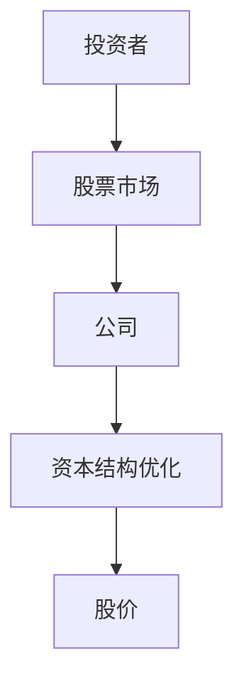
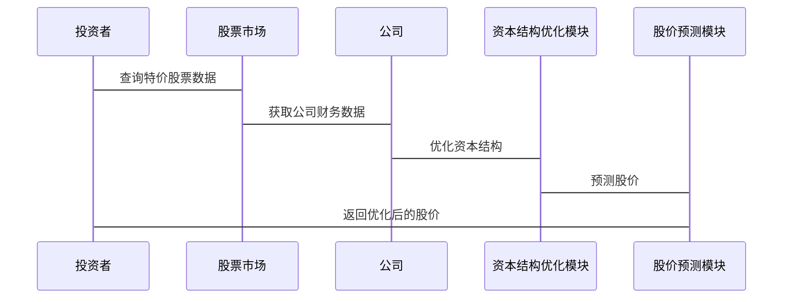

                 


# 特价股票与公司资本结构优化的关系

> **关键词**：特价股票、资本结构优化、公司治理、股东价值最大化、资本成本  
> **摘要**：本文探讨了特价股票与公司资本结构优化之间的关系，从背景介绍、核心概念、算法原理、系统分析、项目实战到总结，详细阐述了如何通过优化资本结构来影响股价，并结合实际案例进行分析，为读者提供全面的理论和实践指导。

---

## 第1章: 特价股票与资本结构优化概述

### 1.1 特价股票的基本概念

#### 1.1.1 特价股票的定义  
特价股票指的是价格相对较低的股票，通常出现在市场低迷或公司业绩不佳的情况下。这类股票具有较高的风险和潜在的回报。

#### 1.1.2 特价股票的特点  
- **低估值**：市盈率、市净率等指标低于行业平均水平。
- **高波动性**：股价波动较大，容易受到市场情绪影响。
- **高风险**：投资风险较高，但潜在回报也较大。

#### 1.1.3 特价股票的分类  
- **周期性股票**：受经济周期影响较大的股票，如制造业、能源等行业。
- **成长型股票**：未来增长潜力大，但当前估值较低。
- **价值型股票**：与市场价格相比，内在价值被低估的股票。

### 1.2 公司资本结构优化的基本概念

#### 1.2.1 资本结构的定义  
资本结构指的是公司债务和股权的比例。合理的资本结构能够降低资本成本，提高股东价值。

#### 1.2.2 资本结构优化的目标  
- **最大化股东价值**：通过优化资本结构，使公司价值最大化。
- **降低资本成本**：通过合理分配债务和股权，降低整体资本成本。
- **增强财务稳定性**：避免过度杠杆化，降低财务风险。

#### 1.2.3 资本结构优化的常见方法  
- **Modigliani-Miller模型**：经典的资本结构优化模型。
- **净现值法（NPV）**：评估不同资本结构下的项目价值。
- **资本资产定价模型（CAPM）**：用于计算资本成本。

### 1.3 特价股票与资本结构优化的关系

#### 1.3.1 特价股票对资本结构的影响  
- 特价股票的低估值可能反映出公司资本结构不合理，需要优化。
- 特价股票的高波动性可能影响资本市场的稳定性。

#### 1.3.2 资本结构优化对股价的影响  
- 优化资本结构可以降低资本成本，提升公司价值，从而推高股价。
- 过高的债务比例可能导致财务风险上升，抑制股价表现。

#### 1.3.3 两者关系的理论基础  
- 股价反映了公司的价值，而资本结构优化是实现价值最大化的重要手段。
- 通过优化资本结构，公司可以更好地应对市场波动，稳定股价。

---

## 第2章: 特价股票与资本结构优化的核心概念

### 2.1 特价股票的核心属性

#### 2.1.1 特价股票的市场定位  
- 特价股票通常出现在熊市或行业低迷期。
- 投资者可能因为公司业绩不佳而抛售股票，导致股价下跌。

#### 2.1.2 特价股票的风险特征  
- **流动性风险**：低价股票流动性可能较差，难以迅速变现。
- **市场风险**：受整体市场波动影响较大。
- **信用风险**：公司财务状况不佳可能导致违约风险。

#### 2.1.3 特价股票的流动性分析  
- 特价股票的流动性与其市场价格和交易量有关。
- 低流动性可能导致买卖价差较大，增加交易成本。

### 2.2 资本结构优化的核心要素

#### 2.2.1 股权与债务的比例  
- 合理的债务比例可以降低资本成本，但过高的债务可能导致财务风险。
- 股权比例过高会增加资本成本，影响股东价值。

#### 2.2.2 股东价值最大化的目标  
- 通过优化资本结构，使公司价值最大化。
- 股东价值最大化是资本结构优化的核心目标。

#### 2.2.3 资本成本的优化  
- 通过合理分配债务和股权，降低整体资本成本。
- 资本成本的优化是实现股东价值最大化的重要手段。

### 2.3 特价股票与资本结构优化的联系

#### 2.3.1 特价股票对资本成本的影响  
- 特价股票的高波动性可能影响市场对公司价值的评估，进而影响资本成本。
- 股价下跌可能导致公司资本成本上升，进一步影响资本结构。

#### 2.3.2 资本结构优化对股价的推动作用  
- 优化资本结构可以提升公司价值，吸引投资者，推高股价。
- 合理的资本结构能够降低财务风险，增强投资者信心。

#### 2.3.3 两者关系的数学模型  
- 使用资本资产定价模型（CAPM）分析股价与资本结构的关系。
- 通过净现值法（NPV）评估资本结构优化对股价的影响。

---

## 第3章: 特价股票与资本结构优化的理论基础

### 3.1 资本资产定价模型（CAPM）

#### 3.1.1 CAPM的基本原理  
CAPM用于计算资产的预期收益，公式如下：
$$
E(r) = r_f + \beta (r_m - r_f)
$$
其中，$E(r)$ 是资产的预期收益率，$r_f$ 是无风险利率，$\beta$ 是资产的系统性风险系数，$r_m$ 是市场预期收益率，$r_f$ 是无风险利率。

#### 3.1.2 CAPM在资本结构优化中的应用  
通过CAPM计算不同资本结构下的资本成本，选择最优资本结构。

#### 3.1.3 CAPM与特价股票的关系  
- 特价股票的系统性风险系数$\beta$可能较高，影响其预期收益率。

### 3.2 净现值法（NPV）

#### 3.2.1 NPV的基本原理  
NPV用于评估投资项目的价值，公式如下：
$$
NPV = \sum_{t=1}^{n} \frac{CF_t}{(1 + r)^t}
$$
其中，$CF_t$ 是第$t$年的现金流，$r$ 是贴现率。

#### 3.2.2 NPV在资本结构优化中的应用  
通过计算不同资本结构下的NPV，选择最优资本结构。

#### 3.2.3 NPV与特价股票的关联  
- NPV分析可以帮助公司评估不同资本结构下的项目价值，进而影响股价。

### 3.3 股权资本成本与债务成本的比较

#### 3.3.1 股权资本成本的计算  
使用CAPM计算股权资本成本：
$$
r_e = r_f + \beta (r_m - r_f)
$$

#### 3.3.2 债务资本成本的计算  
债务资本成本通常以票面利率或银行贷款利率为基础。

#### 3.3.3 两者的比较与优化  
通过比较股权和债务资本成本，确定最优资本结构。

---

## 第4章: 特价股票与资本结构优化的数学模型

### 4.1 特价股票的定价模型

#### 4.1.1 市盈率模型  
$$
P = \text{EPS} \times \text{PE}
$$
其中，$\text{EPS}$ 是每股收益，$\text{PE}$ 是市盈率。

#### 4.1.2 市净率模型  
$$
P = \text{BPS} \times \text{PB}
$$
其中，$\text{BPS}$ 是每股净资产，$\text{PB}$ 是市净率。

#### 4.1.3 股息率模型  
$$
P = \text{Dividend Yield} \times \text{Earnings Per Share}
$$

### 4.2 资本结构优化的数学模型

#### 4.2.1 Modigliani-Miller模型  
基本公式：
$$
V = V_L + T_c \times D
$$
其中，$V_L$ 是无杠杆的公司价值，$D$ 是债务，$T_c$ 是公司所得税率。

#### 4.2.2 净现值法（NPV）  
$$
NPV = \sum_{t=1}^{n} \frac{CF_t}{(1 + r)^t}
$$

---

## 第5章: 特价股票与资本结构优化的系统分析

### 5.1 系统功能设计

#### 5.1.1 领域模型图  


#### 5.1.2 系统架构图  


### 5.2 接口设计与交互序列图

#### 5.2.1 接口设计  
- 输入：公司财务数据、市场数据。
- 输出：优化后的资本结构、股价预测。

#### 5.2.2 交互序列图  


---

## 第6章: 特价股票与资本结构优化的项目实战

### 6.1 环境安装

#### 6.1.1 安装Python环境  
使用Anaconda安装Python 3.8及以上版本。

#### 6.1.2 安装相关库  
安装numpy、pandas、scipy等库：
```bash
pip install numpy pandas scipy
```

### 6.2 系统核心实现

#### 6.2.1 数据获取  
从股票市场获取特价股票数据。

#### 6.2.2 数据分析  
计算市盈率、市净率等指标。

#### 6.2.3 模型实现  
使用CAPM和NPV模型优化资本结构。

### 6.3 实际案例分析

#### 6.3.1 案例介绍  
以某公司为例，分析其资本结构优化过程。

#### 6.3.2 数据分析  
计算公司财务数据，优化资本结构。

#### 6.3.3 模型结果  
得出优化后的资本结构，预测股价。

---

## 第7章: 特价股票与资本结构优化的总结

### 7.1 最佳实践 tips  
- 定期评估资本结构，及时优化。
- 结合市场环境和公司实际情况制定优化策略。

### 7.2 小结  
通过优化资本结构，可以提升公司价值，稳定股价，降低资本成本。

### 7.3 注意事项  
- 特价股票具有高风险，需谨慎投资。
- 资本结构优化需结合公司实际情况，避免过度杠杆化。

### 7.4 拓展阅读  
- 《资本论》
- 《投资学》
- 相关学术论文

---

## 作者：AI天才研究院/AI Genius Institute & 禅与计算机程序设计艺术 /Zen And The Art of Computer Programming

