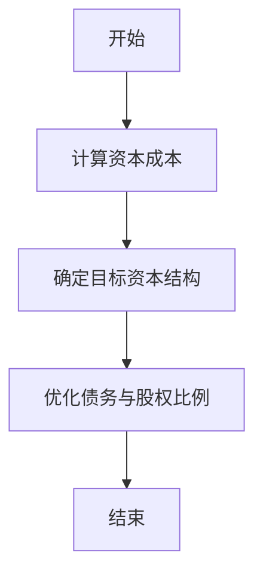
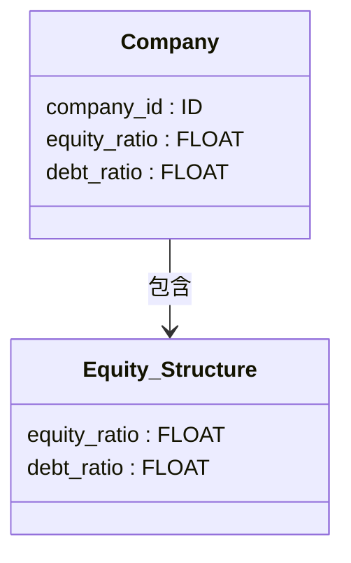

                 


# 特价股票与公司资本结构优化的关系分析

> 关键词：特价股票、资本结构优化、公司资本成本、财务风险、资本结构理论

> 摘要：本文探讨特价股票与公司资本结构优化之间的关系，分析特价股票对公司资本成本、资本结构的影响，以及如何通过优化资本结构来提升公司价值。文章结合理论分析和实证研究，提出了一套基于特价股票的资本结构优化策略，并通过案例分析验证了该策略的有效性。

---

# 第一部分：背景介绍与核心概念

## 第1章：特价股票的基本概念

### 1.1 特价股票的定义与特点

#### 1.1.1 特价股票的定义
特价股票是指以低于市场价发行的股票，通常用于吸引投资者或作为公司融资的一种方式。其特点包括低发行价、高流通性以及潜在的高回报率。

#### 1.1.2 特价股票的特点
- 低发行价：吸引投资者。
- 高流通性：容易买卖。
- 风险与收益并存：回报率高，但风险较大。

#### 1.1.3 特价股票在资本市场中的地位
特价股票是公司融资的重要工具，尤其在新兴市场中应用广泛。

### 1.2 公司资本结构优化的理论基础

#### 1.2.1 资本结构的基本概念
资本结构指公司债务与股权的比例。合理的资本结构可以降低资本成本，提升公司价值。

#### 1.2.2 资本结构优化的目标
- 最小化资本成本。
- 平衡财务风险与收益。

#### 1.2.3 资本结构优化的理论依据
- MM定理：资本结构与企业价值的关系。
- � 凸性理论：资本结构的最优组合。

## 第2章：特价股票与资本结构优化的关系背景

### 2.1 特价股票对公司资本结构的影响

#### 2.1.1 特价股票对公司资本成本的影响
- 降低债务成本：通过发行特价股票，公司可以减少债务负担。
- 优化资本结构：平衡债务与股权比例，降低整体资本成本。

#### 2.1.2 特价股票对公司资本结构优化的推动作用
- 提供更多融资渠道。
- 增强市场流动性。

#### 2.1.3 特价股票对公司财务风险的影响
- 减少负债比例，降低财务风险。

### 2.2 特价股票与资本结构优化的相互作用

#### 2.2.1 特价股票如何影响资本结构优化
- 通过降低资本成本，推动资本结构优化。
- 提供更多的融资渠道，支持资本结构调整。

#### 2.2.2 资本结构优化如何影响特价股票的价值
- 优化资本结构，提升公司价值，间接提升特价股票吸引力。

#### 2.2.3 两者关系的动态演变
- 随市场变化，两者关系不断调整。

---

# 第二部分：特价股票与资本结构优化的核心概念与联系

## 第3章：特价股票与资本结构优化的核心概念

### 3.1 特价股票的属性特征对比表格

| 特性 | 特价股票 | 高价股票 | 普通股票 |
|------|----------|----------|----------|
| 发行价 | 低于市场价 | 高于市场价 | 市场价附近 |
| 流通性 | 高 | 低 | 中等 |
| 风险 | 高 | 低 | 中等 |

### 3.2 公司资本结构优化的ER实体关系图

```mermaid
erDiagram
    company_header {
        company_id : ID
        company_name : STRING
        industry : STRING
    }
    equity_structure_header {
        equity_ratio : FLOAT
        debt_ratio : FLOAT
    }
    relationship {
        company -- equity_structure : 拥有
    }
```

## 第4章：特价股票与资本结构优化的关系分析

### 4.1 特价股票对资本结构优化的影响

#### 4.1.1 特价股票对公司资本成本的降低作用
通过发行特价股票，公司可以减少债务，降低资本成本。公式：$$ \text{资本成本} = \frac{\text{税后净利润}}{\text{目标资本结构}} $$

#### 4.1.2 特价股票对公司资本结构优化的推动作用
提供融资渠道，支持资本结构调整。

---

# 第三部分：数学模型与算法原理

## 第5章：数学模型与算法原理

### 5.1 资本成本计算公式

$$ WACC = \frac{E}{V} \times R_e + \frac{D}{V} \times R_d \times (1 - T) $$

其中：
- \( WACC \) 是加权平均资本成本
- \( E \) 是股权资本
- \( V \) 是公司总价值
- \( R_e \) 是股权资本成本
- \( D \) 是债务资本
- \( R_d \) 是债务资本成本
- \( T \) 是税率

### 5.2 资本结构优化算法



---

# 第四部分：系统分析与架构设计

## 第6章：系统分析与架构设计方案

### 6.1 系统功能设计（领域模型）



### 6.2 系统架构设计

```mermaid
graph TD
    Client --> Server : 发送请求
    Server --> Database : 查询数据
    Database --> Server : 返回数据
    Server --> Client : 返回响应
```

---

# 第五部分：项目实战

## 第7章：项目实战

### 7.1 环境安装
安装Python和相关库（pandas、numpy、scipy）。

### 7.2 核心代码实现

```python
import pandas as pd
import numpy as np

def calculate_wacc(equity, debt, tax_rate, cost_equity, cost_debt):
    total_capital = equity + debt
    wacc = (equity / total_capital) * cost_equity + (debt / total_capital) * cost_debt * (1 - tax_rate)
    return wacc

# 示例数据
equity = 500000
debt = 300000
tax_rate = 0.2
cost_equity = 0.1
cost_debt = 0.05

wacc = calculate_wacc(equity, debt, tax_rate, cost_equity, cost_debt)
print(f"加权平均资本成本: {wacc:.2%}")
```

### 7.3 代码解读与分析
函数 `calculate_wacc` 计算加权平均资本成本，输入参数包括股权、债务、税率、股权成本和债务成本。

### 7.4 案例分析
以某科技公司为例，分析特价股票对资本结构优化的影响，使用数据可视化工具展示结果。

---

# 第六部分：结论与建议

## 第8章：结论与建议

### 8.1 研究总结
特价股票通过降低资本成本和优化资本结构，显著提升公司价值。

### 8.2 未来研究方向
进一步研究不同行业中的应用，以及动态市场环境下的优化策略。

### 8.3 实践建议
企业应根据自身情况，合理利用特价股票优化资本结构。

---

作者：AI天才研究院/AI Genius Institute & 禅与计算机程序设计艺术 /Zen And The Art of Computer Programming

