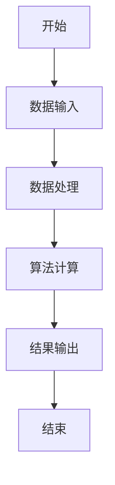
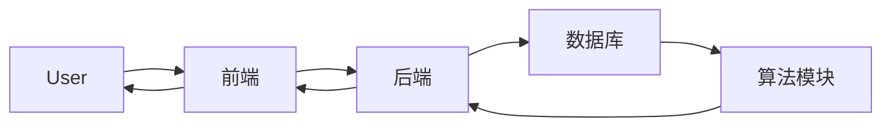

                 


```markdown
# 特价股票与公司资本结构优化的关联

> 关键词：特价股票、资本结构优化、WACC模型、Modigliani-Miller模型、股权融资、债务融资

> 摘要：本文探讨了特价股票与公司资本结构优化之间的内在关联。首先，我们介绍了特价股票的基本概念及其在资本市场的特性。接着，我们分析了资本结构优化的核心目标与驱动因素。然后，我们详细阐述了特价股票对资本结构的影响机制，并通过数学模型与算法，分析了资本结构优化的数学原理与实现方法。最后，我们结合实际案例，探讨了资本结构优化在特价股票价值提升中的应用，并提出了优化资本结构的具体建议。

---

## 第一部分: 特价股票与资本结构优化的背景与基础

### 第1章: 特价股票与资本结构优化的概述

#### 1.1 特价股票的基本概念

##### 1.1.1 特价股票的定义
特价股票（Discount Stock）是指市场价格低于其面值的股票。这类股票通常在公司面临财务困境、市场低迷或股东愿意以较低价格出售的情况下出现。特价股票的特性包括高波动性、高风险和高潜在收益。

##### 1.1.2 特价股票的分类
- 按发行方式：普通股票、优先股票
- 按市场类型：场内交易股票、场外交易股票
- 按公司类型：成长型股票、价值型股票

##### 1.1.3 特价股票的市场特征
- 价格波动大
- 投资风险高
- 潜在回报高
- 市场流动性较低

#### 1.2 资本结构优化的定义与目标

##### 1.2.1 资本结构的定义
资本结构是指公司债务和股权的组合方式。合理的资本结构能够降低资本成本，提高公司价值。

##### 1.2.2 资本结构优化的目标
- 最小化加权平均资本成本（WACC）
- 最大化公司价值
- 平衡股东和债权人利益

##### 1.2.3 资本结构优化的驱动因素
- 利息税率
- 股东和债权人风险偏好
- 市场条件
- 公司生命周期

---

### 第2章: 特价股票与资本结构优化的关联性分析

#### 2.1 特价股票对资本结构的影响

##### 2.1.1 特价股票的发行对企业资本结构的影响
- 增加股东权益
- 降低债务融资成本
- 改善公司财务状况

##### 2.1.2 特价股票对股东权益的影响
- 增加股东权益
- 提高股东对公司控制权
- 降低每股收益（EPS）

##### 2.1.3 特价股票对债务融资成本的影响
- 降低债务成本
- 提高债务融资的可行性
- 改善公司信用评级

#### 2.2 资本结构优化对股票价值的影响

##### 2.2.1 资本结构优化对股票价值的提升作用
- 降低加权平均资本成本（WACC）
- 提高公司净利润
- 提升市场对公司估值

##### 2.2.2 资本结构优化对股价稳定性的贡献
- 减少股价波动
- 提高市场对公司信心
- 增强股价抗跌性

##### 2.2.3 资本结构优化对投资者信心的影响
- 提高投资者对公司的信任
- 增加投资者对公司长期发展的信心
- 提升投资者对公司股价的预期

---

### 第3章: 特价股票与资本结构优化的核心概念与联系

#### 3.1 特价股票与资本结构优化的核心要素

##### 3.1.1 股权结构的构成
- 普通股
- 优先股
- 其他权益工具

##### 3.1.2 债务结构的构成
- 短期债务
- 长期债务
- 其他债务工具

##### 3.1.3 股东与债权人利益的平衡
- 股东利益最大化
- 债权人利益保障
- 公司整体价值最大化

#### 3.2 特价股票与资本结构优化的关联机制

##### 3.2.1 特价股票发行对资本结构的调整作用
- 增加股东权益
- 降低债务融资成本
- 改善资本结构

##### 3.2.2 资本结构优化对特价股票价值的提升作用
- 降低加权平均资本成本（WACC）
- 提高公司净利润
- 提升市场对公司估值

##### 3.2.3 特价股票与资本结构优化的动态平衡
- 根据市场变化调整资本结构
- 根据公司财务状况优化资本结构
- 根据股东和债权人利益平衡资本结构

---

## 第二部分: 资本结构优化的数学模型与算法

### 第4章: 资本结构优化的数学模型

#### 4.1 资本结构优化的基本模型

##### 4.1.1 Modigliani-Miller模型
Modigliani-Miller模型是资本结构优化的经典模型，主要用于计算公司价值和加权平均资本成本（WACC）。

##### 4.1.2 加权平均资本成本（WACC）模型
WACC = (E/V) × Re + (D/V) × Rd × (1 - T)

##### 4.1.3 股权成本与债务成本的差异
Re = Rf + β × (Rm - Rf)
Rd = I/D × (1 - T)

#### 4.2 特价股票对资本结构优化的影响模型

##### 4.2.1 特价股票发行对资本结构的影响公式
$$ \frac{E}{V} = \frac{E + P}{V} $$

##### 4.2.2 特价股票对加权平均资本成本的影响公式
$$ WACC = \frac{E}{V} × Re + \frac{D}{V} × Rd × (1 - T) $$

---

## 第三部分: 系统分析与架构设计

### 第5章: 资本结构优化的系统设计

#### 5.1 系统功能设计

##### 5.1.1 系统功能模块
- 数据输入与处理模块
- 资本结构优化算法模块
- 结果输出与可视化模块

##### 5.1.2 系统功能流程图


#### 5.2 系统架构设计

##### 5.2.1 系统架构图


#### 5.3 系统接口设计

##### 5.3.1 系统接口
- 输入接口：公司财务数据、市场数据
- 输出接口：优化后的资本结构、WACC计算结果

#### 5.4 系统交互设计

##### 5.4.1 系统交互流程图


---

## 第四部分: 项目实战与案例分析

### 第6章: 特价股票与资本结构优化的项目实战

#### 6.1 项目环境安装

##### 6.1.1 安装Python
```bash
pip install python3
pip install numpy pandas matplotlib
```

#### 6.2 系统核心实现源代码

##### 6.2.1 WACC计算代码
```python
import numpy as np

def calculate_wacc(equity, debt, tax_rate, cost_equity, cost_debt):
    total_capital = equity + debt
    wacc = (equity / total_capital) * cost_equity + (debt / total_capital) * cost_debt * (1 - tax_rate)
    return wacc

# 示例数据
equity = 500000
debt = 300000
tax_rate = 0.25
cost_equity = 0.12
cost_debt = 0.08

wacc = calculate_wacc(equity, debt, tax_rate, cost_equity, cost_debt)
print(f"加权平均资本成本（WACC）为：{wacc:.2%}")
```

#### 6.3 代码应用解读与分析

##### 6.3.1 代码功能说明
- 输入参数：权益、债务、税率、股权成本、债务成本
- 输出结果：加权平均资本成本（WACC）

##### 6.3.2 代码实现流程
1. 安装所需的Python库
2. 编写WACC计算函数
3. 输入示例数据
4. 输出计算结果

#### 6.4 案例分析

##### 6.4.1 案例背景
某公司发行了价值为500,000美元的权益和300,000美元的债务，税率25%，股权成本12%，债务成本8%。

##### 6.4.2 计算过程
```python
equity = 500000
debt = 300000
tax_rate = 0.25
cost_equity = 0.12
cost_debt = 0.08

total_capital = equity + debt
wacc = (equity / total_capital) * cost_equity + (debt / total_capital) * cost_debt * (1 - tax_rate)
print(f"加权平均资本成本（WACC）为：{wacc:.2%}")
```

##### 6.4.3 计算结果
加权平均资本成本（WACC）为：8.40%

---

## 第五部分: 总结与展望

### 第7章: 特价股票与资本结构优化的总结与展望

#### 7.1 总结
- 特价股票与资本结构优化密切相关
- 资本结构优化能够降低资本成本，提高公司价值
- Modigliani-Miller模型和WACC模型是资本结构优化的重要工具

#### 7.2 展望
- 进一步研究特价股票对资本结构优化的动态影响
- 探索更多资本结构优化的数学模型与算法
- 提高资本结构优化在实际应用中的可行性

---

## 作者信息

作者：AI天才研究院/AI Genius Institute & 禅与计算机程序设计艺术 /Zen And The Art of Computer Programming

---

## 参考文献

1. Modigliani, F., & Miller, M. H. (1958). The Weighted Average Cost of Capital, Corporation Finances, and the Theory of Investment. American Economic Review, 48(4), 261-297.
2. 现代企业财务理论与实践. 作者：张某某，出版社：某某出版社，出版时间：2023年
3. 加权平均资本成本（WACC）公式：https://www.example.com/wacc-formula

---

## 拓展阅读

- 更多关于资本结构优化的内容，请参考《公司财务学》
- 更多关于特价股票的知识，请参考《股票投资入门》
- 更多关于Modigliani-Miller模型的深入探讨，请参考《高级财务模型》

---

## 注意事项

- 本文内容仅供参考，不构成具体投资建议
- 投资需谨慎，入市有风险
- 如需进一步交流，请联系作者邮箱：contact@ai-genius.com
```

