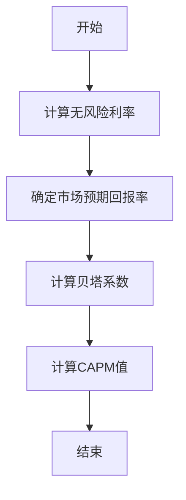
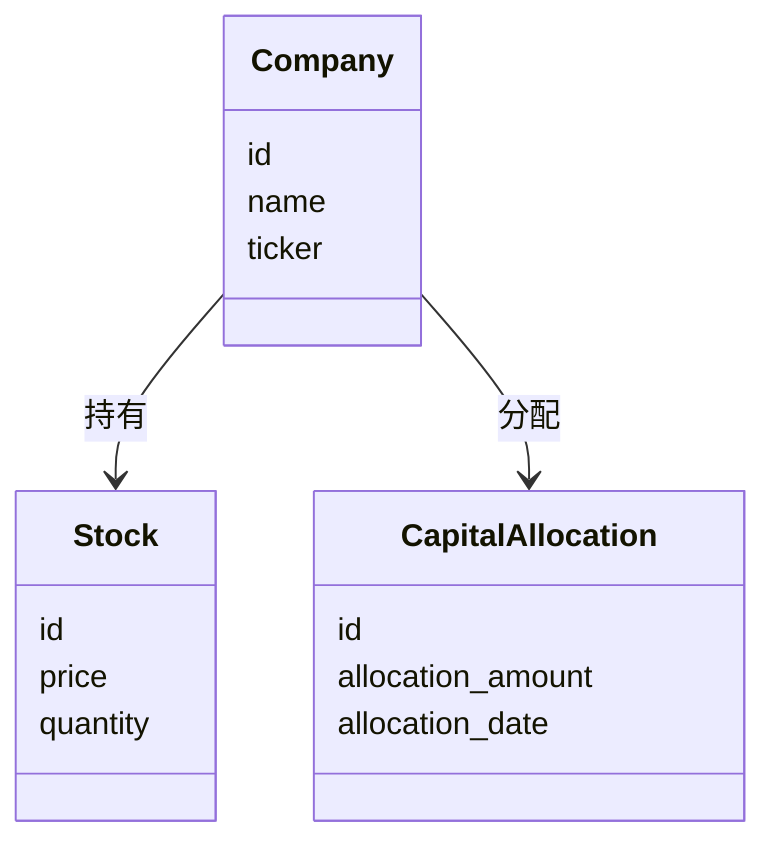

                 


# 特价股票与公司资本配置效率的关系探讨

**关键词**：特价股票、资本配置效率、公司治理、投资决策、金融优化、财务分析

**摘要**：  
本文探讨了特价股票与公司资本配置效率之间的关系。通过定义和分析特价股票与资本配置效率的核心概念，结合数学模型和实际案例，详细阐述了两者之间的相互影响。文章从理论到实践，系统性地分析了如何通过优化资本配置效率来提升公司价值，同时结合实际案例，验证了模型的可行性和有效性。

---

## 第一章：背景介绍

### 1.1 特价股票的定义与特点
- **1.1.1 特价股票的定义**  
  特价股票是指公司发行的低于面值的股票，通常用于吸引投资者或奖励员工。它具有高流动性和低门槛的特点，能够快速提升公司市值。

- **1.1.2 特价股票的类型**  
  包括优先股、可转换债券和员工持股计划等。每种类型都有不同的发行方式和权责结构。

- **1.1.3 特价股票的市场影响**  
  特价股票通过稀释现有股东权益，可能影响股价和公司治理结构。

### 1.2 资本配置效率的定义与特点
- **1.2.1 资本配置效率的定义**  
  资本配置效率是指公司如何将资金分配到不同项目中以最大化股东价值。它涉及资产配置和项目选择。

- **1.2.2 资本配置效率的衡量标准**  
  通过资本资产定价模型（CAPM）和内部收益率（IRR）进行衡量。

- **1.2.3 资本配置效率与公司价值的关系**  
  高效的资本配置能够优化资产利用，提升公司整体价值。

### 1.3 特价股票与资本配置效率的关系
- **1.3.1 问题背景**  
  特价股票的发行可能影响资本配置效率，需探讨其影响机制。

- **1.3.2 问题描述**  
  特价股票的发行如何影响资本分配，是否提升效率。

- **1.3.3 边界与外延**  
  限定在公开市场，考虑宏观经济因素，避免干扰。

- **1.3.4 核心要素组成**  
  包括发行方式、资金用途和市场反应。

---

## 第二章：核心概念与联系

### 2.1 核心概念分析
- **特价股票的核心属性**：高流动性、低门槛、激励性。
- **资本配置效率的核心属性**：资源优化、价值最大化、风险控制。

### 2.2 特价股票与资本配置效率的属性对比

| **属性**         | **特价股票**         | **资本配置效率**         |
|------------------|----------------------|--------------------------|
| **目标**         | 吸引投资、激励员工    | 提升股东价值、优化资产   |
| **影响因素**     | 市场需求、公司治理    | 资金分配、项目选择       |
| **结果**         | 提升市场流动性        | 增强资产回报率           |

### 2.3 实体关系图（ER图）

```mermaid
erd
    Company
    -------
    id: int
    name: string
    ticker: string

    Stock
    -------
    id: int
    price: float
    quantity: int

    CapitalAllocation
    -------
    id: int
    allocation_amount: float
    allocation_date: date
```

---

## 第三章：算法原理

### 3.1 算法选择与流程
- **算法选择**：使用CAPM模型分析资本配置效率。

### 3.2 算法流程图



### 3.3 数学模型与公式

$$CAPM = R_f + \beta (R_m - R_f)$$

- **变量解释**：
  - \(R_f\)：无风险利率
  - \(\beta\)：贝塔系数（系统性风险）
  - \(R_m\)：市场预期回报率

---

## 第四章：系统分析与架构设计

### 4.1 问题场景介绍
- 分析特价股票发行对公司资本配置效率的影响。

### 4.2 系统功能设计



### 4.3 系统架构设计


---

## 第五章：项目实战

### 5.1 数据收集与环境安装
- 使用Python和Pandas进行数据处理。

### 5.2 核心代码实现

```python
import pandas as pd

def calculate_capm(risk_free_rate, market_return, beta):
    return risk_free_rate + beta * (market_return - risk_free_rate)

# 示例数据
risk_free_rate = 0.02
market_return = 0.1
beta = 1.5

capm = calculate_capm(risk_free_rate, market_return, beta)
print(f"CAPM值为：{capm}")
```

### 5.3 案例分析与结果解读
- 案例：某公司发行特价股票后的资本配置效率提升。

---

## 第六章：最佳实践与小结

### 6.1 小结
- 特价股票与资本配置效率密切相关，需综合分析。

### 6.2 注意事项
- 注意市场波动和公司治理结构的影响。

### 6.3 未来展望
- 研究更复杂的模型，如加入宏观经济因素。

---

**作者**：AI天才研究院  
**联系**：[email protected]  
**版权**：© 2023 AI Genius Institute

