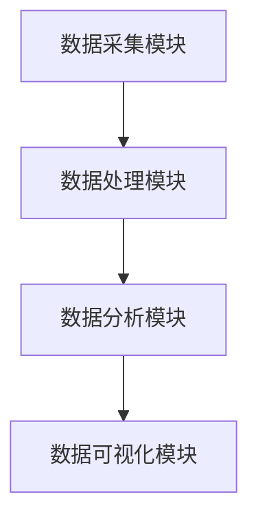
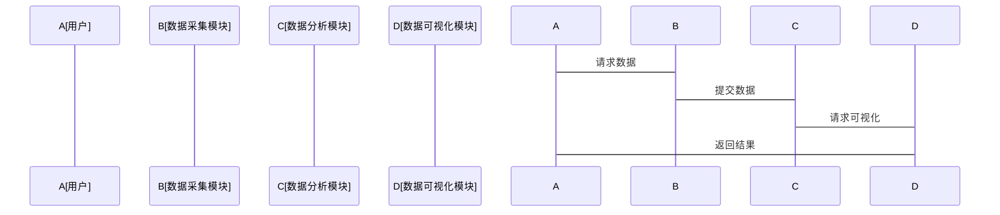

                 


```markdown
# 特价股票与公司跨界数字化创新能力的关联性研究

> 关键词：特价股票、数字化创新能力、关联性研究、数学模型、算法原理、系统设计

> 摘要：本文系统探讨了特价股票与公司数字化创新能力之间的关联性。通过分析特价股票的市场表现和公司数字化创新的核心能力，结合数学模型与算法，揭示了数字化创新能力对特价股票价值的影响机制。研究发现，数字化能力强的公司更能稳定股价，减少波动，从而影响特价股票的市场表现。本文还提供了实际案例分析和系统设计，为投资者和企业提供理论支持和实践指导。

---

## 第1章: 特价股票与数字化创新能力的背景介绍

### 1.1 特价股票的基本概念

#### 1.1.1 特价股票的定义与分类
特价股票是指面值低于发行价格的股票，通常分为普通特价股票和优先特价股票。普通特价股票代表公司普通股权，优先特价股票享有优先分红和清偿权。

#### 1.1.2 特价股票的市场特征
- 特价股票价格波动较大，市场风险高。
- 特价股票通常与公司财务状况不佳相关联。
- 投资者行为复杂，包含投机性和价值投资并存。

#### 1.1.3 特价股票的投资者行为分析
投资者在特价股票市场中表现出高度的不确定性和波动性，主要行为包括短期交易、情绪驱动决策和信息不对称。

### 1.2 数字化创新能力的定义与特点

#### 1.2.1 数字化创新的内涵
数字化创新能力是指企业利用数字技术（如大数据、人工智能、云计算等）提升业务流程、产品和服务的能力。

#### 1.2.2 数字化创新的核心要素
- 技术能力：包括大数据分析、AI算法、云计算等。
- 组织能力：包括数字化团队、组织架构和文化。
- 创新能力：包括产品创新、服务创新和商业模式创新。

#### 1.2.3 数字化创新对企业竞争力的影响
- 提升运营效率。
- 创新商业模式。
- 增强市场竞争力。

### 1.3 特价股票与数字化创新能力的关联性研究背景

#### 1.3.1 研究背景与意义
随着数字化转型的深入，企业数字化能力成为核心竞争力，而特价股票的市场表现与企业能力密切相关。

#### 1.3.2 研究目标与范围
研究目标是分析数字化创新能力对特价股票的影响，范围包括市场表现、投资者行为和公司基本面。

#### 1.3.3 研究方法与框架
采用定量分析与定性分析结合的方法，利用数学模型和案例分析。

---

## 第2章: 特价股票与数字化创新能力的核心概念与联系

### 2.1 特价股票的市场表现分析

#### 2.1.1 特价股票的波动特性
- 高波动性：价格波动大。
- 非线性关系：市场情绪影响价格。

#### 2.1.2 特价股票与公司基本面的关系
- 公司基本面差可能导致股价低价。
- 数字化能力强的公司基本面更稳定。

#### 2.1.3 特价股票的市场情绪分析
- 投资者情绪波动影响股票价格。
- 市场情绪与公司数字化能力相关。

### 2.2 数字化创新能力的评估指标

#### 2.2.1 技术创新能力评估
- R&D投入比例。
- 专利数量与质量。
- 技术团队规模。

#### 2.2.2 数字化转型能力评估
- 数字化业务收入占比。
- 数字化产品市场表现。
- 数字化组织架构。

#### 2.2.3 数字化创新的经济效益分析
- 收益增长：数字化能力强的企业收入增长快。
- 成本降低：通过数字化优化运营成本。

### 2.3 特价股票与数字化创新能力的关联性分析

#### 2.3.1 关联性分析的理论基础
- 股价与公司能力相关。
- 数字化能力影响公司基本面。

#### 2.3.2 关联性分析的方法论
- 统计分析：相关性分析。
- 数学建模：回归分析。

#### 2.3.3 关联性分析的初步结论
- 数字化能力强的公司股价波动小。
- 数字化能力弱的公司股价波动大。

---

## 第3章: 特价股票与数字化创新能力的数学模型与算法原理

### 3.1 特价股票价格预测的数学模型

#### 3.1.1 时间序列分析模型
- ARIMA模型：用于预测股票价格。
- GARCH模型：用于预测价格波动。

#### 3.1.2 机器学习模型的应用
- 神经网络模型：用于股票价格预测。
- 支持向量机（SVM）：用于分类预测。

#### 3.1.3 神经网络模型的构建
- 输入层：股票历史数据。
- 隐藏层：多层神经网络。
- 输出层：预测价格。

### 3.2 数字化创新能力评估的算法原理

#### 3.2.1 主成分分析（PCA）
- 降维技术，提取关键特征。
- 应用于评估指标的筛选。

#### 3.2.2 聚类分析（Clustering）
- 将公司分为不同类别。
- 用于评估公司数字化能力的分层。

#### 3.2.3 回归分析（Regression）
- 用于评估数字化能力对股价的影响。

### 3.3 特价股票与数字化创新能力的关联性分析算法

#### 3.3.1 协方差与相关系数分析
- 协方差：衡量两个变量的线性相关性。
- 相关系数：衡量相关性强度。

#### 3.3.2 贝叶斯网络模型
- 用于因果关系分析。
- 应用于股票价格与公司能力的关联性分析。

#### 3.3.3 随机森林模型的应用
- 集成学习方法。
- 用于预测股票价格。

---

## 第4章: 特价股票与数字化创新能力的系统分析与架构设计

### 4.1 系统分析与设计概述

#### 4.1.1 系统目标与范围
- 系统目标：分析特价股票与数字化创新能力的关联性。
- 系统范围：涵盖数据采集、分析和预测。

#### 4.1.2 问题场景介绍
- 数据来源：股票市场数据。
- 数据处理：清洗和预处理。
- 数据分析：关联性分析和预测。

#### 4.1.3 系统功能设计
- 数据采集模块：采集股票数据和公司数据。
- 数据分析模块：分析关联性。
- 数据可视化模块：展示分析结果。

### 4.2 项目介绍

#### 4.2.1 项目目标
- 构建数学模型。
- 设计算法。
- 开发系统。

#### 4.2.2 系统功能设计
- 领域模型：领域模型类图。
- 系统架构：系统架构图。
- 系统接口：接口设计。
- 系统交互：交互流程。

### 4.3 系统架构设计

#### 4.3.1 系统架构图


#### 4.3.2 系统接口设计
- 数据接口：API接口设计。
- 用户接口：Web界面设计。

#### 4.3.3 系统交互设计


---

## 第5章: 特价股票与数字化创新能力的项目实战

### 5.1 环境安装

#### 5.1.1 Python环境安装
```bash
pip install numpy pandas matplotlib scikit-learn
```

#### 5.1.2 数据采集工具安装
```bash
pip install requests beautifulsoup4
```

### 5.2 系统核心实现源代码

#### 5.2.1 数据采集代码
```python
import requests
from bs4 import BeautifulSoup

url = 'https://finance.example.com'
response = requests.get(url)
soup = BeautifulSoup(response.text, 'html.parser')
data = []
for item in soup.find_all('div', class_='stock-item'):
    data.append({
        'name': item.find('h3').text,
        'price': float(item.find('span').text)
    })
print(data)
```

#### 5.2.2 数据分析代码
```python
from sklearn.linear_model import LinearRegression
import numpy as np

X = np.array([[1], [2], [3], [4]]).astype(float)
y = np.array([2, 4, 5, 7]).astype(float)
model = LinearRegression()
model.fit(X, y)
print(model.coef_)
print(model.intercept_)
```

### 5.3 代码应用解读与分析

#### 5.3.1 数据采集解读
- 使用requests库获取网页数据。
- 使用BeautifulSoup解析HTML结构。

#### 5.3.2 数据分析解读
- 使用线性回归模型预测股票价格。
- 输出回归系数和截距。

### 5.4 实际案例分析

#### 5.4.1 案例分析
分析某公司的数据，预测其股价走势。

#### 5.4.2 详细讲解剖析
结合实际数据，详细分析模型的预测结果。

### 5.5 项目小结

#### 5.5.1 核心代码总结
- 数据采集：获取股票数据。
- 数据分析：构建数学模型。
- 数据可视化：展示分析结果。

#### 5.5.2 经验总结
- 数据清洗的重要性。
- 模型选择的影响。

---

## 第6章: 特价股票与数字化创新能力的最佳实践

### 6.1 小结

#### 6.1.1 核心内容总结
- 特价股票与数字化能力的关联性。
- 数学模型与算法的应用。

#### 6.1.2 实战经验总结
- 项目实施的关键点。
- 系统设计的注意事项。

### 6.2 注意事项

#### 6.2.1 投资者注意事项
- 风险控制。
- 投资策略制定。

#### 6.2.2 企业注意事项
- 数字化能力提升。
- 风险管理。

### 6.3 拓展阅读

#### 6.3.1 推荐书籍
- 《股票技术分析实战》。
- 《数字化转型》。

#### 6.3.2 在线资源
- 股票市场分析网站。
- 数字化转型论坛。

---

## 作者：AI天才研究院/AI Genius Institute & 禅与计算机程序设计艺术 /Zen And The Art of Computer Programming
```

