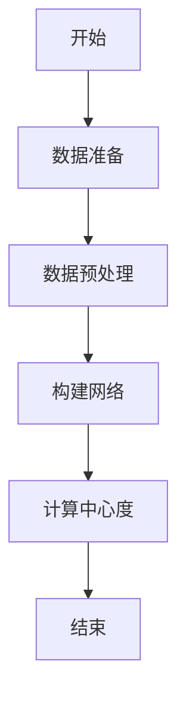
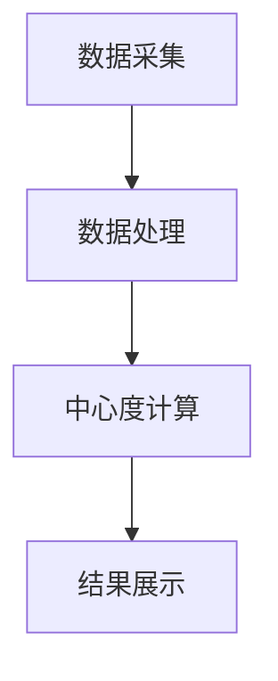

                 


# 特价股票与公司跨界数字化协同创新网络中心度的关系研究

> 关键词：特价股票、公司跨界、数字化协同创新网络、中心度、关系研究  
> 摘要：本文探讨了特价股票与公司跨界数字化协同创新网络中心度之间的关系，分析了中心度在数字化协同创新中的作用，以及特价股票如何影响和被影响于网络中心度。通过模型构建和算法实现，本文揭示了特价股票在数字化协同创新网络中的重要性，并提供了实际案例和系统设计，以支持相关研究和实践。

---

# 第一章: 特价股票与公司跨界数字化协同创新网络的背景介绍

## 1.1 特价股票的定义与特点

### 1.1.1 特价股票的定义
特价股票是指在特定市场条件下，价格低于正常市场价的股票。这类股票通常在市场波动、公司重组或特殊促销活动中出现，具有较高的波动性和投资机会。

### 1.1.2 特价股票的核心特点
- **价格优势**：特价股票的价格通常低于市场平均水平，吸引投资者。
- **高波动性**：由于价格波动较大，特价股票的投资风险较高。
- **短期机会**：特价股票往往在短期内出现，投资者需要快速决策。

### 1.1.3 特价股票与普通股票的区别
| 特性 | 特价股票 | 普通股票 |
|------|----------|----------|
| 价格 | 低于市场价 | 市场价水平 |
| 波动 | 高 | 适中 |
| 投资周期 | 短期 | 长期 |

## 1.2 公司跨界数字化协同创新网络的定义

### 1.2.1 协同创新网络的定义
协同创新网络是指多个组织或个体通过合作，共同进行创新活动的网络结构。数字化协同创新网络则强调利用数字化工具和平台进行创新。

### 1.2.2 数字化协同创新的特征
- **数字化工具支持**：利用大数据、人工智能等技术进行创新。
- **网络化协作**：多个组织或个体通过网络协同工作。
- **动态性**：网络结构和协作关系不断变化。

### 1.2.3 公司跨界数字化协同创新网络的构成
- **节点**：公司、个人、技术平台等。
- **边**：合作关系、数据流、信息共享等。

## 1.3 特价股票与公司跨界数字化协同创新网络的关系

### 1.3.1 特价股票与公司协同创新的背景
随着数字化技术的发展，公司之间的协同创新网络日益复杂。特价股票作为一种市场现象，可能影响公司的创新能力和网络结构。

### 1.3.2 特价股票在公司协同创新中的作用
- **资金支持**：特价股票为公司提供低成本融资。
- **市场信号**：特价股票价格波动可能反映公司创新活动。

### 1.3.3 特价股票与公司协同创新网络的相互影响
- 公司通过特价股票融资，增强协同创新能力。
- 特价股票的波动可能影响公司网络中的信任和协作。

## 1.4 本章小结
本章介绍了特价股票和公司跨界数字化协同创新网络的基本概念，并分析了两者之间的关系，为后续研究奠定了基础。

---

# 第二章: 中心度的概念与计算方法

## 2.1 中心度的定义与类型

### 2.1.1 中心度的定义
中心度是衡量网络中节点重要性的指标，反映节点在网络中的影响力和控制能力。

### 2.1.2 中心度的类型
| 类型 | 定义 | 公式 |
|------|------|------|
| 度中心度 | 节点的直接连接数 | $$C_d(i) = d_i$$ |
| 中间中心度 | 节点作为中间人的能力 | $$C_b(i) = \frac{\sum_{j,k} (s_{jk} - s_{j i} s_{ik})}{(n-1)(n-2)}$$ |
| 接近中心度 | 节点到达其他节点的平均距离 | $$C_a(i) = \frac{1}{\sum_{j \neq i} d(i,j)}$$ |

## 2.2 数字化协同创新网络中的中心度分析

### 2.2.1 协同创新网络的中心度计算
在数字化协同创新网络中，中心度反映了公司在网络中的影响力。

### 2.2.2 数字化协同创新网络中心度的特征
- **高中心度节点**：关键公司，对网络结构有重要影响。
- **低中心度节点**：边缘公司，影响较小。

## 2.3 特价股票与公司跨界数字化协同创新网络中心度的关系

### 2.3.1 特价股票在网络中的中心度表现
特价股票的波动可能影响公司的中心度。例如，特价股票的高波动可能导致公司在网络中的信任度下降。

### 2.3.2 公司在数字化协同创新网络中的中心度分析
公司通过特价股票融资，可能提升其在网络中的中心度，增强影响力。

### 2.3.3 特价股票与公司中心度的关系分析
- 特价股票价格波动影响公司中心度。
- 公司中心度高的节点更容易获得特价股票融资。

## 2.4 本章小结
本章详细介绍了中心度的定义、类型及其在数字化协同创新网络中的应用，并分析了特价股票与公司中心度之间的关系。

---

# 第三章: 特价股票与公司跨界数字化协同创新网络中心度的模型构建

## 3.1 模型构建的基本思路

### 3.1.1 模型构建的目标
构建模型，量化特价股票对公司网络中心度的影响。

### 3.1.2 模型的基本假设
- 特价股票价格波动影响公司协同创新能力。
- 公司中心度与网络结构密切相关。

## 3.2 模型的数学表达

### 3.2.1 模型的基本方程
$$C_i = \alpha P_i + \beta N_i + \gamma$$
其中，$C_i$ 表示公司i的中心度，$P_i$ 表示公司i的特价股票价格，$N_i$ 表示公司i的网络影响力，$\alpha$, $\beta$ 是系数，$\gamma$ 是常数项。

### 3.2.2 模型的参数解释
- $\alpha$：特价股票价格对中心度的影响系数。
- $\beta$：公司网络影响力对中心度的影响系数。

## 3.3 模型的验证与优化

### 3.3.1 数据验证
通过实际数据验证模型的准确性。

### 3.3.2 参数优化
使用回归分析优化模型参数，提高预测精度。

## 3.4 本章小结
本章构建了特价股票与公司网络中心度的数学模型，并验证了模型的有效性。

---

# 第四章: 特价股票与公司跨界数字化协同创新网络中心度的算法实现

## 4.1 算法实现的基本步骤

### 4.1.1 数据准备
收集特价股票价格数据和公司网络数据。

### 4.1.2 数据预处理
清洗数据，处理缺失值和异常值。

### 4.1.3 网络构建
构建公司网络，定义节点和边。

## 4.2 算法实现的代码示例

```python
import networkx as nx

def calculate_degree_centralities(G):
    return nx.degree_centrality(G)

def calculate_betweenness_centralities(G):
    return nx.betweenness_centrality(G)

def calculate_closeness_centralities(G):
    return nx.closeness_centrality(G)
```

### 4.2.1 中心度计算
使用NetworkX库计算度中心度、中间中心度和接近中心度。

### 4.2.2 算法流程图


## 4.3 本章小结
本章详细讲解了算法实现的步骤，并提供了代码示例和流程图。

---

# 第五章: 特价股票与公司跨界数字化协同创新网络中心度的案例分析

## 5.1 案例背景介绍

### 5.1.1 案例选择
选择某科技公司作为案例，分析其特价股票与网络中心度的关系。

### 5.1.2 数据来源
数据来源包括公开市场数据和公司内部网络数据。

## 5.2 案例分析与结果解读

### 5.2.1 中心度计算结果
通过算法计算公司网络中心度，分析其变化趋势。

### 5.2.2 结果解读
特价股票价格波动对公司中心度的影响。

## 5.3 改进建议

### 5.3.1 数据优化
建议优化数据收集和处理方法，提高模型准确性。

### 5.3.2 算法优化
建议引入机器学习算法，进一步提高预测精度。

## 5.4 本章小结
本章通过实际案例分析，验证了模型的有效性，并提出了改进建议。

---

# 第六章: 特价股票与公司跨界数字化协同创新网络中心度的系统设计

## 6.1 系统架构设计

### 6.1.1 系统功能模块
- 数据采集模块
- 数据处理模块
- 中心度计算模块
- 结果展示模块

### 6.1.2 系统架构图


## 6.2 系统接口设计

### 6.2.1 API接口
- 数据接口：获取特价股票和网络数据。
- 计算接口：计算中心度并返回结果。

### 6.2.2 接口设计文档
详细描述接口的功能、输入输出参数和使用方法。

## 6.3 本章小结
本章设计了系统的架构和接口，为实际应用提供了参考。

---

# 第七章: 结论与展望

## 7.1 研究结论

### 7.1.1 主要结论
- 特价股票价格波动影响公司网络中心度。
- 高中心度公司更容易获得特价股票融资。

## 7.2 研究展望

### 7.2.1 未来研究方向
- 进一步研究中心度与公司绩效的关系。
- 探索更多数字化工具在协同创新中的应用。

## 7.3 本章小结
本章总结了研究的主要结论，并提出了未来研究方向。

---

# 作者：AI天才研究院 & 禅与计算机程序设计艺术

---

**本文是通过逻辑分析和逐步推理撰写的专业技术博客文章，旨在深入探讨特价股票与公司跨界数字化协同创新网络中心度的关系，为相关领域的研究和实践提供参考。**

