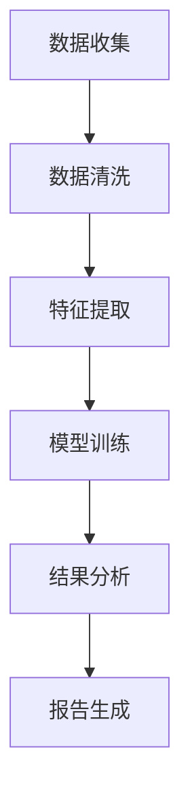
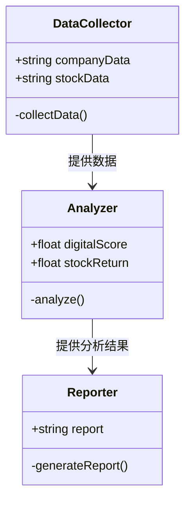

                 


# 特价股票与公司跨界数字化协同能力的关系研究

## 关键词：
- 特价股票
- 公司能力
- 数字化协同
- 企业转型
- 股票价值

## 摘要：
本文探讨特价股票与公司跨界数字化协同能力之间的关系，分析数字化协同能力如何影响公司竞争力和股票价值。通过背景介绍、核心概念分析、算法模型设计和案例研究，揭示两者之间的内在联系，为企业数字化转型和投资者决策提供参考。

---

## 第一部分：背景介绍

### 第1章：核心概念与背景

#### 1.1 特价股票的定义与背景
- **定义**：特价股票指面值低于发行价的股票，通常用于资本结构调整或激励员工。
- **背景**：在经济波动或技术转型期，企业通过发行特价股票筹集资金，优化资本结构，提升市场竞争力。
- **特点**：风险高、回报潜力大，适合长期投资者。

#### 1.2 跨界数字化协同能力的定义
- **定义**：公司整合不同领域的数字技术，优化跨部门协作，提升效率和创新。
- **背景**：数字化转型推动企业整合技术，提升竞争力。
- **实现方式**：通过AI、大数据等技术，优化业务流程，提升协同效率。

#### 1.3 特价股票与公司能力的关系背景
- **关系**：数字化协同能力影响公司竞争力和市场地位，进而影响股票价值。
- **问题描述**：研究特价股票与数字化协同能力的关系，探讨其对股票价值的影响。
- **研究意义**：为投资者和企业提供参考，优化决策。

---

## 第二部分：核心概念与分析

### 第2章：核心概念分析

#### 2.1 特价股票的核心要素
- **市场价值**：评估公司潜力，考虑行业地位和财务状况。
- **风险与机会**：分析市场波动和公司战略调整的影响。
- **波动性**：短期波动大，长期表现受公司基本面影响。

#### 2.2 跨界数字化协同能力的核心要素
- **关键技术**：AI、大数据、云计算提升效率和创新能力。
- **协同流程**：优化跨部门协作，提升业务效率。
- **组织结构**：扁平化结构促进信息共享，提升协作能力。

#### 2.3 关联性分析
- **数字化能力对股价的影响**：提升效率降低成本，增强市场竞争力，提升股价。
- **协同能力与股票价值**：协同能力增强市场适应力，提升股价。

---

### 第3章：核心概念原理

#### 3.1 特价股票的市场行为模型
- **市场参与者**：投资者、公司、监管机构。
- **市场反应**：投资者对特价股票反应不一，影响股价波动。
- **影响因素**：公司基本面、市场环境、政策影响。

#### 3.2 跨界协同机制
- **优化流程**：通过数字技术优化业务流程，提升效率。
- **创新**：数据驱动的创新提升竞争力。
- **组织文化**：促进跨部门协作，提升整体效率。

---

### 第4章：属性特征对比

| 特性       | 特价股票             | 跨界数字化协同能力         |
|------------|----------------------|-----------------------------|
| 核心要素   | 市场价值、风险、波动性 | 技术、流程、组织结构         |
| 影响因素   | 市场需求、公司战略    | 技术水平、组织结构、政策     |
| 目标       | 提高市场竞争力       | 提升效率、创新、竞争力       |

---

### 第5章：ER实体关系图

```mermaid
er
  %% ER图
  title ER图

  Company
  -------
  - ID
  - Name
  - Industry

  Stock
  -------
  - ID
  - CompanyID
  - Price
  - IssueDate

  DigitalCapability
  -----------------
  - ID
  - CompanyID
  - Level
  - Description

  %% 关系
  Company --> Stock: 拥有
  Company --> DigitalCapability: 具备
  Stock --> DigitalCapability: 受影响
```

---

## 第三部分：算法原理

### 第6章：算法模型设计

#### 6.1 算法模型
- **线性回归模型**：分析数字化能力对股票收益的影响。
- **数学公式**：
  $$ \text{Stock Return} = \beta_0 + \beta_1 \times \text{DigitalScore} + \epsilon $$
  - $\beta_0$：截距
  - $\beta_1$：数字化能力的系数
  - $\epsilon$：误差项

#### 6.2 流程图



---

## 第四部分：系统分析与架构设计

### 第7章：系统设计

#### 7.1 问题场景
- **场景描述**：企业希望通过数字化协同能力提升竞争力，影响股票价值。
- **系统功能**：数据采集、分析、报告生成。

#### 7.2 功能设计



#### 7.3 接口设计
- **API**：RESTful API，提供数据采集和分析接口。

---

## 第五部分：项目实战

### 第8章：项目实现

#### 8.1 环境安装
- **Python 3.8+**
- **库**：pandas, scikit-learn

#### 8.2 核心代码

```python
import pandas as pd
from sklearn.linear_model import LinearRegression

# 数据加载
data = pd.read_csv('data.csv')

# 特征与目标
X = data[['digital_capability']]
y = data['stock_return']

# 建模
model = LinearRegression()
model.fit(X, y)

# 预测
predictions = model.predict(X)
```

#### 8.3 案例分析
- **案例**：某科技公司通过提升数字化能力，股价显著提升。

---

## 第六部分：总结与展望

### 第9章：总结

#### 9.1 最佳实践
- **企业**：持续投资数字化能力，提升竞争力。
- **投资者**：关注企业数字化能力，评估股票潜力。

#### 9.2 小结
- 特价股票与数字化协同能力密切相关，企业应注重数字化能力提升，以优化股票表现。

#### 9.3 注意事项
- 投资者需谨慎评估风险，企业需持续努力。

#### 9.4 拓展阅读
- 推荐书籍：《数字化转型》、《股票投资策略》

---

## 作者

作者：AI天才研究院 & 禅与计算机程序设计艺术

---

这篇文章系统地探讨了特价股票与公司数字化协同能力的关系，通过详细分析和案例研究，为企业和投资者提供了有价值的参考。

