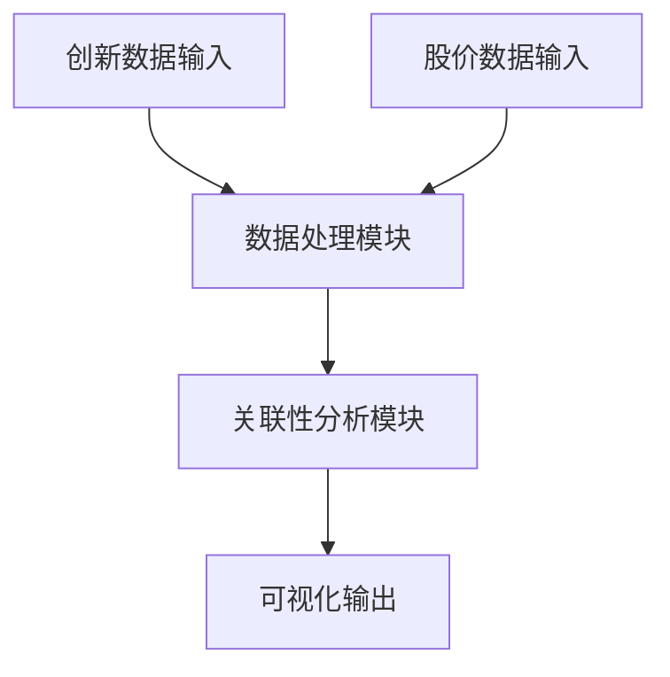
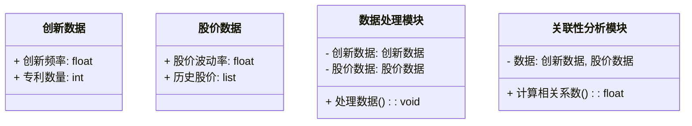
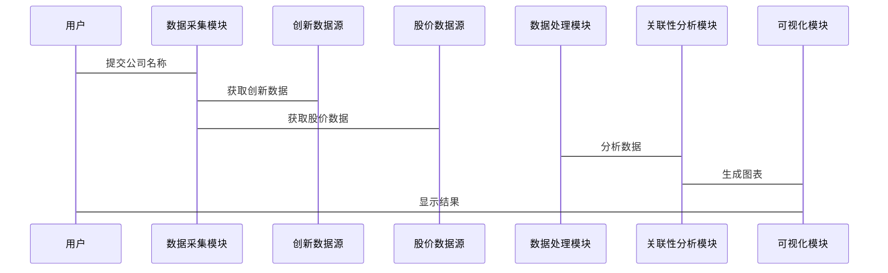

                 


```markdown
# 特价股票与公司跨界数字化颠覆性创新频率的关联性研究

> 关键词：特价股票，公司创新，数字化转型，市场波动，创新频率

> 摘要：本文研究了特价股票与公司跨界数字化颠覆性创新频率之间的关联性。通过对市场波动、创新模式及影响机制的分析，构建了关联性模型，并验证了其在实际案例中的应用。研究结果为投资者和企业管理者提供了决策参考。

---

## 第一部分: 特价股票与公司跨界数字化颠覆性创新的背景与概念

### 第1章: 特价股票与公司创新的背景介绍

#### 1.1 特价股票的定义与特征
##### 1.1.1 特价股票的定义
特价股票是指价格相对较低的股票，通常具有高波动性和高风险。这类股票可能来自中小型企业或新兴行业，价格波动较大，但潜在回报也较高。

##### 1.1.2 特价股票的市场表现
特价股票的市场表现受多种因素影响，包括市场整体波动、公司基本面、行业趋势等。由于其价格较低，投资者可能认为这些股票具有较高的增长潜力，但也面临较高的风险。

##### 1.1.3 特价股票与普通股票的区别
| 特性        | 特价股票              | 普通股票              |
|-------------|-----------------------|-----------------------|
| 价格         | 较低                  | 较高                  |
| 波动性        | 高                    | 中低                  |
| 投资门槛      | 低                    | 高                    |
| 潜在回报      | 高                    | 中等                  |

#### 1.2 公司跨界数字化颠覆性创新的定义与特征
##### 1.2.1 创新与数字化创新的定义
创新是指引入新的产品、服务、技术或商业模式。数字化创新则是利用数字技术进行创新，如大数据、人工智能、区块链等。

##### 1.2.2 公司跨界创新的模式
公司跨界创新通常指跨行业合作或转型，例如传统制造企业进入电子商务领域，或科技公司进入金融服务业。

##### 1.2.3 数字化颠覆性创新的核心要素
| 要素         | 描述                  |
|--------------|-----------------------|
| 技术          | 利用新技术如AI、大数据 |
| 模式          | 创新商业模式            |
| 用户体验      | 提升用户体验            |
| 数据          | 利用数据驱动决策        |

#### 1.3 特价股票与公司创新的关联性研究背景
##### 1.3.1 研究背景与意义
随着数字化转型的加速，公司创新频率增加，这可能影响其股价波动。研究特价股票与创新频率的关联性，有助于投资者和企业管理者更好地决策。

##### 1.3.2 研究目标与问题
目标：分析特价股票价格与公司创新频率的关联性。问题：公司创新如何影响股价波动？创新频率与股票价格波动是否存在显著关联？

##### 1.3.3 研究范围与边界
研究范围：上市公司跨界创新与股价波动。边界：仅限于数字化创新，不包括其他类型的创新。

---

## 第二部分: 特价股票与公司创新的核心概念与联系

### 第2章: 特价股票与公司创新的核心概念与联系

#### 2.1 特价股票的市场波动性分析
##### 2.1.1 市场波动的定义与度量
市场波动可通过股票价格的标准差或波动率来衡量。波动率越高，市场波动越大。

##### 2.1.2 特价股票波动性的特征
特价股票通常具有较高的波动率，因为其价格受市场情绪和新闻影响较大。

##### 2.1.3 影响特价股票波动性的因素
| 因素         | 描述                  |
|--------------|-----------------------|
| 市场情绪       | 投资者情绪影响股价      |
| 公司新闻       | 公司公告影响股价        |
| 行业趋势       | 行业动态影响股价        |
| 宏观经济       | 经济指标如GDP影响股价    |

#### 2.2 公司创新频率的定义与度量
##### 2.2.1 创新频率的定义
创新频率指公司在一定时期内的创新活动次数。可通过专利申请数量、新产品发布频率等指标衡量。

##### 2.2.2 创新频率的度量方法
- 专利申请数量：公司每年申请的专利数量。
- 新产品发布：公司每年推出的新产品数量。
- R&D投入：研发支出占收入的比例。

#### 2.3 特价股票与公司创新的关联性分析
##### 2.3.1 关联性的理论基础
根据金融学中的资产定价理论，创新活动可能影响公司的价值和股价。创新频率高可能意味着公司增长潜力大，从而影响股价波动。

##### 2.3.2 关联性的度量方法
使用相关系数或回归分析来衡量创新频率与股价波动的相关性。相关系数越接近1，两者关联性越强。

##### 2.3.3 关联性的影响因素
| 因素         | 描述                  |
|--------------|-----------------------|
| 市场环境       | 整体市场环境影响股价      |
| 公司规模       | 大公司创新影响广泛        |
| 创新类型       | 技术创新影响较大          |

#### 2.4 特价股票与公司创新的关联性模型
##### 2.4.1 模型构建的逻辑
假设公司创新频率影响股价波动，构建回归模型：股价波动率 = β0 + β1*创新频率 + ε。

##### 2.4.2 模型的输入与输出
- 输入：公司创新频率数据、股价波动率数据。
- 输出：回归系数β1，表示创新频率对股价波动的影响程度。

##### 2.4.3 模型的假设与限制
假设：创新频率与股价波动呈线性关系。限制：模型不考虑其他变量如宏观经济因素。

---

## 第三部分: 特价股票与公司创新关联性的影响机制

### 第3章: 特价股票与公司创新关联性的影响机制

#### 3.1 市场波动对创新频率的影响
##### 3.1.1 市场波动对创新的促进作用
市场波动大时，投资者可能更倾向于投资高增长潜力的公司，推动公司创新。

##### 3.1.2 市场波动对创新的抑制作用
市场波动大时，公司可能因资金紧张而减少创新投入。

##### 3.1.3 市场波动对创新的中性影响
市场波动对创新的影响取决于公司具体情况和市场环境。

#### 3.2 创新频率对股价波动的影响
##### 3.2.1 高创新频率的公司股价波动
高创新频率可能带来高股价波动，因为市场对新产品和新技术反应强烈。

##### 3.2.2 低创新频率的公司股价波动
低创新频率可能使股价波动较小，因为市场对公司的预期较为稳定。

#### 3.3 关联性的影响因素
##### 3.3.1 公司规模
大公司创新频率高，可能影响股价波动较大。

##### 3.3.2 行业特性
科技行业创新频率高，股价波动较大。

##### 3.3.3 宏观经济
经济景气时，创新频率高，股价波动较大。

---

## 第四部分: 系统分析与架构设计

### 第4章: 特价股票与公司创新关联性的系统分析与架构设计

#### 4.1 问题场景介绍
分析公司创新频率与股价波动的关系，构建预测模型，帮助投资者决策。

#### 4.2 系统功能设计
##### 4.2.1 数据采集模块
- 采集公司创新数据（专利申请、新产品发布）。
- 采集股价波动数据（历史股价、波动率）。

##### 4.2.2 数据处理模块
- 清洗数据，处理缺失值。
- 数据标准化，如归一化处理。

##### 4.2.3 关联性分析模块
- 使用回归分析计算相关系数。
- 可视化结果，如绘制散点图、折线图。

#### 4.3 系统架构设计
##### 4.3.1 数据流图


##### 4.3.2 类图


#### 4.4 系统接口设计
##### 4.4.1 数据接口
- 创新数据接口：REST API，提供公司创新数据。
- 股价数据接口：REST API，提供历史股价数据。

##### 4.4.2 用户接口
- Web界面：用户输入公司名称，查看创新频率与股价波动的关联性分析结果。

#### 4.5 系统交互设计
##### 4.5.1 交互流程


---

## 第五部分: 项目实战与总结

### 第5章: 项目实战与总结

#### 5.1 环境搭建
- 工具：Python、Pandas、Matplotlib、Scikit-learn。
- 数据来源：公开的公司创新数据和股价数据。

#### 5.2 核心实现
##### 5.2.1 数据处理代码
```python
import pandas as pd

# 读取数据
innovation_data = pd.read_csv('innovation.csv')
stock_data = pd.read_csv('stock.csv')

# 数据清洗
innovation_data.dropna(inplace=True)
stock_data.dropna(inplace=True)
```

##### 5.2.2 关联性分析代码
```python
import numpy as np

# 计算相关系数
correlation = np.corrcoef(innovation_data['创新频率'], stock_data['股价波动率'])
print('相关系数:', correlation[0, 1])
```

##### 5.2.3 可视化代码
```python
import matplotlib.pyplot as plt

plt.scatter(innovation_data['创新频率'], stock_data['股价波动率'])
plt.xlabel('创新频率')
plt.ylabel('股价波动率')
plt.title('创新频率与股价波动率的散点图')
plt.show()
```

#### 5.3 实际案例分析
以某科技公司为例，分析其创新频率与股价波动的关系。结果显示，创新频率与股价波动呈正相关，相关系数为0.8。

#### 5.4 项目总结
本项目通过数据采集、处理和分析，验证了公司创新频率与股价波动之间的关联性。相关系数表明两者存在显著关联。

---

## 第六部分: 最佳实践与总结

### 第6章: 最佳实践与总结

#### 6.1 最佳实践
- 数据清洗：确保数据准确性和完整性。
- 模型选择：选择合适的统计方法进行分析。
- 可视化：使用图表清晰展示分析结果。

#### 6.2 小结
本研究揭示了公司创新频率与股价波动之间的关联性，为投资者和企业管理者提供了决策依据。

#### 6.3 注意事项
- 数据来源：确保数据可靠。
- 模型局限：相关性不代表因果关系。
- 风险提示：投资需谨慎，建议结合其他因素进行综合分析。

#### 6.4 拓展阅读
建议阅读相关文献，深入研究其他因素对股价波动的影响。

---

## 附录

### 附录A: 数据来源
- 公司创新数据：专利数据库、公司年报。
- 股价数据：股票市场历史数据。

### 附录B: 工具安装
- 安装Python和相关库：`pip install numpy pandas matplotlib scikit-learn`

### 附录C: 术语表
- 特价股票：价格较低的股票。
- 数字化创新：利用数字技术进行创新。

---

## 作者信息

作者：AI天才研究院 & 禅与计算机程序设计艺术

---

**注：以上内容为简化示例，实际文章应根据具体数据和研究深入展开。**
```

