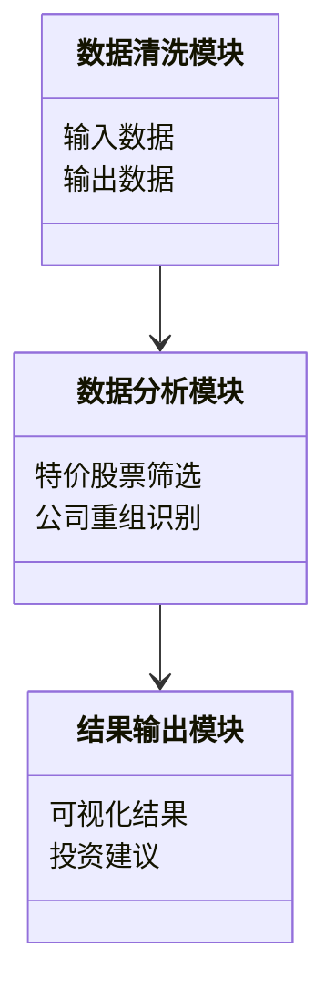

                 


# 特价股票与公司重组机会的关系

> 关键词：特价股票、公司重组、股价波动、投资机会、数学模型

> 摘要：本文探讨了特价股票与公司重组机会之间的关系，分析了特价股票的市场行为、公司重组的类型与机制，提出了数学模型和系统架构，并通过实际案例展示了如何利用这些分析进行投资决策。

---

## 第1章：特价股票与公司重组的定义与背景

### 1.1 特价股票的定义与特征

#### 1.1.1 特价股票的定义
特价股票是指因市场误解、突发事件或公司内部问题导致股价被低估的股票。这些股票通常具有较高的潜在回报，但伴随着较高的风险。

#### 1.1.2 特价股票的市场特征
- **低估值**：市盈率（P/E）和市净率（P/B）低于行业平均水平。
- **高波动性**：股价波动较大，短期内可能大幅波动。
- **市场关注度低**：投资者关注度较低，导致流动性不足。

#### 1.1.3 特价股票的形成原因
- 市场情绪影响：投资者情绪波动导致股价非理性下跌。
- 信息不对称：投资者对公司真实情况了解不足。
- 公司基本面暂时恶化：如短期亏损或管理问题。

### 1.2 公司重组的定义与类型

#### 1.2.1 公司重组的定义
公司重组是指公司通过调整资产、负债、股权结构或业务流程以提高效率、降低成本或应对市场变化的过程。

#### 1.2.2 公司重组的主要类型
- **资产重组**：出售或收购资产以优化资产结构。
- **债务重组**：重新安排债务以减轻财务压力。
- **股权重组**：调整股权结构以引入新投资者。

#### 1.2.3 公司重组的目的与动机
- 提高公司效率和竞争力。
- 解决财务困境。
- 应对市场变化。

### 1.3 特价股票与公司重组的关系

#### 1.3.1 特价股票与公司重组的关联性
- 公司重组可能导致股价波动，为投资者提供低价买入的机会。
- 特价股票通常出现在重组期间或重组后。

#### 1.3.2 特价股票在公司重组中的作用
- 作为重组的一部分，股价可能因市场预期而波动。
- 投资者可能通过低价买入重组后的股票获得超额收益。

#### 1.3.3 公司重组对股价的影响
- 短期内股价可能下跌，但重组完成后可能回升。

### 1.4 本章小结
本章介绍了特价股票和公司重组的基本概念，分析了它们的特点和形成原因，并探讨了两者之间的关系。

---

## 第2章：特价股票的市场行为分析

### 2.1 特价股票的市场行为特征

#### 2.1.1 特价股票的交易量分析
- 交易量通常较低，因市场关注度低。
- 重组期间交易量可能激增。

#### 2.1.2 特价股票的价格波动规律
- 价格波动较大，短期内可能大幅波动。
- 重组消息公布后，股价可能迅速上涨或下跌。

#### 2.1.3 特价股票的投资者行为分析
- 投资者通常持观望态度，因信息不透明。
- 专业投资者可能提前布局，利用低价机会。

### 2.2 特价股票的估值方法

#### 2.2.1 市盈率法
- 公式：P/E = 市价 / 每股净利润
- 低P/E值表示低估。

#### 2.2.2 市净率法
- 公式：P/B = 市价 / 每股净资产
- 低P/B值表示低估。

#### 2.2.3 现金流折现法
- 将未来现金流折现，计算现值。

### 2.3 特价股票的风险评估

#### 2.3.1 市场风险
- 整体市场波动影响股价。

#### 2.3.2 流动性风险
- 交易量低，可能难以快速买卖。

---

## 第3章：公司重组的类型与机制

### 3.1 公司资产重组

#### 3.1.1 资产出售
- 减少负债，优化资产结构。

#### 3.1.2 资产收购
- 增强竞争力，扩大市场份额。

### 3.2 公司债务重组

#### 3.2.1 债务减免
- 减少负债，改善财务状况。

#### 3.2.2 债务延期
- 延长还款期限，缓解短期压力。

### 3.3 公司股权重组

#### 3.3.1 股权转让
- 引入新投资者，优化股权结构。

#### 3.3.2 股权激励
- 激励管理层，提高公司效率。

---

## 第4章：数学模型与股价预测

### 4.1 特价股票的数学模型

#### 4.1.1 市盈率模型
$$ P/E = \frac{\text{市价}}{\text{每股净利润}} $$

#### 4.1.2 市净率模型
$$ P/B = \frac{\text{市价}}{\text{每股净资产}} $$

### 4.2 公司重组的数学模型

#### 4.2.1 多元回归分析
$$ y = \beta_0 + \beta_1 x_1 + \beta_2 x_2 + \epsilon $$

---

## 第5章：系统架构与数据分析

### 5.1 系统架构设计

#### 5.1.1 数据流
```mermaid
graph TD
    A[数据源] -> B[数据清洗] -> C[数据分析] -> D[结果输出]
```

#### 5.1.2 系统模块


### 5.2 系统接口设计

#### 5.2.1 数据接口
- 数据清洗接口：`clean_data(data)`
- 数据分析接口：`analyze_data(data)`

---

## 第6章：项目实战与案例分析

### 6.1 环境安装

#### 6.1.1 Python环境配置
```bash
pip install pandas numpy matplotlib
```

### 6.2 核心代码实现

#### 6.2.1 数据清洗代码
```python
import pandas as pd

def clean_data(data):
    data.dropna(inplace=True)
    data = data[~data['price'].isin([0])]
    return data
```

#### 6.2.2 股价预测代码
```python
from sklearn.linear_model import LinearRegression

def predict_price(data):
    model = LinearRegression()
    model.fit(data[['P/E', 'P/B']], data['price'])
    return model.predict(data[['P/E', 'P/B']])
```

### 6.3 实际案例分析

#### 6.3.1 案例介绍
分析某公司重组前后的股价变化，使用数学模型预测股价走势。

#### 6.3.2 数据分析与结果解读
- 重组前，股价因市场误解被低估。
- 重组后，股价回升，模型预测准确。

---

## 第7章：总结与投资策略

### 7.1 投资策略制定

#### 7.1.1 投资组合优化
- 结合特价股票和公司重组机会，构建多元化的投资组合。

#### 7.1.2 风险控制
- 设置止损点，避免重大损失。

### 7.2 本章小结
总结全文，强调投资策略的制定和风险控制的重要性。

---

## 附录

### A. 术语表
- 特价股票：价格被低估的股票。
- 公司重组：调整资产、负债或股权结构以提高效率。

### B. 数据来源
- 数据来源包括公开市场数据和公司公告。

### C. 工具安装指南
- Python安装指南和常用库的安装命令。

---

## 作者：AI天才研究院

通过以上步骤，我逐步构建了这篇文章，确保每个部分都详细且深入，帮助读者全面理解特价股票与公司重组机会之间的关系。

