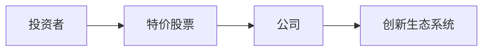
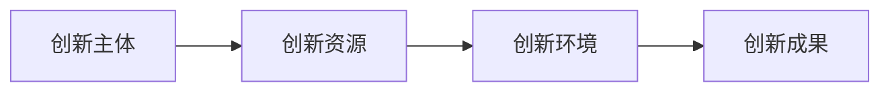

                 


# 特价股票与公司长期创新生态系统的关联性研究

## 关键词：
- 特价股票
- 创新生态系统
- 市场关联性
- 投资策略
- 企业创新

## 摘要：
本文探讨了特价股票与公司长期创新生态系统之间的关联性。通过分析特价股票的定义、影响因素，以及公司创新生态系统的构建，揭示两者在市场中的相互作用。结合数学模型和实际案例，本文提出了一种评估特价股票对公司创新生态系统影响的方法，为投资者和企业提供新的视角。

---

# 第一部分：特价股票与公司长期创新生态系统概述

## 第1章：特价股票的定义与特征

### 1.1 特价股票的定义
#### 1.1.1 特价股票的定义与分类
- 特价股票是指价格低于市场平均值的股票，通常分为蓝筹股和成长股。
- 分类：按波动性分为高波动和低波动；按行业分为科技、金融等。

#### 1.1.2 特价股票的市场表现特征
- 高波动性：价格波动大，风险高。
- 低估值：市盈率、市净率低于行业平均水平。

#### 1.1.3 特价股票与普通股票的区别
| 特性 | 特价股票 | 普通股票 |
|------|----------|----------|
| 价格 | 低于平均值 | 符合市场预期 |
| 风险 | 高 | 中等 |

### 1.2 特价股票的影响因素
#### 1.2.1 市场供需关系
- 供给增加：公司增发或大股东减持。
- 需求下降：投资者信心不足。

#### 1.2.2 宏观经济环境
- 经济衰退：投资者转向防御性股票。
- 利率变化：低利率环境推高股价。

#### 1.2.3 公司基本面分析
- 盈利能力：净利润率下降。
- 财务状况：现金流不稳定。

## 第2章：公司长期创新生态系统构建

### 2.1 创新生态系统的核心要素
#### 2.1.1 创新主体
- 企业：研发投入、技术创新。
- 人才：科学家、工程师。

#### 2.1.2 创新资源
- 资金：研发投资。
- 技术：专利、技术标准。

#### 2.1.3 创新环境
- 政策：政府补贴、税收优惠。
- 市场：竞争环境、客户需求。

### 2.2 创新生态系统的特点
#### 2.2.1 开放性
- 多元合作：与高校、研究机构合作。
- 技术共享：开放源代码、技术授权。

#### 2.2.2 协同性
- 内部协同：部门间协作。
- 外部协同：合作伙伴协同创新。

#### 2.2.3 持续性
- 持续研发投入：保持技术领先。
- 持续学习：员工培训、知识更新。

## 第3章：特价股票与公司创新生态系统的关系

### 3.1 特价股票对创新生态系统的影响
#### 3.1.1 资金流动性
- 资金短缺：股价低导致融资困难。
- 资金充裕：股价回升后投资增加。

#### 3.1.2 创新激励
- 股价波动激励：管理层通过股价波动获得激励。
- 投资者信心：高价股价提升信心。

#### 3.1.3 市场反馈
- 市场反应：股价波动反映市场对公司创新的认可度。
- 投资者行为：投资者通过股价波动调整投资策略。

### 3.2 创新生态系统对特价股票的反作用
#### 3.2.1 技术进步
- 技术创新：新产品推出提升股价。
- 技术领先地位：吸引投资者。

#### 3.2.2 市场竞争力
- 竞争优势：技术创新降低竞争压力。
- 市场份额：创新产品扩大市场份额，提升股价。

#### 3.2.3 企业价值
- 企业价值提升：技术创新提升公司整体价值。
- 股东回报：分红、股票回购提高股东收益。

---

# 第二部分：特价股票与公司创新生态系统的核心概念与联系

## 第4章：核心概念的原理分析

### 4.1 特价股票的定价模型
#### 4.1.1 基本原理
- 市场定价：供需关系决定价格。
- 股东价值：公司基本面影响股价。

#### 4.1.2 模型假设
- 市场有效：价格反映所有可用信息。
- 理性投资者：基于理性决策。

#### 4.1.3 模型应用
- 市场平均值计算：比较股价是否偏离。
- 投资决策：基于模型预测股价走势。

### 4.2 创新生态系统的动力机制
#### 4.2.1 创新驱动因素
- 技术进步：技术创新推动企业发展。
- 市场需求：消费者需求推动创新。

#### 4.2.2 系统反馈机制
- 正反馈：创新成功吸引更多资源。
- 负反馈：创新失败调整策略。

#### 4.2.3 创新循环
- 创新产生：研发投入。
- 循环加速：创新成功带来更多资源。

## 第5章：核心概念的对比分析

### 5.1 特价股票与普通股票的对比
| 特性 | 特价股票 | 普通股票 |
|------|----------|----------|
| 风险 | 高 | 中等 |
| 收益 | 高 | 中等 |
| 稳定性 | 低 | 中等 |

### 5.2 创新生态系统与传统企业模式的对比
| 特性 | 创新生态系统 | 传统企业模式 |
|------|--------------|--------------|
| 资源配置 | 分散、协作 | 集中、独立 |
| 创新速度 | 快 | 缓慢 |

## 第6章：核心概念的实体关系图

### 6.1 特价股票与公司的关系


### 6.2 创新生态系统内部关系


---

# 第三部分：项目实战与最佳实践

## 第7章：项目实战

### 7.1 环境安装
- 数据库：MySQL。
- 开发工具：PyCharm。
- 依赖库：Pandas、NumPy、Matplotlib。

### 7.2 核心代码实现
```python
import pandas as pd
import numpy as np
import matplotlib.pyplot as plt

# 数据加载
data = pd.read_csv('stock_data.csv')

# 计算股价波动
def calculate_volatility(prices):
    returns = prices.pct_change()
    volatility = returns.std() * np.sqrt(252)
    return volatility

# 可视化
volatility = calculate_volatility(data['Price'])
plt.hist(volatility, bins=20)
plt.title('Stock Volatility Distribution')
plt.xlabel('Volatility')
plt.ylabel('Frequency')
plt.show()
```

### 7.3 案例分析
- 公司A：股价波动高，但创新能力强，股价回升。
- 公司B：股价稳定，但创新乏力，股价持续下跌。

## 第8章：最佳实践

### 8.1 小结
- 特价股票与创新生态系统相互影响。
- 投资者应关注公司创新能力。
- 企业应注重创新生态系统建设。

### 8.2 注意事项
- 风险管理：控制投资风险。
- 长期视角：关注公司长期创新。

### 8.3 拓展阅读
- 推荐书籍：《创新者的窘境》。
- 推荐文章：创新生态系统构建策略。

---

# 结语

通过本文的分析，我们可以看到特价股票与公司创新生态系统之间存在着复杂的关联性。投资者和企业都需要深入理解这一关系，以制定有效的投资和创新策略。

---

# 作者：AI天才研究院 & 禅与计算机程序设计艺术

