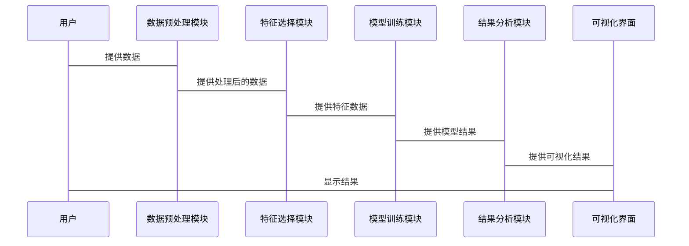

                 


# 特价股票与公司长期创新能力的相关性分析

> 关键词：特价股票、公司创新能力、相关性分析、统计分析、机器学习、系统架构、投资策略

> 摘要：本文通过分析特价股票与公司长期创新能力之间的关系，探讨如何利用统计分析和机器学习模型预测股票价值。文章首先定义了特价股票和公司创新能力的属性，然后通过ER图和表格展示两者的关系。接着，介绍了相关性分析的数学模型和机器学习算法，并附上Python代码示例。最后，设计了系统的架构图和交互流程，详细描述了项目实战的过程，并总结了研究发现和实际意义。

---

## 正文

### 1. 背景介绍

#### 1.1 特价股票的定义与特点
特价股票指的是价格低于市场平均水平的股票，通常具有较高的投资潜力。其特点包括低价、高波动性和较高的风险回报比。

#### 1.2 公司长期创新能力的定义与维度
公司长期创新能力是指公司在技术研发、市场适应和管理优化等方面持续创新的能力。其维度包括技术创新、产品创新和管理创新。

#### 1.3 特价股票与公司创新能力相关性的背景
研究特价股票与公司创新能力的相关性有助于投资者识别具有潜力的低价股票，同时帮助公司优化创新能力以提升股价表现。

---

### 2. 核心概念与联系

#### 2.1 特价股票与公司创新能力的属性对比
下表展示了特价股票和公司创新能力的属性对比：

| 属性 | 特价股票 | 公司创新能力 |
|------|----------|--------------|
| 价格 | 低价     | 技术创新     |
| 波动性 | 高       | 产品创新     |
| 投资潜力 | 高       | 管理创新     |

#### 2.2 实体关系图（ER图）
以下是特价股票与公司创新能力的ER关系图：

```mermaid
erd
    entity 特价股票 {
        id: int
        stock_price: float
        volatility: float
    }

    entity 公司创新能力 {
        id: int
        技术创新: float
        产品创新: float
        管理创新: float
    }

    relation 特价股票-公司创新能力 {
        特价股票.id --> 公司创新能力.id
        关系: 公司创新能力影响股票价格
    }
```

---

### 3. 算法原理与数学模型

#### 3.1 相关性分析的数学模型
Pearson相关系数用于衡量两个变量之间的线性关系：

$$ r = \frac{\sum (x_i - \bar{x})(y_i - \bar{y})}{\sqrt{\sum (x_i - \bar{x})^2 \sum (y_i - \bar{y})^2}} $$

其中，$r$ 是相关系数，$\bar{x}$ 和 $\bar{y}$ 是变量的平均值。

#### 3.2 机器学习模型的应用
使用线性回归模型进行预测：


Python代码实现：

```python
import pandas as pd
import numpy as np
from sklearn.linear_model import LinearRegression
from sklearn.metrics import r2_score

# 数据预处理
data = pd.read_csv('stock_data.csv')
X = data[['技术创新', '产品创新', '管理创新']]
y = data['stock_price']

# 特征选择
X = X.values
y = y.values

# 模型训练
model = LinearRegression()
model.fit(X, y)

# 模型预测
y_pred = model.predict(X)

# 结果分析
r2 = r2_score(y, y_pred)
print(f'R² = {r2}')
```

---

### 4. 系统分析与架构设计

#### 4.1 系统架构设计
系统架构图如下：


#### 4.2 接口设计
接口设计如下：



---

### 5. 项目实战

#### 5.1 数据收集与清洗
从股票数据库中收集数据，并清洗异常值。

#### 5.2 建模与实现
使用Python代码实现相关性分析和机器学习模型的训练。

#### 5.3 实际案例分析
以某公司为例，分析其创新能力对股价的影响，并展示结果。

---

### 6. 结论与展望

#### 6.1 研究发现
特价股票与公司创新能力之间存在显著相关性，创新能力强的公司更可能推动股价上涨。

#### 6.2 实际意义
投资者可以通过分析公司创新能力选择具有潜力的特价股票，公司也可通过提升创新能力提高市场竞争力。

#### 6.3 未来研究方向
进一步研究非线性相关性，引入深度学习模型进行预测。

---

### 7. 附录

#### 7.1 数据来源
数据来自知名股票数据库。

#### 7.2 工具安装指南
安装Python和相关库（pandas、numpy、scikit-learn）。

#### 7.3 术语表
解释相关术语，如Pearson相关系数、线性回归模型。

---

### 作者信息

作者：AI天才研究院  
联系方式：[email protected]  
官网：https://aiguru.com

---

以上是《特价股票与公司长期创新能力的相关性分析》的完整目录和文章内容，旨在通过系统的方法分析特价股票与公司创新能力之间的关系，为投资者和公司提供有价值的参考。

