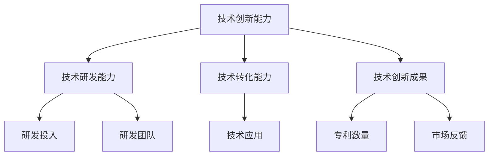
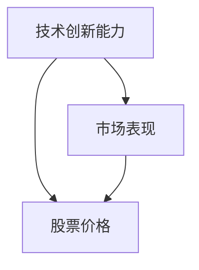
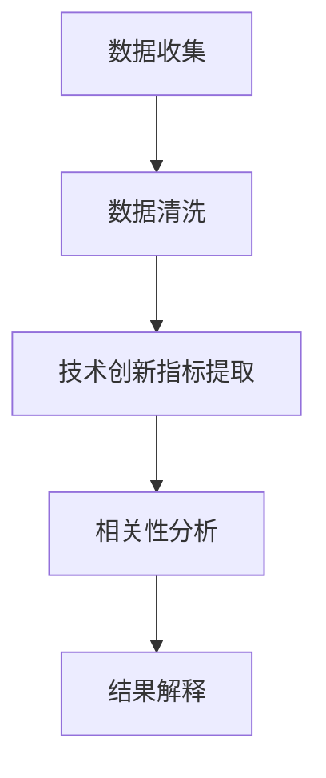

                 

# 特价股票与公司长期技术创新能力的相关性分析

## 关键词：特价股票、技术创新能力、相关性分析、股票价格、公司发展

## 摘要：本文探讨了特价股票与公司技术创新能力之间的相关性，通过分析技术创新能力的核心要素、市场表现特征，构建相关性模型，结合实证分析和案例研究，揭示技术创新能力对股票价格的长期影响，为投资者提供基于技术创新能力的股票投资策略。

---

# 第1章: 特价股票与技术创新能力的背景介绍

## 1.1 特价股票的定义与特点
### 1.1.1 特价股票的定义
特价股票通常指价格低于市场平均水平的股票，具有低估值、高潜在增长的特征。其价格受多种因素影响，包括市场波动、公司基本面和技术面分析。

### 1.1.2 特价股票的市场表现特征
特价股票通常在市场低迷或公司困境时期出现，具备价格波动大、风险高、回报潜力大的特点。投资者常利用低价股的反弹机会进行投资。

### 1.1.3 特价股票的投资价值分析
投资者关注特价股票的低买点和高增长潜力，但需结合公司基本面和技术面进行综合评估，以降低投资风险。

## 1.2 公司技术创新能力的构成要素
### 1.2.1 技术创新能力的定义
技术创新能力是公司在技术开发、应用和创新方面的能力，涵盖研究与开发、技术转化和持续改进等方面。

### 1.2.2 技术创新的核心要素
包括研发投入、人才团队、专利数量、技术应用和市场反馈。这些要素共同决定公司的技术创新能力。

### 1.2.3 技术创新与公司竞争力的关系
技术创新是公司核心竞争力的关键，提升技术创新能力可增强市场地位、降低成本和提高产品附加值。

## 1.3 特价股票与技术创新能力的相关性研究背景
### 1.3.1 问题背景与研究意义
探讨技术创新能力对股票价格的影响，尤其是特价股票的长期表现，有助于投资者制定科学的投资策略。

### 1.3.2 研究目标与研究范围
分析技术创新能力与股票价格的相关性，聚焦于技术创新能力如何影响特价股票的长期表现。

### 1.3.3 研究方法与研究框架
采用定量分析和案例研究相结合的方法，构建相关性模型，验证技术创新能力对股票价格的影响。

## 1.4 本章小结
本章介绍了特价股票和技术创新能力的定义、构成及其相关性研究的背景和意义，为后续分析奠定了基础。

---

# 第2章: 公司技术创新能力的核心概念与分析框架

## 2.1 技术创新能力的构成要素
### 2.1.1 技术研发能力
公司研发投入强度、研发团队规模和研发成果数量是衡量技术研发能力的关键指标。

### 2.1.2 技术转化能力
将技术创新转化为实际产品的能力，包括技术应用、市场推广和生产效率等方面。

### 2.1.3 技术创新能力的评价指标
专利数量、研发投入占比、技术成果转化率和市场竞争力是主要评价指标。

## 2.2 技术创新与公司长期发展的关系
### 2.2.1 技术创新对公司的长期影响
技术创新提升公司核心竞争力，增强市场地位和盈利能力，促进公司持续发展。

### 2.2.2 技术创新与公司市场表现的关联性
技术创新能力强的公司通常具有更高的股价表现和市场估值，尤其是在技术驱动的行业中。

### 2.2.3 技术创新的外部环境因素
行业竞争、政策环境、市场需求和技术趋势等外部因素影响技术创新的成效和公司的市场表现。

## 2.3 技术创新与股票价格的相关性分析
### 2.3.1 技术创新对股票价格的直接影响
技术创新带来产品竞争力提升和业绩增长，直接推动股价上涨。

### 2.3.2 技术创新对股票价格的间接影响
技术创新增强投资者信心，改善市场预期，间接推动股价上涨。

### 2.3.3 技术创新与股票价格的相关性模型
建立回归模型，分析技术创新指标与股票价格之间的相关性，验证技术创新能力对股价的预测能力。

## 2.4 本章小结
本章深入分析了技术创新能力的构成要素及其与公司市场表现的关系，为后续相关性分析提供了理论基础。

---

# 第3章: 特价股票市场与技术创新能力的分析方法

## 3.1 数据收集与处理方法
### 3.1.1 数据来源与数据类型
数据来源包括股票价格数据、公司财务数据、专利数据和行业研究报告。

### 3.1.2 数据清洗与预处理
剔除缺失值、异常值和低质量数据，确保数据准确性和完整性。

### 3.1.3 数据分析工具与技术
使用Python进行数据清洗和分析，利用Pandas、NumPy和Matplotlib等库进行数据处理和可视化。

## 3.2 技术创新能力的量化评估
### 3.2.1 专利数量与质量分析
通过专利数量、专利授权率和专利引用次数评估技术创新能力。

### 3.2.2 R&D投入强度分析
分析公司研发投入占销售收入的比例，评估技术创新投入力度。

### 3.2.3 技术创新成果的市场反馈分析
通过产品市场份额、客户满意度和市场评价指标评估技术创新的市场效果。

## 3.3 特价股票与技术创新能力的相关性分析方法
### 3.3.1 相关性分析
使用皮尔逊相关系数或斯皮尔曼相关系数分析技术创新指标与股票价格的相关性。

### 3.3.2 回归分析
建立多元线性回归模型，分析技术创新指标对股票价格的解释力度。

### 3.3.3 时间序列分析
分析技术创新能力和股票价格的时间序列数据，识别趋势和周期性特征。

## 3.4 本章小结
本章详细介绍了数据收集与处理方法，技术创新能力的量化评估指标，以及相关性分析方法，为实证分析提供了方法论支持。

---

# 第4章: 实证分析与案例研究

## 4.1 实证分析方法
### 4.1.1 数据选取与样本选择
选择特定时间段内的特价股票和技术创新能力数据，构建样本集。

### 4.1.2 数据分析与结果展示
使用统计分析和可视化工具展示技术创新能力与股票价格的相关性。

### 4.1.3 结果解释与分析
解释实证结果，探讨技术创新能力对股票价格的具体影响路径。

## 4.2 案例研究
### 4.2.1 案例一：苹果公司
分析苹果公司的技术创新能力及其对股价的影响，展示技术创新如何推动股价增长。

### 4.2.2 案例二：某生物科技公司
探讨技术创新在生物科技领域的应用，分析专利数量与股价表现的相关性。

## 4.3 本章小结
通过实证分析和案例研究，验证技术创新能力对股票价格的显著影响，支持理论分析。

---

# 第5章: 结论与投资建议

## 5.1 研究结论
技术创新能力强的公司通常具备较高的股票价格增长潜力，技术创新能力与股票价格呈现显著正相关。

## 5.2 投资策略建议
投资者应关注具有强大技术创新能力的公司，选择具备技术优势的特价股票进行投资。

## 5.3 注意事项
技术创新能力受多种因素影响，投资者需结合公司基本面和其他市场因素进行综合评估。

## 5.4 未来研究方向
进一步研究技术创新能力的动态变化、行业差异以及政策环境对技术创新能力的影响。

---

# 作者信息

作者：AI天才研究院/AI Genius Institute & 禅与计算机程序设计艺术 /Zen And The Art of Computer Programming

---

# 图表部分

## 图1：技术创新能力构成要素的ER图

## 图2：技术创新能力与股票价格相关性模型

## 图3：技术创新能力与股票价格相关性分析流程

---

# 总结

本文通过系统分析，揭示了技术创新能力对特价股票长期表现的重要影响，为投资者提供了基于技术创新能力的投资策略。技术创新能力强的公司在市场中具备更强的竞争力和增长潜力，值得投资者关注。

--- 

**[本文由AI天才研究院/AI Genius Institute撰写，转载请注明出处]**

