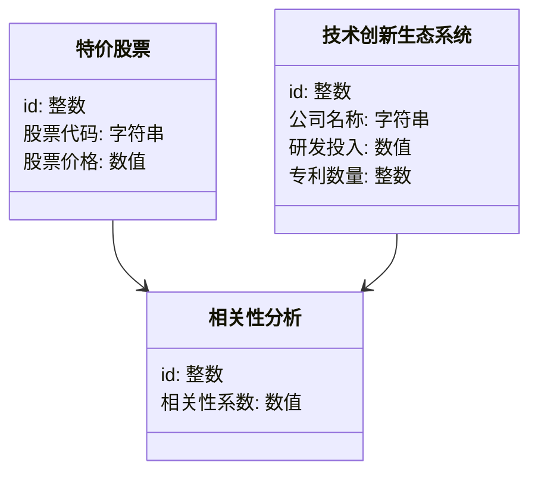
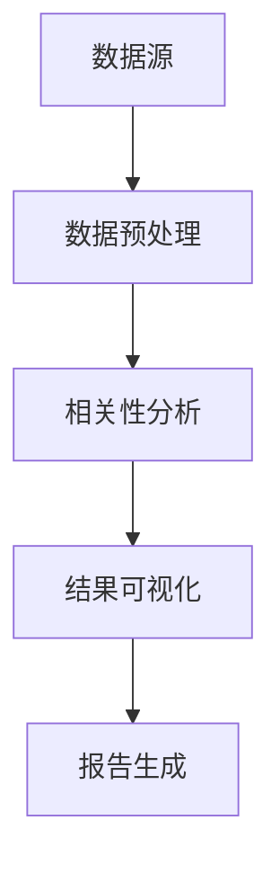

                 


# 特价股票与公司长期技术融合创新生态系统相关性分析

> 关键词：特价股票、技术创新生态系统、相关性分析、统计学、机器学习、系统架构

> 摘要：本文深入分析了特价股票与公司技术创新生态系统之间的相关性，探讨了如何通过统计学和机器学习方法进行相关性分析，并提出了系统的解决方案。文章内容涵盖背景介绍、相关性分析的核心概念、算法原理、系统架构设计、项目实战以及实际案例分析，旨在为投资者和技术创新企业提供理论支持和实践指导。

---

## # 第1章: 特价股票与公司技术创新生态系统相关性背景

### ## 1.1 特价股票的定义与特点

#### ### 1.1.1 特价股票的定义  
特价股票是指价格相对较低，通常具有较高增长潜力的股票。这些股票可能来自新兴公司或在市场中处于低估状态的公司。特价股票的特点包括高波动性、高风险和高回报潜力。

#### ### 1.1.2 特价股票的特点与分类  
- **高波动性**：价格波动较大，短期内可能大幅上涨或下跌。  
- **高风险**：由于价格较低，市场对公司的未来发展存在不确定性。  
- **高回报潜力**：如果公司成功实现技术创新或业务突破，股票价格可能大幅上涨。  

特价股票可以分为以下几类：  
1. **成长型股票**：公司处于高速成长阶段，未来盈利潜力大。  
2. **价值型股票**：市场价格低于其内在价值，存在被低估的情况。  
3. **周期性股票**：受行业周期影响较大的股票。  

#### ### 1.1.3 特价股票的市场表现与投资价值  
特价股票的市场表现通常与公司基本面和技术面密切相关。投资者需要结合公司的技术创新能力、财务状况和行业趋势来评估其投资价值。

---

### ## 1.2 公司技术创新生态系统的核心要素

#### ### 1.2.1 技术创新的定义与特征  
技术创新是指通过引入新技术、新产品或新的生产方式，提升公司的竞争力和市场地位。技术创新具有以下特征：  
- **创新性**：引入新的技术或方法。  
- **实用性**：能够实际应用于生产或服务。  
- **持续性**：技术创新是一个持续的过程，需要不断投入资源。  

#### ### 1.2.2 公司技术创新生态系统的构成要素  
技术创新生态系统由以下要素构成：  
1. **技术创新能力**：公司的研发能力和技术水平。  
2. **创新资源**：包括资金、人才、技术设备等。  
3. **创新环境**：公司内部和外部的环境支持。  
4. **创新成果**：技术创新带来的产品或服务。  

#### ### 1.2.3 技术创新生态系统与公司长期发展的关系  
技术创新是公司长期发展的核心驱动力。通过技术创新，公司可以提升产品竞争力、降低成本、开拓新市场，并实现可持续发展。

---

### ## 1.3 特价股票与公司技术创新生态系统相关性的研究背景

#### ### 1.3.1 研究背景与意义  
随着科技的快速发展，技术创新在公司发展中的作用越来越重要。特价股票通常与技术创新能力强的公司相关，研究其相关性有助于投资者发现潜在投资机会。

#### ### 1.3.2 研究目标与范围  
本文旨在研究特价股票与公司技术创新生态系统之间的相关性，分析技术创新能力对股票价格的影响，并提出相关投资策略。

#### ### 1.3.3 研究方法与框架  
- **数据收集**：收集相关公司的技术创新数据和股票价格数据。  
- **相关性分析**：使用统计学和机器学习方法分析两者之间的相关性。  
- **案例分析**：通过实际案例验证分析结果。  

---

## # 第2章: 特价股票与公司技术创新生态系统相关性分析的核心概念

### ## 2.1 相关性分析的理论基础

#### ### 2.1.1 相关性分析的定义与方法  
相关性分析是研究两个或多个变量之间关系的统计方法。常用方法包括：  
1. **统计学相关性分析**：如皮尔逊相关系数和斯皮尔曼相关系数。  
2. **机器学习相关性分析**：如线性回归和决策树模型。  

#### ### 2.1.2 统计学相关性分析的数学模型  
皮尔逊相关系数公式：  
$$ r = \frac{\sum (x_i - \bar{x})(y_i - \bar{y})}{\sqrt{\sum (x_i - \bar{x})^2 \sum (y_i - \bar{y})^2}} $$  

斯皮尔曼相关系数公式：  
$$ \rho = \frac{\sum (R_i - \bar{R})(S_i - \bar{S})}{\sqrt{\sum (R_i - \bar{R})^2 \sum (S_i - \bar{S})^2}} $$  

#### ### 2.1.3 机器学习相关性分析的基本原理  
机器学习通过构建模型来分析变量之间的关系，常用方法包括线性回归和决策树。

---

### ## 2.2 特价股票与技术创新生态系统相关性的属性对比

#### ### 2.2.1 特价股票的市场表现属性  
- **股价波动性**：股价的短期波动性。  
- **市盈率**：市盈率与行业平均水平的对比。  

#### ### 2.2.2 技术创新生态系统的属性特征  
- **研发投入**：公司研发投入占总收入的比例。  
- **专利数量**：公司拥有的专利数量。  

#### ### 2.2.3 相关性属性对比的特征分析  
通过对比股价波动性与研发投入、专利数量等属性，分析技术创新能力对股票价格的影响。

---

### ## 2.3 相关性分析的ER实体关系图

#### ### 2.3.1 实体关系图的定义与作用  
ER实体关系图用于描述系统中的实体及其关系，帮助我们更好地理解数据结构。

#### ### 2.3.2 特价股票与技术创新生态系统的实体关系  
```mermaid
er
  %%{init: { 'theme': 'default', 'title': '特价股票与技术创新生态系统 ER 图' }}
  entity 特价股票 {
    id: 整数
    股票代码: 字符串
    股票价格: 数值
    市盈率: 数值
  }
  entity 技术创新生态系统 {
    id: 整数
    公司名称: 字符串
    研发投入: 数值
    专利数量: 整数
  }
  relationship 相关性 {
    特价股票 --> 技术创新生态系统
    关联度: 数值
  }
```

#### ### 2.3.3 实体关系图的构建与分析  
通过ER图可以看出，特价股票与技术创新生态系统之间存在相关性关系，关联度可以通过统计学方法量化。

---

## # 第3章: 特价股票与公司技术创新生态系统相关性分析的算法原理

### ## 3.1 相关性分析的算法原理

#### ### 3.1.1 统计学相关性分析算法  
- **皮尔逊相关系数**：衡量线性相关性。  
- **斯皮尔曼相关系数**：衡量非线性相关性。  

#### ### 3.1.2 机器学习相关性分析算法  
- **线性回归**：通过回归系数分析变量之间的关系。  
- **决策树**：通过树状结构分析变量之间的关系。  

#### ### 3.1.3 深度学习相关性分析算法  
- **神经网络**：通过多层神经网络分析复杂的变量关系。  

---

### ## 3.2 相关性分析的数学模型与公式

#### ### 3.2.1 统计学相关性分析的数学公式  
皮尔逊相关系数公式：  
$$ r = \frac{\sum (x_i - \bar{x})(y_i - \bar{y})}{\sqrt{\sum (x_i - \bar{x})^2 \sum (y_i - \bar{y})^2}} $$  

斯皮尔曼相关系数公式：  
$$ \rho = \frac{\sum (R_i - \bar{R})(S_i - \bar{S})}{\sqrt{\sum (R_i - \bar{R})^2 \sum (S_i - \bar{S})^2}} $$  

#### ### 3.2.2 机器学习相关性分析的数学模型  
线性回归模型：  
$$ y = \beta_0 + \beta_1 x + \epsilon $$  

---

### ## 3.3 相关性分析算法的Python实现

#### ### 3.3.1 统计学相关性分析的Python实现  
```python
import numpy as np

# 示例数据
x = np.array([1, 2, 3, 4, 5])
y = np.array([2, 4, 5, 4, 5])

# 皮尔逊相关系数
correlation_pearson = np.corrcoef(x, y)
print("皮尔逊相关系数:", correlation_pearson)

# 斯皮尔曼相关系数
from scipy import stats
correlation_spearman = stats.spearmanr(x, y).correlation
print("斯皮尔曼相关系数:", correlation_spearman)
```

#### ### 3.3.2 机器学习相关性分析的Python实现  
```python
from sklearn.linear_model import LinearRegression

# 示例数据
x = np.array([1, 2, 3, 4, 5]).reshape(-1, 1)
y = np.array([2, 4, 5, 4, 5])

# 线性回归模型
model = LinearRegression()
model.fit(x, y)
print("回归系数:", model.coef_)
print("回归截距:", model.intercept_)
```

---

## # 第4章: 特价股票与公司技术创新生态系统相关性分析的系统架构设计

### ## 4.1 系统功能设计

#### ### 4.1.1 领域模型设计  


#### ### 4.1.2 系统架构设计  


---

## # 第5章: 特价股票与公司技术创新生态系统相关性分析的项目实战

### ## 5.1 环境安装

#### ### 5.1.1 安装Python环境  
安装Python 3.8及以上版本，并安装以下库：  
- NumPy  
- Pandas  
- Matplotlib  
- Scipy  
- Scikit-learn  

#### ### 5.1.2 数据收集  
从公开数据源获取特价股票数据和技术创新相关数据。

---

### ## 5.2 核心代码实现

#### ### 5.2.1 数据预处理  
```python
import pandas as pd

# 读取数据
data = pd.read_csv('stock_data.csv')

# 删除缺失值
data = data.dropna()

# 标准化数据
from sklearn.preprocessing import StandardScaler
scaler = StandardScaler()
scaled_data = scaler.fit_transform(data)
```

#### ### 5.2.2 相关性分析  
```python
# 皮尔逊相关系数矩阵
correlation_matrix = data.corr(method='pearson')
print(correlation_matrix)
```

---

### ## 5.3 案例分析与结果解读

#### ### 5.3.1 案例分析  
假设我们分析一家技术创新能力强的公司，其股价与研发投入高度相关。  

#### ### 5.3.2 结果解读  
通过相关性分析，我们发现技术创新能力对股票价格有显著影响，投资者可以据此制定投资策略。

---

## # 第6章: 特价股票与公司技术创新生态系统相关性分析的结论与展望

### ## 6.1 研究结论  
通过相关性分析，我们得出技术创新能力对特价股票价格有显著影响。  

### ## 6.2 研究展望  
未来可以进一步研究技术创新能力对股票价格的长期影响，并结合更多数据源进行分析。

---

## 作者：AI天才研究院/AI Genius Institute & 禅与计算机程序设计艺术 /Zen And The Art of Computer Programming

