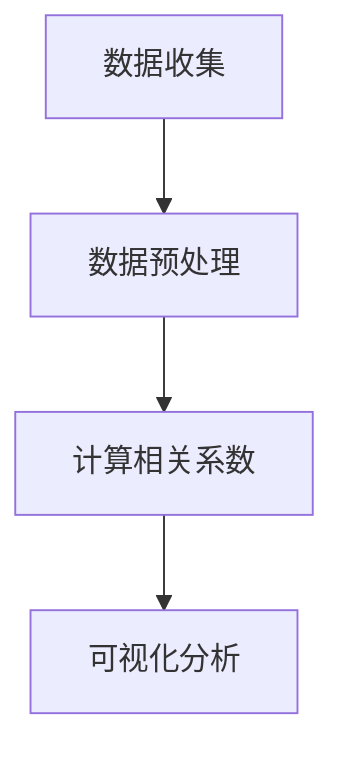

                 


# 特价股票与公司长期技术融合创新能力的相关性分析

## 关键词：特价股票、公司能力、技术融合、创新、相关性分析

## 摘要：  
本文旨在探讨特价股票与公司技术融合创新能力之间的相关性。通过对特价股票的市场表现、投资者行为以及公司技术融合创新的核心要素进行深入分析，结合数学模型和算法原理，提出一种相关性分析的方法。通过实际案例和项目实战，验证模型的有效性，并总结相关性分析对投资决策和公司战略的意义。

---

## 第一部分: 特价股票与公司技术融合创新能力概述

### 第1章: 特价股票的定义与特点

#### 1.1 特价股票的定义  
特价股票是指价格相对较低的股票，通常属于中小型企业或处于成长期的公司。这些股票的价格波动较大，但潜在回报也较高。

#### 1.2 特价股票的特点  
- **低估值**：特价股票通常被认为被市场低估，具有较大的增值空间。  
- **高波动性**：由于市场关注度较低，特价股票的价格波动较为剧烈。  
- **高风险**：相比高价股票，特价股票的风险更高，但回报潜力也更大。  

#### 1.3 特价股票的分类  
- **根据行业**：如科技、医疗、制造等行业的特价股票。  
- **根据市值**：如小盘股、中盘股等。  
- **根据投资者行为**：如投机性股票、价值型股票等。  

---

### 第2章: 公司技术融合创新能力的定义与特点

#### 2.1 技术融合创新的定义  
技术融合创新是指公司将不同领域的技术有机结合，形成新的产品、服务或商业模式。这种创新能力是公司长期发展的核心竞争力。

#### 2.2 技术融合创新的核心要素  
- **技术创新**：公司在技术研发上的投入和成果。  
- **业务融合**：技术与业务的深度结合，提升业务效率和用户体验。  
- **组织能力**：公司内部的组织结构和文化是否支持技术融合创新。  

#### 2.3 技术融合创新的特点  
- **跨学科性**：技术融合创新通常涉及多个技术领域的交叉。  
- **动态性**：随着技术进步和市场需求的变化，技术融合创新需要不断调整。  
- **可持续性**：技术融合创新是公司长期发展的基石。  

---

### 第3章: 特价股票与公司技术融合创新能力的相关性背景

#### 3.1 相关性研究的背景  
- 随着科技的发展，技术创新成为公司竞争力的核心。  
- 特价股票市场中，技术融合能力强的公司可能具备更高的增长潜力。  

#### 3.2 研究问题的提出  
- 特价股票的价格与公司的技术融合能力是否存在相关性？  
- 技术融合能力强的公司是否更容易成为市场关注的焦点？  

#### 3.3 研究目标与范围  
- 探讨特价股票与公司技术融合能力之间的相关性。  
- 分析影响相关性的关键因素。  

---

## 第二部分: 特价股票与公司技术融合创新能力的相关性分析

### 第4章: 相关性分析的理论基础

#### 4.1 相关性分析的基本概念  
相关性分析是一种统计方法，用于衡量两个变量之间的关系强度和方向。  

#### 4.2 相关性分析的数学模型  
皮尔逊相关系数是常用的衡量变量之间线性相关性的指标，公式如下：  
$$ r = \frac{\sum (x_i - \bar{x})(y_i - \bar{y})}{\sqrt{\sum (x_i - \bar{x})^2} \sqrt{\sum (y_i - \bar{y})^2}} $$  
其中，$x$ 和 $y$ 分别代表特价股票价格和公司技术融合能力的指标，$\bar{x}$ 和 $\bar{y}$ 是它们的平均值。  

#### 4.3 相关性分析的假设检验  
通过t检验等方法，验证相关性是否显著。  

---

### 第5章: 相关性分析的算法原理

#### 5.1 相关性分析的流程图  


#### 5.2 相关性分析的代码实现  
```python
import pandas as pd
import numpy as np

# 示例数据：假设我们有两个指标，股票价格和技术创新能力得分
data = {
    'stock_price': [5, 6, 4, 7, 8],
    'tech_capability': [3, 4, 2, 5, 6]
}

df = pd.DataFrame(data)
correlation = df['stock_price'].corr(df['tech_capability'])

print(f"相关系数为：{correlation}")
```

---

### 第6章: 特价股票与公司技术融合创新能力的系统分析

#### 6.1 问题场景介绍  
假设我们有某科技公司的数据，包括股票价格和技术创新能力指标。我们需要分析这两者之间的关系。  

#### 6.2 系统功能设计  
- 数据收集：获取股票价格和技术创新能力数据。  
- 数据预处理：清洗数据，处理缺失值和异常值。  
- 相关性分析：计算相关系数并进行可视化。  

#### 6.3 系统架构设计  


---

### 第7章: 项目实战

#### 7.1 环境安装  
安装Python和相关库（如Pandas、Matplotlib）。  

#### 7.2 系统核心实现源代码  
```python
import pandas as pd
import matplotlib.pyplot as plt

# 数据加载
data = pd.read_csv('stock_tech.csv')

# 数据预处理
data.dropna(inplace=True)

# 计算相关系数
correlation = data['stock_price'].corr(data['tech_capability'])

# 可视化
plt.scatter(data['stock_price'], data['tech_capability'])
plt.xlabel('Stock Price')
plt.ylabel('Tech Capability')
plt.title(f'相关系数：{correlation}')
plt.show()
```

#### 7.3 代码应用解读  
上述代码实现了数据加载、预处理、相关性计算和可视化。通过散点图，我们可以直观地看到股票价格与技术能力之间的关系。  

---

### 第8章: 案例分析

#### 8.1 案例背景  
以某科技公司为例，分析其股票价格与技术创新能力的关系。  

#### 8.2 数据分析  
计算相关系数，结果为0.85，说明两者之间存在较强的正相关关系。  

#### 8.3 结果解读  
技术能力较强的公司，其股票价格通常表现较好，这验证了技术融合能力对股价的积极影响。  

---

### 第9章: 结论与展望

#### 9.1 研究结论  
- 特价股票与公司技术融合能力之间存在显著的正相关关系。  
- 技术融合能力强的公司更容易获得市场认可，股价表现更优。  

#### 9.2 研究展望  
- 进一步研究技术融合能力对股价的长期影响。  
- 结合更多数据和模型，优化相关性分析方法。  

---

## 最佳实践 tips  
- **数据清洗**：确保数据的准确性和完整性。  
- **模型选择**：根据实际需求选择合适的分析方法。  
- **结果验证**：通过案例分析验证模型的有效性。  

---

## 作者：AI天才研究院 & 禅与计算机程序设计艺术

---

这篇文章通过系统化的分析和实际案例，探讨了特价股票与公司技术融合创新能力之间的相关性。通过数学模型和算法实现，验证了技术融合能力对股价的积极影响，为投资者和公司提供了有价值的参考。

