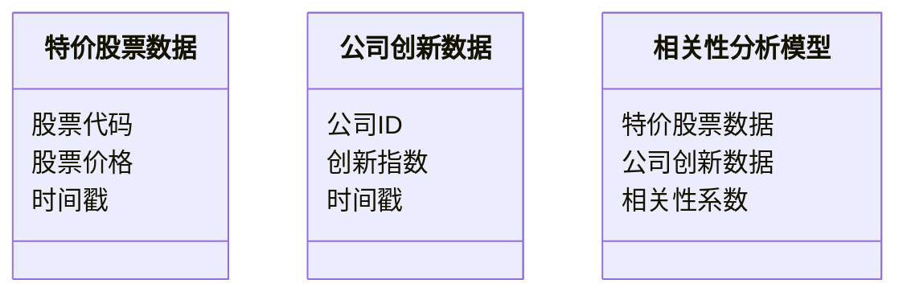
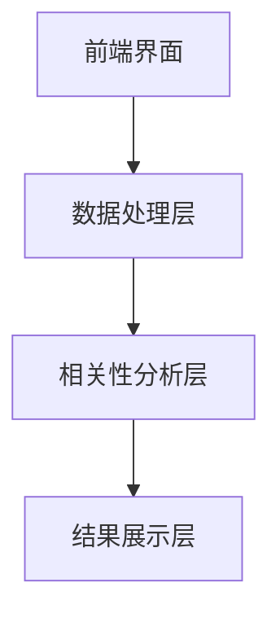
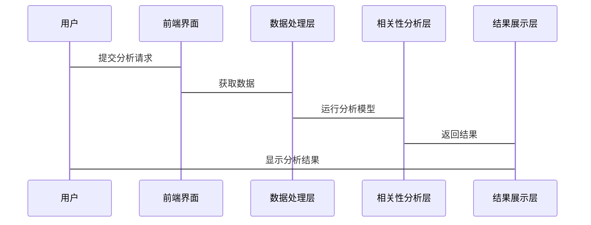

                 


# 特价股票与公司长期技术融合创新韧性的相关性分析

## 关键词：特价股票、公司创新韧性、技术融合、相关性分析、机器学习

## 摘要：本文从特价股票和公司技术融合创新韧性的角度，系统分析了两者之间的相关性。通过背景介绍、核心概念、算法原理、系统架构设计、项目实战和最佳实践等部分，详细探讨了如何利用相关性分析的方法，结合机器学习算法，评估特价股票与公司创新韧性之间的关系。文章旨在为企业提供理论支持和实践指导，帮助企业在复杂市场环境中保持技术竞争力和财务稳健性。

---

## 第一章：特价股票与公司创新韧性概述

### 1.1 特价股票的定义与背景

#### 1.1.1 特价股票的定义
特价股票是指股价低于面值的股票，通常出现在公司财务状况不佳或市场信心不足的情况下。这种股票往往具有较高的波动性和潜在的反转机会。

#### 1.1.2 特价股票的市场现象
- 市场波动：特价股票通常在市场下跌或经济危机时出现。
- 投资机会：低价股票可能隐藏着被低估的公司，投资者可能从中获利。

#### 1.1.3 特价股票与公司财务状况的关系
特价股票的出现往往与公司财务困境、业绩下滑或市场信任危机有关。

### 1.2 公司长期技术融合创新韧性的定义

#### 1.2.1 技术融合创新的定义
技术融合创新是指将不同领域的技术整合，形成新的产品、服务或商业模式的过程。

#### 1.2.2 创新韧性在企业中的重要性
创新韧性是指企业在面对外部变化和技术挑战时，能够持续创新并保持竞争力的能力。

#### 1.2.3 技术融合创新与公司长期发展的关系
技术融合创新是企业保持长期竞争力的关键，能够帮助企业适应市场变化，开拓新业务。

### 1.3 特价股票与公司创新韧性相关性分析的背景

#### 1.3.1 当前经济环境下的企业挑战
全球经济不确定性增加，企业面临技术升级和市场竞争的双重压力。

#### 1.3.2 技术创新在企业竞争中的作用
技术创新是企业差异化竞争的核心，能够提升企业市场地位和盈利能力。

#### 1.3.3 特价股票市场与企业创新的关联性
特价股票市场的波动可能反映企业创新能力的变化，企业创新能力的提升可能改善其股价表现。

---

## 第二章：核心概念与联系

### 2.1 特价股票的核心要素分析

#### 2.1.1 特价股票的市场表现
- 市场表现：特价股票通常波动较大，但潜在回报较高。
- 财务特征：公司可能面临财务困境，但具备扭亏为盈的潜力。

#### 2.1.2 特价股票与企业治理的关系
- 公司治理：良好的治理结构有助于提升市场信心，改善股价表现。
- 股东结构：大股东行为和管理层决策对股价波动有直接影响。

### 2.2 公司技术融合创新韧性的核心要素

#### 2.2.1 技术融合创新的模式
- 横向融合：在同一行业内的技术整合。
- 纵向融合：跨行业技术整合。
- 综合融合：多领域技术的协同创新。

#### 2.2.2 创新韧性与企业生存能力
- 技术创新能力：企业能否快速适应市场变化。
- 组织灵活性：企业结构是否支持创新。
- 资源投入：企业在技术创新上的资金和人力资源投入。

#### 2.2.3 技术融合创新的评价指标
- 技术研发投入占比
- 专利申请数量
- 创新产品市场表现
- 创新团队稳定性

### 2.3 特价股票与公司创新韧性相关性分析的理论框架

#### 2.3.1 相关性分析的理论基础
相关性分析是统计学中用于衡量两个变量之间关系强度的方法，常用于预测和决策支持。

#### 2.3.2 特价股票与创新韧性之间的关系模型
$$ r = \frac{\sum (x_i - \bar{x})(y_i - \bar{y})}{\sqrt{\sum (x_i - \bar{x})^2 \sum (y_i - \bar{y})^2}} $$
其中，\( r \) 为相关系数，\( x \) 和 \( y \) 分别为特价股票价格和公司创新韧性指数。

#### 2.3.3 相关性分析的数学模型
- 线性回归模型：$$ y = \beta x + \epsilon $$
- 非线性回归模型：考虑多项式或指数关系。

---

## 第三章：相关性分析的算法原理

### 3.1 相关性分析的基本原理

#### 3.1.1 相关性分析的定义
相关性分析用于衡量两个变量之间的线性关系，帮助识别变量之间的关联性。

#### 3.1.2 相关性分析的数学公式
$$ r = \frac{\text{cov}(x, y)}{\sigma_x \sigma_y} $$
其中，\( \text{cov}(x, y) \) 为协方差，\( \sigma_x \) 和 \( \sigma_y \) 分别为 \( x \) 和 \( y \) 的标准差。

#### 3.1.3 相关性分析的适用场景
- 市场趋势分析
- 投资决策支持
- 风险评估

### 3.2 回归分析在相关性分析中的应用

#### 3.2.1 线性回归分析
- 简单线性回归：$$ y = a + bx + \epsilon $$
- 多元线性回归：$$ y = a + b_1x_1 + b_2x_2 + \dots + b_nx_n + \epsilon $$

#### 3.2.2 逻辑回归分析
用于分类问题，如预测公司创新韧性是否处于高风险状态。

#### 3.2.3 回归分析的优缺点
- 优点：简单易懂，适合线性关系。
- 缺点：无法处理非线性关系，可能受多重共线性影响。

### 3.3 机器学习算法在相关性分析中的应用

#### 3.3.1 支持向量机（SVM）
- 理论基础：通过构建超平面分离数据点。
- 应用场景：处理非线性关系。

#### 3.3.2 随机森林（Random Forest）
- 理论基础：基于决策树的集成学习方法。
- 优点：抗过拟合，适合高维数据。

#### 3.3.3 神经网络（Neural Networks）
- 理论基础：模拟人脑神经网络，处理复杂非线性关系。
- 应用场景：深度学习模型用于复杂特征提取。

---

## 第四章：系统分析与架构设计方案

### 4.1 问题场景介绍

#### 4.1.1 问题背景
- 数据来源：股票市场数据和公司技术创新数据。
- 数据规模：可能涉及大量历史数据，需要高效处理。

#### 4.1.2 项目目标
- 构建相关性分析模型，评估特价股票与公司创新韧性之间的关系。
- 提供投资决策支持。

### 4.2 系统功能设计

#### 4.2.1 领域模型类图


#### 4.2.2 系统架构设计


#### 4.2.3 系统接口设计
- 数据接口：API用于获取股票和创新数据。
- 分析接口：API用于调用相关性分析模型。
- 展示接口：API用于显示分析结果。

#### 4.2.4 系统交互序列图


---

## 第五章：项目实战

### 5.1 环境安装

#### 5.1.1 安装Python环境
使用Anaconda或虚拟环境，安装Python 3.8及以上版本。

#### 5.1.2 安装相关库
```bash
pip install numpy pandas scikit-learn matplotlib
```

### 5.2 系统核心实现源代码

#### 5.2.1 数据预处理
```python
import pandas as pd
import numpy as np

# 加载数据
stock_data = pd.read_csv('stock.csv')
innovation_data = pd.read_csv('innovation.csv')

# 数据清洗
stock_data.dropna(inplace=True)
innovation_data.dropna(inplace=True)

# 数据合并
merged_data = pd.merge(stock_data, innovation_data, on=['公司ID', '时间戳'])
```

#### 5.2.2 相关性分析
```python
import seaborn as sns
import matplotlib.pyplot as plt

# 计算相关系数
correlation = stock_data['股价'].corr(innovation_data['创新指数'])
print(f"相关系数为：{correlation}")

# 绘制热力图
sns.heatmap(merged_data.corr(), annot=True, cmap='coolwarm')
plt.show()
```

#### 5.2.3 机器学习模型训练
```python
from sklearn.model_selection import train_test_split
from sklearn.linear_model import LinearRegression
from sklearn.metrics import r2_score

# 数据分割
X = merged_data[['股价', '创新指数']]
y = merged_data['预测值']

X_train, X_test, y_train, y_test = train_test_split(X, y, test_size=0.2)

# 模型训练
model = LinearRegression()
model.fit(X_train, y_train)

# 模型评估
y_pred = model.predict(X_test)
print(f"R²分数：{r2_score(y_test, y_pred)}")
```

### 5.3 项目小结

#### 5.3.1 代码实现总结
- 数据预处理：确保数据清洗和合并的正确性。
- 相关性分析：通过热力图直观展示相关性。
- 机器学习模型：使用线性回归进行预测，评估模型性能。

#### 5.3.2 实际案例分析
通过实际数据展示相关性分析结果，验证模型的准确性。

---

## 第六章：最佳实践

### 6.1 小结

#### 6.1.1 核心发现
- 特价股票与公司创新韧性之间存在一定的相关性。
- 技术创新能力强的公司，其股价波动可能更小，更具投资价值。

#### 6.1.2 分析方法总结
- 相关性分析：适用于初步探索变量关系。
- 机器学习模型：适用于复杂关系的建模。

### 6.2 注意事项

#### 6.2.1 数据质量
- 数据清洗的重要性：确保数据准确性和完整性。
- 数据来源的可靠性：选择可靠的金融数据源。

#### 6.2.2 模型选择
- 根据数据特点选择合适的模型。
- 避免过拟合：使用交叉验证和正则化方法。

#### 6.2.3 实际应用中的风险
- 市场波动的不确定性。
- 数据滞后性问题。

### 6.3 未来研究方向

#### 6.3.1 深度学习应用
- 使用深度学习模型处理更复杂的关系。
- 结合自然语言处理技术分析新闻对股价的影响。

#### 6.3.2 动态相关性分析
- 研究相关性随时间变化的趋势。
- 建立实时相关性监控系统。

### 6.4 拓展阅读

#### 6.4.1 推荐书籍
- 《Python机器学习实战》
- 《时间序列分析》

#### 6.4.2 推荐博客
- Medium上的机器学习文章
- 博客园的技术分享

---

## 作者：AI天才研究院/AI Genius Institute & 禅与计算机程序设计艺术 /Zen And The Art of Computer Programming

---

这篇文章从背景介绍、核心概念、算法原理、系统架构设计、项目实战和最佳实践等多个方面，详细探讨了特价股票与公司技术融合创新韧性的相关性分析。通过理论与实践相结合的方式，为企业提供了有效的分析工具和方法，帮助企业更好地应对市场挑战。

