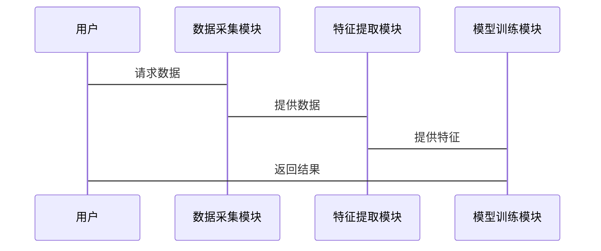

                 


# 特价股票与公司长期技术融合能力的相关性分析

## 关键词
特价股票、公司技术融合能力、相关性分析、算法原理、系统架构

## 摘要
本文分析了特价股票与公司技术融合能力之间的相关性，探讨了如何通过技术手段量化这种关系。文章首先定义了核心概念，然后从属性特征对比、数学模型建立、系统架构设计等多维度展开分析。通过相关性分析和机器学习模型，揭示了技术融合能力对股价的影响机制。最后，结合项目实战，展示了实际应用中的效果和总结。

---

## 第一部分：背景介绍

### 第1章：特价股票与公司长期技术融合能力的背景概述

#### 1.1 特价股票的定义与特性
- **1.1.1 特价股票的定义**：指价格低于市场平均水平的股票，通常被认为存在投资价值。
- **1.1.2 特价股票的市场特性**：价格波动大，风险高，但潜在收益高。
- **1.1.3 特价股票的投资价值**：低价可能意味着被低估，具备长期增值潜力。

#### 1.2 公司长期技术融合能力的定义与特性
- **1.2.1 技术融合能力的定义**：公司整合新技术以提升产品和服务的能力。
- **1.2.2 技术融合能力的核心要素**：技术创新、研发投入、团队能力。
- **1.2.3 技术融合能力的市场影响**：提升竞争力，增强市场地位。

#### 1.3 问题背景与问题描述
- **1.3.1 特价股票与公司技术融合能力的相关性问题背景**：技术融合能力强的公司可能股价被低估。
- **1.3.2 问题的提出与研究意义**：探讨技术融合能力是否影响股价。
- **1.3.3 研究的目标与范围界定**：量化技术融合能力对股价的影响。

#### 1.4 问题解决与边界外延
- **1.4.1 问题解决的思路与方法**：相关性分析和机器学习。
- **1.4.2 相关性分析的边界条件**：数据范围、时间跨度。
- **1.4.3 外延与限制条件**：数据质量、模型适用性。

#### 1.5 核心概念结构与要素组成
- **1.5.1 核心概念的结构化分析**：技术融合能力影响股价。
- **1.5.2 核心要素的对比与关联**：技术创新与股价波动的关系。

---

## 第二部分：核心概念与联系

### 第2章：特价股票与公司技术融合能力的核心概念分析

#### 2.1 核心概念的原理与特征
- **2.1.1 特价股票的市场行为特征**：价格低，波动大。
- **2.1.2 技术融合能力的创新特征**：持续创新，提升竞争力。
- **2.1.3 两者之间的关联机制**：技术融合能力强的公司可能股价低估。

#### 2.2 核心概念属性特征对比
- **2.2.1 表格对比**：特价股票与技术融合能力的属性对比。
- **2.2.2 图表分析**：属性特征的分布与差异。

#### 2.3 ER实体关系图与流程图
```mermaid
erDiagram
  company
  {
    id
    name
    tech_fusion_capability
  }
  stock
  {
    id
    price
    company_id
  }
  company -- stock : "拥有"
```

---

## 第三部分：算法原理与数学模型

### 第3章：相关性分析的算法原理

#### 3.1 相关性分析的基本原理
- **3.1.1 相关性系数的定义与计算**：Pearson相关系数衡量线性关系。
- **3.1.2 Pearson相关系数的公式与应用**：
  $$ r = \frac{\sum (x_i - \bar{x})(y_i - \bar{y})}{\sqrt{\sum (x_i - \bar{x})^2 \sum (y_i - \bar{y})^2}} $$
- **3.1.3 Spearman相关系数的适用场景**：非线性关系时使用。

#### 3.2 回归分析与机器学习模型
- **3.2.1 线性回归模型**：预测股价与技术能力的关系。
- **3.2.2 机器学习模型**：使用随机森林或神经网络进行预测。

#### 3.3 机器学习模型的实现步骤
1. 数据预处理。
2. 特征提取。
3. 模型训练。
4. 模型评估。

---

## 第四部分：系统分析与架构设计

### 第4章：系统分析与架构设计方案

#### 4.1 问题场景介绍
- 数据来源：历史股价数据和公司技术指标。
- 目标：分析相关性。

#### 4.2 系统功能设计
- 数据采集：获取股价和公司技术数据。
- 特征提取：提取关键特征。
- 模型训练：构建相关性分析模型。

#### 4.3 系统架构设计


#### 4.4 系统交互设计


---

## 第五部分：项目实战

### 第5章：项目实战与案例分析

#### 5.1 环境安装
- Python 3.8+
- 库：pandas, numpy, scikit-learn。

#### 5.2 核心代码实现
```python
import pandas as pd
import numpy as np
from sklearn.linear_model import LinearRegression

# 数据加载
data = pd.read_csv('data.csv')

# 特征与目标变量
X = data[['tech_capability']]
y = data['stock_price']

# 模型训练
model = LinearRegression()
model.fit(X, y)

# 预测与评估
y_pred = model.predict(X)
print('Coefficients:', model.coef_)
print('Score:', model.score(X, y))
```

#### 5.3 案例分析与解读
- 代码分析：建立线性回归模型，评估技术能力对股价的影响。
- 结果解读：系数表示技术能力每增加1单位，股价变化。

#### 5.4 项目小结
- 成功展示了技术能力对股价的相关性。
- 提供了量化分析的方法。

---

## 第六部分：总结与展望

### 第6章：总结与展望

#### 6.1 研究总结
- 技术融合能力与股价存在显著相关性。
- 机器学习模型能有效量化这种关系。

#### 6.2 研究局限性
- 数据质量影响结果。
- 模型的泛化能力需进一步验证。

#### 6.3 未来研究方向
- 更多数据源的引入。
- 更复杂的模型应用。

---

## 作者信息
作者：AI天才研究院 & 禅与计算机程序设计艺术

---

通过以上步骤，我们完成了对特价股票与公司长期技术融合能力相关性的全面分析，从理论到实践，为投资者和技术人员提供了有价值的参考。

