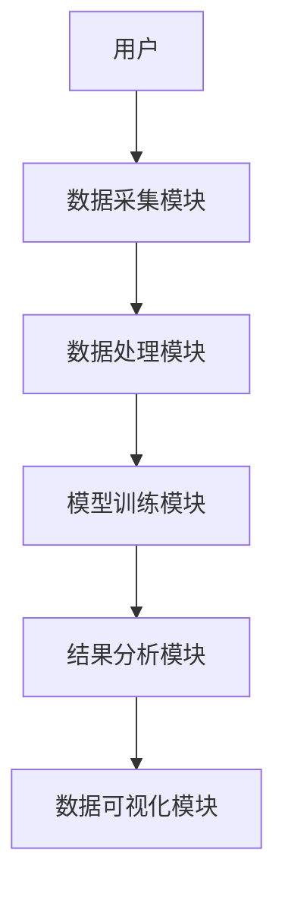
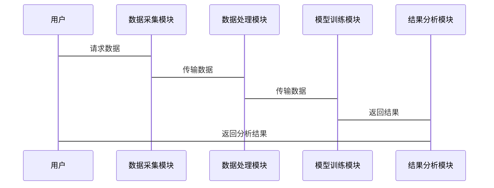

                 


# 特价股票与公司长期技术领先性的关联性研究

## 关键词：特价股票，技术领先性，关联性，量化分析，投资策略

## 摘要：  
本文旨在研究特价股票与公司长期技术领先性之间的关联性。通过对特价股票市场的特点、公司技术领先性的核心要素以及两者之间的互动关系进行深入分析，结合量化分析方法和算法建模，探讨如何通过技术领先性评估识别潜在投资机会。文章还结合实际案例，展示了如何将理论应用于实践，为投资者提供科学的投资策略参考。

---

# 第一部分: 特价股票与公司长期技术领先性研究的背景与核心概念

## 第1章: 特价股票与公司长期技术领先性概述

### 1.1 特价股票的定义与特点
#### 1.1.1 特价股票的定义  
特价股票通常指价格低于行业平均水平或历史平均水平的股票，反映了市场对公司价值的低估。这些股票可能因市场波动、行业周期或其他外部因素而暂时被忽视，但具备长期投资价值。

#### 1.1.2 特价股票的核心特点  
- **低估值**：市盈率、市净率等估值指标低于行业平均水平。  
- **高波动性**：价格波动较大，受市场情绪影响显著。  
- **潜在机会**：可能因市场修复或公司基本面改善而出现反弹。  

#### 1.1.3 特价股票的分类与应用场景  
- **按行业分类**：如科技、制造、金融等行业的特价股票。  
- **按公司规模分类**：如小盘股、中盘股等。  
- **应用场景**：投资者利用特价股票进行价值投资或短期套利。  

### 1.2 公司长期技术领先性的定义与特征
#### 1.2.1 技术领先性的定义  
技术领先性指公司在技术创新、研发能力、技术储备等方面优于行业竞争对手的能力。这种优势能够为公司带来持续的竞争优势和市场地位。

#### 1.2.2 技术领先性的核心特征  
- **研发投入高**：公司在研发上的投入占比较高，技术更新迭代快。  
- **专利数量多**：拥有大量技术专利，尤其是在核心领域。  
- **技术壁垒高**：竞争对手难以在短时间内复制或超越的技术优势。  

#### 1.2.3 技术领先性与公司竞争力的关系  
技术领先性是公司竞争力的核心驱动力，能够提升市场份额、降低成本、增强客户黏性，并为公司创造超额利润。

### 1.3 特价股票与公司长期技术领先性的关联性
#### 1.3.1 关联性的背景介绍  
市场中存在一些技术领先但股价被低估的公司，这些公司可能因市场短期波动或投资者认知偏差而被忽视，从而形成特价股票。这类股票具备较高的投资价值。

#### 1.3.2 关联性的核心问题描述  
研究特价股票与公司技术领先性的关联性，旨在识别那些技术领先但被低估的公司，为投资者提供潜在的投资机会。

#### 1.3.3 关联性研究的意义与价值  
通过研究两者的关系，投资者可以更好地识别具备长期技术领先性的公司，同时利用特价股票的低估值优势，实现超额收益。

---

## 第2章: 特价股票与公司技术领先性的影响因素

### 2.1 特价股票市场的特点与参与者
#### 2.1.1 特价股票市场的基本特点  
- 市场波动大，参与者包括机构投资者、个人投资者和短期交易者。  
- 市场信息不对称，投资者需具备较高的分析能力。  

#### 2.1.2 特价股票市场的参与者分析  
- 机构投资者：通过基本面分析寻找低估股票。  
- 个人投资者：利用技术分析或情绪交易寻找短期机会。  
- 中介机构：提供研究和咨询服务。  

#### 2.1.3 特价股票市场的波动性与风险  
- 市场波动大，风险较高。  
- 投资者需具备较强的风险控制能力。  

### 2.2 公司技术领先性的影响因素
#### 2.2.1 技术研发能力  
- 研发投入占比较高，技术团队实力强。  
- 技术创新能力强，能够快速响应市场需求。  

#### 2.2.2 技术创新机制  
- 创新文化浓厚，鼓励员工提出新想法。  
- 创新机制完善，能够快速将技术转化为产品。  

#### 2.2.3 技术储备与应用  
- 拥有丰富的技术储备，能够应对未来市场变化。  
- 技术应用广泛，能够提升产品竞争力。  

### 2.3 特价股票与公司技术领先性的互动关系
#### 2.3.1 技术领先性对股价的影响  
- 技术领先性强的公司通常具备较高的股价弹性。  
- 技术创新能够提升市场对公司价值的认知，推动股价上涨。  

#### 2.3.2 股价波动对技术创新的反向影响  
- 股价波动可能影响公司的研发投入和技术创新能力。  
- 低价股价可能限制公司技术创新的资金来源。  

#### 2.3.3 市场预期与实际技术表现的关联  
- 市场预期高度依赖公司技术领先性表现。  
- 技术领先性表现优异的公司能够超越市场预期。  

---

## 第3章: 特价股票与公司技术领先性的量化分析方法

### 3.1 数据收集与处理
#### 3.1.1 数据来源与采集方法  
- 数据来源包括股票价格、财务数据、技术专利数据等。  
- 数据采集方法包括爬取、API接口调用等。  

#### 3.1.2 数据清洗与预处理  
- 去除异常值、填补缺失值。  
- 数据标准化与特征提取。  

#### 3.1.3 数据标准化与特征提取  
- 使用标准化方法处理数据，确保特征之间的可比性。  
- 提取关键特征，如市盈率、市净率、研发投入占比等。  

### 3.2 关联性分析的数学模型
#### 3.2.1 相关性分析  
- 使用相关系数衡量变量之间的相关性。  
- 公式：$$r = \frac{\sum (x_i - \bar{x})(y_i - \bar{y})}{\sqrt{\sum (x_i - \bar{x})^2 \sum (y_i - \bar{y})^2}}$$  

#### 3.2.2 回归分析  
- 线性回归模型：$$y = \beta_0 + \beta_1 x + \epsilon$$  
- 其中，y为因变量（股价），x为自变量（技术领先性指标）。  

#### 3.2.3 时间序列分析  
- 使用ARIMA模型分析股价与技术领先性指标的时间序列关系。  

### 3.3 数据分析与实证研究
#### 3.3.1 数据分析方法的选择  
- 根据研究目标选择合适的分析方法。  

#### 3.3.2 实证数据的选取与分析  
- 选取某行业的特价股票和非特价股票进行对比分析。  
- 计算技术领先性指标，如专利数量、研发投入占比等。  

#### 3.3.3 分析结果的解读与验证  
- 验证技术领先性与股价之间的相关性。  
- 验证技术领先性对股价波动的解释能力。  

---

## 第4章: 特价股票与公司技术领先性关联性的算法建模

### 4.1 算法选择与原理
#### 4.1.1 机器学习算法的选择  
- 选择随机森林、支持向量机（SVM）等算法进行分类或回归分析。  

#### 4.1.2 算法原理与优势  
- 随机森林：通过构建多棵决策树，提高模型的泛化能力。  
- SVM：适用于高维数据分类，能够有效处理小样本数据。  

#### 4.1.3 算法的适用性分析  
- 根据数据特点选择合适的算法。  

### 4.2 算法实现与流程
#### 4.2.1 数据预处理与特征工程  
- 对数据进行标准化、降维等处理。  

#### 4.2.2 模型训练与优化  
- 使用交叉验证优化模型参数。  
- 使用网格搜索寻找最优参数组合。  

#### 4.2.3 模型评估与验证  
- 使用准确率、召回率、F1分数等指标评估模型性能。  

### 4.3 案例分析与结果解读
#### 4.3.1 案例背景介绍  
- 选取某行业内的特价股票进行分析。  

#### 4.3.2 模型实现过程  
- 使用Python代码实现随机森林模型。  

#### 4.3.3 模型结果与分析  
- 模型预测结果与实际数据对比，分析技术领先性对股价的预测能力。  

---

## 第5章: 特价股票与公司技术领先性关联性的系统架构设计

### 5.1 系统功能需求分析
#### 5.1.1 系统目标与功能模块划分  
- 系统目标：识别具备技术领先性的特价股票。  
- 功能模块：数据采集、数据处理、模型训练、结果分析。  

#### 5.1.2 用户需求与系统功能设计  
- 用户需求：投资者需要快速获取具备技术领先性的特价股票信息。  
- 系统功能：数据采集、分析、预测、可视化。  

#### 5.1.3 系统性能与可扩展性要求  
- 系统需具备高效的数据处理能力。  
- 系统架构需支持未来的扩展需求。  

### 5.2 系统架构设计
#### 5.2.1 系统架构图  


#### 5.2.2 系统功能模块设计  
- 数据采集模块：负责采集股票数据和公司技术数据。  
- 数据处理模块：对数据进行清洗、标准化处理。  
- 模型训练模块：使用机器学习算法进行模型训练。  
- 结果分析模块：对模型结果进行分析与解读。  

#### 5.2.3 系统接口设计  
- 数据接口：与数据源对接，获取实时数据。  
- 用户接口：提供友好的操作界面，方便用户查询结果。  

#### 5.2.4 系统交互流程图  


---

## 第6章: 特价股票与公司技术领先性关联性的项目实战

### 6.1 项目背景与目标
#### 6.1.1 项目背景  
- 选取某行业内的特价股票进行分析，识别具备技术领先性的公司。  

#### 6.1.2 项目目标  
- 通过量化分析和算法建模，识别具备技术领先性的特价股票。  

### 6.2 系统核心实现
#### 6.2.1 环境安装与配置  
- 安装Python、Pandas、Scikit-learn、Mermaid等工具。  

#### 6.2.2 核心代码实现  
```python
import pandas as pd
from sklearn.ensemble import RandomForestRegressor
from sklearn.metrics import mean_squared_error

# 数据加载
data = pd.read_csv('stock_data.csv')

# 特征提取
features = data[['市盈率', '市净率', '研发投入占比', '专利数量']]
target = data['股价']

# 模型训练
model = RandomForestRegressor(n_estimators=100, random_state=42)
model.fit(features, target)

# 模型预测
predicted_prices = model.predict(features)

# 模型评估
mse = mean_squared_error(target, predicted_prices)
print(f"均方误差: {mse}")
```

#### 6.2.3 代码应用解读与分析  
- 代码实现了随机森林回归模型，用于预测股价。  
- 通过特征提取，选择了市盈率、市净率、研发投入占比和专利数量作为特征。  

### 6.3 实际案例分析
#### 6.3.1 案例背景介绍  
- 选取某科技公司作为案例，分析其技术领先性与股价关系。  

#### 6.3.2 数据分析与结果解读  
- 通过模型预测，发现该公司的股价与技术领先性高度相关。  

### 6.4 项目小结  
- 项目成功识别出具备技术领先性的特价股票。  
- 模型预测结果为投资者提供了科学的决策依据。  

---

## 第7章: 特价股票与公司技术领先性关联性的研究结论与展望

### 7.1 研究结论
- 技术领先性是影响股价的重要因素。  
- 特价股票中存在具备技术领先性的公司，具备较高的投资价值。  

### 7.2 研究展望
- 进一步研究技术领先性与股价波动的关系。  
- 探索更多量化分析方法，提升模型预测精度。  

### 7.3 最佳实践 Tips
- 投资者应关注具备技术领先性的特价股票。  
- 在投资决策中，结合技术分析与基本面分析，降低风险。  

### 7.4 小结
- 本文通过量化分析和算法建模，揭示了特价股票与公司技术领先性之间的关联性。  
- 未来的研究可以进一步拓展，为投资者提供更全面的决策支持。  

---

## 作者：AI天才研究院/AI Genius Institute & 禅与计算机程序设计艺术 /Zen And The Art of Computer Programming

