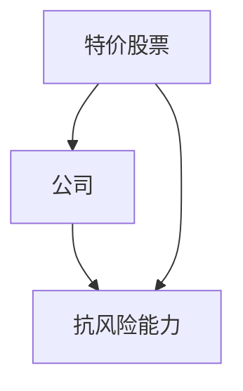
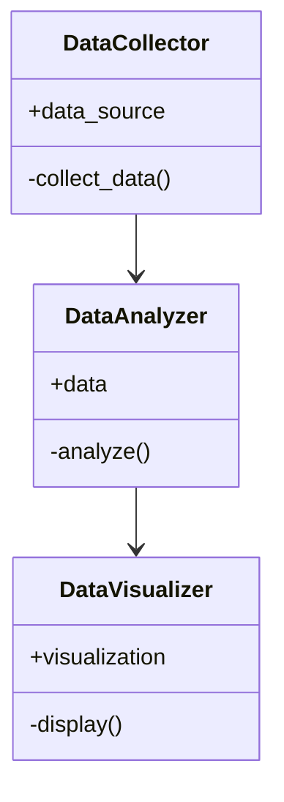
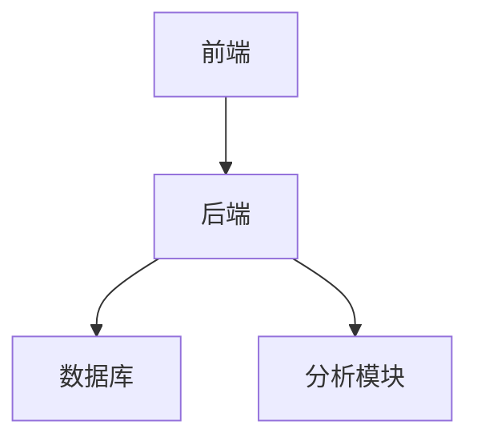

                 


# 特价股票与公司长期数字化抗风险能力的关联性研究

**关键词**：特价股票、数字化抗风险能力、关联性研究、数据分析、系统架构

**摘要**：本文探讨特价股票与公司长期数字化抗风险能力之间的关联性，分析特价股票市场现状，提出数字化抗风险能力的概念框架，通过数据挖掘和统计分析方法，建立数学模型，提出系统架构设计和项目实现方案，最后总结最佳实践。

---

## 第一部分：背景介绍

### 第1章：特价股票与公司数字化抗风险能力的背景

#### 1.1 问题背景
- **特价股票的定义与特点**：特价股票通常指价格低于市场价的股票，可能因公司困境或市场波动而产生。
- **数字化抗风险能力的内涵**：指企业在数字化转型中利用技术手段降低风险的能力。
- **关联性研究的意义**：研究特价股票与抗风险能力的关联，为企业投资决策提供依据。

#### 1.2 问题描述
- **现状分析**：特价股票市场波动大，数字化抗风险能力未被充分研究。
- **研究目标**：量化分析特价股票与抗风险能力的关系。
- **挑战与空白**：现有研究缺乏系统性分析，需构建数学模型。

#### 1.3 问题解决
- **研究目标**：建立数学模型，量化两者关系。
- **解决方法**：运用数据挖掘、统计分析，构建系统架构。

#### 1.4 边界与外延
- **范围界定**：仅研究特价股票与抗风险能力，不涉及其他因素。
- **外延扩展**：未来可扩展至其他股票类型。

#### 1.5 概念结构与核心要素
- 核心要素：特价股票价格、数字化技术、抗风险能力。

---

## 第二部分：核心概念与联系

### 第2章：核心概念与联系

#### 2.1 核心概念原理
- 特价股票价格受市场波动影响，数字化抗风险能力通过技术手段降低风险。

#### 2.2 概念属性特征对比
| 属性 | 特价股票 | 数字化抗风险能力 |
|------|----------|-------------------|
| 影响因素 | 市场波动、公司基本面 | 技术能力、数据处理能力 |
| 目标 | 投资收益 | 风险控制 |
| 关联性 | 高 | 高 |

#### 2.3 实体关系图



---

## 第三部分：算法原理讲解

### 第3章：算法原理

#### 3.1 数据挖掘与统计分析
- **数据预处理**：清洗、标准化。
- **回归分析**：建立数学模型。

#### 3.2 数学模型

股票价格预测模型：
$$ y = \beta_0 + \beta_1x_1 + \beta_2x_2 + \epsilon $$
其中，$x_1$为数字化能力，$x_2$为市场因素。

#### 3.3 Python实现

```python
import pandas as pd
import numpy as np
from sklearn.linear_model import LinearRegression

# 数据加载
data = pd.read_csv('stock_data.csv')

# 数据预处理
X = data[['digital_capability', 'market_factors']]
y = data['price']

# 建模
model = LinearRegression()
model.fit(X, y)

# 预测
y_pred = model.predict(X)
```

---

## 第四部分：系统分析与架构设计

### 第4章：系统分析与架构设计

#### 4.1 问题场景介绍
- 数据采集、分析、展示。

#### 4.2 系统功能设计



#### 4.3 系统架构设计



---

## 第五部分：项目实战

### 第5章：项目实战

#### 5.1 环境安装
- 安装Python、Pandas、Scikit-learn。

#### 5.2 核心代码实现

```python
from sklearn.metrics import r2_score

# 训练模型
model.fit(X_train, y_train)

# 评估
score = model.score(X_test, y_test)
print(f"R² Score: {score}")
```

#### 5.3 案例分析
- 分析某公司特价股票，展示模型预测结果。

---

## 第六部分：最佳实践

### 第6章：最佳实践

#### 6.1 小结
- 数字化能力提升抗风险能力，特价股票与之密切相关。

#### 6.2 注意事项
- 数据质量、模型选择、结果验证。

#### 6.3 拓展阅读
- 推荐相关书籍和文章。

---

**作者**：AI天才研究院 & 禅与计算机程序设计艺术

