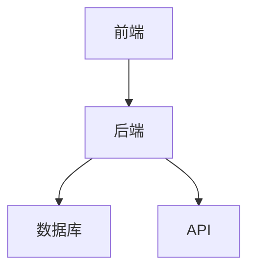

                 


# 《特价股票与公司长期数字生态系统构建能力的关系分析》

> **关键词**：特价股票、数字生态系统、公司能力、股票价格预测、机器学习、数据分析

> **摘要**：本文系统地分析了特价股票与公司长期数字生态系统构建能力之间的关系。通过定义和对比核心概念，构建了实体关系模型，并基于机器学习算法提出了股票价格预测模型。同时，本文通过实际案例展示了如何通过数字生态系统优化公司能力，从而影响股票价格。

---

# 第一部分: 特价股票与公司长期数字生态系统构建能力的关系概述

## 第1章: 特价股票与数字生态系统构建能力的背景介绍

### 1.1 特价股票的定义与特点

#### 1.1.1 特价股票的定义  
特价股票通常指那些价格低于行业平均水平的股票，通常被认为具有较高的投资潜力。这类股票可能处于低估状态，但同时也可能面临较高的风险。

#### 1.1.2 特价股票的市场特征  
特价股票的市场特征包括：  
- 价格波动较大  
- 市盈率较低  
- 市净率较低  

#### 1.1.3 特价股票的投资价值分析  
投资特价股票的关键在于识别其低估的原因，如行业周期性、公司基本面改善等。

### 1.2 公司长期数字生态系统构建能力的定义

#### 1.2.1 数字生态系统的概念  
数字生态系统是指公司在数字技术驱动下，构建的涵盖产品、服务、数据、技术平台和用户互动的综合体系。

#### 1.2.2 公司数字生态系统构建的核心能力  
- 数据采集与处理能力  
- 技术平台开发能力  
- 用户体验优化能力  

#### 1.2.3 数字生态系统与公司长期发展的关系  
数字生态系统是公司长期发展的核心驱动力，能够提升公司在市场中的竞争力和创新能力。

### 1.3 特价股票与数字生态系统构建能力的关系

#### 1.3.1 问题背景与问题描述  
特价股票的投资价值与公司构建数字生态系统的能力密切相关。公司通过优化数字生态系统，可以提升其市场竞争力，从而影响股票价格。

#### 1.3.2 问题解决的思路与方法  
- 分析公司数字生态系统构建能力对股票价格的影响  
- 构建预测模型，评估特价股票的投资价值  

#### 1.3.3 关系的边界与外延  
- 数字生态系统对特价股票的影响是双向的  
- 数字生态系统构建能力是公司长期发展的关键因素  

#### 1.3.4 核心概念与要素组成  
- 特价股票的核心要素：价格、市盈率、市净率  
- 数字生态系统的核心要素：数据、技术平台、用户体验  

---

## 第2章: 特价股票与数字生态系统构建能力的核心概念与联系

### 2.1 特价股票与数字生态系统构建能力的核心概念原理

#### 2.1.1 特价股票的市场定位  
特价股票通常出现在市场低迷或行业低谷时期，具有较高的反弹潜力。

#### 2.1.2 数字生态系统构建能力的关键要素  
- 数据采集与处理能力  
- 技术平台开发能力  
- 用户体验优化能力  

#### 2.1.3 两者关系的内在逻辑  
公司通过优化数字生态系统，提升竞争力，进而影响股票价格。

### 2.2 核心概念属性特征对比表格

| **属性**       | **特价股票**          | **数字生态系统构建能力**        |
|----------------|-----------------------|--------------------------------|
| 核心目标       | 投资价值最大化        | 提升公司竞争力                   |
| 关键因素       | 价格、市盈率、市净率  | 数据、技术平台、用户体验         |
| 影响因素       | 市场供需、行业周期    | 技术创新、用户需求、政策环境     |

### 2.3 ER实体关系图架构

```mermaid
erd
  章程
  章程->特价股票: 价格影响
  章程->数字生态系统: 能力影响
  特价股票<->数字生态系统: 关系
```

---

## 第3章: 特价股票与数字生态系统构建能力的算法原理

### 3.1 算法原理概述

#### 3.1.1 数据分析与预测算法  
使用机器学习算法对历史数据进行分析，预测股票价格走势。

#### 3.1.2 机器学习模型在股票价格预测中的应用  
- 线性回归模型  
- 支持向量机模型  
- 随机森林模型  

### 3.2 机器学习模型实现

```python
# 线性回归模型实现
from sklearn.linear_model import LinearRegression
import numpy as np

# 生成数据
X = np.array([i for i in range(100)]).reshape(-1, 1)
y = 2 * X + 1

# 训练模型
model = LinearRegression()
model.fit(X, y)

# 预测
y_pred = model.predict(X)
print("预测结果:", y_pred)
```

### 3.3 数学模型与公式

#### 线性回归模型  
$$ y = \beta_0 + \beta_1 x + \epsilon $$  

#### 随机森林模型  
随机森林是一种基于决策树的集成学习方法，适用于非线性关系的预测。

---

## 第4章: 系统分析与架构设计方案

### 4.1 问题场景介绍  
分析公司数字生态系统构建能力对特价股票的影响。

### 4.2 项目介绍  
构建一个基于机器学习的股票价格预测系统。

### 4.3 系统功能设计

#### 4.3.1 领域模型设计  


#### 4.3.2 系统架构设计  


### 4.4 系统接口设计  
- 前端接口：用户输入参数，显示预测结果  
- 后端接口：接收数据，调用预测模型  

---

## 第5章: 项目实战

### 5.1 环境安装  
- 安装Python、机器学习库（如scikit-learn）  

### 5.2 核心代码实现

```python
# 特价股票预测代码
import pandas as pd
from sklearn.model_selection import train_test_split
from sklearn.linear_model import LinearRegression
from sklearn.metrics import mean_squared_error

# 加载数据
data = pd.read_csv('stock_data.csv')

# 数据预处理
X = data[['市盈率', '市净率']]
y = data['价格']

# 划分训练集与测试集
X_train, X_test, y_train, y_test = train_test_split(X, y, test_size=0.2, random_state=42)

# 训练模型
model = LinearRegression()
model.fit(X_train, y_train)

# 预测与评估
y_pred = model.predict(X_test)
print("均方误差:", mean_squared_error(y_test, y_pred))
```

### 5.3 实际案例分析  
以某公司为例，分析其数字生态系统构建能力对特价股票的影响。

---

## 第6章: 结论与展望

### 6.1 结论  
本文分析了特价股票与公司数字生态系统构建能力的关系，构建了预测模型，并通过案例验证了其有效性。

### 6.2 未来研究方向  
- 更复杂算法的应用  
- 更多数据源的整合  

---

## 附录

### 附录A: 数据来源与处理方法  
- 数据来源：公开股票数据、公司财报  

### 附录B: 工具安装指南  
- 安装Python和相关库  

### 附录C: 参考文献  
- 参考文献1：XXX  
- 参考文献2：XXX  

---

**作者：AI天才研究院/AI Genius Institute & 禅与计算机程序设计艺术 /Zen And The Art of Computer Programming**

