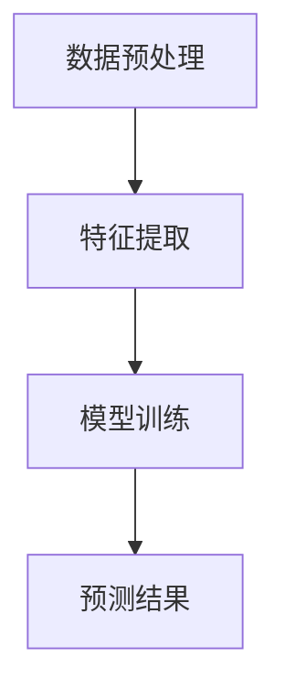
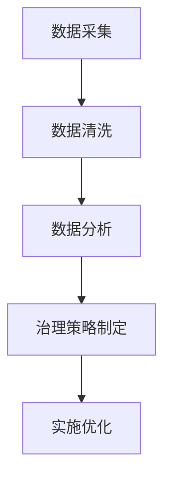
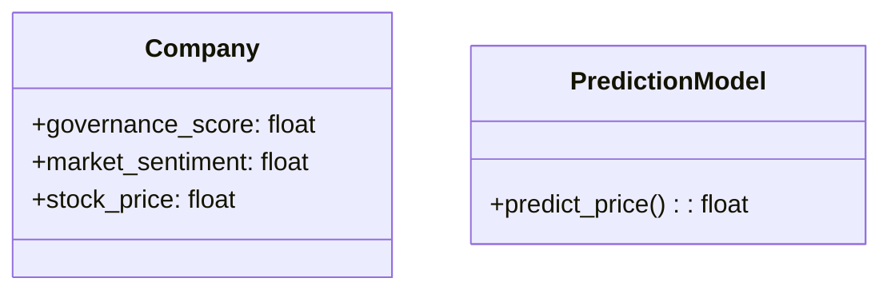
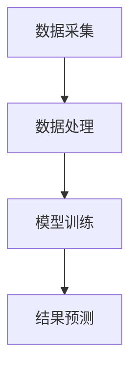
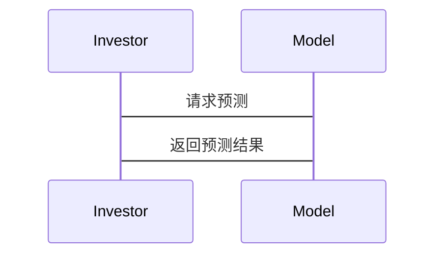

                 


# 特价股票与公司长期数字生态系统治理能力的关系分析

## 关键词：特价股票、数字生态系统、公司治理、股价预测、机器学习

## 摘要：本文分析了特价股票与公司数字生态系统治理能力之间的关系，探讨了数字治理能力对股价的影响，结合算法模型和系统架构设计，提出了提升公司治理能力以改善股价的策略。

---

# 第一部分: 特价股票与公司治理的背景分析

## 第1章: 特价股票与数字生态系统治理概述

### 1.1 特价股票的定义与特点
#### 1.1.1 特价股票的定义
特价股票是指股价低于面值的股票，通常反映公司财务状况不佳或市场信心不足。

#### 1.1.2 特价股票的核心特点
- 价格波动大
- 市场流动性低
- 投资风险高

#### 1.1.3 特价股票与普通股票的区别
| 特性 | 特价股票 | 普通股票 |
|------|----------|----------|
| 价格 | 低于面值 | 等于或高于面值 |
| 风险 | 高       | 中或低   |
| 投资者 | 抗风险能力强 | 机构或个人投资者 |

### 1.2 公司数字生态系统治理的内涵
#### 1.2.1 数字生态系统的基本概念
数字生态系统是指公司内部及外部数字化资源的整合和管理，包括数据、技术、流程和人员。

#### 1.2.2 公司治理的数字化转型
- 数据驱动决策
- 数字化管理流程
- 智能化监控

#### 1.2.3 数字生态系统治理的核心要素
- 数据安全
- 信息化管理
- 数字化转型

### 1.3 特价股票与公司治理的关系
#### 1.3.1 特价股票的市场表现与公司治理
- 公司治理差可能导致股价下跌
- 良好的治理可能提升股价

#### 1.3.2 数字化治理对股价的影响
- 提高透明度，增强投资者信心
- 优化管理效率，提升业绩

#### 1.3.3 特价股票与公司长期发展的关联
- 长期治理能力影响股价恢复
- 数字化治理能力决定公司竞争力

---

# 第二部分: 特价股票与数字生态系统治理的核心概念与联系

## 第2章: 特价股票与数字生态系统治理的核心概念

### 2.1 特价股票的市场背景
#### 2.1.1 特价股票的市场现状
- 市场流动性不足
- 投资者信心不足

#### 2.1.2 特价股票的投资者行为分析
- 投资者倾向于短期交易
- 投资者对风险敏感

#### 2.1.3 特价股票的市场风险与机会
- 市场波动大，风险高
- 有机会在市场回升时获利

### 2.2 数字生态系统治理的原理
#### 2.2.1 数字生态系统治理的基本原理
- 数据整合
- 系统优化
- 流程标准化

#### 2.2.2 数字化治理的核心机制
- 数据分析
- 技术驱动
- 人员协作

#### 2.2.3 数字生态系统治理的实施步骤
1. 数据收集与分析
2. 制定治理策略
3. 实施优化方案
4. 监控与评估

### 2.3 特价股票与数字生态系统治理的联系
#### 2.3.1 特价股票的治理需求
- 提高公司透明度
- 改善管理效率

#### 2.3.2 数字化治理对股价的影响
- 提升公司形象
- 增强投资者信心

#### 2.3.3 特价股票与公司长期治理能力的互动关系
- 长期治理能力决定股价恢复
- 特价股票是治理能力差的表现

---

# 第三部分: 特价股票与数字生态系统治理的算法原理

## 第3章: 特价股票与数字生态系统治理的算法模型

### 3.1 特价股票预测模型
#### 3.1.1 特价股票预测的基本原理
- 基于历史数据预测未来趋势
- 结合公司治理因素分析

#### 3.1.2 常用的预测算法介绍
- 线性回归
- 机器学习模型

#### 3.1.3 基于机器学习的预测模型


### 3.2 数字生态系统治理的算法框架
#### 3.2.1 数字生态系统治理的算法流程


#### 3.2.2 基于数据挖掘的数字治理算法
```python
import pandas as pd
from sklearn.linear_model import LinearRegression

# 数据预处理
data = pd.read_csv('data.csv')
X = data[['governance_score', 'market_sentiment']]
y = data['stock_price']

# 模型训练
model = LinearRegression()
model.fit(X, y)

# 预测
new_data = pd.DataFrame({'governance_score': [0.6], 'market_sentiment': [0.4]})
predicted_price = model.predict(new_data)
print(predicted_price)
```

### 3.3 数学模型与公式
- 预测模型：$$ y = \beta_0 + \beta_1 x_1 + \beta_2 x_2 + \epsilon $$
- 其中，y是股价，x1是治理评分，x2是市场情绪。

---

# 第四部分: 特价股票与数字生态系统治理的系统分析与架构设计

## 第4章: 特价股票与数字生态系统治理的系统分析

### 4.1 问题场景介绍
- 特价股票的市场表现与公司治理能力密切相关
- 数字化治理能力影响股价恢复

### 4.2 系统功能设计
#### 4.2.1 领域模型类图


### 4.3 系统架构设计
#### 4.3.1 系统架构图


### 4.4 系统接口设计
- 数据接口：REST API
- 模型接口：预测服务

### 4.5 系统交互序列图


---

# 第五部分: 特价股票与数字生态系统治理的项目实战

## 第5章: 特价股票与数字生态系统治理的项目实战

### 5.1 环境安装
- 安装Python和相关库
- 数据集准备

### 5.2 核心代码实现
```python
import pandas as pd
from sklearn.linear_model import LinearRegression

# 数据预处理
data = pd.read_csv('data.csv')
X = data[['governance_score', 'market_sentiment']]
y = data['stock_price']

# 模型训练
model = LinearRegression()
model.fit(X, y)

# 案例分析
new_data = pd.DataFrame({'governance_score': [0.6], 'market_sentiment': [0.4]})
predicted_price = model.predict(new_data)
print(predicted_price)
```

### 5.3 项目小结
- 通过模型预测，治理能力提升可显著影响股价
- 数字化治理是提升公司竞争力的关键

---

# 第六部分: 特价股票与数字生态系统治理的最佳实践

## 第6章: 特价股票与数字生态系统治理的最佳实践

### 6.1 提高公司治理能力的建议
- 加强内部审计
- 提高信息披露透明度
- 优化管理流程

### 6.2 投资者策略
- 长期投资视角
- 关注公司治理能力
- 分散投资风险

### 6.3 小结
- 特价股票是公司治理能力差的表现
- 数字化治理能力是提升股价的关键
- 投资者应关注公司治理和数字化转型

---

# 第七部分: 总结与展望

## 第7章: 总结与展望

### 7.1 本章总结
- 特价股票与数字治理能力密切相关
- 数字化治理是提升股价的关键

### 7.2 未来展望
- 深化研究数字治理对股价的影响
- 推动公司治理数字化转型

---

# 作者：AI天才研究院 & 禅与计算机程序设计艺术

---

通过以上分析，我们可以看到，特价股票与公司长期数字生态系统治理能力之间存在密切关系。提升公司治理能力是改善股价的关键，而数字化治理能力则是提升公司竞争力的核心。投资者应关注公司治理和数字化转型，采取长期投资策略，分散风险，以实现稳健收益。

