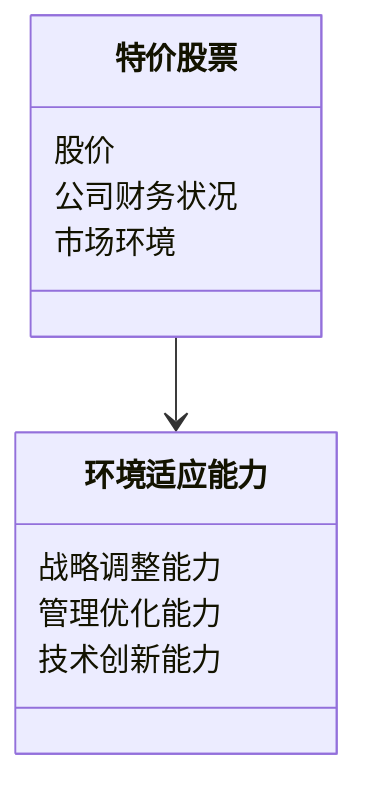
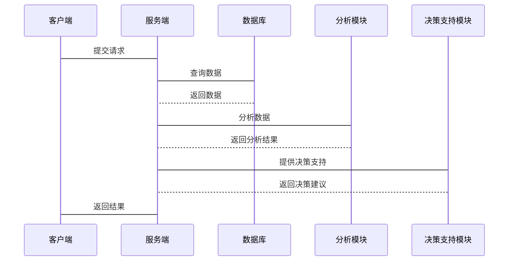

                 


# 特价股票与公司长期环境适应能力的关系分析

## 关键词：特价股票，公司环境适应能力，股价影响，企业战略，风险管理

## 摘要：特价股票反映了公司面临的财务和市场压力，而公司环境适应能力是其长期发展的关键。本文分析了特价股票的成因及其对公司的具体影响，探讨了环境适应能力的构成要素，并通过系统分析和实际案例，揭示了两者之间的关系。通过建立数学模型和算法，本文提出了提升公司环境适应能力的战略和方法，以应对市场变化和挑战，确保公司的长期稳定发展。

---

# 第一部分：特价股票与公司长期环境适应能力的背景介绍

## 第1章：特价股票与公司长期环境适应能力的概述

### 1.1 特价股票的定义与特征

#### 1.1.1 特价股票的定义
特价股票是指公司发行的股票价格低于其面值的股票，通常表明公司面临财务困境或市场信任度下降。

#### 1.1.2 特价股票的分类
- 按行业分类：不同行业内的特价股票表现不同，如科技行业可能因技术落后导致股价下跌。
- 按公司规模分类：小公司更容易出现特价股票，因为市场对其未来发展的不确定性强。
- 按市场表现分类：根据股价波动情况，分为短期特价股票和长期特价股票。

#### 1.1.3 特价股票的市场影响
特价股票的出现可能导致市场整体信心下降，影响投资者情绪，进而影响整体市场表现。

### 1.2 公司长期环境适应能力的内涵

#### 1.2.1 环境适应能力的定义
公司环境适应能力是指企业在面对外部环境变化时，能够调整战略、优化管理、创新技术以维持或提升竞争力的能力。

#### 1.2.2 公司长期发展的核心要素
- 战略调整能力：根据市场变化调整业务方向。
- 管理优化能力：提升组织效率和员工绩效。
- 技术创新能力：通过技术进步推动产品升级。

#### 1.2.3 环境适应能力与公司生存的关系
环境适应能力强的公司能够更好地应对市场波动，维持稳定的业绩表现，从而避免成为特价股票。

### 1.3 特价股票与公司环境适应能力的关系

#### 1.3.1 特价股票的形成原因
- 公司内部管理不善，如成本控制不佳。
- 外部市场环境恶化，如行业竞争加剧。

#### 1.3.2 公司环境适应能力对股价的影响
环境适应能力强的公司能够有效应对挑战，提升市场信任度，从而提高股价。

#### 1.3.3 两者关系的理论框架
建立一个框架，分析环境适应能力如何影响股价，从而影响特价股票的出现。

---

## 第2章：特价股票的分类与影响因素

### 2.1 特价股票的分类

#### 2.1.1 按行业分类
分析不同行业内的特价股票表现，如科技行业和传统制造行业的区别。

#### 2.1.2 按公司规模分类
小公司更容易出现特价股票，因为市场对其未来发展的不确定性强。

#### 2.1.3 按市场表现分类
根据股价波动情况，分为短期特价股票和长期特价股票。

### 2.2 特价股票的影响因素

#### 2.2.1 公司财务状况
财务状况不佳可能导致股价下跌，成为特价股票。

#### 2.2.2 市场环境
外部市场环境恶化，如行业竞争加剧，可能导致股价下跌。

#### 2.2.3 行业竞争格局
行业内的竞争状况影响公司的市场地位，从而影响股价。

### 2.3 公司环境适应能力的构成

#### 2.3.1 战略调整能力
公司能够根据市场变化调整业务方向，增强竞争力。

#### 2.3.2 管理优化能力
优化组织结构和管理流程，提升效率和员工绩效。

#### 2.3.3 技术创新能力
通过技术创新推动产品升级，保持市场竞争力。

### 2.4 特价股票与环境适应能力的对比分析

#### 2.4.1 概念对比表
| 概念       | 特价股票                     | 环境适应能力             |
|------------|------------------------------|--------------------------|
| 定义       | 股票价格低于面值的股票       | 公司应对环境变化的能力   |
| 影响因素   | 公司财务状况、市场环境       | 战略调整、管理优化、技术创新 |
| 目的       | 反映公司财务困境             | 维持或提升市场竞争力     |

#### 2.4.2 ER实体关系图
```mermaid
erd
  班级
    售卖
    学生
      学号
      姓名
      年龄
      性别
    教师
      教师号
      教师名
      职称
  课程
    课程号
    课程名
    学分
```

---

## 第3章：特价股票对公司的具体影响

### 3.1 特价股票对财务状况的影响

#### 3.1.1 财务压力的增加
股价下跌可能导致公司融资困难，增加财务压力。

#### 3.1.2 偿债能力的下降
股价下跌可能影响公司的偿债能力，增加财务风险。

#### 3.1.3 资产质量的恶化
股价下跌可能导致公司资产质量恶化，影响市场信任度。

### 3.2 特价股票对市场信任度的影响

#### 3.2.1 投资者信心的丧失
股价下跌可能导致投资者信心丧失，影响市场表现。

#### 3.2.2 股票流动性下降
股价下跌可能导致股票流动性下降，影响市场交易活跃度。

#### 3.2.3 品牌价值的受损
股价下跌可能导致公司品牌价值受损，影响市场竞争力。

### 3.3 公司环境适应能力的具体表现

#### 3.3.1 战略调整能力
公司能够根据市场变化调整业务方向，增强竞争力。

#### 3.3.2 管理优化能力
优化组织结构和管理流程，提升效率和员工绩效。

#### 3.3.3 技术创新能力
通过技术创新推动产品升级，保持市场竞争力。

---

## 第4章：系统分析与架构设计方案

### 4.1 问题场景介绍
分析特价股票与公司环境适应能力的关系，构建分析系统。

### 4.2 项目介绍
介绍项目目标，即通过系统分析，揭示特价股票与公司环境适应能力之间的关系。

### 4.3 系统功能设计

#### 4.3.1 领域模型


#### 4.3.2 系统架构设计


### 4.4 系统接口设计
描述系统各模块之间的接口和交互流程。

### 4.5 系统交互设计


---

## 第5章：项目实战

### 5.1 环境安装
说明如何安装和配置系统运行环境。

### 5.2 核心代码实现

#### 5.2.1 数据采集模块
```python
import requests

def fetch_data(symbol):
    url = f"https://api.example.com/stock/{symbol}"
    response = requests.get(url)
    return response.json()
```

#### 5.2.2 分析模块
```python
from sklearn.linear_model import LinearRegression

def analyze(stock_data):
    model = LinearRegression()
    model.fit(stock_data[['financial_status', 'market_environment']], stock_data['price'])
    return model
```

#### 5.2.3 决策支持模块
```python
def provide_recommendations(model, new_data):
    recommendations = model.predict(new_data)
    return recommendations
```

### 5.3 案例分析
分析一个具体案例，展示如何应用前面的理论进行分析。

### 5.4 分析与解读
解释代码的功能和实际应用，说明如何通过代码实现对特价股票和公司环境适应能力的分析。

---

## 第6章：最佳实践与小结

### 6.1 最佳实践 tips
- 数据质量的重要性
- 模型的可解释性
- 系统的可扩展性

### 6.2 小结
总结全文的主要观点，强调提升公司环境适应能力的重要性。

### 6.3 注意事项
- 数据收集的准确性
- 模型的适用性
- 系统的维护和更新

### 6.4 拓展阅读
建议读者进一步阅读相关领域的书籍和论文，以深入理解特价股票与公司环境适应能力的关系。

---

## 附录

### 附录1：数据来源
列出数据来源和获取方式。

### 附录2：工具安装指南
说明如何安装和配置所需的工具和环境。

### 附录3：参考文献
列出参考文献和相关资料。

---

## 作者：AI天才研究院/AI Genius Institute & 禅与计算机程序设计艺术 /Zen And The Art of Computer Programming

---

通过本文的分析，我们可以看到，特价股票的出现与公司环境适应能力密切相关。提升公司环境适应能力是应对市场变化和挑战的关键，也是避免成为特价股票的重要策略。希望本文的分析和建议能够为读者提供有价值的参考，帮助他们在复杂多变的市场环境中做出明智的决策。

