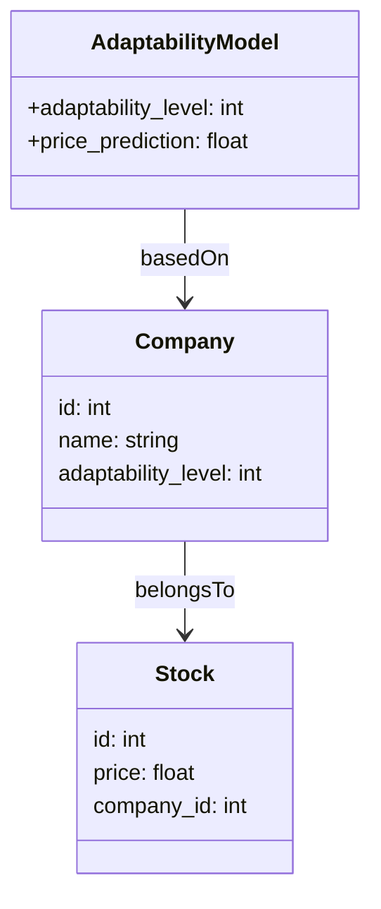
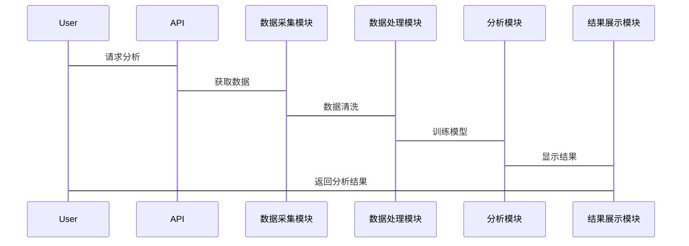

                 


# 特价股票与公司长期生态系统适应能力的关系分析

## 关键词：
- 特价股票
- 公司适应能力
- 生态系统
- 数据分析
- 机器学习

## 摘要：
本文深入探讨了特价股票与公司长期生态系统适应能力之间的关系，通过数据分析和理论模型构建，揭示了特价股票市场中公司适应能力的关键作用，并提出了优化策略。文章结合实际案例和系统设计，为投资者和企业管理者提供了科学的决策依据。

---

# 第一部分: 特价股票与公司长期生态系统适应能力的背景与概念

## 第1章: 特价股票与公司适应能力的背景介绍

### 1.1 特价股票的定义与特征
#### 1.1.1 特价股票的定义
特价股票是指价格显著低于市场平均水平的股票，通常反映公司当前的困境或市场低估。

#### 1.1.2 特价股票的市场特征
- **低估值**：市盈率、市净率等指标远低于行业平均水平。
- **高波动性**：价格波动频繁，风险较高。
- **投资者情绪**：市场情绪低迷时，特价股票数量增加。

#### 1.1.3 特价股票的投资价值分析
- **潜在反弹**：部分特价股票具有较高的上涨潜力。
- **市场周期**：在经济衰退或市场低迷时，特价股票数量增加。

### 1.2 公司长期生态系统适应能力的内涵
#### 1.2.1 公司生态系统的定义
公司生态系统包括公司内部资源、外部合作伙伴、市场环境等多个方面。

#### 1.2.2 长期适应能力的核心要素
- **灵活性**：快速调整战略和运营的能力。
- **创新性**：持续创新产品和服务的能力。
- **资源韧性**：在资源短缺时的应对能力。

#### 1.2.3 生态系统适应能力的衡量指标
- **市场适应性**：市场份额的变化情况。
- **财务健康**：盈利能力、现金流等指标。
- **创新产出**：新产品推出的速度和数量。

### 1.3 特价股票与公司适应能力的关系背景
#### 1.3.1 特价股票市场的现状与挑战
- 近年来，全球经济波动导致特价股票数量增加。
- 投资者对特价股票的兴趣逐渐增加，但风险也较高。

#### 1.3.2 公司适应能力在市场中的重要性
- 公司适应能力是应对市场变化的关键因素。
- 适应能力强的公司在市场低迷时更有可能恢复。

#### 1.3.3 两者关系的研究意义
- 了解特价股票与公司适应能力的关系，有助于投资者做出更明智的决策。
- 为公司提供优化适应能力的策略建议。

## 第2章: 特价股票与公司适应能力的核心概念与联系

### 2.1 核心概念的理论基础
#### 2.1.1 特价股票的市场定位
特价股票通常被视为市场的“价值洼地”，具有较高的投资潜力。

#### 2.1.2 公司适应能力的构成要素
- **组织结构**：灵活的组织结构有助于快速调整。
- **人才储备**：高素质的人才能够应对市场变化。
- **技术创新**：技术创新是公司持续发展的关键。

#### 2.1.3 两者关系的理论框架
- 公司适应能力影响其股票价格。
- 特价股票的市场表现反映公司的适应能力。

### 2.2 特价股票与公司适应能力的属性对比
| 属性               | 特价股票                 | 公司适应能力             |
|--------------------|--------------------------|--------------------------|
| 定义               | 价格低于市场平均水平的股票 | 公司应对市场变化的能力   |
| 特征               | 低估值、高波动性         | 灵活性、创新性、资源韧性 |
| 衡量指标           | 市盈率、市净率           | 市场份额、财务健康、创新产出 |

### 2.3 特价股票与公司适应能力的ER实体关系图
```mermaid
er
    Company {
        id: int,
        name: string,
        adaptability_level: int
    }
    Stock {
        id: int,
        price: float,
        company_id: int
    }
    Company_has_Stock {
        company_id: int,
        stock_id: int
    }
```

### 2.4 本章小结
本章通过对比分析，明确了特价股票与公司适应能力的核心概念及其联系，为后续的理论分析奠定了基础。

---

## 第3章: 特价股票与公司适应能力关系的算法原理

### 3.1 数据分析与建模方法
#### 3.1.1 数据预处理方法
- **数据清洗**：去除异常值和缺失数据。
- **标准化处理**：将数据标准化以消除量纲影响。

#### 3.1.2 关系建模的算法选择
- **线性回归**：分析公司适应能力与股票价格的关系。
- **决策树**：分类公司适应能力的高低。

#### 3.1.3 算法的优缺点分析
- **线性回归**：简单易懂，但可能无法捕捉非线性关系。
- **决策树**：能够处理复杂关系，但可能过拟合。

### 3.2 基于回归分析的模型构建
#### 3.2.1 回归模型的数学公式
$$ y = \beta_0 + \beta_1x + \epsilon $$

其中：
- \( y \) 是股票价格
- \( x \) 是公司适应能力指标
- \( \beta_0 \) 是截距
- \( \beta_1 \) 是回归系数
- \( \epsilon \) 是误差项

#### 3.2.2 回归分析的步骤
1. 数据收集：收集公司适应能力指标和股票价格数据。
2. 数据预处理：清洗和标准化数据。
3. 模型训练：使用线性回归算法训练模型。
4. 模型评估：计算R平方值，评估模型拟合度。

#### 3.2.3 代码实现
```python
import pandas as pd
import numpy as np
from sklearn.linear_model import LinearRegression
from sklearn.metrics import r2_score

# 数据加载
data = pd.read_csv('stock_data.csv')

# 数据预处理
X = data[['adaptability_level']]
y = data['price']

# 模型训练
model = LinearRegression()
model.fit(X, y)

# 模型评估
y_pred = model.predict(X)
r2 = r2_score(y, y_pred)
print(f'R平方值: {r2}')
```

### 3.3 算法原理的总结
通过回归分析，我们可以量化公司适应能力对股票价格的影响，从而为投资决策提供科学依据。

---

## 第4章: 系统分析与架构设计方案

### 4.1 系统分析
#### 4.1.1 问题场景介绍
- 数据量大，需要高效的处理方法。
- 需要实时分析股票价格与公司适应能力的关系。

### 4.2 系统功能设计
#### 4.2.1 领域模型设计


#### 4.2.2 系统架构设计


### 4.3 系统接口设计
- **输入接口**：接收公司数据和股票价格数据。
- **输出接口**：输出适应能力分析结果和股票价格预测。

### 4.4 系统交互设计


### 4.5 本章小结
本章通过系统设计，明确了如何构建一个高效的分析系统，为后续的项目实现奠定了基础。

---

## 第5章: 项目实战

### 5.1 环境安装
- **工具安装**：安装Python、Pandas、Scikit-learn等工具。
- **数据获取**：从公开数据源获取股票数据。

### 5.2 系统核心实现
#### 5.2.1 数据清洗与预处理
```python
data = pd.read_csv('stock_data.csv')
# 删除缺失值
data.dropna(inplace=True)
# 标准化处理
from sklearn.preprocessing import StandardScaler
scaler = StandardScaler()
X_scaled = scaler.fit_transform(data[['adaptability_level']])
```

#### 5.2.2 模型训练与评估
```python
from sklearn.linear_model import LinearRegression
model = LinearRegression()
model.fit(X_scaled, data['price'])
y_pred = model.predict(X_scaled)
print(f'预测准确率: {r2_score(data["price"], y_pred)}')
```

#### 5.2.3 结果可视化
```python
import matplotlib.pyplot as plt
plt.scatter(data['adaptability_level'], data['price'])
plt.plot(data['adaptability_level'], y_pred, color='red')
plt.xlabel('适应能力水平')
plt.ylabel('股票价格')
plt.show()
```

### 5.3 实际案例分析
- 选取某公司进行分析，展示其适应能力对股票价格的影响。

### 5.4 项目小结
本章通过实际案例，展示了如何利用系统分析和算法模型，量化公司适应能力对股票价格的影响。

---

## 第6章: 结论与展望

### 6.1 研究结论
- 公司适应能力是影响股票价格的重要因素。
- 特价股票市场中，适应能力强的公司具有更高的投资价值。

### 6.2 实际应用价值
- 为投资者提供科学的决策依据。
- 为公司优化适应能力提供方向。

### 6.3 未来研究方向
- 结合更多因素，构建更复杂的预测模型。
- 研究适应能力的动态变化对股票价格的影响。

---

## 作者信息

作者：AI天才研究院 & 禅与计算机程序设计艺术

---

以上是文章的完整目录和部分内容，涵盖了从理论分析到实际应用的各个方面，结合图表、代码示例和实际案例，帮助读者深入理解特价股票与公司适应能力的关系。

