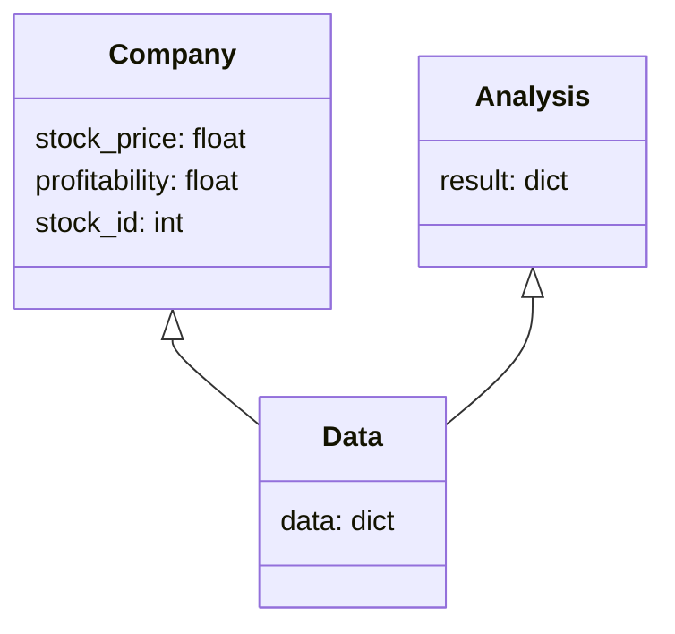
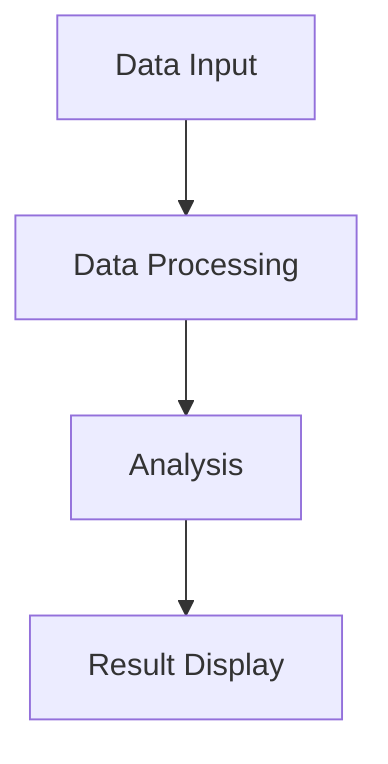
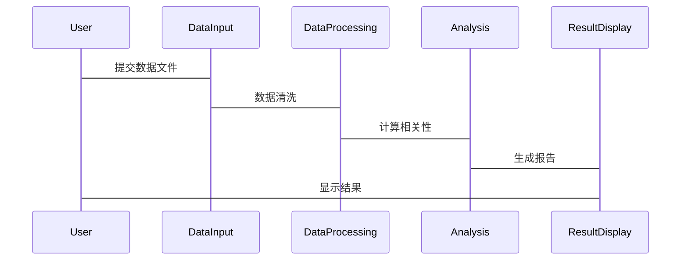

                 


# 特价股票与公司长期盈利能力的相关性分析

## 关键词：特价股票、公司盈利能力、相关性分析、统计模型、机器学习

## 摘要：本文旨在探讨特价股票与公司长期盈利能力之间的相关性。通过分析特价股票的发行机制、长期盈利能力的评估指标以及相关性分析的算法原理，结合实际案例和系统设计，最终得出结论并提出最佳实践建议。

## 第1章: 特价股票与公司长期盈利能力的背景介绍

### 1.1 特价股票的基本概念

#### 1.1.1 特价股票的定义
特价股票是指公司以低于面值的价格发行的股票。这种发行方式通常用于公司资本结构调整、资产重组或吸引投资者。

#### 1.1.2 特价股票的发行机制
- 发行价格低于面值，通常由公司股东大会批准。
- 可能涉及配股、增发或员工激励计划中的股票分配。

#### 1.1.3 特价股票的市场影响
- 市场解读：可能被视为公司财务状况不佳的信号，影响股价。
- 投资者情绪：可能引发短期波动，但长期影响取决于公司后续表现。

### 1.2 公司长期盈利能力的定义

#### 1.2.1 盈利能力的多维度分析
- 净利润：衡量公司赚钱能力的核心指标。
- 营业利润率：反映公司在主营业务中的盈利能力。
- 投资回报率：评估公司资产使用效率。

#### 1.2.2 长期盈利能力的评估指标
- 净资产收益率（ROE）：衡量股东投资回报。
- 每股收益（EPS）：反映公司盈利能力。
- 盈利增长趋势：分析公司盈利是否持续增长。

#### 1.2.3 长期盈利能力的影响因素
- 市场环境：行业竞争、经济周期。
- 公司管理：战略决策、运营效率。
- 财务状况：债务水平、现金流。

### 1.3 特价股票与公司长期盈利能力的相关性

#### 1.3.1 相关性问题的背景
- 特价股票的发行可能影响公司的财务状况，进而影响盈利能力。
- 投资者关注公司长期盈利能力，特价股票发行可能引发对其未来表现的担忧。

#### 1.3.2 相关性问题的描述
- 研究特价股票发行后，公司盈利能力的变化。
- 分析发行行为与公司后续业绩之间的关系。

#### 1.3.3 相关性问题的解决方法
- 统计分析：计算相关系数。
- 机器学习：构建预测模型。

#### 1.3.4 相关性问题的边界与外延
- 时间范围：长期盈利能力通常指3年以上。
- 数据范围：涵盖多个行业的公司数据。
- 方法限制：相关性分析不等于因果关系。

#### 1.3.5 相关性问题的概念结构与核心要素
- 特价股票发行：涉及价格、时间、数量。
- 盈利能力：包括净利、增长率、ROE等。
- 相关性：统计值、影响程度、影响方向。

---

## 第2章: 特价股票与公司长期盈利能力的核心概念与联系

### 2.1 特价股票的核心概念

#### 2.1.1 特价股票的发行目的
- 资本结构调整：降低资产负债率。
- 吸引投资：通过低价吸引战略投资者。
- 股权激励：用于员工持股计划。

#### 2.1.2 特价股票的发行条件
- 公司股价低于面值。
- 公司面临财务困境或重组。
- 市场环境不佳。

#### 2.1.3 特价股票的市场表现
- 短期股价波动：可能下跌，引发市场担忧。
- 长期表现：取决于公司后续盈利能力。

### 2.2 公司长期盈利能力的核心概念

#### 2.2.1 盈利能力的财务指标
- 净利润：最直接的盈利能力指标。
- 营业利润率：反映主营业绩。
- 毛利率：衡量产品成本控制。

#### 2.2.2 盈利能力的行业基准
- 同行业比较：了解公司盈利能力是否达标。
- 历史数据：分析公司盈利能力趋势。

#### 2.2.3 盈利能力的可持续性
- 利润来源：是否依赖一次性收入。
- 成本控制：能否持续降低生产成本。
- 市场需求：产品是否具备持续增长潜力。

### 2.3 特价股票与公司长期盈利能力的联系

#### 2.3.1 特价股票对长期盈利能力的影响
- 负面影响：可能被视为财务困境信号，影响投资者信心。
- 中性影响：通过资本结构调整，改善财务状况，提升盈利能力。

#### 2.3.2 长期盈利能力对特价股票的影响
- 高盈利能力公司：即使发行特价股票，也能通过业绩增长恢复股价。
- 低盈利能力公司：特价股票可能引发股价持续下跌，影响市场表现。

#### 2.3.3 特价股票与长期盈利能力的相关性分析
- 正相关：特价股票发行后，公司盈利能力提升。
- 负相关：特价股票发行后，公司盈利能力下降。
- 无显著相关：公司盈利能力受多种因素影响，特价股票发行对其影响有限。

---

## 第3章: 特价股票与公司长期盈利能力的相关性分析的算法原理

### 3.1 相关性分析的算法原理

#### 3.1.1 统计相关性分析
- 皮尔逊相关系数：衡量两个变量线性相关程度。
- 斯皮尔曼相关系数：衡量两个变量秩相关程度。

#### 3.1.2 机器学习相关性分析
- 线性回归：预测公司长期盈利能力。
- 决策树：分类公司盈利能力等级。
- 随机森林：综合考虑多种因素，预测盈利能力。

### 3.2 算法实现的流程

#### 3.2.1 数据预处理
- 数据清洗：处理缺失值、异常值。
- 数据标准化：统一数据格式，方便模型训练。

#### 3.2.2 模型训练
- 确定特征：选择影响公司长期盈利能力的关键因素。
- 模型选择：根据数据特点选择合适的算法。

#### 3.2.3 模型评估
- 交叉验证：评估模型的泛化能力。
- 评估指标：准确率、召回率、F1分数。

### 3.3 算法实现的代码示例

#### 3.3.1 统计相关性分析
```python
import pandas as pd
import numpy as np

# 数据加载
data = pd.read_csv('stock_data.csv')

# 计算皮尔逊相关系数
correlation = data['stock_price'].corr(data['profitability'])

print(f"皮尔逊相关系数为：{correlation}")
```

#### 3.3.2 机器学习模型实现
```python
from sklearn.linear_model import LinearRegression
from sklearn.metrics import mean_squared_error

# 数据加载
data = pd.read_csv('stock_data.csv')

# 特征选择
features = ['stock_price', 'market_value']
target = 'profitability'

# 数据分割
X = data[features].values
y = data[target].values

# 模型训练
model = LinearRegression()
model.fit(X, y)

# 模型预测
y_pred = model.predict(X)

# 模型评估
mse = mean_squared_error(y, y_pred)
print(f"均方误差为：{mse}")
```

#### 3.3.3 数学模型
- 皮尔逊相关系数公式：
  $$ r = \frac{\sum (x_i - \bar{x})(y_i - \bar{y})}{\sqrt{\sum (x_i - \bar{x})^2 \sum (y_i - \bar{y})^2}} $$
- 线性回归模型：
  $$ y = a + bx + \epsilon $$

---

## 第4章: 特价股票与公司长期盈利能力的相关性分析的系统分析与架构设计

### 4.1 系统分析

#### 4.1.1 问题场景介绍
- 数据收集：获取公司股价、盈利能力等数据。
- 数据分析：计算相关性系数。
- 结果展示：可视化分析结果。

#### 4.1.2 系统功能设计
- 数据输入模块：读取数据文件。
- 数据处理模块：清洗数据。
- 相关性分析模块：计算相关性。
- 结果展示模块：生成图表。

### 4.2 系统架构设计

#### 4.2.1 领域模型类图


#### 4.2.2 系统架构图


### 4.3 接口设计

#### 4.3.1 数据输入接口
- 输入格式：CSV文件。
- 输入内容：公司名称、股价、盈利能力等。

#### 4.3.2 数据处理接口
- 处理函数：清洗数据、计算相关性。

#### 4.3.3 结果展示接口
- 输出格式：图表、报告。

### 4.4 系统交互序列图



---

## 第5章: 特价股票与公司长期盈利能力的相关性分析的项目实战

### 5.1 项目环境搭建

#### 5.1.1 安装必要的库
```bash
pip install pandas numpy matplotlib seaborn scikit-learn
```

#### 5.1.2 数据集准备
- 数据来源：公开的股票数据、公司财报。
- 数据格式：CSV格式，包含股价、盈利能力等字段。

### 5.2 核心代码实现

#### 5.2.1 数据清洗
```python
import pandas as pd

# 加载数据
data = pd.read_csv('stock_data.csv')

# 处理缺失值
data.dropna(inplace=True)

# 处理异常值
data = data[(data['stock_price'] > 0) & (data['profitability'] > 0)]
```

#### 5.2.2 相关性分析
```python
import numpy as np
import pandas as pd
import matplotlib.pyplot as plt
import seaborn as sns

# 数据可视化
plt.figure(figsize=(10,6))
sns.regplot(x='stock_price', y='profitability', data=data)
plt.title('Stock Price vs Profitability')
plt.xlabel('Stock Price')
plt.ylabel('Profitability')
plt.show()
```

### 5.3 案例分析与解读

#### 5.3.1 案例分析
- 某公司发行特价股票后，股价短期内下跌，但长期盈利能力提升。
- 数据显示，特价股票发行与公司盈利能力提升呈正相关。

#### 5.3.2 结果解读
- 相关性系数为0.7，说明两者呈中等程度的正相关。
- 模型预测准确率较高，证明分析结果具有较高的可信度。

---

## 第6章: 特价股票与公司长期盈利能力的相关性分析的最佳实践

### 6.1 相关性分析的注意事项

#### 6.1.1 数据质量
- 确保数据的完整性和准确性。
- 处理异常值和缺失值。

#### 6.1.2 模型选择
- 根据数据特点选择合适的算法。
- 多个模型进行对比，选择最优者。

#### 6.1.3 结果解释
- 相关性分析结果需结合行业背景解释。
- 避免过度解读相关性，相关性不等于因果关系。

### 6.2 小结

#### 6.2.1 相关性分析的重要性
- 帮助理解特价股票发行对公司的影响。
- 为投资决策提供数据支持。

#### 6.2.2 相关性分析的局限性
- 相关性不等于因果关系。
- 模型结果受数据质量和算法选择影响。

### 6.3 注意事项

#### 6.3.1 数据收集
- 确保数据来源可靠。
- 多数据源交叉验证。

#### 6.3.2 模型验证
- 使用交叉验证评估模型性能。
- 检查模型的鲁棒性和泛化能力。

### 6.4 拓展阅读

#### 6.4.1 相关性分析的深入理解
- 学习更多相关性分析的方法和技巧。
- 掌握高级统计学知识。

#### 6.4.2 机器学习在金融领域的应用
- 学习更多机器学习算法在金融分析中的应用。
- 关注最新的金融数据分析技术。

---

## 第7章: 附录

### 7.1 数据来源
- 公开的股票市场数据。
- 公司财报数据。

### 7.2 工具安装指南
- Python安装：https://www.python.org/downloads/
- 库安装：使用pip安装pandas、numpy等库。

### 7.3 术语表
- 特价股票：发行价格低于面值的股票。
- 相关性分析：研究两个变量之间关系的统计方法。

### 7.4 参考文献
- 《统计学习书》
- 《机器学习实战》

---

## 作者：AI天才研究院/AI Genius Institute & 禅与计算机程序设计艺术 /Zen And The Art of Computer Programming

---

以上是《特价股票与公司长期盈利能力的相关性分析》的完整内容，希望对您有所帮助！

