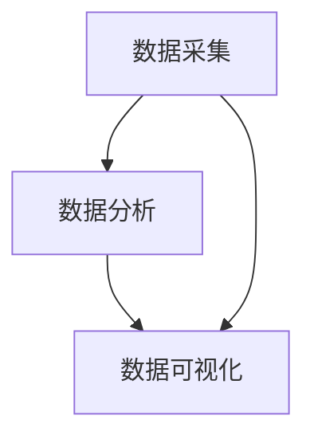

                 


```markdown
# 特价股票与公司隐藏资产的价值发现

> 关键词：特价股票、隐藏资产、价值发现、投资策略、财务分析、技术分析

> 摘要：本文深入探讨了特价股票和公司隐藏资产的价值发现方法，结合了财务分析、技术分析和系统设计等多方面的知识，帮助投资者识别潜在的投资机会，提升投资决策的科学性和准确性。

---

# 引言

## 1.1 特价股票的定义与特征
- 特价股票是指价格被市场低估的股票，通常具有较高的潜在回报。
- 特点包括低市盈率、低市净率，可能被市场忽视或低估。

## 1.2 隐藏资产的概念与重要性
- 隐藏资产指公司账面上未被充分反映的资产，可能包括无形资产、未来收益或潜在资源。
- 发现隐藏资产可以帮助投资者评估公司的真实价值，发现投资机会。

## 1.3 本文目标
- 探讨如何通过财务分析、技术分析和系统设计来发现隐藏资产，挖掘特价股票的投资价值。

---

# 第一部分：隐藏资产的识别与分析

## 2.1 财务报表分析法
### 2.1.1 资产负债表分析
- 检查是否存在未记录的资产或负债。
- 通过比较不同期间的财务数据，识别异常变动。

### 2.1.2 利润表分析
- 分析收入和利润趋势，识别潜在的增长点。
- 评估成本结构，发现可能的效率提升空间。

### 2.1.3 现金流量表分析
- 检查现金流的健康状况，评估公司的流动性。
- 识别非经常性收入或支出，调整估值。

## 2.2 市场信号法
### 2.2.1 市场传闻与媒体报道
- 监听市场传闻，验证其真实性。
- 关注行业专家的分析和意见。

### 2.2.2 行业对比分析
- 比较同行业公司的财务指标，识别异常值。
- 分析行业趋势，判断公司的相对位置。

## 2.3 内部信息法
### 2.3.1 内部审计
- 审核财务报告，确保数据的准确性。
- 发现潜在的隐藏资产或负债。

### 2.3.2 管理层访谈
- 与公司高管交流，获取内部信息。
- 评估管理层的诚信和能力。

## 2.4 综合分析法
### 2.4.1 多维度信息整合
- 结合财务、市场和内部信息，进行全面评估。
- 使用数据分析工具，建立综合模型。

---

# 第二部分：特价股票的投资策略

## 3.1 技术分析法
### 3.1.1 K线图分析
- 观察股价走势，识别趋势和形态。
- 使用技术指标如MACD、RSI进行买卖信号判断。

### 3.1.2 移动平均线（MA）应用
- 计算短期和长期移动平均线，判断趋势方向。
- 通过MA交叉识别买卖信号。

## 3.2 价值评估法
### 3.2.1 市盈率（P/E）分析
- 计算P/E比率，比较行业平均水平。
- 低P/E比率可能意味着低估。

### 3.2.2 市净率（P/B）分析
- 计算P/B比率，评估资产价值。
- 低P/B比率可能表明资产被低估。

## 3.3 隐藏资产的价值发现
### 3.3.1 潜在价值评估
- 估计隐藏资产的未来收益，调整公司估值。
- 考虑市场对隐藏资产的定价是否合理。

---

# 第三部分：系统设计与项目实战

## 4.1 系统架构设计
### 4.1.1 系统功能模块
- 数据采集模块：收集公司财务数据和市场信息。
- 数据分析模块：应用算法进行分析和预测。
- 可视化模块：展示分析结果，辅助决策。

### 4.1.2 系统架构图


## 4.2 算法实现
### 4.2.1 技术分析算法
```python
import pandas as pd
import matplotlib.pyplot as plt

data = pd.read_csv('stock_data.csv')
data['MA_20'] = data['Close'].rolling(20).mean()
data['MA_50'] = data['Close'].rolling(50).mean()

plt.plot(data['Date'], data['Close'], label='Close Price')
plt.plot(data['Date'], data['MA_20'], label='20-day MA')
plt.plot(data['Date'], data['MA_50'], label='50-day MA')
plt.legend()
plt.show()
```

### 4.2.2 价值评估模型
```latex
$$ \text{内在价值} = \text{现金流折现} + \text{隐藏资产价值} $$
```

## 4.3 项目实战
### 4.3.1 环境配置
- 安装Python和相关库（pandas、numpy、matplotlib）。
- 数据来源：Yahoo Finance或其他金融数据源。

### 4.3.2 核心代码实现
```python
import pandas as pd
import yfinance as yf

# 下载股票数据
stock = yf.Ticker('AAPL')
data = stock.history(period='max')

# 计算技术指标
data['20-day MA'] = data['Close'].rolling(20).mean()
data['50-day MA'] = data['Close'].rolling(50).mean()

# 绘制图表
plt.figure(figsize=(12,6))
plt.plot(data.index, data['Close'], label='Close Price')
plt.plot(data.index, data['20-day MA'], label='20-day MA')
plt.plot(data.index, data['50-day MA'], label='50-day MA')
plt.legend()
plt.title('AAPL Stock Analysis')
plt.show()
```

### 4.3.3 案例分析
- 以AAPL为例，分析其隐藏资产和特价股票机会。
- 讨论技术分析和价值评估的结果，判断是否为投资机会。

---

# 结论

## 5.1 本文总结
- 隐藏资产的识别和特价股票的发现需要结合财务分析、技术分析和系统设计。
- 投资者应综合考虑多种因素，制定科学的投资策略。

## 5.2 展望
- 进一步研究隐藏资产的量化评估方法。
- 开发自动化分析工具，提高分析效率。

## 5.3 注意事项
- 投资有风险，需谨慎评估。
- 保持对市场的敏感性，及时调整策略。

## 5.4 拓展阅读
- 建议阅读《投资学》和《技术分析实战技巧》等书籍。

---

# 作者

作者：AI天才研究院 & 禅与计算机程序设计艺术

---

通过本文的分析，读者可以系统地了解特价股票和公司隐藏资产的价值发现方法，掌握相关的分析工具和策略，提升投资决策的能力。
```

