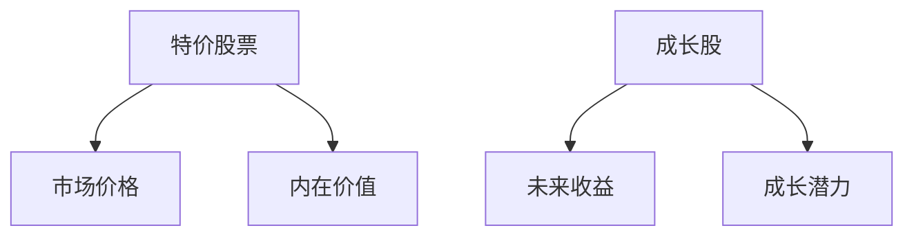
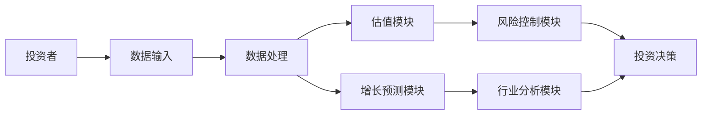
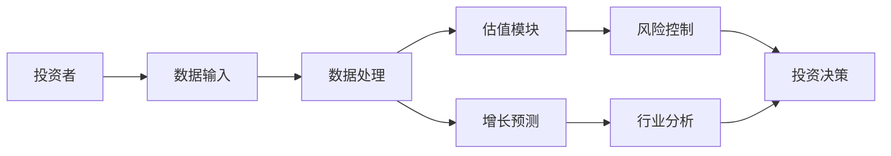

                 

# 特价股票与成长股的投资区别

> 关键词：特价股票，成长股，投资区别，股票分析，风险管理

> 摘要：本文将深入探讨特价股票和成长股的投资区别，从定义、特点、投资逻辑、数学模型、系统架构、实战技巧、风险管理到案例分析，全面解析两者在投资策略中的不同之处，帮助投资者更好地理解并选择适合自己的投资方式。

---

## 第1章: 特价股票与成长股的背景与定义

### 1.1 特价股票的定义与特点
#### 1.1.1 特价股票的定义
特价股票是指市场价格显著低于其内在价值的股票，通常被认为是被市场低估的投资机会。

#### 1.1.2 特价股票的特点
- 价格低于价值
- 通常出现在周期性低谷或市场恐慌时期
- 高分红率或股息收益率
- 投资者情绪往往过度悲观

#### 1.1.3 特价股票的投资逻辑
- 寻找市场误判的价值洼地
- 长期持有的价值回归理念
- 稳定的股息收入

### 1.2 成长股的定义与特点
#### 1.2.1 成长股的定义
成长股是指那些预期收入和利润能够持续快速增长的公司的股票。

#### 1.2.2 成长股的特点
- 高成长性
- 通常具有较高的市盈率
- 主要投资于新兴行业或朝阳产业
- 风险较高，波动性大

#### 1.2.3 成长股的投资逻辑
- 寻找高增长潜力的公司
- 侧重未来收益的增长
- 风险偏好较高的投资者

### 1.3 两者的背景对比
- 特价股票的市场背景：市场恐慌、经济低迷、行业低谷
- 成长股的市场背景：经济高速增长、新兴行业、技术创新
- 投资目标：前者注重价值修复，后者注重未来增长

---

## 第2章: 特价股票与成长股的核心概念对比

### 2.1 核心概念对比
| 对比维度 | 特价股票 | 成长股 |
|----------|----------|--------|
| 投资目标 | 价值修复 | 增长潜力 |
| 风险偏好 | 较低风险 | 高风险 |
| 投资周期 | 长期持有 | 中长期 |
| 估值方法 | 市盈率、市净率 | 市盈率、PEG |

### 2.2 特价股票与成长股的属性特征对比
- 投资目标：特价股票注重当前低估，成长股注重未来增长
- 风险收益比：特价股票风险较低，收益稳定；成长股风险较高，收益潜力大
- 投资周期：特价股票适合长期持有，成长股适合中长期投资

### 2.3 ER实体关系图

---

## 第3章: 特价股票与成长股的数学模型与算法原理

### 3.1 特价股票的数学模型
#### 3.1.1 特价股票的估值模型
$$ V = P \times (1 + r)^n $$
其中，V为股票的内在价值，P为当前价格，r为预期收益率，n为投资年数。

#### 3.1.2 价盈率模型
$$ P/E = \frac{P}{E} $$
其中，P为股价，E为每股收益。

### 3.2 成长股的数学模型
#### 3.2.1 �PEG模型
$$ PEG = \frac{P/E}{G} $$
其中，G为年均净利润增长率。

#### 3.2.2 预测模型
$$ F = a \times G + b \times M + c \times T $$
其中，F为未来股价，G为增长率，M为行业景气度，T为宏观经济因素。

### 3.3 对比分析
通过数学模型可以看出，特价股票更注重当前价格与价值的匹配，而成长股更注重未来的增长潜力。

---

## 第4章: 特价股票与成长股的系统分析与架构设计

### 4.1 系统功能设计
- 特价股票：估值模块、风险控制模块
- 成长股：增长预测模块、行业分析模块

### 4.2 系统架构

### 4.3 数据流图

---

## 第5章: 特价股票与成长股的实战技巧

### 5.1 特价股票的实战技巧
- 寻找低市盈率、低市净率的股票
- 结合行业周期分析
- 长期持有，等待价值回归

### 5.2 成长股的实战技巧
- 关注新兴行业和技术创新
- 选择高ROE（净资产收益率）的公司
- 结合技术分析和行业趋势

### 5.3 组合投资策略
- 搭配投资：将部分资金投入特价股票，部分资金投入成长股
- 风险分散：通过多样化投资降低整体风险

---

## 第6章: 特价股票与成长股的风险管理

### 6.1 特价股票的风险
- 价值陷阱：某些低价股票可能没有真正的投资价值
- 市场波动：短期内股价可能继续下跌

### 6.2 成长股的风险
- 高估值风险：市盈率过高可能导致股价下跌
- 成长停滞：公司增长不及预期

### 6.3 风险管理策略
- 设置止损点
- 定期调整投资组合
- 保持足够的流动性

---

## 第7章: 特价股票与成长股的案例分析

### 7.1 特价股票的案例
- 某银行股在经济低迷时期被低估，后续股价回升。

### 7.2 成长股的案例
- 某科技公司在新兴行业中的快速增长。

### 7.3 组合投资案例
- 比例分配：30%特价股票，70%成长股
- 定期调整：每年根据市场情况调整比例

---

## 第8章: 总结与展望

### 8.1 总结
- 特价股票适合风险偏好较低的投资者，注重短期价值修复
- 成长股适合风险偏好较高的投资者，注重长期增长潜力
- 组合投资是平衡风险与收益的有效方式

### 8.2 展望
- 经济周期变化对投资策略的影响
- 新兴技术对成长股的影响
- 全球化市场中的投资机会

---

## 作者：AI天才研究院/AI Genius Institute & 禅与计算机程序设计艺术 /Zen And The Art of Computer Programming

---

通过以上目录，我们可以清晰地看到特价股票与成长股在定义、特点、数学模型、系统架构、实战技巧、风险管理等方面的区别。投资者可以根据自身的风险偏好和投资目标，选择适合自己的投资策略。

