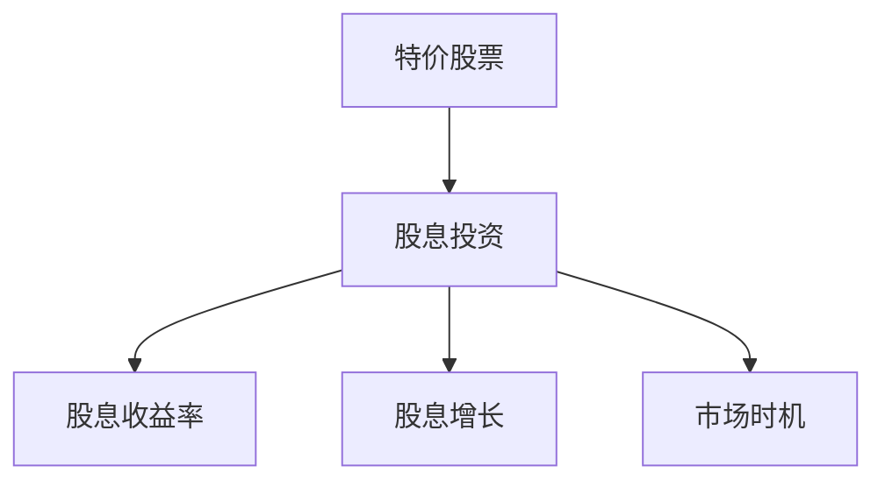
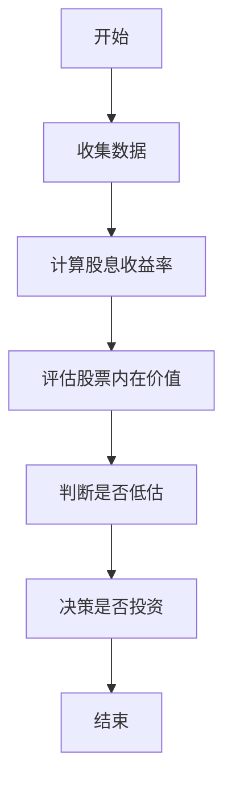
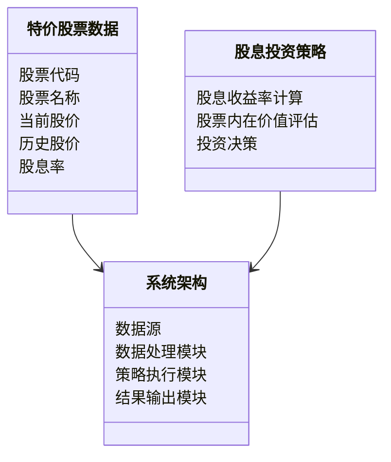

                 


# 特价股票与股息投资策略的结合

> **关键词**：特价股票、股息投资、股票价值评估、股息收益率、投资策略  
> **摘要**：本文探讨了如何将特价股票与股息投资策略相结合，通过数学建模和系统设计，提供了一种基于股息收益率和股票内在价值的综合投资策略。文章详细分析了特价股票和股息投资的核心概念、算法原理、系统架构及项目实战，并给出了风险管理与优化建议。

---

## 第一部分: 特价股票与股息投资策略的结合概述

### 第1章: 特价股票与股息投资策略的核心概念

#### 1.1 特价股票的定义与特点
- **1.1.1 什么是特价股票**  
  特价股票是指市场价格低于其内在价值的股票，通常由于市场波动、投资者情绪或公司短期问题导致的低估。

- **1.1.2 特价股票的市场特征**  
  - 价格被低估  
  - 具备较高的安全边际  
  - 通常出现在市场低迷时期  

- **1.1.3 特价股票的识别方法**  
  - 基于市盈率（P/E）的估值分析  
  - 基于市净率（P/B）的估值分析  
  - 基于股息率的分析  

#### 1.2 股息投资策略的定义与特点
- **1.2.1 股息投资的基本概念**  
  股息投资是指通过投资于那些能够稳定派发股息的公司，以获取稳定的现金流和资本增值的投资策略。

- **1.2.2 股息投资的核心要素**  
  - 股息率（Dividend Yield）  
  - 股息增长能力（Dividend Growth Rate）  
  - 公司财务稳定性  

- **1.2.3 股息投资的类型与分类**  
  - 高股息率股票  
  - 股息增长型股票  
  - 稳定股息型股票  

#### 1.3 特价股票与股息投资的结合
- **1.3.1 结合的背景与意义**  
  - 在市场低迷时期，特价股票通常具备较高的股息收益率，为投资者提供安全边际和现金流。  
  - 结合股息投资策略，可以在市场波动中稳定收益，同时利用特价股票的低估特性捕捉长期价值。  

- **1.3.2 结合的优势与挑战**  
  - 优势：  
    - 稳定的现金流来源  
    - 低估的市场价提供潜在的资本增值空间  
    - 抗风险能力较强  
  - 挑战：  
    - 需要精准识别特价股票的内在价值  
    - 需要长期持有，考验投资者的耐心  

---

### 第2章: 特价股票与股息投资的核心概念联系

#### 2.1 特价股票与股息投资的属性对比
| **属性**       | **特价股票**                              | **股息投资**                              |
|-----------------|------------------------------------------|------------------------------------------|
| 投资目标         | 寻找被低估的股票                          | 追求稳定的股息收益                        |
| 风险特征         | 较高（市场波动可能导致价格波动）          | 较低（依赖公司财务稳定性）                |
| 收益来源         | 资本增值（股价回归内在价值）              | 现金流（股息收入）                        |

#### 2.2 特价股票与股息投资的ER实体关系图


#### 2.3 特价股票与股息投资的数学模型
- **2.3.1 股息收益率计算公式**  
  $$ \text{股息收益率} = \frac{\text{股息率}}{\text{股票价格}} $$  

- **2.3.2 股票内在价值评估模型**  
  $$ \text{内在价值} = \sum_{t=1}^{\infty} \frac{\text{现金流}_t}{(1 + r)^t} $$  

---

### 第3章: 特价股票与股息投资策略的算法原理

#### 3.1 股票价值评估算法


#### 3.2 股票价值评估算法实现
```python
import pandas as pd
import numpy as np

def calculate_dividend_yield(stock_price, dividend):
    return dividend / stock_price

def calculate_intrinsic_value(cash_flows, discount_rate):
    return np.sum(cash_flows / (1 + discount_rate) ** np.arange(len(cash_flows)))

# 示例数据
stock_price = 50
dividend = 2.5
discount_rate = 0.08
cash_flows = [2.5, 2.65, 2.81, 2.97, 3.14]

# 计算股息收益率
dividend_yield = calculate_dividend_yield(stock_price, dividend)
print(f"股息收益率：{dividend_yield:.2f}")

# 计算内在价值
intrinsic_value = calculate_intrinsic_value(cash_flows, discount_rate)
print(f"内在价值：{intrinsic_value:.2f}")
```

---

## 第二部分: 特价股票与股息投资策略的系统分析与架构设计

### 第4章: 系统分析与架构设计方案

#### 4.1 问题场景介绍
- 投资者希望结合特价股票和股息投资策略，构建一个自动化投资分析系统。  
- 系统需要完成数据收集、分析、策略选择和结果输出。

#### 4.2 项目介绍
- 项目名称：特价股票与股息投资策略结合系统  
- 项目目标：提供一个基于股息收益率和股票内在价值的投资决策支持系统。

#### 4.3 系统功能设计


---

## 第三部分: 项目实战与代码实现

### 第5章: 项目实战

#### 5.1 环境安装
- Python 3.8+  
- pandas、numpy、matplotlib、scikit-learn

#### 5.2 核心实现
```python
import pandas as pd
import numpy as np
import yfinance as yf

# 下载股票数据
stock_data = yf.download("AAPL", start="2020-01-01", end="2023-12-31")

# 计算股息收益率
stock_data['Dividend Yield'] = stock_data['Dividends'] / stock_data['Close']

# 评估内在价值（简化模型）
discount_rate = 0.08
cash_flows = stock_data['Dividends'].values
intrinsic_values = []
for i in range(len(cash_flows)):
    if i == 0:
        intrinsic = cash_flows[i] / (discount_rate - (cash_flows[i+1]/cash_flows[i] - 1))
    else:
        intrinsic = cash_flows[i] / (discount_rate - (cash_flows[i+1]/cash_flows[i] - 1))
    intrinsic_values.append(intrinsic)

stock_data['Intrinsic Value'] = intrinsic_values

print(stock_data[['Close', 'Dividend Yield', 'Intrinsic Value']].tail())
```

---

## 第四部分: 风险管理与优化

### 第6章: 风险管理与优化

#### 6.1 风险管理策略
- **风险识别**：市场波动、公司基本面变化、股息政策调整。  
- **风险控制**：分散投资、设置止损点、定期再平衡投资组合。  

#### 6.2 优化建议
- 定期评估投资组合的股息收益率和内在价值。  
- 结合技术分析和基本面分析，优化投资决策。  

---

## 第五部分: 总结与展望

### 第7章: 总结与展望

#### 7.1 总结
- 特价股票与股息投资策略的结合为投资者提供了一种稳定收益与资本增值相结合的投资方式。  
- 通过数学建模和系统设计，投资者可以更好地识别投资机会，优化投资组合。

#### 7.2 展望
- 随着人工智能和大数据技术的发展，未来可以进一步优化股票价值评估模型，提高投资决策的效率和准确性。  

---

## 作者

**作者：AI天才研究院/AI Genius Institute & 禅与计算机程序设计艺术 /Zen And The Art of Computer Programming**

