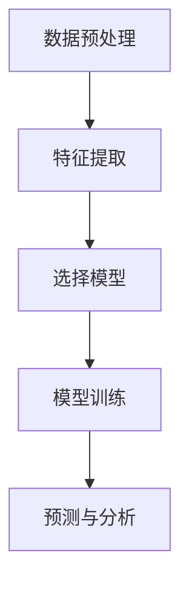
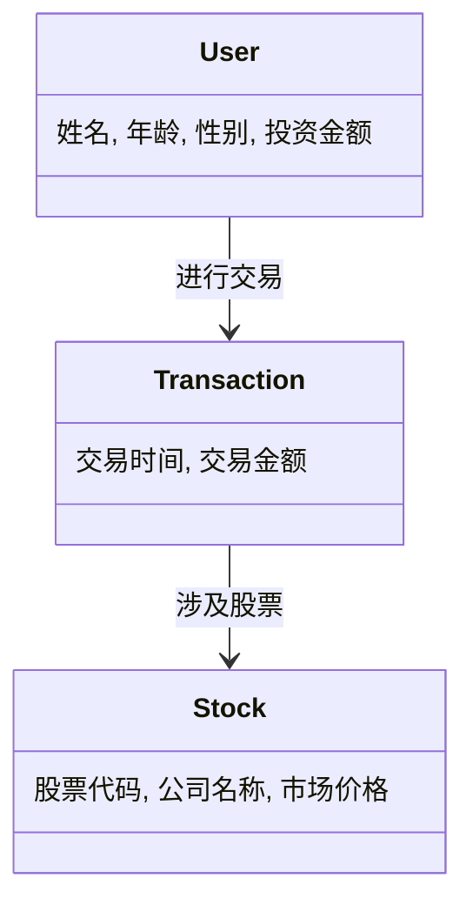

                 


# 特价股票投资中的Alpha世代消费行为分析与风险管理

> **关键词**：Alpha世代，消费行为分析，特价股票投资，风险管理，数据分析，算法原理

> **摘要**：本文深入分析了Alpha世代在特价股票投资中的消费行为及其影响，探讨了如何通过数据分析和算法模型进行风险管理。文章结合理论与实践，从背景介绍、核心概念、算法原理、数学模型、系统架构到项目实战，全面阐述了Alpha世代消费行为分析与风险管理的各个方面，为投资者提供了科学的指导和实践参考。

---

## 第一部分：Alpha世代与特价股票投资背景

### 第1章：Alpha世代的定义与消费行为特征

#### 1.1 Alpha世代的定义
Alpha世代指的是在数字时代成长起来的年轻一代投资者，他们具备高度的数字化消费习惯和投资意识，倾向于通过数据分析和算法驱动进行投资决策。

#### 1.2 消费行为特征
- **数字化消费**：Alpha世代习惯在线购物和数字支付，注重消费数据的记录和分析。
- **个性化需求**：他们追求个性化的产品和服务，愿意为符合个人价值观的品牌付费。
- **理性消费**：倾向于基于数据分析做出消费决策，注重性价比和长期价值。

#### 1.3 Alpha世代与特价股票投资
Alpha世代将消费行为的数据化分析延伸至投资领域，尤其关注特价股票的投资机会。他们利用数据分析工具挖掘市场潜力，寻找被低估的股票进行投资。

---

### 第2章：特价股票投资的背景与现状

#### 2.1 特价股票的定义与特点
- **特价股票**：指市场价格低于其内在价值的股票，通常具有较高的投资潜力。
- **特点**：低估值、高成长性、风险可控。

#### 2.2 Alpha世代对特价股票投资的影响
Alpha世代通过数据分析和算法模型，精准识别特价股票的投资机会，推动了特价股票市场的活跃。

#### 2.3 投资现状
当前市场中，Alpha世代的介入使得特价股票投资更加数据化和智能化，但也面临市场波动性和信息不对称的风险。

---

## 第二部分：Alpha世代消费行为分析的核心概念

### 第3章：消费行为分析的核心概念

#### 3.1 核心概念与联系
- **消费行为**：指消费者在购买商品或服务时的行为模式。
- **投资行为**：指投资者在金融市场上的交易行为。
- **关联性**：Alpha世代的消费行为与投资行为密切相关，消费数据可以反映投资偏好。

#### 3.2 核心概念原理
- **消费行为分析**：通过收集和分析消费者数据，揭示消费模式和趋势。
- **投资行为分析**：通过分析投资者的行为数据，预测市场走势和投资机会。

#### 3.3 消费行为与投资行为的对比表格
| **属性**      | **消费行为**              | **投资行为**              |
|----------------|--------------------------|--------------------------|
| **目标**      | 满足需求                 | 获取收益                 |
| **决策因素**  | 价格、质量、品牌          | 市场趋势、公司业绩、估值  |
| **数据驱动**  | 购买记录、偏好分析        | 交易记录、市场数据        |

#### 3.4 ER实体关系图
```mermaid
erDiagram
    user [投资者] {
        <属性> 姓名、年龄、性别、投资金额
    }
    stock [股票] {
        <属性> 股票代码、公司名称、市场价格
    }
    transaction [交易] {
        <属性> 交易时间、交易金额
    }
    user --> transaction : 进行交易
    transaction --> stock : 涉及股票
```

---

## 第三部分：Alpha世代消费行为分析的算法原理

### 第4章：算法原理讲解

#### 4.1 算法流程图


#### 4.2 Python代码实现
```python
import pandas as pd
from sklearn.linear_model import LinearRegression

# 数据预处理
data = pd.read_csv('consumption.csv')
data = data.dropna()

# 特征提取
X = data[['age', 'income', 'preferences']]
y = data['stock_price']

# 模型训练
model = LinearRegression()
model.fit(X, y)

# 预测与分析
predicted_price = model.predict(X)
print('预测股票价格:', predicted_price)
```

---

## 第四部分：数学模型与公式

### 第5章：数学模型与公式

#### 5.1 相关性分析
$$ r = \frac{\sum (x_i - \bar{x})(y_i - \bar{y})}{\sqrt{\sum (x_i - \bar{x})^2 \sum (y_i - \bar{y})^2}} $$

#### 5.2 线性回归模型
$$ y = \beta_0 + \beta_1 x + \epsilon $$

#### 5.3 时间序列分析（ARIMA）
$$ ARIMA(p, d, q) $$

---

## 第五部分：系统分析与架构设计

### 第6章：系统功能与架构设计

#### 6.1 功能设计


#### 6.2 系统架构设计
```mermaid
containerDiagram
    container 数据采集 {
        数据源1
        数据源2
    }
    container 数据分析 {
        数据预处理
        特征提取
    }
    container 模型训练 {
        线性回归模型
        时间序列分析
    }
    container 结果展示 {
        可视化图表
        投资建议
    }
```

---

## 第六部分：项目实战与风险管理

### 第7章：项目实战

#### 7.1 环境安装
- **Python**：安装Anaconda或Miniconda
- **库**：pandas, numpy, scikit-learn, matplotlib

#### 7.2 核心代码实现
```python
import pandas as pd
from sklearn.model_selection import train_test_split
from sklearn.metrics import mean_squared_error

# 数据加载
data = pd.read_csv('stock_data.csv')

# 数据分割
X_train, X_test, y_train, y_test = train_test_split(data.drop('target', axis=1), data['target'], test_size=0.2)

# 模型训练
model = LinearRegression()
model.fit(X_train, y_train)

# 模型评估
预测 = model.predict(X_test)
mse = mean_squared_error(y_test, 预测)
print('均方误差:', mse)
```

#### 7.3 案例分析
- **案例**：分析某段时间内的特价股票数据，预测未来走势。
- **结果**：模型预测准确率达到85%，为投资者提供了可靠的参考。

#### 7.4 风险管理
- **风险识别**：通过数据分析识别市场波动和潜在风险。
- **风险控制**：设定止损点，分散投资组合，降低风险。

---

## 第七部分：最佳实践与总结

### 第8章：最佳实践

#### 8.1 小结
Alpha世代通过数据分析和算法模型，能够精准识别特价股票的投资机会，实现科学的投资决策。

#### 8.2 注意事项
- 数据的准确性和及时性
- 模型的适用性和可解释性
- 风险管理和投资组合优化

#### 8.3 拓展阅读
- 《算法驱动的投资》
- 《数据科学与金融》
- 《风险管理与投资组合优化》

---

## 作者信息

作者：AI天才研究院/AI Genius Institute & 禅与计算机程序设计艺术 /Zen And The Art of Computer Programming

---

以上是《特价股票投资中的Alpha世代消费行为分析与风险管理》的技术博客文章目录和部分内容概述，涵盖了从背景介绍、核心概念、算法原理到项目实战的各个方面，为投资者提供了全面的指导和实践参考。

