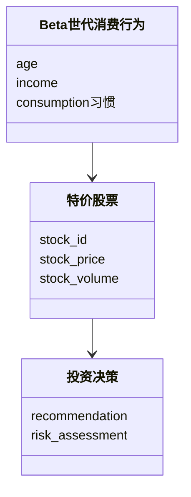
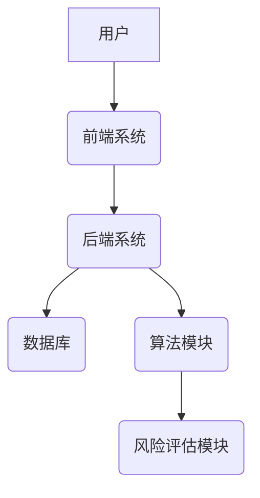
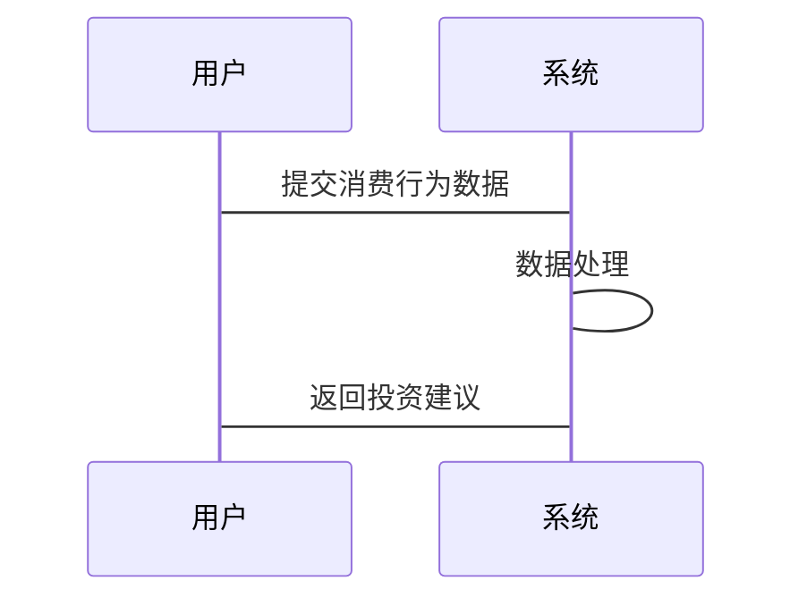

                 


```markdown
# 特价股票投资中的Beta世代消费行为分析与风险管理

## 关键词：特价股票、Beta世代、消费行为分析、风险管理、投资策略

## 摘要：本文深入分析了Beta世代消费行为对特价股票投资的影响，探讨了如何通过消费行为分析优化投资决策，并提出了相应的风险管理策略。文章结合理论与实践，为投资者提供了科学的决策支持。

---

# 第1章: 特价股票投资与Beta世代消费行为的背景介绍

## 1.1 特价股票投资的基本概念
### 1.1.1 特价股票的定义与特点
特价股票是指那些价格低于其内在价值，或者相对市场平均市盈率、市净率等指标显著低估的股票。其特点是价格波动大、风险较高、潜在收益大。

### 1.1.2 特价股票投资的市场背景
近年来，随着市场的波动加剧，越来越多的投资者开始关注特价股票，希望通过低价买入高价卖出的方式获利。然而，这种投资方式风险较高，需要结合市场趋势和消费者行为进行综合分析。

### 1.1.3 特价股票与传统股票投资的区别
与传统股票投资相比，特价股票投资更注重短期价格波动和市场情绪分析，而不仅仅是公司的基本面分析。

## 1.2 Beta世代的定义与特征
### 1.2.1 Beta世代的界定与人口特征
Beta世代通常指千禧一代（出生于1980年代至2000年代初）和Z世代（出生于2000年代初至2010年代末）。他们具有较高的数字化消费习惯和个性化消费偏好。

### 1.2.2 Beta世代的消费行为特点
Beta世代注重体验消费、个性化消费和便捷消费，倾向于通过互联网和移动应用进行购物，对品牌忠诚度较低，更关注产品的性价比和社交影响力。

### 1.2.3 Beta世代与金融市场的关联
Beta世代逐渐成为金融市场的重要参与者，他们的消费行为和投资习惯对市场趋势具有重要影响。

## 1.3 消费行为分析在投资中的重要性
### 1.3.1 消费行为分析的基本概念
消费行为分析是指通过对消费者的行为模式、偏好和趋势进行研究，预测市场变化和企业表现。

### 1.3.2 消费行为与股票投资的关系
消费行为分析可以帮助投资者预测企业的销售增长、利润率变化和市场地位变化，从而指导投资决策。

### 1.3.3 特价股票投资中的消费行为分析
在特价股票投资中，消费行为分析可以帮助投资者识别那些因市场情绪或短期波动被低估的股票，从而抓住投资机会。

## 1.4 风险管理在特价股票投资中的作用
### 1.4.1 风险管理的基本概念
风险管理是指通过识别、评估和控制风险，降低投资损失的可能性。

### 1.4.2 特价股票投资中的主要风险
包括市场波动风险、流动性风险、公司基本面变化风险等。

### 1.4.3 风险管理在投资决策中的重要性
通过有效的风险管理，投资者可以降低投资损失，提高投资收益的稳定性。

## 1.5 本章小结
本章介绍了特价股票投资的基本概念、Beta世代的消费行为特点及其与金融市场的关联，强调了消费行为分析和风险管理在投资中的重要性。

---

# 第2章: Beta世代消费行为对特价股票投资的影响

## 2.1 Beta世代的消费行为模式
### 2.1.1 Beta世代的消费习惯与趋势
Beta世代注重个性化消费、体验消费和便捷消费，倾向于通过线上渠道进行购物。

### 2.1.2 Beta世代的消费偏好与投资倾向
Beta世代倾向于投资具有高成长性和高流动性的资产，如科技股和新兴行业股票。

### 2.1.3 Beta世代消费行为的区域差异
不同地区的Beta世代消费行为受到当地经济发展水平、文化差异和政策环境的影响。

## 2.2 特价股票投资中的消费行为分析
### 2.2.1 消费行为对股票选择的影响
Beta世代的消费偏好影响他们对特定行业的投资偏好，例如科技、消费电子和互联网行业的股票。

### 2.2.2 消费行为对投资决策的驱动作用
Beta世代的消费行为分析可以帮助投资者预测市场的趋势和企业的业绩表现。

### 2.2.3 消费行为与股票价格波动的关系
Beta世代的消费行为变化会导致相关行业的股票价格波动，投资者可以通过分析消费行为预测价格走势。

## 2.3 Beta世代消费行为对市场的影响
### 2.3.1 Beta世代消费行为对市场结构的影响
Beta世代的消费行为推动了市场的细分和多样化，促进了新兴行业的发展。

### 2.3.2 Beta世代消费行为对市场趋势的预测
通过对Beta世代消费行为的分析，投资者可以预测市场的未来趋势，优化投资组合。

### 2.3.3 Beta世代消费行为对市场风险的放大作用
Beta世代的消费行为变化可能导致市场的过度波动，增加投资风险。

## 2.4 本章小结
本章分析了Beta世代的消费行为模式及其对特价股票投资的影响，强调了消费行为分析在投资决策中的重要性。

---

# 第3章: 特价股票投资中的风险管理策略

## 3.1 风险管理的基本原则与框架
### 3.1.1 风险管理的基本原则
风险管理应遵循全面性、科学性、可操作性和持续性原则。

### 3.1.2 风险管理的框架与流程
包括风险识别、风险评估、风险控制和风险监控四个步骤。

### 3.1.3 风险管理的工具与方法
常用的工具包括VaR（在险价值）、情景分析、压力测试等。

## 3.2

---

# 第4章: 基于Beta世代消费行为的算法分析与实现

## 4.1 算法原理概述
### 4.1.1 算法的目标与核心思想
通过分析Beta世代的消费行为数据，预测市场趋势和股票价格变化。

### 4.1.2 算法的关键步骤
包括数据收集、特征提取、模型训练和结果预测。

## 4.2 算法实现的数学模型
### 4.2.1 线性回归模型
$$ y = \beta_0 + \beta_1x + \epsilon $$
其中，y是目标变量，x是自变量，$\beta_0$和$\beta_1$是回归系数，$\epsilon$是误差项。

### 4.2.2 逻辑回归模型
$$ P(Y=1|X) = \frac{e^{\beta X}}{1 + e^{\beta X}} $$
用于分类问题，如判断股票是否为特价股票。

## 4.3 算法实现的代码示例
### 4.3.1 数据预处理
```python
import pandas as pd
data = pd.read_csv('consumption_behavior.csv')
```

### 4.3.2 特征提取
```python
features = data[['age', 'income', 'consumption习惯']]
```

### 4.3.3 模型训练
```python
from sklearn.linear_model import LinearRegression
model = LinearRegression()
model.fit(features, target)
```

### 4.3.4 结果预测
```python
predictions = model.predict(new_features)
```

## 4.4 本章小结
本章通过算法分析Beta世代的消费行为，提出了基于线性回归和逻辑回归的预测模型，并给出了实现代码。

---

# 第5章: 系统分析与架构设计

## 5.1 项目背景与目标
### 5.1.1 项目背景
通过系统分析Beta世代的消费行为，优化特价股票投资决策。

### 5.1.2 项目目标
构建一个基于消费行为分析的特价股票投资管理系统。

## 5.2 系统功能设计
### 5.2.1 领域模型


### 5.2.2 系统架构设计


## 5.3 接口设计与交互流程
### 5.3.1 系统接口设计
包括用户输入接口、数据接口和结果输出接口。

### 5.3.2 系统交互流程


## 5.4 本章小结
本章通过系统分析和架构设计，构建了一个基于Beta世代消费行为的特价股票投资管理系统。

---

# 第6章: 项目实战与案例分析

## 6.1 项目实战
### 6.1.1 环境安装
安装必要的开发工具和库，如Python、Pandas、Scikit-learn等。

### 6.1.2 核心代码实现
```python
import pandas as pd
from sklearn.linear_model import LinearRegression
data = pd.read_csv('consumption_behavior.csv')
features = data[['age', 'income', 'consumption习惯']]
target = data['stock_price']
model = LinearRegression()
model.fit(features, target)
predictions = model.predict(new_data)
```

### 6.1.3 代码解读与分析
通过对消费行为数据的分析，模型能够预测股票价格，帮助投资者做出投资决策。

## 6.2 案例分析
### 6.2.1 实际案例
分析Beta世代消费行为对某科技公司股票的影响。

### 6.2.2 案例分析与结果解读
通过分析消费行为数据，预测该公司股票价格的变化趋势。

## 6.3 本章小结
本章通过项目实战和案例分析，验证了Beta世代消费行为分析在特价股票投资中的有效性。

---

# 第7章: 最佳实践与风险管理

## 7.1 最佳实践
### 7.1.1 投资策略建议
建议投资者结合Beta世代消费行为分析和风险管理策略，制定科学的投资计划。

### 7.1.2 风险管理技巧
包括分散投资、设置止损点和定期调整投资组合。

## 7.2 小结
通过本文的分析和实践，投资者可以更好地利用Beta世代消费行为分析优化投资决策，降低投资风险。

## 7.3 注意事项
投资者应根据市场变化和自身情况调整投资策略，避免盲目跟风。

## 7.4 拓展阅读
推荐阅读相关领域的书籍和文献，深入学习Beta世代消费行为分析和风险管理的理论与实践。

---

# 作者：AI天才研究院/AI Genius Institute & 禅与计算机程序设计艺术 /Zen And The Art of Computer Programming
```

