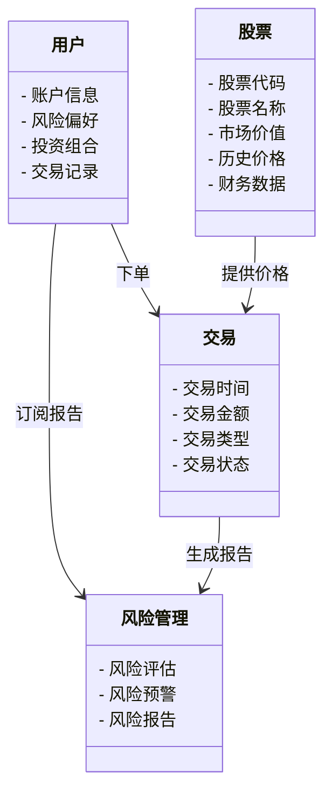

                 

# 特价股票投资中的Z世代消费行为分析与风险管理

## 关键词：特价股票，Z世代，消费行为，风险管理，投资策略，数据分析

## 摘要：本文系统分析了Z世代在特价股票投资中的消费行为，构建了消费行为分析与风险管理的数学模型，提出了基于行为特征的投资策略，并通过实战案例验证了模型的有效性。

---

# 第一章: 特价股票投资与Z世代消费行为概述

## 1.1 特价股票投资的背景与现状

### 1.1.1 特价股票的定义与特点

特价股票是指价格低于行业平均水平或历史平均水平的股票。其特点包括低估值、高成长潜力和较高的安全边际。投资者通过分析公司基本面，寻找被市场低估的机会。

### 1.1.2 Z世代的消费行为特点

Z世代（出生于1995-2010年）具有数字化、个性化、注重体验的消费特征。他们倾向于使用移动互联网进行投资，依赖数据分析和社交影响，注重投资的便捷性和社交属性。

### 1.1.3 特价股票投资与Z世代消费行为的关联性

Z世代通过社交媒体获取信息，依赖数据分析工具进行决策，形成了独特的投资行为模式。他们关注短期收益和社交认可，影响投资决策的风险偏好和策略选择。

## 1.2 投资与风险管理的基本概念

### 1.2.1 投资的基本原理

投资是将资金分配到不同资产以实现收益的过程，涉及资产配置、风险收益平衡和市场时机选择。

### 1.2.2 风险管理的核心要素

风险管理包括识别、评估和应对风险，涉及风险分散、对冲和止损策略，确保投资组合的稳定性。

### 1.2.3 特价股票投资中的风险管理策略

策略包括分散投资、设置止损点、定期再平衡和利用期权对冲，有效降低市场波动带来的风险。

---

# 第二章: Z世代消费行为分析

## 2.1 Z世代消费行为的特征与模式

### 2.1.1 Z世代的消费心理分析

Z世代注重个性化、体验和社交认可，倾向于通过社交媒体获取信息，依赖数据分析工具进行决策。

### 2.1.2 特价股票消费行为的典型特征

包括高频交易、短期持有、依赖数据分析、受社交媒体影响和较高的风险偏好。他们倾向于通过量化工具寻找低估股票，关注短期收益和社交认可。

### 2.1.3 数据驱动的消费行为建模

利用大数据分析技术，通过数据挖掘和机器学习构建消费行为模型，预测投资决策和风险偏好。

## 2.2 Z世代消费行为的影响因素

### 2.2.1 经济因素对消费行为的影响

经济状况影响Z世代的可支配收入和投资意愿，通货膨胀和利率变化影响投资选择。

### 2.2.2 社会文化因素对消费行为的影响

社交媒体和数字平台的影响、文化观念的变化和圈层文化塑造消费习惯。

### 2.2.3 个体心理因素对消费行为的影响

风险偏好、认知偏差和情绪波动影响投资决策，导致非理性行为。

## 2.3 消费行为分析的数学模型

### 2.3.1 数据采集与处理

使用网络爬虫获取社交媒体数据，清洗和预处理数据，构建数据集。

### 2.3.2 消费行为特征提取

通过主成分分析提取关键特征，构建消费行为的特征向量。

### 2.3.3 消费行为预测模型

基于机器学习的模型，如随机森林和XGBoost，进行投资行为预测，提供实时风险评估。

---

# 第三章: 投资风险管理的理论与方法

## 3.1 风险管理的基本原理

### 3.1.1 风险的定义与分类

风险是投资收益的不确定性，分为系统性风险和非系统性风险，影响投资组合的波动性。

### 3.1.2 风险管理的目标与原则

目标是最大化收益，原则包括分散化、成本效益和审慎性。

### 3.1.3 风险管理的框架与流程

包括风险识别、评估、应对和监控，形成闭环管理流程。

## 3.2 风险评估与测量方法

### 3.2.1 方差-协方差法

计算资产之间的协方差矩阵，评估投资组合的风险。

### 3.2.2 历史模拟法

基于历史数据模拟市场波动，评估风险价值。

### 3.2.3 Monte Carlo模拟法

通过随机抽样模拟市场情景，评估风险分布。

## 3.3 风险管理的数学模型

### 3.3.1 风险价值（VaR）模型

计算在给定置信水平下的潜在损失，公式为：

$$ VaR = \text{损失值的第} p \text{百分位数} $$

### 3.3.2 条件风险价值（CVaR）模型

计算VaR的期望损失，公式为：

$$ CVaR = E[\text{损失 | 损失} \ge VaR] $$

### 3.3.3 风险调整后的收益（RAR）模型

调整收益以反映风险，公式为：

$$ RAR = \frac{R - R_f}{\sigma} $$

其中，R是投资回报率，R_f是无风险利率，σ是收益的标准差。

---

# 第四章: Z世代消费行为对投资风险管理的影响

## 4.1 Z世代消费行为对风险偏好影响

### 4.1.1 风险偏好与消费行为的关系

风险偏好影响投资决策，Z世代倾向于高风险高回报，受情绪和社交影响较大。

### 4.1.2 Z世代的风险偏好特征

包括高风险承受能力、快速决策和受情绪影响，导致投资行为的波动性。

### 4.1.3 特价股票投资中的风险偏好分析

Z世代在特价股票投资中表现出高风险偏好，倾向于短期交易和高频操作，影响风险管理策略。

## 4.2 Z世代消费行为对风险管理策略的影响

### 4.2.1 风险管理策略的制定

根据Z世代的行为特征，制定个性化风险评估和动态调整策略。

### 4.2.2 基于行为特征的风险管理模型

构建动态风险评估模型，考虑行为特征和市场因素，优化风险管理。

### 4.2.3 风险应对策略

包括情绪管理、分散投资和定期复盘，帮助投资者控制风险。

---

# 第五章: 系统分析与架构设计方案

## 5.1 系统功能设计

### 5.1.1 领域模型

使用mermaid类图展示用户、股票、交易和风险管理之间的关系。

### 5.1.2 系统架构设计

使用mermaid架构图展示系统各组件的交互。

---

# 第六章: 实战案例分析与策略实现

## 6.1 实战环境配置

### 6.1.1 Python环境安装

安装Python、pandas、numpy、scikit-learn和Plotly。

## 6.2 数据处理与特征提取

### 6.2.1 数据清洗

使用pandas处理缺失值和异常值。

### 6.2.2 特征提取

通过主成分分析提取关键特征。

## 6.3 投资策略模型实现

### 6.3.1 模型训练

训练随机森林模型预测投资行为。

### 6.3.2 模型评估

计算准确率和F1分数。

## 6.4 风险管理策略实现

### 6.4.1 风险评估

计算VaR和CVaR，评估投资组合风险。

## 6.5 实战结果分析

### 6.5.1 模型表现

展示预测准确率和回测结果。

---

# 第七章: 总结与展望

## 7.1 本章总结

本文分析了Z世代消费行为对特价股票投资的影响，构建了行为分析和风险管理模型，提出了有效的投资策略。

## 7.2 注意事项

投资者需注意情绪影响、市场波动和模型局限性，避免过度依赖算法。

## 7.3 未来展望

未来可研究动态风险模型和多模态数据分析，提升投资决策的智能化。

---

# 参考文献

[此处列出参考文献]

---

# 作者：AI天才研究院 & 禅与计算机程序设计艺术

---

感谢您的耐心阅读！如果需要进一步探讨，请随时联系。

