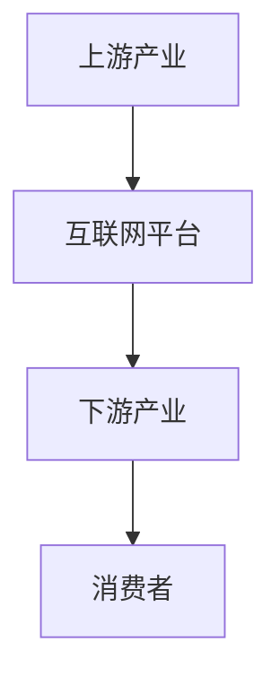
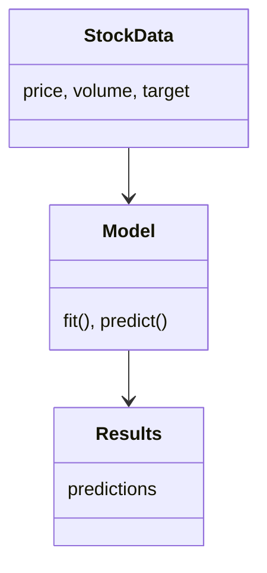
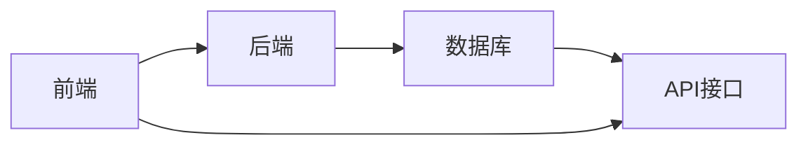

                 


# 特价股票投资中的产业互联网价值链分析方法

> 关键词：特价股票投资、产业互联网、价值链分析、数学建模、系统架构、股票分析

> 摘要：本文从特价股票投资与产业互联网的结合出发，详细分析了产业互联网价值链的核心要素，探讨了特价股票投资中的产业分析与优化策略，并通过数学模型和系统架构的设计，提出了基于产业互联网价值链的特价股票投资优化方法。

---

## 第一部分: 特价股票投资与产业互联网价值链概述

### 第1章: 特价股票投资与产业互联网概述

#### 1.1 特价股票投资的基本概念

**1.1.1 特价股票的定义与特点**

特价股票是指价格相对市场价大幅折价的股票，通常因市场波动、公司特定情况或投资者需求而产生。其特点包括高折扣率、短期投资机会和高风险回报比。

**1.1.2 特价股票投资的基本原理**

特价股票投资基于市场定价偏差和短期套利机会。投资者通过分析市场信息和公司基本面，寻找被低估的股票，进行短期投资以获取超额收益。

**1.1.3 特价股票与普通股票的区别**

| 特性 | 特价股票 | 普通股票 |
|------|----------|----------|
| 定价 | 折价     | 市场价    |
| 风险 | 较高     | 较低     |
| 投资策略 | 短期套利 | 长期价值投资 |

#### 1.2 产业互联网的基本概念

**1.2.1 产业互联网的定义与特点**

产业互联网是互联网技术与传统产业深度融合的产物，具有数据化、智能化和网络化的特点。

**1.2.2 产业互联网的发展现状**

当前，产业互联网在制造业、金融、教育等领域快速发展，推动了传统产业的数字化转型。

**1.2.3 产业互联网对传统产业的影响**

通过提升效率、优化资源配置和创造新的商业模式，产业互联网为传统产业带来竞争优势。

#### 1.3 特价股票投资与产业互联网的结合

**1.3.1 产业互联网对股票市场的潜在影响**

产业互联网通过数据化和智能化，改变了股票市场的信息传播、交易方式和定价机制。

**1.3.2 特价股票投资在产业互联网中的机会**

利用产业互联网技术，投资者可以更高效地获取信息、分析数据和识别投资机会。

**1.3.3 特价股票投资与产业互联网价值链的关系**

产业互联网价值链为特价股票投资提供了数据支持、分析工具和交易渠道，二者相互促进。

---

## 第二部分: 产业互联网价值链分析方法

### 第2章: 产业互联网价值链的核心要素

#### 2.1 产业互联网价值链的构成

**2.1.1 价值链的基本概念**

价值链是指企业创造和传递价值的一系列过程，包括设计、生产、销售、服务等环节。

**2.1.2 产业互联网价值链的核心要素**

| 要素 | 描述 |
|------|------|
| 数据源 | 数据采集和处理 |
| 分析工具 | 数据挖掘和机器学习算法 |
| 交易渠道 | 在线交易平台 |
| 服务支持 | 客户服务和风险管理 |

**2.1.3 价值链的上下游关系**



#### 2.2 产业互联网价值链的分析框架

**2.2.1 价值链分析的基本步骤**


**2.2.2 价值链分析的关键指标**

| 指标 | 描述 |
|------|------|
| 附加值 | 产品或服务的额外价值 |
| 效率 | 资源利用效率 |
| 竞争力 | 市场竞争力 |

**2.2.3 价值链分析的工具与方法**

- 数据可视化工具：如Tableau、Power BI
- 数据挖掘算法：如聚类分析、回归分析
- 优化工具：如线性规划

#### 2.3 产业互联网价值链的优化策略

**2.3.1 价值链优化的目标**

最大化资源利用效率、提升竞争力、降低运营成本。

**2.3.2 价值链优化的关键点**

- 数据质量管理
- 模型优化
- 交易流程优化

**2.3.3 价值链优化的实施步骤**

1. 数据收集与清洗
2. 模型构建与训练
3. 结果分析与优化

---

## 第三部分: 特价股票投资中的产业互联网价值链分析

### 第3章: 特价股票投资中的产业分析

#### 3.1 特价股票投资的产业选择

**3.1.1 产业选择的基本原则**

根据市场前景、行业竞争格局和公司基本面。

**3.1.2 产业选择的关键因素**

| 因素 | 描述 |
|------|------|
| 行业周期 | 行业所处的生命周期阶段 |
| 市场容量 | 行业市场规模 |
| 竞争格局 | 行业主要竞争对手分析 |

**3.1.3 产业选择的案例分析**

以某行业为例，分析其市场容量、竞争格局和周期阶段。

#### 3.2 产业互联网对股票价值的影响

**3.2.1 产业互联网对股票价值的正向影响**

通过提升效率和降低成本，增强企业盈利能力。

**3.2.2 产业互联网对股票价值的负向影响**

过度竞争和数据泄露可能带来风险。

**3.2.3 产业互联网对股票价值的综合影响**

综合考虑正向和负向影响，评估其净效应。

#### 3.3 特价股票投资中的产业风险分析

**3.3.1 产业风险的基本概念**

指因行业环境变化而带来的投资风险。

**3.3.2 产业风险的评估方法**

- 宏观经济分析
- 行业政策分析
- 竞争分析

**3.3.3 产业风险的应对策略**

多元化投资、风险分散和及时止损。

---

## 第四部分: 特价股票投资中的产业互联网价值链优化策略

### 第4章: 产业互联网价值链优化的数学模型

#### 4.1 价值链优化的数学模型构建

**4.1.1 模型的基本假设**

- 投资者理性决策
- 市场信息有效
- 模型参数可优化

**4.1.2 模型的变量定义**

- 收益率：r
- 投资成本：c
- 优化目标：最大化收益

**4.1.3 模型的数学表达**

$$ \text{最大化} \quad \sum_{i=1}^{n} (r_i - c_i) $$

#### 4.2 模型的求解方法

**4.2.1 线性规划方法**

$$ \max \sum_{i=1}^{n} r_i - \sum_{i=1}^{n} c_i $$

**4.2.2 非线性规划方法**

$$ \max \quad f(x) = \sum_{i=1}^{n} (r_i x_i - c_i x_i^2) $$

**4.2.3 数值优化方法**

使用遗传算法或模拟退火算法进行优化。

---

## 第五部分: 系统分析与架构设计方案

### 第5章: 项目实战

#### 5.1 环境安装与数据准备

- 安装Python和相关库（如pandas、scikit-learn）
- 数据来源：股票市场数据、行业数据

#### 5.2 系统核心实现源代码

```python
import pandas as pd
from sklearn.linear_model import LinearRegression

# 数据加载
data = pd.read_csv('stock_data.csv')

# 特征选择
features = data[['price', 'volume']]
target = data['target']

# 模型训练
model = LinearRegression()
model.fit(features, target)

# 预测
predictions = model.predict(features)
```

#### 5.3 系统功能设计

**领域模型**



**系统架构图**



#### 5.4 实际案例分析

以某产业为例，进行数据建模和分析，得出投资建议。

---

## 第六部分: 最佳实践与总结

### 第6章: 小结与注意事项

**6.1 小结**

本文系统分析了特价股票投资中的产业互联网价值链，提出了优化策略和数学模型。

**6.2 注意事项**

- 数据质量影响模型效果
- 模型需定期更新
- 投资需谨慎，注意风险

---

## 作者信息

作者：AI天才研究院/AI Genius Institute & 禅与计算机程序设计艺术 /Zen And The Art of Computer Programming

