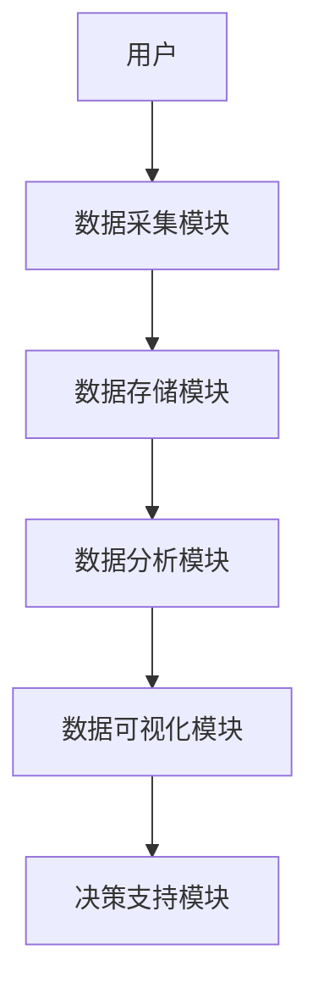
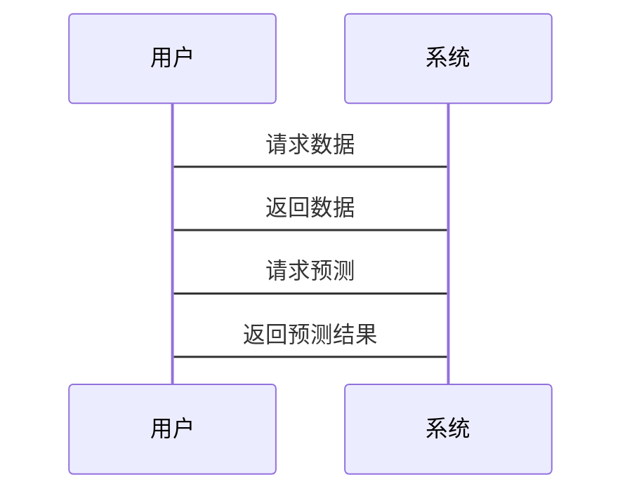

                 


# 特价股票投资中的产业互联网分析方法

## 关键词：特价股票投资、产业互联网、数据分析、算法建模、系统架构、项目实战

## 摘要：
本文详细探讨了在特价股票投资中应用产业互联网分析方法的策略和实现路径。通过结合产业互联网的核心概念和数据分析技术，本文提出了从数据采集到模型构建的完整方法论，并通过实际案例展示了如何利用这些方法进行投资决策优化。文章还深入分析了系统架构设计和最佳实践，为投资者提供了切实可行的指导。

---

# 目录

1. [背景介绍](#背景介绍)
2. [核心概念与联系](#核心概念与联系)
3. [数据分析方法](#数据分析方法)
4. [算法原理](#算法原理)
5. [系统架构设计](#系统架构设计)
6. [项目实战](#项目实战)
7. [最佳实践与小结](#最佳实践与小结)

---

## 1. 背景介绍

### 1.1 特价股票投资的背景介绍
#### 1.1.1 特价股票的定义与特点
特价股票通常指价格低于市场平均水平的股票，具有低估值、高成长潜力的特点。这类股票往往被市场忽视或低估，但可能蕴含较大的投资机会。

#### 1.1.2 特价股票投资的市场现状
当前市场中，特价股票因其高回报潜力吸引了大量投资者。然而，由于信息不对称和市场波动，投资决策需要更加精准的分析方法。

#### 1.1.3 产业互联网对特价股票投资的影响
产业互联网通过整合产业链数据，提供了更全面的市场信息，帮助投资者做出更明智的投资决策。

### 1.2 产业互联网的基本概念
#### 1.2.1 产业互联网的定义
产业互联网是指将互联网技术与传统产业深度融合，通过数据采集、分析和应用，优化传统产业的运营和决策。

#### 1.2.2 产业互联网的核心特征
- 数据驱动：基于海量数据的分析和应用。
- 实时性：能够快速响应市场变化。
- 智能化：利用人工智能和大数据技术进行预测和优化。

#### 1.2.3 产业互联网与传统互联网的区别
| 特性       | 产业互联网                     | 传统互联网                     |
|------------|-------------------------------|-------------------------------|
| 数据量     | 大数据驱动                   | 以用户行为数据为主             |
| 应用场景   | 传统产业优化                 | 信息共享与服务               |
| 技术复杂度 | 高，涉及物联网、大数据等       | 较低，主要基于HTTP协议等       |

### 1.3 特价股票投资与产业互联网的结合
#### 1.3.1 产业互联网在股票投资中的应用
通过产业互联网，投资者可以获取更全面的行业数据和公司信息，从而做出更精准的投资决策。

#### 1.3.2 特价股票投资中的产业互联网分析方法
利用产业互联网技术，分析特价股票的市场趋势、公司基本面和行业动态，从而优化投资策略。

---

## 2. 核心概念与联系

### 2.1 数据分析与产业互联网的结合
#### 2.1.1 数据采集与处理
- 数据来源：股票价格、行业动态、公司财报等。
- 数据处理：清洗、转换和存储。

#### 2.1.2 数据分析与建模
- 数据分析：使用统计方法和机器学习模型进行预测。
- 模型构建：基于历史数据，预测股票价格和市场趋势。

#### 2.1.3 数据可视化与决策支持
- 数据可视化：通过图表展示分析结果。
- 决策支持：基于分析结果，优化投资策略。

### 2.2 产业互联网分析方法的原理
#### 2.2.1 数据驱动的分析方法
通过收集和分析大量数据，识别市场规律和趋势。

#### 2.2.2 产业互联网分析的流程
1. 数据采集：从多个来源获取数据。
2. 数据清洗：处理缺失值和异常值。
3. 数据建模：构建预测模型。
4. 结果分析：评估模型效果并优化。

#### 2.2.3 分析方法的优缺点对比
| 方法       | 优点                         | 缺点                         |
|------------|------------------------------|------------------------------|
| 数据驱动   | 精准性高                     | 数据量大，处理复杂             |
| 经验驱动   | 易操作                      | 易受主观因素影响               |

---

## 3. 数据分析方法

### 3.1 数据采集与处理
#### 3.1.1 数据来源与采集方法
- 股票数据：通过API接口获取实时数据。
- 行业动态：爬取新闻和报告。

#### 3.1.2 数据清洗与预处理
- 删除缺失值。
- 处理异常值。

#### 3.1.3 数据存储与管理
- 使用数据库存储结构化数据。
- 使用文件存储非结构化数据。

### 3.2 数据分析与建模
#### 3.2.1 数据分析方法
- 统计分析：计算均值、方差等。
- 可视化分析：绘制趋势图和分布图。

#### 3.2.2 数据建模与预测
- 使用回归模型预测股票价格。
- 使用分类模型判断股票涨跌。

#### 3.2.3 模型评估与优化
- 使用均方误差评估回归模型。
- 使用准确率评估分类模型。

### 3.3 数据可视化与决策支持
#### 3.3.1 数据可视化方法
- 使用折线图展示股票价格趋势。
- 使用散点图分析相关性。

#### 3.3.2 数据可视化工具
- Matplotlib：绘制基础图表。
- Seaborn：绘制统计图表。

---

## 4. 算法原理

### 4.1 机器学习算法的应用
#### 4.1.1 线性回归
- 模型公式：$y = \beta_0 + \beta_1 x + \epsilon$
- 使用最小二乘法求解系数。

#### 4.1.2 支持向量机
- 数据分类：通过超平面分割数据。

#### 4.1.3 随机森林
- 集成学习：通过多个决策树进行投票。

### 4.2 算法实现
#### 4.2.1 Python代码实现
```python
import pandas as pd
from sklearn.linear_model import LinearRegression

# 数据加载
data = pd.read_csv('stock_data.csv')

# 模型训练
model = LinearRegression()
model.fit(data[['feature']], data['target'])

# 预测结果
predictions = model.predict(data[['feature']])
```

#### 4.2.2 算法优化
- 调参：使用网格搜索优化模型。
- 交叉验证：评估模型泛化能力。

---

## 5. 系统架构设计

### 5.1 问题场景介绍
- 系统目标：构建股票分析平台。
- 用户角色：投资者、数据分析师。

### 5.2 系统功能设计
- 数据采集模块：实时获取股票数据。
- 数据分析模块：进行数据建模和预测。
- 数据可视化模块：展示分析结果。

### 5.3 系统架构图


### 5.4 接口设计
- 数据接口：API接口提供数据查询功能。
- 模型接口：提供预测结果接口。

### 5.5 交互设计


---

## 6. 项目实战

### 6.1 环境安装
- Python 3.8+
- Jupyter Notebook
- 相关库：Pandas、Scikit-learn、Matplotlib

### 6.2 核心实现代码
```python
import pandas as pd
from sklearn.model_selection import train_test_split
from sklearn.metrics import mean_squared_error

# 数据加载
data = pd.read_csv('stock_data.csv')

# 数据分割
X_train, X_test, y_train, y_test = train_test_split(data[['feature']], data['target'], test_size=0.2)

# 模型训练
model = LinearRegression()
model.fit(X_train, y_train)

# 模型预测
y_pred = model.predict(X_test)

# 模型评估
mse = mean_squared_error(y_test, y_pred)
print(f'Mean Squared Error: {mse}')
```

### 6.3 代码解读
- 数据加载：读取CSV文件。
- 数据分割：将数据分为训练集和测试集。
- 模型训练：使用线性回归模型训练。
- 模型预测：使用测试集进行预测。
- 模型评估：计算均方误差。

### 6.4 实际案例分析
- 数据来源：某公司股票历史数据。
- 模型预测：预测未来一个月的股票价格。
- 结果分析：评估模型的准确性。

---

## 7. 最佳实践与小结

### 7.1 小结
本文详细介绍了特价股票投资中的产业互联网分析方法，从数据采集到模型构建，再到系统设计，提供了完整的实现方案。

### 7.2 注意事项
- 数据质量：确保数据准确性和完整性。
- 模型选择：根据具体情况选择合适的算法。
- 风险控制：合理分散投资风险。

### 7.3 拓展阅读
- 《Python机器学习实战》
- 《数据驱动的投资决策》

---

## 作者：AI天才研究院 & 禅与计算机程序设计艺术

---

通过以上结构和内容，您可以撰写一篇详细的博客文章，涵盖特价股票投资中的产业互联网分析方法的各个方面。

