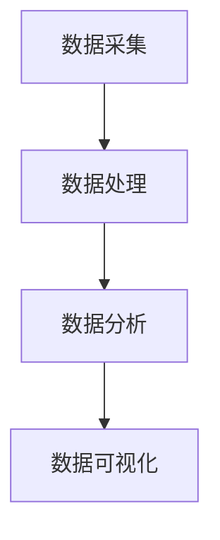

                 


# 特价股票投资中的产业链分析方法

> **关键词**：产业链分析、特价股票投资、投资策略、股票分析方法、投资风险管理  
> **摘要**：本文系统地介绍特价股票投资中的产业链分析方法，涵盖产业链的基本概念、分析方法、数学模型、系统架构设计及实战案例。通过逐步分析产业链的结构与协同效应，结合数学模型和算法原理，帮助投资者识别潜在投资机会，优化投资决策，降低投资风险。

---

## 第1章: 特价股票投资与产业链分析的背景

### 1.1 特价股票投资的定义与特点
#### 1.1.1 特价股票的定义
特价股票是指在特定市场环境下，由于市场波动、企业基本面变化或行业周期性调整，导致股票价格低于其内在价值的股票。这类股票通常具有较高的潜在回报，但同时也伴随着较高的风险。

#### 1.1.2 特价股票投资的特点
- **低估值**：价格远低于行业平均水平或历史平均水平。
- **周期性**：通常出现在市场低迷或行业低谷时期。
- **高波动性**：价格波动较大，容易受到市场情绪影响。
- **风险与机会并存**：投资者需要具备较强的风险承受能力和市场分析能力。

#### 1.1.3 特价股票与普通股票的区别
| 属性       | 特价股票                     | 普通股票                     |
|------------|------------------------------|------------------------------|
| 价格       | 低于内在价值                 | 接近或高于内在价值             |
| 投资策略   | 价值挖掘型投资                 | 综合型投资                     |
| 风险       | 高                           | 中或低                       |

### 1.2 产业链分析的基本概念
#### 1.2.1 产业链的定义
产业链是指从原材料供应、生产制造、分销到最终消费者的完整价值链。每个环节相互依存，协同工作，共同构成一个有机的整体。

#### 1.2.2 产业链的结构与层次
- **上游环节**：原材料供应商、设备制造商。
- **中游环节**：生产制造企业、加工企业。
- **下游环节**：分销商、零售商、消费者。

#### 1.2.3 产业链分析的意义
通过分析产业链的结构和各环节的竞争力，投资者可以更好地理解行业发展趋势，识别潜在的投资机会。

### 1.3 特价股票投资中的产业链分析方法
#### 1.3.1 产业链分析在投资中的作用
- **识别行业龙头**：通过分析产业链的关键环节，找到具有竞争优势的企业。
- **预测行业趋势**：通过分析产业链上下游的关系，预测行业未来的发展方向。
- **发现潜在投资机会**：通过分析产业链中的薄弱环节，发现具有增长潜力的企业。

#### 1.3.2 产业链分析的基本步骤
1. **确定行业**：选择一个具有增长潜力的行业。
2. **分析产业链结构**：了解产业链的上下游关系。
3. **评估各环节的竞争力**：找出具有竞争优势的企业。
4. **结合股票价格**：比较股票价格与内在价值，寻找低价高价值的投资机会。

#### 1.3.3 产业链分析的优势与局限性
- **优势**：帮助投资者更好地理解行业结构，发现潜在投资机会。
- **局限性**：需要大量的行业数据和专业知识，分析过程较为复杂。

---

## 第2章: 产业链分析的核心要素

### 2.1 产业链的关键环节
#### 2.1.1 上游环节
上游环节是产业链的起点，主要包括原材料供应商和设备制造商。这些环节的稳定性对整个产业链的运行至关重要。

#### 2.1.2 中游环节
中游环节是产业链的核心，主要包括生产制造企业和加工企业。这些环节的竞争力直接影响整个产业链的盈利能力。

#### 2.1.3 下游环节
下游环节是产业链的终点，主要包括分销商和零售商。这些环节的市场需求直接影响整个产业链的销售情况。

### 2.2 产业链的关联性与协同效应
#### 2.2.1 产业链各环节的协同关系
- **协同关系**：产业链各环节之间相互依存，协同工作，共同构成一个有机的整体。
- **协同效应**：通过优化产业链各环节的协同关系，提高整个产业链的效率和竞争力。

#### 2.2.2 协同效应对企业竞争力的影响
- **提高效率**：通过优化协同关系，减少浪费，提高效率。
- **降低成本**：通过协同效应，降低生产成本和运营成本。
- **增强竞争力**：通过协同效应，提高企业整体竞争力。

### 2.3 产业链的竞争力分析
#### 2.3.1 竞争力的定义与衡量标准
- **竞争力**：企业在全球市场中的竞争优势。
- **衡量标准**：市场占有率、成本优势、技术优势等。

#### 2.3.2 上下游企业竞争力对产业链整体的影响
- **上游企业竞争力**：上游企业的原材料供应能力和成本直接影响整个产业链的成本。
- **下游企业竞争力**：下游企业的市场需求和销售能力直接影响整个产业链的销售情况。

---

## 第3章: 产业链分析的数学模型与算法原理

### 3.1 产业链竞争力的量化模型
#### 3.1.1 模型的构建与假设
- **假设**：假设各环节的竞争力可以通过量化指标进行衡量。
- **输入变量**：各环节的竞争力指标。
- **输出变量**：整体产业链的竞争力评分。

#### 3.1.2 模型的数学表达式
$$
\text{整体竞争力评分} = \sum (\text{各环节竞争力评分} \times \text{权重})
$$

### 3.2 产业链协同效应的计算方法
#### 3.2.1 协同效应的度量指标
- **协同效应指标**：通过分析产业链各环节的协同关系，计算协同效应的大小。

#### 3.2.2 协同效应的计算公式
$$
\text{协同效应} = \frac{\text{协同关系的强度}}{\text{各环节的独立性}}
$$

### 3.3 产业链分析的算法原理
#### 3.3.1 数据预处理与特征提取
- **数据预处理**：对收集的数据进行清洗和标准化处理。
- **特征提取**：提取影响产业链竞争力的关键特征。

#### 3.3.2 算法选择与实现
- **算法选择**：选择适合的机器学习算法（如线性回归、决策树等）进行分析。
- **算法实现**：通过Python代码实现算法的训练和预测。

---

## 第4章: 产业链分析的系统设计与实现

### 4.1 系统架构设计
- **系统架构图**：通过Mermaid图展示系统的主要模块和它们之间的关系。



### 4.2 系统功能设计
- **功能模块**：
  - 数据采集：收集行业数据。
  - 数据处理：清洗和标准化数据。
  - 数据分析：使用数学模型进行分析。
  - 数据可视化：将分析结果以图表形式展示。

### 4.3 系统接口设计
- **接口设计**：定义系统与外部数据源和用户的接口。

---

## 第5章: 项目实战与案例分析

### 5.1 环境安装与数据采集
- **环境安装**：安装必要的Python库（如Pandas、NumPy等）。
- **数据采集**：通过网络爬虫或其他工具采集行业数据。

### 5.2 核心代码实现
```python
import pandas as pd
import numpy as np

# 数据清洗
data = pd.read_csv('industry_data.csv')
data = data.dropna()
data = data[~data['price'].isin(['', np.nan])]

# 竞争力评分计算
def compute_competitiveness(row):
    upstream = row['upstream_competitiveness']
    midstream = row['midstream_competitiveness']
    downstream = row['downstream_competitiveness']
    return upstream * 0.3 + midstream * 0.4 + downstream * 0.3

data['overall_competitiveness'] = data.apply(compute_competitiveness, axis=1)
```

### 5.3 案例分析
- **案例分析**：通过具体案例展示如何应用产业链分析方法进行投资决策。

---

## 第6章: 总结与注意事项

### 6.1 总结
- **总结**：回顾全文，强调产业链分析在特价股票投资中的重要性。

### 6.2 注意事项
- **风险提示**：提醒投资者注意市场波动、数据滞后等风险。
- **最佳实践**：建议投资者结合多种分析方法，制定合理的投资策略。

---

## 作者：AI天才研究院/AI Genius Institute & 禅与计算机程序设计艺术 /Zen And The Art of Computer Programming

---

通过本文的系统分析，读者可以全面了解特价股票投资中的产业链分析方法，掌握从理论到实践的完整流程。希望本文能为投资者提供有价值的参考，帮助他们在复杂多变的市场中找到潜在的投资机会，实现稳健的投资回报。

