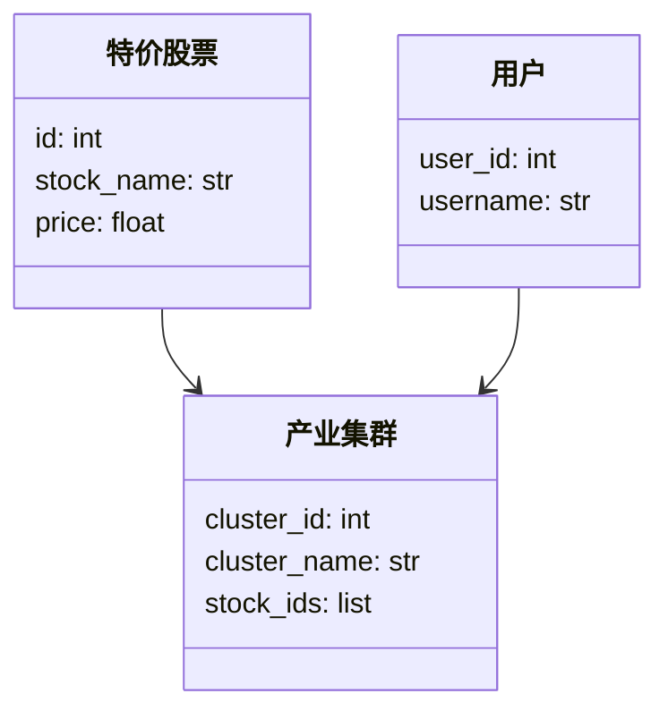
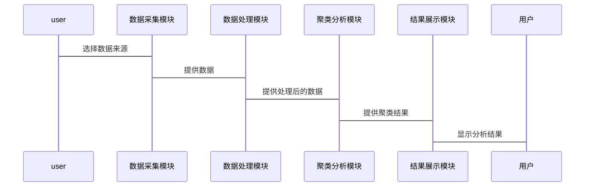

                 


# 特价股票投资中的产业集群分析方法

> 关键词：特价股票、产业集群分析、投资策略、数据挖掘、机器学习

> 摘要：本文系统地探讨了特价股票投资中的产业集群分析方法，结合数据挖掘、机器学习等技术，分析了产业集群的特征、影响因素及分析方法，详细阐述了算法实现、系统架构设计和实际案例分析，为投资者提供科学的决策支持。

---

# 第1章: 特价股票与产业集群分析概述

## 1.1 特价股票的基本概念

### 1.1.1 特价股票的定义与特点
特价股票是指价格相对较低的股票，通常具有较高的投资潜力。其特点包括：
- 价格低廉：通常在市场中属于低价股。
- 市场波动性较大：由于价格较低，容易受到市场情绪影响。
- 投资门槛低：适合中小投资者参与。

### 1.1.2 特价股票的投资价值分析
特价股票的投资价值主要体现在：
- 估值优势：许多特价股票可能被市场低估。
- 投资机会：低价股票容易出现反弹，带来超额收益。

### 1.1.3 产业集群的定义与特征
产业集群是指在特定区域内，相关企业和机构聚集形成的经济现象。其特征包括：
- 地域集中：企业集中在某一特定区域。
- 产业链完整：区域内企业之间形成完整的产业链。
- 协作紧密：企业之间存在密切的协作关系。

## 1.2 产业集群与股票投资的关系

### 1.2.1 产业集群的定义与分类
产业集群可以分为以下几类：
- 行业集群：同一行业内的企业聚集。
- 地区集群：同一地区内多个行业的企业聚集。

### 1.2.2 产业集群对股票投资的影响
产业集群对股票投资的影响主要体现在：
- 产业协同效应：产业集群内的企业之间可以形成协同效应，降低投资风险。
- 区域经济优势：产业集群往往集中在经济发达区域，具有较好的经济基础。

### 1.2.3 产业集群分析在投资决策中的作用
通过分析产业集群，投资者可以更好地识别投资机会和风险，优化投资组合。

## 1.3 特价股票产业集群分析的背景与意义

### 1.3.1 特价股票产业集群的形成背景
随着经济全球化的发展，许多企业选择在特定区域内聚集，形成产业集群。

### 1.3.2 产业集群分析在投资中的重要性
产业集群分析可以帮助投资者识别具有投资潜力的区域和行业。

### 1.3.3 研究特价股票产业集群的意义
通过研究特价股票产业集群，投资者可以发现潜在的投资机会，优化投资策略。

## 1.4 本章小结
本章介绍了特价股票和产业集群的基本概念，分析了产业集群对股票投资的影响，并探讨了研究特价股票产业集群的意义。

---

# 第2章: 特价股票产业集群的特征分析

## 2.1 特价股票产业集群的核心特征

### 2.1.1 产业集群的规模特征
产业集群的规模特征包括：
- 企业数量：集群内企业数量多。
- 产业集中度高：集群内企业集中于某一行业。

### 2.1.2 产业集群的结构特征
产业集群的结构特征包括：
- 产业链完整：集群内企业形成完整的产业链。
- 企业间协作紧密：企业之间存在密切的协作关系。

### 2.1.3 产业集群的竞争优势分析
产业集群的竞争优势包括：
- 成本优势：企业之间协作可以降低生产成本。
- 市场优势：产业集群往往能够更好地满足市场需求。

## 2.2 特价股票产业集群的关键影响因素

### 2.2.1 区域经济因素
区域经济因素包括：
- 经济发展水平：经济发达地区更容易形成产业集群。
- 区域政策支持：政府政策对产业集群的形成起着重要作用。

### 2.2.2 产业政策因素
产业政策因素包括：
- 产业政策的支持：政府对特定产业的政策支持有助于产业集群的形成。
- 产业规划：合理的产业规划可以促进产业集群的发展。

### 2.2.3 市场需求因素
市场需求因素包括：
- 市场需求的多样性：多样化的市场需求可以促进产业集群的发展。
- 市场竞争程度：适度的市场竞争可以推动产业集群的形成。

## 2.3 特价股票产业集群的生命周期分析

### 2.3.1 产业集群的形成阶段
形成阶段的特点：
- 企业数量较少，产业集中度低。
- 企业之间的协作关系尚未形成。

### 2.3.2 产业集群的成长阶段
成长阶段的特点：
- 企业数量增加，产业集中度提高。
- 企业之间的协作关系逐渐加强。

### 2.3.3 产业集群的成熟阶段
成熟阶段的特点：
- 产业集群内企业数量稳定，产业集中度高。
- 企业之间的协作关系成熟。

## 2.4 本章小结
本章分析了特价股票产业集群的核心特征、关键影响因素及其生命周期，为后续的分析方法奠定了基础。

---

# 第3章: 特价股票产业集群的分析方法

## 3.1 数据收集与处理方法

### 3.1.1 数据来源与收集渠道
数据来源包括：
- 证券交易所：获取股票价格、成交量等数据。
- 企业年报：获取企业财务数据。
- 政府统计：获取区域经济数据。

### 3.1.2 数据清洗与预处理
数据清洗的步骤：
1. 数据去重：去除重复数据。
2. 数据补全：填补缺失值。
3. 数据标准化：统一数据格式。

### 3.1.3 数据标准化与特征提取
特征提取的方法：
- 主成分分析（PCA）：降低数据维度。
- 聚类分析：识别数据中的潜在集群。

## 3.2 特价股票产业集群的定量分析方法

### 3.2.1 统计分析方法
统计分析方法包括：
- 描述性统计：计算均值、方差等统计指标。
- 相关性分析：分析变量之间的相关性。

### 3.2.2 聚类分析方法
聚类分析的步骤：
1. 数据预处理：标准化数据。
2. 选择聚类算法：如K-means算法。
3. 聚类实现：将数据分成若干簇。
4. 结果分析：分析各簇的特征。

### 3.2.3 回归分析方法
回归分析的应用：
- 预测股票价格：建立回归模型，预测股票价格的变化。

## 3.3 特价股票产业集群的定性分析方法

### 3.3.1 产业链分析方法
产业链分析的步骤：
1. 确定产业链结构。
2. 分析各环节之间的关系。
3. 识别关键环节。

### 3.3.2 价值链分析方法
价值链分析的步骤：
1. 确定企业价值链。
2. 分析各环节的成本和收益。
3. 识别竞争优势。

### 3.3.3 竞争优势分析方法
竞争优势分析的方法：
- SWOT分析：分析企业的优势、劣势、机会和威胁。

## 3.4 本章小结
本章详细介绍了特价股票产业集群的分析方法，包括数据收集与处理、定量分析和定性分析方法。

---

# 第4章: 特价股票产业集群分析的算法实现

## 4.1 聚类分析算法原理

### 4.1.1 K-means算法原理
K-means算法的步骤：
1. 初始化：随机选择K个质心。
2. 聚类：将数据点分配到最近的质心。
3. 更新：计算新的质心。
4. 重复：直到质心不再变化。

### 4.1.2 聚类分析的实现步骤
1. 数据预处理：标准化数据。
2. 选择K值：通过肘部法选择最优K值。
3. 聚类实现：使用K-means算法进行聚类。
4. 结果分析：分析各簇的特征。

### 4.1.3 代码实现
```python
from sklearn.cluster import KMeans
from sklearn.preprocessing import StandardScaler
import numpy as np

# 数据预处理
data = np.array([[1, 2], [3, 4], [5, 6]])
scaler = StandardScaler()
data_scaled = scaler.fit_transform(data)

# 聚类实现
kmeans = KMeans(n_clusters=2, random_state=0)
kmeans.fit(data_scaled)

# 结果分析
print(kmeans.labels_)
```

## 4.2 算法实现的注意事项

### 4.2.1 数据预处理的重要性
数据预处理可以提高聚类的效果，确保算法的准确性。

### 4.2.2 算法选择的影响
选择合适的算法可以提高聚类的准确率，降低误分类率。

### 4.2.3 聚类结果的解释
聚类结果需要结合实际业务背景进行解释，才能更好地支持投资决策。

## 4.3 本章小结
本章详细讲解了聚类分析的算法原理和实现步骤，并给出了Python代码示例。

---

# 第5章: 特价股票产业集群分析的系统架构设计

## 5.1 系统功能设计

### 5.1.1 领域模型设计
领域模型的类图：


### 5.1.2 系统功能模块
系统功能模块包括：
- 数据采集模块：采集股票数据。
- 数据处理模块：处理数据，提取特征。
- 聚类分析模块：进行聚类分析。
- 结果展示模块：展示分析结果。

## 5.2 系统架构设计

### 5.2.1 系统架构图
系统架构图：
```mermaid
containerDiagram
    container 系统架构 {
        component 数据采集模块
        component 数据处理模块
        component 聚类分析模块
        component 结果展示模块
    }
```

### 5.2.2 系统接口设计
系统接口包括：
- 数据接口：与数据源对接。
- 用户接口：供用户进行操作。

## 5.3 系统交互设计

### 5.3.1 用户与系统交互流程
用户与系统交互流程：
1. 用户登录系统。
2. 用户选择数据采集模块，输入数据来源。
3. 系统采集数据并进行处理。
4. 用户选择聚类分析模块，输入参数。
5. 系统进行聚类分析并展示结果。

### 5.3.2 交互序列图
交互序列图：


## 5.4 本章小结
本章设计了系统的功能模块、架构和交互流程，为实际应用提供了指导。

---

# 第6章: 特价股票产业集群分析的项目实战

## 6.1 项目环境安装

### 6.1.1 Python环境安装
安装Python和必要的库：
- pip install numpy
- pip install pandas
- pip install scikit-learn

### 6.1.2 数据库安装
安装MySQL或其他数据库。

## 6.2 项目核心实现

### 6.2.1 数据采集与处理
```python
import pandas as pd
from sklearn.preprocessing import StandardScaler

# 数据采集
data = pd.read_csv('stock_data.csv')

# 数据处理
scaler = StandardScaler()
data_scaled = scaler.fit_transform(data)
```

### 6.2.2 聚类分析实现
```python
from sklearn.cluster import KMeans

# 聚类实现
kmeans = KMeans(n_clusters=3, random_state=0)
kmeans.fit(data_scaled)

# 结果保存
clusters = pd.DataFrame({'stock_id': data.index, 'cluster': kmeans.labels_})
clusters.to_csv('clusters.csv', index=False)
```

### 6.2.3 结果展示
```python
import matplotlib.pyplot as plt

# 绘制聚类结果
plt.scatter(data_scaled[:, 0], data_scaled[:, 1], c=kmeans.labels_)
plt.show()
```

## 6.3 项目小结
本章通过实际项目展示了如何利用Python和机器学习算法进行产业集群分析，为投资者提供科学的决策支持。

---

# 作者：AI天才研究院 & 禅与计算机程序设计艺术

---

以上是《特价股票投资中的产业集群分析方法》的完整目录大纲，内容涵盖从基础概念到算法实现、系统设计和项目实战的全过程。通过系统化的分析和实际案例的讲解，读者可以全面掌握特价股票投资中的产业集群分析方法。

