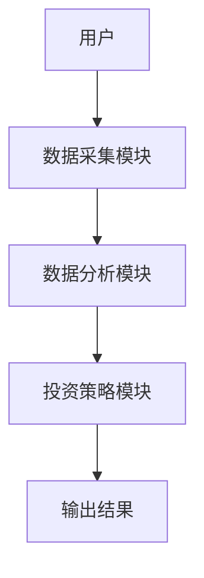
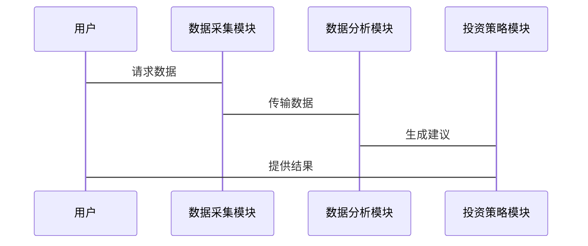

                 


# 特价股票投资中的人口结构变化趋势考量

> 关键词：人口结构变化、特价股票、投资策略、经济影响、数据分析

> 摘要：本文探讨了人口结构变化对特价股票投资的影响，分析了不同年龄段人口的消费习惯和投资行为，提出了基于人口结构变化的量化分析方法和投资策略。通过实际案例分析，展示了如何利用人口结构变化趋势来优化投资组合，降低风险，提高收益。

---

## 第1章: 人口结构变化与特价股票投资的背景介绍

### 1.1 人口结构变化的基本概念

#### 1.1.1 人口结构的定义与组成
人口结构是指一个国家或地区人口按年龄、性别、职业等因素的分布情况。主要组成部分包括：
- 年龄结构：不同年龄段人口的分布，分为少儿、青年、壮年和老年。
- 性别结构：男性和女性人口的比例。
- 职业结构：不同职业人口的分布。

#### 1.1.2 人口结构变化的驱动因素
- 自然因素：出生率、死亡率、寿命延长。
- 社会因素：经济发展、教育水平、医疗条件。
- 政策因素：计划生育政策、移民政策、社会保障制度。

#### 1.1.3 人口结构变化对经济的影响
- 劳动力供给：直接影响经济增长和产业结构。
- 消费需求：不同年龄段人口的消费习惯影响市场需求。
- 财政压力：老龄化导致医疗、养老支出增加。

### 1.2 特价股票投资的定义与特点

#### 1.2.1 特价股票的定义
特价股票是指价格低于其内在价值的股票，通常具有较高的投资潜力，但可能暂时被市场低估。

#### 1.2.2 特价股票投资的核心要素
- 估值：市盈率、市净率等指标。
- 公司基本面：盈利能力、财务状况。
- 行业地位：市场占有率、竞争能力。

#### 1.2.3 特价股票与普通股票的区别
- 价格弹性：特价股票价格波动较大，普通股票相对稳定。
- 投资风险：特价股票风险较高，普通股票风险较低。
- 投资策略：特价股票需要深入研究和长期持有，普通股票适合短期交易。

### 1.3 人口结构变化与特价股票投资的关系

#### 1.3.1 人口结构变化如何影响股市
- 投资者行为：老龄化导致更多资金流入低风险资产。
- 行业需求：年轻人口推动科技和消费行业增长。
- 市场情绪：人口结构变化影响市场整体走势。

#### 1.3.2 特价股票投资中的机会与风险
- 机会：老龄化推动医疗、养老等行业的投资机会。
- 风险：人口结构变化可能导致某些行业需求下降。

#### 1.3.3 人口结构变化对投资者决策的影响
- 投资策略调整：根据人口结构变化调整行业配置。
- 风险管理：关注老龄化带来的系统性风险。

---

## 第2章: 人口结构变化对经济和股市的影响分析

### 2.1 不同年龄段人口的消费习惯与投资行为

#### 2.1.1 年轻人口的消费倾向
- 更多关注科技、消费和服务行业。
- 投资行为偏向高增长股票，风险承受能力较强。

#### 2.1.2 中年人口的储蓄与投资行为
- 偏好稳健投资，如债券、房地产和蓝筹股。
- 更注重资产保值和长期收益。

#### 2.1.3 老年人口的资产配置特点
- 偏好低风险资产，如国债、银行理财和 dividend stocks。
- 对医疗、养老等行业的投资偏好较高。

### 2.2 人口老龄化对股市的影响

#### 2.2.1 人口老龄化对经济增长的抑制作用
- 劳动力减少，经济增长放缓。
- 消费需求下降，企业盈利能力降低。

#### 2.2.2 老龄人口对股市资金流动的影响
- 更多资金流入低风险资产，导致股市资金减少。
- 增加对 dividend stocks 的需求，推动相关股票价格上涨。

#### 2.2.3 股市收益与人口年龄结构的相关性
- 老龄化加剧可能导致股市长期回报下降。
- 年轻人口比例增加会推动股市增长。

### 2.3 人口结构变化对行业选择的影响

#### 2.3.1 不同行业对人口结构的敏感性
- 医疗行业：老龄化直接推动需求增长。
- 消费行业：年轻人口推动需求。
- 制造业：老龄化可能导致劳动力短缺。

#### 2.3.2 人口结构变化对行业景气度的影响
- 老龄化行业：医疗、养老等行业的景气度上升。
- 年轻化行业：科技、互联网行业的景气度上升。

#### 2.3.3 行业选择中的机会与风险
- 投资医疗行业需关注政策风险。
- 投资科技行业需关注技术风险。

---

## 第3章: 特价股票投资中的人口结构变化量化分析

### 3.1 人口结构变化的量化指标

#### 3.1.1 人口年龄分布的指标
- 年龄中位数：衡量人口年龄的集中程度。
- 老龄人口比例：65岁以上人口占总人口的比例。

#### 3.1.2 人口增长与结构变化的衡量方法
- 净增长：人口增长的绝对值。
- 结构变化：不同年龄段人口的比例变化。

#### 3.1.3 人口结构变化的周期性分析
- 长周期：人口结构变化的长期趋势。
- 短周期：经济波动对人口结构的短期影响。

### 3.2 特价股票投资中的数据采集与处理

#### 3.2.1 数据来源与获取方法
- 公开数据：政府统计年鉴、公司财报。
- 第三方数据：金融数据平台、学术研究数据。

#### 3.2.2 数据清洗与预处理
- 数据清洗：去除无效数据、填补缺失值。
- 数据转换：标准化、归一化处理。

#### 3.2.3 数据分析工具与技术
- 数据可视化：Python的matplotlib、seaborn。
- 数据分析：Python的pandas、numpy。
- 统计分析：SPSS、R。

### 3.3 人口结构变化对股票估值的影响

#### 3.3.1 人口结构变化对市盈率的影响
- 市盈率公式：$$ P/E = \text{股价} / \text{每股收益} $$
- 老龄化可能导致市盈率下降。

#### 3.3.2 人口结构变化对市净率的影响
- 市净率公式：$$ P/B = \text{股价} / \text{每股净资产} $$
- 年轻化可能推高市净率。

#### 3.3.3 人口结构变化对股息率的影响
- 股息率公式：$$ \text{股息率} = \text{每股股息} / \text{股价} \times 100\% $$
- 老龄化可能导致股息率上升。

---

## 第4章: 基于人口结构变化的特价股票投资策略

### 4.1 投资策略的制定原则

#### 4.1.1 风险与收益的平衡
- 考虑人口结构变化带来的系统性风险。
- 平衡高收益与低风险。

#### 4.1.2 长期与短期策略的结合
- 长期策略：关注人口结构变化的长期趋势。
- 短期策略：抓住短期市场波动机会。

#### 4.1.3 量化与定性分析的结合
- 量化分析：利用数据模型预测趋势。
- 定性分析：结合行业基本面分析。

### 4.2 投资组合优化

#### 4.2.1 行业配置策略
- 医疗行业：老龄化带来的投资机会。
- 科技行业：年轻人口推动的高增长。

#### 4.2.2 股票筛选策略
- 选择具有增长潜力的公司。
- 关注公司财务状况和行业地位。

#### 4.2.3 风险管理策略
- 设置止损点。
- 分散投资组合。

### 4.3 投资策略的实施步骤

#### 4.3.1 确定投资目标
- 确定风险承受能力。
- 设定投资期限。

#### 4.3.2 数据收集与分析
- 收集人口结构数据。
- 分析数据对股票估值的影响。

#### 4.3.3 制定投资计划
- 确定投资组合。
- 制定买卖时机。

#### 4.3.4 监控与调整
- 定期评估投资组合。
- 根据市场变化调整策略。

---

## 第5章: 数学模型与算法原理

### 5.1 时间序列分析模型

#### 5.1.1 ARIMA模型
- 算法流程：
  1. 确定数据的平稳性。
  2. 选择模型参数。
  3. 模型拟合与验证。
  4. 预测与误差分析。

#### 5.1.2 模型实现
```python
import pandas as pd
from statsmodels.tsa.arima_model import ARIMA

data = pd.read_csv('stock_price.csv')
model = ARIMA(data, order=(1, 1, 1))
model_fit = model.fit()
预测结果 = model_fit.forecast(steps=10)
```

#### 5.1.3 案例分析
- 数据来源：某公司股票价格。
- 分析结果：预测未来10天的股票价格。

### 5.2 多元回归模型

#### 5.2.1 模型原理
- 回归方程：$$ y = \beta_0 + \beta_1x_1 + \beta_2x_2 + \cdots + \beta_nx_n + \epsilon $$
- 解释变量：人口结构指标。
- 因变量：股票价格。

#### 5.2.2 模型实现
```python
import statsmodels.api as sm

X = data[['x1', 'x2', ..., 'xn']]
y = data['y']
model = sm.OLS(y, sm.add_constant(X))
result = model.fit()
```

#### 5.2.3 应用场景
- 预测股票价格受人口结构变化的影响。

### 5.3 机器学习算法

#### 5.3.1 支持向量机（SVM）
- 算法流程：
  1. 数据预处理。
  2. 核函数选择。
  3. 模型训练。
  4. 模型预测。

#### 5.3.2 神经网络（ANN）
- 模型结构：输入层、隐藏层、输出层。
- 激活函数：ReLU、sigmoid。
- 优化器：Adam、SGD。

#### 5.3.3 案例分析
- 数据来源：人口结构与股票价格数据。
- 分析结果：预测股票价格的变化趋势。

---

## 第6章: 系统架构与项目实战

### 6.1 系统功能设计

#### 6.1.1 数据采集模块
- 功能：收集人口结构数据和股票数据。
- 实现：使用爬虫技术采集数据。

#### 6.1.2 数据分析模块
- 功能：分析数据，生成投资建议。
- 实现：使用Python的pandas和numpy库。

#### 6.1.3 投资策略模块
- 功能：根据分析结果制定投资策略。
- 实现：基于机器学习模型生成策略。

### 6.2 系统架构设计

#### 6.2.1 系统架构图


#### 6.2.2 系统接口设计
- 数据接口：REST API。
- 用户接口：Web界面。

#### 6.2.3 系统交互流程


### 6.3 项目实战

#### 6.3.1 环境安装
- 安装Python和相关库：pandas、numpy、statsmodels、scikit-learn。
- 安装Jupyter Notebook用于数据可视化。

#### 6.3.2 核心实现代码
```python
import pandas as pd
import numpy as np
from sklearn import linear_model

data = pd.read_csv('population.csv')
X = data[['age', 'income', 'education']]
y = data['stock_price']

model = linear_model.LinearRegression()
model.fit(X, y)
预测结果 = model.predict(X)
```

#### 6.3.3 应用案例分析
- 数据来源：某地区的人口结构与股票价格数据。
- 分析结果：预测未来股票价格走势。

---

## 第7章: 总结与展望

### 7.1 小结
本文详细探讨了人口结构变化对特价股票投资的影响，提出了基于量化分析的投资策略，并通过实际案例进行了验证。

### 7.2 注意事项
- 数据质量：确保数据的准确性和完整性。
- 模型选择：根据实际情况选择合适的算法。
- 风险管理：制定合理的风险管理策略。

### 7.3 拓展阅读
- 《投资学基础》
- 《人口经济学》
- 《机器学习在金融中的应用》

---

作者：AI天才研究院/AI Genius Institute & 禅与计算机程序设计艺术 /Zen And The Art of Computer Programming

