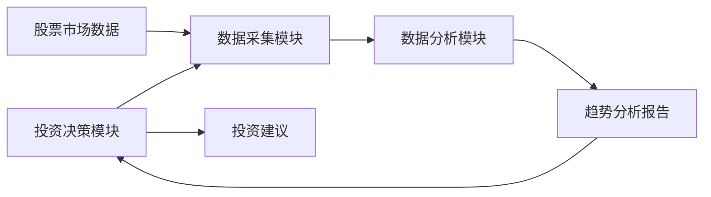

                 


# 特价股票投资中的人口结构红利趋势考量

> **关键词**：人口结构红利、股票投资、趋势分析、量化分析、系统架构

> **摘要**：本文探讨了人口结构红利对特价股票投资的影响，从背景、机制、量化分析到系统架构和实战案例，详细分析了如何利用人口结构红利趋势进行投资决策。

---

## 第1章: 人口结构红利与股票投资的背景介绍

### 1.1 人口结构红利的基本概念

#### 1.1.1 人口红利的定义与特征
人口红利是指由于人口结构的优化，尤其是劳动年龄人口占比高，带来的经济增长潜力。其主要特征包括：
- **劳动年龄人口占比高**：通常指15-64岁人口占比高。
- **人口抚养比低**：少儿抚养比和老年抚养比低，减少社会负担。
- **人口结构动态变化**：随着经济发展和医疗进步，人口结构不断变化。

#### 1.1.2 人口结构红利对经济的推动作用
人口红利通过增加劳动力供给、降低抚养比，推动经济增长，从而影响股市整体表现。例如，劳动年龄人口增加带来生产力提升，推动企业盈利增长。

#### 1.1.3 人口结构红利与股票投资的关联性
人口结构变化影响行业需求和企业盈利，进而影响股票价格。例如，老龄化社会可能增加医疗行业需求，推动相关股票上涨。

### 1.2 特价股票投资的定义与特点

#### 1.2.1 特价股票的定义与分类
- **特价股票**：指市盈率、市净率等估值指标低于市场平均水平的股票。
- **分类**：包括周期性股票、价值型股票和低估值成长股。

#### 1.2.2 特价股票市场的基本特征
- **价格波动大**：受市场情绪和行业周期影响显著。
- **价值洼地**：短期被市场忽视，但长期具有增长潜力。
- **高波动性**：适合短期交易和长期投资结合。

#### 1.2.3 特价股票投资的潜在收益与风险
- **收益**：通过低估值股票的估值修复获取收益。
- **风险**：市场波动大，行业风险高，可能面临长期亏损。

---

## 第2章: 人口结构红利对股票投资的影响机制

### 2.1 人口结构与经济周期的关系

#### 2.1.1 不同年龄段人口对经济活动的影响
- **劳动年龄人口**：推动经济增长，增加企业盈利。
- **少儿人口**：增加教育支出，影响消费结构。
- **老年人口**：增加医疗支出，影响社会福利。

#### 2.1.2 人口老龄化对经济的潜在影响
- **劳动力短缺**：推高企业用工成本。
- **社保压力增加**：影响政府财政支出。
- **消费结构变化**：增加 healthcare 和养老服务需求。

#### 2.1.3 人口红利对经济增长的推动作用
- 通过增加劳动力供给和提高生产效率，推动 GDP 增长。
- 人口红利与技术创新相互作用，推动产业升级。

### 2.2 人口结构与股票市场的互动关系

#### 2.2.1 人口结构变化对股票需求的影响
- **需求变化**：老龄化增加 healthcare 类股票需求，年轻化增加消费类股票需求。
- **市场情绪**：人口结构变化影响投资者对市场的信心。

#### 2.2.2 人口结构对行业选择的指导作用
- **老龄化社会**：医疗、养老行业需求增加。
- **年轻化社会**：消费、科技行业增长潜力大。

#### 2.2.3 人口结构对股票估值的影响
- **行业估值调整**：人口红利相关行业估值可能被高估或低估。
- **个股估值变化**：公司所处行业的人口结构变化影响其估值。

---

## 第3章: 人口结构红利趋势的量化分析方法

### 3.1 人口结构红利的统计分析方法

#### 3.1.1 人口统计数据的收集与整理
- **数据来源**：政府统计年鉴、人口普查数据、行业报告。
- **数据清洗**：处理缺失值、异常值，确保数据准确。

#### 3.1.2 人口结构红利的指标体系设计
- **主要指标**：劳动年龄人口占比、人口抚养比、老龄化程度。
- **辅助指标**：人口增长速度、城乡人口结构、人口迁移数据。

#### 3.1.3 数据分析工具与方法的选择
- **工具**：Python（Pandas、NumPy）、R、Excel。
- **方法**：趋势分析、回归分析、时间序列分析。

### 3.2 人口结构红利的数学模型构建

#### 3.2.1 人口结构红利的数学模型框架
- **基本模型**：使用线性回归模型预测人口红利对股票收益的影响。
- **改进模型**：引入时间序列模型（如ARIMA）捕捉趋势变化。

#### 3.2.2 模型的假设条件与变量定义
- **假设条件**：数据充分性、变量独立性、模型线性性。
- **变量定义**：人口红利指数、股票收益、行业风险因子。

#### 3.2.3 模型的验证与优化
- **验证方法**：R²检验、残差分析、交叉验证。
- **优化方法**：参数调整、模型组合、机器学习算法引入。

---

## 第4章: 特价股票投资中的趋势分析

### 4.1 人口结构红利对行业选择的影响

#### 4.1.1 不同行业对人口结构红利的敏感性分析
- **高敏感行业**：医疗、养老、教育。
- **低敏感行业**：能源、原材料。

#### 4.1.2 人口红利对消费行业的推动作用
- **消费增长**：年轻人口增加推动消费增长。
- **行业选择**：选择受益于人口红利的消费细分行业。

#### 4.1.3 人口红利对科技行业的潜在影响
- **技术创新**：人口红利推动技术创新，利好科技行业。
- **人才需求**：年轻人口增加推动科技行业人才需求。

### 4.2 人口红利对个股选择的影响

#### 4.2.1 人口红利对个股估值的影响
- **估值调整**：人口红利相关个股估值可能被市场高估或低估。
- **估值修复**：通过价值发现，低价股票可能迎来估值修复。

#### 4.2.2 人口红利对个股成长性的预测作用
- **成长潜力**：人口红利相关行业个股具有较高的成长潜力。
- **成长风险**：老龄化行业个股可能面临增长放缓风险。

#### 4.2.3 人口红利对个股风险的评估作用
- **行业风险**：老龄化行业风险较高。
- **个股风险**：公司治理、财务状况影响个股风险。

---

## 第5章: 人口结构红利趋势分析的系统分析与架构设计

### 5.1 人口结构红利趋势分析的系统框架

#### 5.1.1 系统功能模块划分
- **数据采集模块**：收集人口统计数据和股票数据。
- **数据分析模块**：进行趋势分析和模型预测。
- **投资决策模块**：基于分析结果制定投资策略。

#### 5.1.2 系统输入输出设计
- **输入**：人口数据、股票数据、市场数据。
- **输出**：趋势分析报告、投资建议、风险评估。

#### 5.1.3 系统数据流图


### 5.2 人口结构红利趋势分析的算法实现

#### 5.2.1 数据预处理与清洗
```python
import pandas as pd

# 加载数据
data = pd.read_csv('population.csv')

# 处理缺失值
data.dropna(inplace=True)

# 去重
data.drop_duplicates(inplace=True)
```

#### 5.2.2 数据特征提取与选择
```python
# 提取劳动年龄人口占比
data['labor_force_ratio'] = data['labor_age_population'] / data['total_population']

# 选择关键特征
selected_features = ['labor_force_ratio', 'elderly_ratio']
data = data[selected_features]
```

#### 5.2.3 机器学习算法的选择与实现
```python
from sklearn.linear_model import LinearRegression

# 训练模型
model = LinearRegression()
model.fit(X_train, y_train)

# 预测
y_pred = model.predict(X_test)
```

---

## 第6章: 人口结构红利趋势分析的项目实战

### 6.1 项目背景与目标

#### 6.1.1 项目背景介绍
- **背景**：老龄化加剧，寻找受益于人口红利的行业。
- **目标**：通过分析人口结构，寻找低估股票投资机会。

### 6.2 项目核心实现

#### 6.2.1 数据收集与处理
```python
import pandas as pd

# 加载数据
data = pd.read_csv('population.csv')

# 数据清洗
data.dropna(inplace=True)
```

#### 6.2.2 模型训练与优化
```python
from sklearn.ensemble import RandomForestRegressor

# 训练模型
model = RandomForestRegressor()
model.fit(X_train, y_train)

# 优化参数
from sklearn.model_selection import GridSearchCV

param_grid = {'n_estimators': [10, 20, 30]}
grid_search = GridSearchCV(model, param_grid, cv=5)
grid_search.fit(X_train, y_train)
best_model = grid_search.best_estimator_
```

#### 6.2.3 结果分析与解读
- **分析结果**：预测特定行业的股票收益。
- **解读**：根据预测结果制定投资策略。

### 6.3 项目案例分析

#### 6.3.1 案例背景介绍
- **案例**：分析老龄化社会下的医疗行业投资机会。

#### 6.3.2 数据分析与结果展示
- **分析**：医疗行业需求增加，相关股票可能被低估。
- **结果**：医疗行业股票具有较高的投资价值。

#### 6.3.3 投资策略制定
- **策略**：买入低估医疗行业股票，长期持有。

---

## 总结与注意事项

### 总结
人口结构红利是影响股票投资的重要因素，通过量化分析和系统设计，投资者可以更好地把握投资机会。

### 注意事项
- **数据质量**：确保数据准确性和完整性。
- **模型局限性**：考虑模型假设和数据偏差。
- **持续学习**：关注人口结构变化和市场动态。

### 最佳实践 tips
- **定期复盘**：评估投资策略效果。
- **风险控制**：设定止损点，分散投资。

---

**作者**：AI天才研究院/AI Genius Institute & 禅与计算机程序设计艺术 /Zen And The Art of Computer Programming

---

以上是完整的文章内容，涵盖了从理论到实战的各个方面，希望对您有所帮助！

