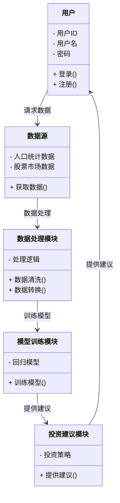
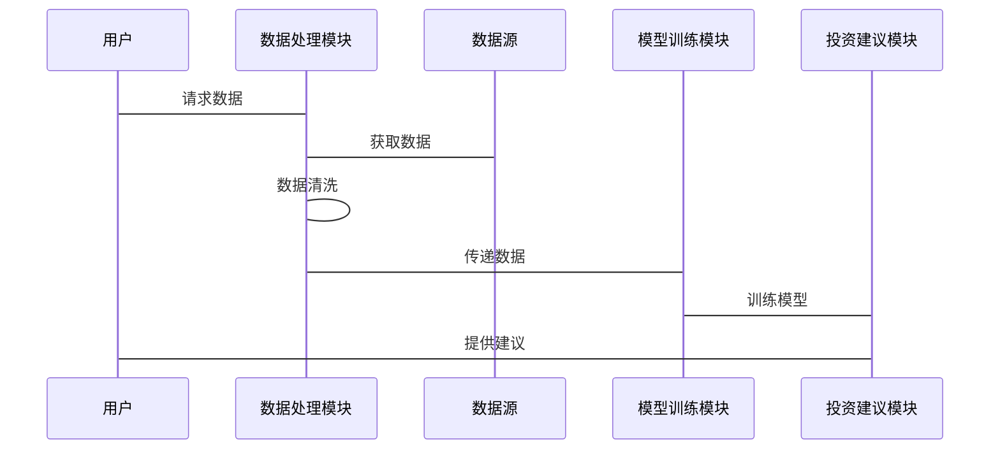

                 


# 特价股票投资中的人口统计学趋势考量

> **关键词**：特价股票、人口统计学、趋势分析、投资策略、回归分析、股票市场、数据驱动

> **摘要**：本文探讨了在特价股票投资中如何利用人口统计学趋势进行分析和决策。通过介绍人口统计学的核心概念，分析人口结构变化对股票市场的影响，构建基于人口统计学的选股策略，并结合数学模型和算法实现，为投资者提供数据驱动的决策支持。

---

## 第1章: 特价股票投资与人口统计学趋势概述

### 1.1 特价股票投资的基本概念

#### 1.1.1 特价股票的定义与特点

特价股票通常指市盈率、市净率等估值指标低于市场平均水平的股票。这些股票往往被认为具有较高的投资价值，但同时也可能面临被市场忽视或低估的情况。特价股票的特点包括低估值、高分红潜力以及较高的安全边际。

#### 1.1.2 特价股票投资的背景与现状

近年来，随着市场波动加剧，投资者越来越关注低估值股票的投资机会。特价股票因其潜在的反弹空间，吸引了越来越多的资金流入。然而，如何在众多特价股票中筛选出具有长期增长潜力的标的，成为投资者面临的挑战。

#### 1.1.3 人口统计学在股票投资中的应用潜力

人口统计学研究的是人口的结构、分布及其变化趋势。通过分析人口的年龄、性别、收入、教育水平等特征，可以预测未来的消费趋势、劳动力市场变化以及宏观经济走势，进而影响股票市场的表现。将人口统计学应用于特价股票投资，可以帮助投资者更好地把握市场趋势。

---

### 1.2 人口统计学趋势的核心概念

#### 1.2.1 人口统计学的基本概念

人口统计学是研究人口特征及其变化规律的学科。主要研究的指标包括人口数量、年龄结构、性别比例、教育水平、收入分布、地理位置等。这些指标能够反映社会的经济状况、文化特征以及未来的发展趋势。

#### 1.2.2 人口统计学趋势的定义与分类

人口统计学趋势是指在一定时期内，人口特征的变化方向和速度。趋势可以分为长期趋势和短期波动，通常通过时间序列分析来预测未来的人口结构变化。

#### 1.2.3 人口统计学趋势对股票市场的潜在影响

人口结构的变化会影响消费习惯、劳动力供给、企业盈利能力和政策制定，进而影响股票市场的表现。例如，人口老龄化可能导致医疗行业的需求增加，而年轻人口的增长可能推动科技行业的发展。

---

### 1.3 本章小结

本章介绍了特价股票投资的基本概念和人口统计学的核心概念，强调了人口统计学在股票投资中的应用潜力。通过分析人口结构变化对市场的影响，为后续的策略构建奠定了基础。

---

## 第2章: 人口结构变化与股票市场的关联性

### 2.1 人口结构变化的多维度分析

#### 2.1.1 年龄结构对股票市场的影响

人口老龄化可能导致医疗、养老等行业的投资机会增加，而年轻人口的增长可能推动科技和消费行业的增长。通过分析年龄结构，投资者可以更好地把握行业的未来发展趋势。

#### 2.1.2 性别结构对股票市场的影响

性别结构可能影响消费习惯和投资偏好。例如，女性投资者可能更倾向于关注消费品和医疗行业，而男性投资者可能更关注科技和金融行业。

#### 2.1.3 地域分布对股票市场的影响

不同地区的经济发展水平和人口密度差异，会影响股票市场的区域表现。例如，人口集中地区的企业可能具有更强的市场竞争力。

---

### 2.2 人口统计学指标与股票价格的相关性分析

#### 2.2.1 人口增长率与股票市场的相关性

人口增长率影响经济增长和企业盈利能力，进而影响股票价格。通常，人口增长较快的地区，经济增长潜力较大，股票市场表现也可能较好。

#### 2.2.2 人口老龄化与股票市场的相关性

人口老龄化可能导致医疗、养老等行业的投资机会增加，但同时也可能增加社会福利支出，影响政府财政状况。

#### 2.2.3 其他人口统计指标对股票市场的影响

收入水平、教育水平等指标也会影响消费习惯和企业盈利能力，进而影响股票市场的表现。

---

### 2.3 人口统计学趋势对股票市场波动的预测模型

#### 2.3.1 基于人口统计学的股票价格预测模型

通过回归分析等方法，将人口统计学指标与股票价格相关联，构建预测模型。

#### 2.3.2 模型的优缺点分析

优点：能够捕捉人口结构变化对市场的长期影响；缺点：短期波动难以预测，且模型假设可能与实际情况不符。

---

### 2.4 本章小结

本章分析了人口结构变化对股票市场的影响，并构建了基于人口统计学的股票价格预测模型。通过对比不同人口统计指标对股票市场的相关性，为后续的策略构建提供了数据支持。

---

## 第3章: 基于人口统计学的选股策略

### 3.1 人口统计学驱动的选股逻辑

#### 3.1.1 人口结构变化与行业选择的关系

根据人口结构变化，选择具有增长潜力的行业。例如，人口老龄化可能导致医疗行业的需求增加。

#### 3.1.2 人口统计学指标与个股估值的关系

通过分析个股所在行业的市场规模和增长潜力，结合公司财务状况，筛选具有投资价值的特价股票。

#### 3.1.3 特价股票在人口统计学策略中的定位

特价股票通常具有低估值特征，适合在人口结构变化中寻找具有长期增长潜力的行业。

---

### 3.2 特价股票投资中的风险控制策略

#### 3.2.1 人口统计学趋势的不确定性分析

人口结构变化受政策、经济和文化等多重因素影响，具有一定的不确定性。

#### 3.2.2 风险控制的多维度考量

通过分散投资、设置止损位等方法，降低投资风险。

#### 3.2.3 特价股票投资中的分散化策略

通过投资多个行业的特价股票，降低行业风险。

---

### 3.3 本章小结

本章提出了基于人口统计学的选股策略，并强调了风险控制的重要性。通过分析人口结构变化对行业的影响，投资者可以更好地筛选具有长期增长潜力的特价股票。

---

## 第4章: 人口统计学趋势分析的数学模型与算法实现

### 4.1 回归分析模型

#### 4.1.1 线性回归模型

通过将人口统计学指标作为自变量，股票价格作为因变量，建立线性回归模型。

$$ y = \beta_0 + \beta_1x_1 + \beta_2x_2 + ... + \beta_nx_n $$

其中，$y$为股票价格，$x_i$为人口统计学指标，$\beta_i$为回归系数。

#### 4.1.2 回归分析的实现步骤

1. 数据收集：获取人口统计学指标和股票价格数据。
2. 数据预处理：对数据进行标准化或归一化处理。
3. 模型训练：使用最小二乘法估计回归系数。
4. 模型验证：通过交叉验证评估模型的拟合效果。

---

### 4.2 机器学习算法的应用

#### 4.2.1 支持向量回归（SVR）

使用支持向量机进行回归分析，适用于非线性关系的建模。

#### 4.2.2 随机森林回归

通过集成学习方法，提高模型的泛化能力。

---

### 4.3 本章小结

本章介绍了回归分析和机器学习算法在人口统计学趋势分析中的应用，通过数学模型和算法实现，为投资者提供了数据驱动的决策支持。

---

## 第5章: 系统分析与架构设计方案

### 5.1 问题场景介绍

构建一个基于人口统计学的股票投资系统，帮助投资者筛选具有长期增长潜力的特价股票。

---

### 5.2 项目介绍

本项目旨在通过分析人口统计学指标，构建股票价格预测模型，并为投资者提供投资建议。

---

### 5.3 系统功能设计

#### 5.3.1 领域模型（Mermaid 类图）



---

#### 5.3.2 系统架构设计（Mermaid 架构图）


---

#### 5.3.3 系统接口设计

- 用户接口：提供数据请求和投资建议查询功能。
- 数据接口：与数据源对接，获取人口统计学指标和股票市场数据。
- 模型接口：与模型训练模块对接，获取预测结果。

---

#### 5.3.4 系统交互设计（Mermaid 序列图）



---

### 5.4 本章小结

本章通过系统分析与架构设计，构建了一个基于人口统计学的股票投资系统。通过领域模型、系统架构图和交互序列图，详细描述了系统的功能和实现过程。

---

## 第6章: 项目实战

### 6.1 环境安装

#### 6.1.1 安装Python和必要的库

```bash
pip install numpy pandas scikit-learn matplotlib
```

---

#### 6.1.2 数据获取

使用公开数据集，例如美国人口普查数据和股票市场数据。

---

### 6.2 系统核心实现源代码

#### 6.2.1 数据处理模块

```python
import pandas as pd

# 数据加载
data = pd.read_csv('population_stock.csv')

# 数据清洗
data.dropna(inplace=True)
data = data.drop_duplicates()
```

#### 6.2.2 模型训练模块

```python
from sklearn.linear_model import LinearRegression

# 数据分割
X = data[['age', 'gender', 'region']]
y = data['stock_price']

# 模型训练
model = LinearRegression()
model.fit(X, y)

# 模型预测
predictions = model.predict(X)
```

---

#### 6.2.3 投资建议模块

```python
import numpy as np

# 投资建议
threshold = np.percentile(y, 30)
investment_recommendations = data[data['stock_price'] < threshold]
```

---

### 6.3 代码应用解读与分析

通过代码实现，投资者可以根据人口统计学指标筛选出具有投资价值的特价股票。

---

### 6.4 实际案例分析和详细讲解剖析

以某地区的人口统计数据和股票市场数据为例，通过代码实现，分析具有投资潜力的特价股票。

---

### 6.5 本章小结

本章通过项目实战，详细展示了如何利用Python代码实现基于人口统计学的股票投资系统，为投资者提供了实际操作的指导。

---

## 第7章: 总结与展望

### 7.1 最佳实践 tips

- 定期更新数据和模型，确保投资策略的有效性。
- 结合其他因素，如宏观经济指标和行业趋势，进行综合分析。

### 7.2 小结

本文通过分析人口统计学趋势对股票市场的影响，构建了基于人口统计学的选股策略，并通过数学模型和算法实现，为投资者提供了数据驱动的决策支持。

### 7.3 注意事项

- 投资有风险，需谨慎操作。
- 模型结果仅供参考，需结合实际情况进行判断。

### 7.4 拓展阅读

- 推荐阅读《Data-Driven Portfolio Management》和《Quantitative Equity Portfolio Management》。

---

## 作者：AI天才研究院/AI Genius Institute & 禅与计算机程序设计艺术 /Zen And The Art of Computer Programming

---

**本文由AI天才研究院（AI Genius Institute）与“禅与计算机程序设计艺术”联合出品。**

