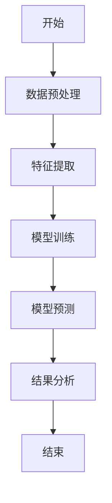
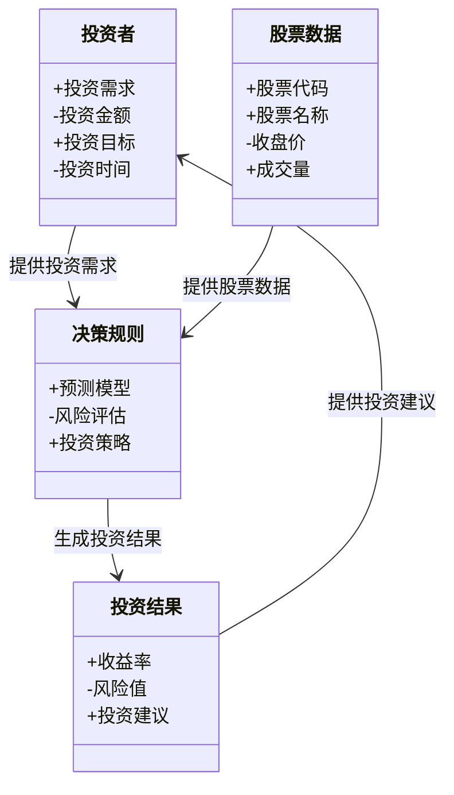

                 


# 特价股票投资中的人工智能辅助决策系统

> 关键词：人工智能、股票投资、决策系统、大数据分析、量化交易

> 摘要：本文深入探讨了在特价股票投资中，如何利用人工智能技术构建辅助决策系统。通过分析特价股票投资的背景、挑战及人工智能的优势，详细讲解了系统的原理、算法、架构设计及实际应用。文章从理论到实践，结合案例分析，展示了如何利用AI技术优化投资决策过程，帮助投资者在复杂多变的市场中获得更好的收益。

---

# 第一章: 特价股票投资的背景与挑战

## 1.1 特价股票投资的背景

### 1.1.1 特价股票的定义与特点

特价股票是指在特定市场环境下，由于公司财务状况、行业竞争格局或市场情绪等因素的影响，价格被暂时低估的股票。其特点包括：

- **低估值**：市场价格低于其内在价值。
- **波动性**：价格波动较大，存在短期反弹机会。
- **高风险**：投资风险较高，需谨慎选择。

### 1.1.2 特价股票投资的市场现状

随着金融市场的发展，投资者对特价股票的兴趣日益增加。然而，市场波动性和信息不对称使得投资决策变得复杂。投资者需要借助技术手段，提升决策的准确性和效率。

### 1.1.3 特价股票投资的潜在机会与风险

- **机会**：抓住市场低估的时机，获得超额收益。
- **风险**：市场波动可能导致短期亏损，需具备长期投资耐心。

---

## 1.2 人工智能在金融投资中的应用

### 1.2.1 人工智能在金融领域的应用现状

人工智能技术在金融领域的应用日益广泛，包括股票预测、风险评估、交易自动化等方面。其优势在于能够快速处理海量数据，发现隐藏的模式和趋势。

### 1.2.2 人工智能在股票投资中的优势

- **数据处理能力**：能够快速分析大量市场数据，发现潜在的投资机会。
- **预测准确性**：通过机器学习算法，提高股票价格预测的准确性。
- **自动化决策**：实现自动化交易，减少人为干扰。

### 1.2.3 人工智能辅助决策系统的概念与目标

人工智能辅助决策系统是一种结合人工智能技术，帮助投资者做出更明智投资决策的系统。其目标是通过数据分析、模型预测和智能决策，提升投资收益并降低风险。

---

## 1.3 本章小结

本章介绍了特价股票投资的背景、特点及市场现状，并探讨了人工智能在金融投资中的应用及其优势。通过分析，我们明确了构建人工智能辅助决策系统的重要性和必要性。

---

# 第二章: 人工智能辅助决策系统的原理与核心要素

## 2.1 人工智能辅助决策系统的原理

### 2.1.1 数据采集与处理

数据采集是系统的核心环节，包括从多个来源获取股票数据，并进行清洗、预处理等步骤，确保数据的准确性和完整性。

### 2.1.2 模型训练与优化

通过机器学习算法，对历史数据进行训练，构建预测模型，并通过不断优化模型参数，提高预测精度。

### 2.1.3 决策生成与反馈

系统根据模型预测结果，生成投资建议，并通过实际投资结果反馈，不断优化模型和策略。

---

## 2.2 核心概念与联系

### 2.2.1 人工智能与大数据分析的联系

人工智能依赖于大数据分析，通过海量数据提取特征，训练模型，实现智能决策。

### 2.2.2 量化交易与机器学习的关系

量化交易依赖于机器学习算法，通过数学模型优化交易策略，提高交易效率和收益。

### 2.2.3 特价股票投资与传统投资策略的对比

- **传统投资策略**：依赖经验判断，投资决策主观性强。
- **人工智能辅助决策**：基于数据和模型，决策更加客观和科学。

---

## 2.3 系统架构的ER实体关系图

```mermaid
er
  actor(投资者)
  system(人工智能辅助决策系统)
  stock_data(股票数据)
  decision_rule(决策规则)
  investment_result(投资结果)
  actor --> system: 提供投资需求
  system --> stock_data: 获取股票数据
  system --> decision_rule: 应用决策规则
  system --> investment_result: 生成投资结果
  system --> actor: 提供投资建议
```

---

## 2.4 本章小结

本章详细讲解了人工智能辅助决策系统的原理，并通过对比分析，明确了系统的核心概念与联系。通过ER实体关系图，展示了系统的主要组成和交互关系。

---

# 第三章: 人工智能辅助决策系统的算法原理

## 3.1 机器学习算法在股票投资中的应用

### 3.1.1 监督学习与非监督学习的对比

- **监督学习**：基于标签数据，预测股票价格。
- **非监督学习**：发现数据中的潜在模式，用于市场分割。

### 3.1.2 常见算法（如线性回归、支持向量机等）的优缺点

- **线性回归**：简单易懂，适用于线性关系，但对非线性关系表现较差。
- **支持向量机**：适用于高维数据，分类效果较好，但训练时间较长。

---

## 3.2 时间序列分析与股票预测

### 3.2.1 时间序列分析的基本原理

时间序列分析是通过对历史数据建模，预测未来趋势的一种方法。常用模型包括ARIMA和LSTM。

### 3.2.2 基于ARIMA模型的股票价格预测

ARIMA模型通过自回归和滑动平均，预测股票价格。其数学公式为：

$$ ARIMA(p, d, q) $$

其中，p为自回归阶数，d为差分阶数，q为滑动平均阶数。

### 3.2.3 基于LSTM模型的股票价格预测

LSTM（长短期记忆网络）通过记忆单元捕获长期依赖关系，适用于时间序列预测。其核心公式为：

$$ f_t = \sigma(W_f \cdot [h_{t-1}, x_t] + b_f) $$

$$ i_t = \sigma(W_i \cdot [h_{t-1}, x_t] + b_i) $$

$$ o_t = \sigma(W_o \cdot [h_{t-1}, x_t] + b_o) $$

$$ c_t = f_t \cdot c_{t-1} + i_t \cdot tanh(W_c \cdot [h_{t-1}, x_t] + b_c) $$

$$ h_t = o_t \cdot tanh(c_t) $$

---

## 3.3 算法流程图



---

## 3.4 本章小结

本章详细讲解了机器学习算法在股票投资中的应用，重点分析了ARIMA和LSTM模型，并通过流程图展示了算法的整体流程。

---

# 第四章: 系统分析与架构设计

## 4.1 系统分析

### 4.1.1 问题场景介绍

投资者需要在特价股票市场中做出快速、准确的投资决策，但由于市场波动大、信息复杂，传统方法难以满足需求。

### 4.1.2 项目介绍

本项目旨在构建一个人工智能辅助决策系统，帮助投资者在特价股票投资中获得更好的收益。

---

## 4.2 系统功能设计

### 4.2.1 领域模型类图



---

## 4.3 系统架构设计

### 4.3.1 系统架构图


---

## 4.4 本章小结

本章通过系统分析，明确了项目目标和问题场景，并通过领域模型类图和系统架构图，展示了系统的整体设计。

---

# 第五章: 项目实战

## 5.1 环境安装

### 5.1.1 安装Python环境

- 使用Anaconda安装Python 3.8以上版本。

### 5.1.2 安装依赖库

- 使用pip安装numpy、pandas、tensorflow、keras等库。

---

## 5.2 核心代码实现

### 5.2.1 数据预处理代码

```python
import pandas as pd
import numpy as np

# 读取股票数据
data = pd.read_csv('stock_data.csv')

# 数据清洗
data = data.dropna()
data = data.astype(float)
```

### 5.2.2 模型训练代码

```python
from tensorflow.keras.models import Sequential
from tensorflow.keras.layers import LSTM, Dense

# 构建LSTM模型
model = Sequential()
model.add(LSTM(64, input_shape=(1, 1)))
model.add(Dense(1))
model.compile(loss='mean_squared_error', optimizer='adam')
```

### 5.2.3 模型预测代码

```python
# 预测股票价格
predicted_price = model.predict(data_test)
```

---

## 5.3 代码功能解读与分析

通过上述代码，我们可以实现股票数据的预处理、模型训练和预测。数据预处理是模型训练的前提，模型训练是系统的核心，而预测结果则是投资者做出决策的重要依据。

---

## 5.4 实际案例分析

以某只股票为例，通过系统的预测，投资者可以得到该股票的投资建议，并根据实际情况调整投资策略。

---

## 5.5 项目小结

本章通过项目实战，展示了系统的实际应用，帮助读者理解如何将理论知识转化为实际操作。

---

# 第六章: 最佳实践与总结

## 6.1 小结

通过本文的介绍，我们了解了人工智能在特价股票投资中的应用，掌握了系统的原理和架构设计，并通过项目实战，验证了系统的可行性和有效性。

---

## 6.2 注意事项

- 数据质量对模型预测结果影响重大，需确保数据的准确性和完整性。
- 模型的优化需要不断迭代，结合实际投资需求进行调整。
- 投资者需具备一定的金融知识，才能更好地利用系统做出决策。

---

## 6.3 拓展阅读

- 《机器学习实战》
- 《Python金融大数据分析》
- 《量化交易与对冲基金》

---

# 作者：AI天才研究院/AI Genius Institute & 禅与计算机程序设计艺术 /Zen And The Art of Computer Programming

---

本文通过系统化的分析和实践，详细介绍了人工智能在特价股票投资中的应用，帮助投资者提升决策效率和准确性。希望本文对读者有所帮助，欢迎在评论区留言交流！

